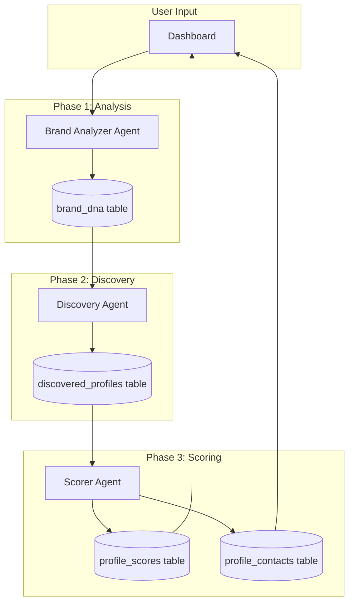
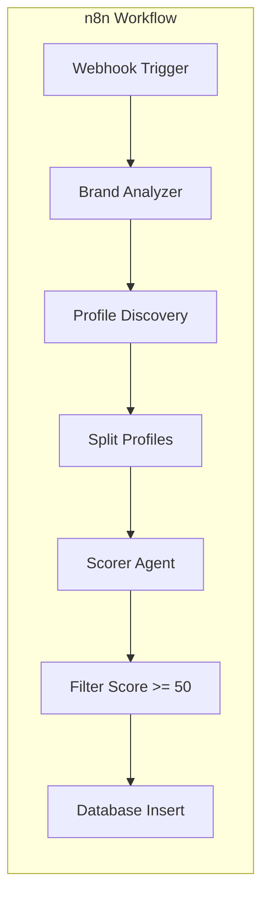
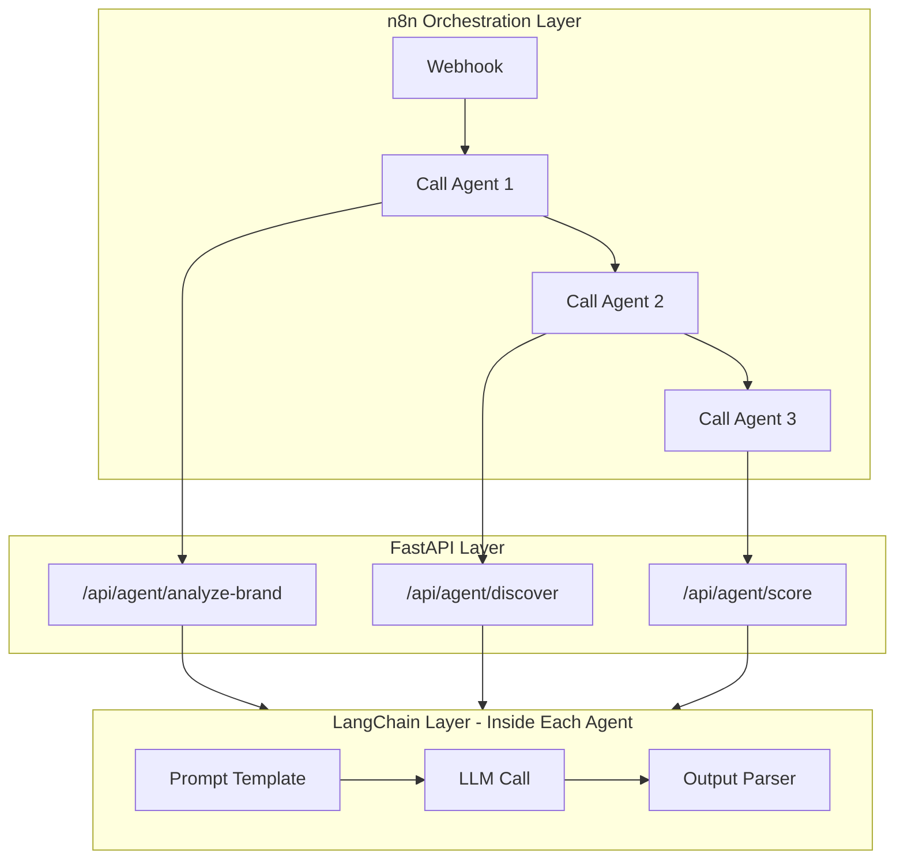
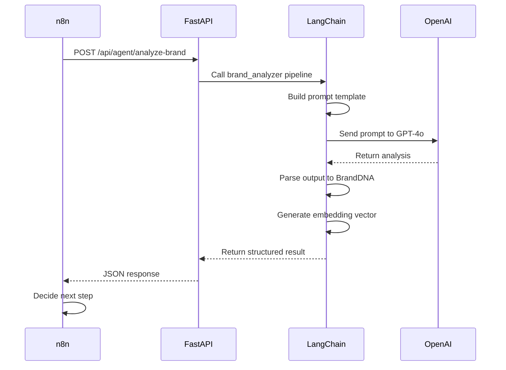

# PartnerScout AI - Agents Documentation

## 1. Agent Overview

PartnerScout uses **3 AI Agents** that work sequentially to automate Instagram partner discovery:

| Agent | Purpose | Endpoint |
|-------|---------|----------|
| **Brand Analyzer** | Learn brand identity from reference profiles | `POST /api/agent/analyze-brand` |
| **Profile Discovery** | Find candidate Instagram profiles | `POST /api/agent/discover` |
| **Scorer** | Rank candidates and extract contacts | `POST /api/agent/score` |

---

## 2. Brand Analyzer Agent

### Purpose

Extracts the "Brand DNA" from reference Instagram profiles and brand description. This creates a semantic fingerprint used to find and score similar profiles.

### Endpoint

```
POST /api/agent/analyze-brand
```

### Sample Input

```json
{
  "job_id": "11111111-1111-1111-1111-111111111111",
  "brand_description": "Sustainable fashion brand focused on minimalist aesthetics, ethical production, and timeless wardrobe essentials.",
  "reference_profiles": [
    "https://instagram.com/everlane",
    "https://instagram.com/reformation",
    "https://instagram.com/kotn"
  ]
}
```

### Sample Output

```json
{
  "brand_dna": {
    "hashtags": [
      "#sustainablefashion",
      "#slowfashion",
      "#ethicalfashion",
      "#minimalistwardrobe",
      "#consciousfashion"
    ],
    "keywords": [
      "sustainable",
      "minimalist",
      "ethical",
      "organic",
      "timeless",
      "capsule wardrobe"
    ],
    "embedding_vector": [0.0234, -0.0891, 0.0456, ...]
  }
}
```

### What It Does

1. Scrapes reference profiles using Apify
2. Analyzes visual content, captions, hashtags, and bio
3. Extracts key themes and style attributes
4. Generates a 1536-dimension embedding vector (OpenAI)
5. Stores results in `brand_dna` table

---

## 3. Profile Discovery Agent

### Purpose

Discovers new Instagram profiles that match the brand DNA by searching hashtags, exploring similar accounts, and identifying related content.

### Endpoint

```
POST /api/agent/discover
```

### Sample Input

```json
{
  "job_id": "11111111-1111-1111-1111-111111111111",
  "hashtags": [
    "#sustainablefashion",
    "#slowfashion",
    "#ethicalfashion"
  ],
  "keywords": ["sustainable", "minimalist", "ethical"],
  "limit": 50
}
```

### Sample Output

```json
{
  "profiles": [
    {
      "id": "aaaa1111-aaaa-aaaa-aaaa-aaaaaaaaaaaa",
      "instagram_url": "https://instagram.com/the_sustainable_closet",
      "username": "the_sustainable_closet",
      "followers": 45200
    },
    {
      "id": "bbbb2222-bbbb-bbbb-bbbb-bbbbbbbbbbbb",
      "instagram_url": "https://instagram.com/eco.boutique",
      "username": "eco.boutique",
      "followers": 28500
    },
    {
      "id": "cccc3333-cccc-cccc-cccc-cccccccccccc",
      "instagram_url": "https://instagram.com/mindful_threads",
      "username": "mindful_threads",
      "followers": 67800
    }
  ]
}
```

**Note:** The response includes `id` because profiles are inserted into the `discovered_profiles` table during discovery, and the generated UUIDs are returned for use in the scoring phase.

### What It Does

1. Searches hashtags via Apify Instagram scraper
2. Explores "similar accounts" from reference profiles
3. Filters for relevant follower ranges (e.g., 10K-500K)
4. Deduplicates results
5. Inserts discovered profiles into `discovered_profiles` table with status `new`
6. Returns profile data with generated database IDs

---

## 4. Scorer Agent

### Purpose

Scores each candidate profile against the brand DNA, providing an explainable match score (0-100) and extracting contact information.

### Endpoint

```
POST /api/agent/score
```

### Sample Input

**Option A: Full Request (for direct API testing)**

```json
{
  "profile_id": "aaaa1111-aaaa-aaaa-aaaa-aaaaaaaaaaaa",
  "profile_data": {
    "username": "the_sustainable_closet",
    "instagram_url": "https://instagram.com/the_sustainable_closet",
    "bio": "Curating ethical fashion | Slow fashion advocate | hello@sustainablecloset.com",
    "followers": 45200,
    "posts_count": 847,
    "engagement_rate": 3.2,
    "recent_posts": [
      {
        "caption": "Capsule wardrobe essentials...",
        "hashtags": ["#capsulewardrobe", "#slowfashion"],
        "likes": 1250,
        "comments": 45
      }
    ]
  },
  "brand_dna": {
    "hashtags": ["#sustainablefashion", "#slowfashion"],
    "keywords": ["sustainable", "minimalist", "ethical"],
    "embedding_vector": [0.0234, -0.0891, 0.0456, ...]
  }
}
```

**Option B: Simplified Request (used by N8N and Python orchestrators)**

The orchestrators use a simplified request with just IDs. The backend fetches `brand_dna` from the database and `profile_data` from Apify at runtime. See `docs/Orchestration.md` Section 3.3 (Node 12) for details.

```json
{
  "profile_id": "aaaa1111-aaaa-aaaa-aaaa-aaaaaaaaaaaa",
  "job_id": "11111111-1111-1111-1111-111111111111"
}
```

### Sample Output

```json
{
  "score": 92,
  "reasoning": {
    "aesthetic_match": 95,
    "engagement_quality": 88,
    "content_alignment": 93,
    "audience_fit": 91,
    "summary": "Excellent match. Strong alignment with sustainable fashion values, consistent minimalist aesthetic, and engaged audience.",
    "recommendation": "Highly recommended for partnership outreach."
  },
  "contact": {
    "email": "hello@sustainablecloset.com",
    "source": "bio"
  }
}
```

### What It Does

1. Fetches detailed profile data via Apify
2. Calculates embedding similarity with brand DNA
3. Analyzes aesthetic consistency using vision models
4. Evaluates engagement quality and audience authenticity
5. Extracts email from bio, website, or linked content
6. Stores score in `profile_scores` table
7. Stores contact in `profile_contacts` table
8. Updates profile status to `done`

### Apify Data Mapping

The Scorer Agent fetches fresh profile data from Apify at scoring time. Field mapping:

| Apify Field | Agent Field | Notes |
|-------------|-------------|-------|
| `biography` | `bio` | Profile description text |
| `postsCount` | `posts_count` | Total number of posts |
| `followersCount` | `followers` | Current follower count |
| `latestPosts` | `recent_posts` | Array with likes, comments, captions |
| Calculated | `engagement_rate` | `(avg_likes + avg_comments) / followers * 100` |

**Note:** These fields are fetched at runtime, not stored in `discovered_profiles`, ensuring scoring uses current data.

---

## 5. Data Flow Summary



---

## 6. Agent Orchestration

### 6.1 Primary: n8n Workflow

n8n is the primary orchestrator that coordinates agent execution:



#### Workflow Steps

1. **Webhook Trigger** - Receives job start request from frontend
2. **Brand Analyzer** - Calls `/api/agent/analyze-brand`
3. **Profile Discovery** - Calls `/api/agent/discover`
4. **Split Profiles** - Batches profiles for parallel processing
5. **Scorer Agent** - Calls `/api/agent/score` (parallel execution)
6. **Filter** - Keeps only profiles with score >= 50
7. **Database Insert** - Updates final results and job status

#### n8n Responsibilities

- Sequential and parallel agent execution
- Retry logic on API failures
- Error handling and job status updates
- Webhook notifications to frontend
- Visual workflow debugging

### 6.2 Plan B: Python Fallback Orchestrator

If n8n is unavailable during a demo, a Python script replaces the orchestration:

```python
# backend/scripts/run_discovery.py
import asyncio
from app.agents import brand_analyzer, discovery_agent, scorer_agent
from app.db import update_job_status, save_result

async def run_discovery(job_id: str):
    """Fallback orchestrator when n8n is unavailable."""
    try:
        # Update status: analyzing
        await update_job_status(job_id, "analyzing")
        
        # Step 1: Analyze brand
        brand_dna = await brand_analyzer.analyze(job_id)
        
        # Update status: discovering
        await update_job_status(job_id, "discovering")
        
        # Step 2: Discover profiles
        profiles = await discovery_agent.discover(brand_dna)
        
        # Update status: scoring
        await update_job_status(job_id, "scoring")
        
        # Step 3: Score each profile (sequential fallback)
        for profile in profiles:
            result = await scorer_agent.score(profile, brand_dna)
            if result.score >= 50:
                await save_result(profile, result)
        
        # Update status: completed
        await update_job_status(job_id, "completed")
        
    except Exception as e:
        await update_job_status(job_id, "failed", error=str(e))
        raise

# CLI entry point
if __name__ == "__main__":
    import sys
    job_id = sys.argv[1]
    asyncio.run(run_discovery(job_id))
```

#### When to Use Plan B

- n8n server is down or unreachable
- Demo environment without n8n installed
- Local development and testing
- CI/CD pipeline integration tests

---

## 7. How n8n and LangChain Work Together

n8n and LangChain are **not alternatives** - they operate at **different layers**:



### Layer Responsibilities

| Layer | Technology | What It Does |
|-------|------------|--------------|
| **Orchestration** | n8n | Decides WHEN and in what ORDER to call agents. Handles retries, parallelization, filtering, webhooks. |
| **API** | FastAPI | Exposes HTTP endpoints. Validates requests. Returns responses. |
| **AI Logic** | LangChain | Handles HOW each agent thinks. Builds prompts, calls LLMs, parses outputs, generates embeddings. |
| **LLM Providers** | OpenAI/Gemini/Ollama | The actual AI models that generate responses. |

### Request Flow Example



### Division of Concerns

| n8n Handles | LangChain Handles |
|-------------|-------------------|
| Retry if API call fails | Prompt engineering |
| Run 50 scorer calls in parallel | LLM provider abstraction |
| Filter profiles with score < 50 | Embedding generation |
| Trigger webhooks to frontend | Chain-of-thought reasoning |
| Update job status in database | Structured output parsing |
| Visual workflow debugging | Memory/context management |

---

## 8. Agent Implementation Guide

This section provides skeleton code and pseudo code for implementing each LangChain agent. For expected inputs/outputs, see Sections 2-4. For architecture context, see Section 7.

### 8.1 Project Structure

```
backend/
├── app/
│   ├── agents/
│   │   ├── __init__.py
│   │   ├── base.py              # Base agent class
│   │   ├── brand_analyzer.py    # Brand DNA extraction
│   │   ├── discovery.py         # Profile discovery
│   │   └── scorer.py            # Profile scoring
│   ├── prompts/                 # Prompt files (see Section 8.2)
│   │   ├── brand_analyzer/
│   │   │   ├── system.txt       # System prompt
│   │   │   └── user.txt         # User prompt template
│   │   ├── discovery/
│   │   │   ├── system.txt
│   │   │   └── user.txt
│   │   └── scorer/
│   │       ├── system.txt
│   │       └── user.txt
│   ├── config/                  # Configuration files (see Section 8.8)
│   │   ├── __init__.py
│   │   ├── settings.py          # Environment & app settings
│   │   ├── agents.yaml          # Agent-specific configuration
│   │   └── scoring.yaml         # Scoring weights & thresholds
│   ├── core/
│   │   ├── config.py            # Config loader utility
│   │   └── llm.py               # LLM provider factory
│   └── services/
│       └── apify.py             # Instagram scraping client
```

### 8.2 Prompt File Organization

Each agent's prompts are stored in separate text files for easier maintenance, version control, and reuse.

#### Directory Structure

```
backend/app/prompts/
├── brand_analyzer/
│   ├── system.txt    # System role and instructions
│   └── user.txt      # User message template with {placeholders}
├── discovery/
│   ├── system.txt
│   └── user.txt
└── scorer/
    ├── system.txt
    └── user.txt
```

#### Brand Analyzer Prompts

**`prompts/brand_analyzer/system.txt`**
```
You are a brand identity analyst specializing in Instagram marketing.

Your task is to analyze Instagram profiles and extract the brand's DNA - 
the core elements that define their identity and aesthetic.

You will identify:
- Key hashtags the brand consistently uses
- Keywords describing brand values, aesthetic, and messaging
- Target audience characteristics

Always return structured JSON output.
```

**`prompts/brand_analyzer/user.txt`**
```
Brand description provided by the user:
{brand_description}

Instagram profile data from reference accounts:
{profile_data}

Analyze this data and return a JSON object with:
- hashtags: Array of 5-10 most relevant hashtags
- keywords: Array of 5-15 brand identity keywords
- audience_traits: Array of target audience characteristics
```

#### Discovery Agent Prompts

**`prompts/discovery/system.txt`**
```
You are an Instagram discovery specialist.

Your task is to generate search variations and related hashtags 
to help discover similar Instagram profiles.

Focus on:
- Variations of provided hashtags
- Related niche hashtags
- Community hashtags in the same space
```

**`prompts/discovery/user.txt`**
```
Brand hashtags: {hashtags}
Brand keywords: {keywords}

Generate 5-10 related hashtags to search for discovering similar profiles.
Return as a JSON array of hashtag strings (include # prefix).
```

#### Scorer Agent Prompts

**`prompts/scorer/system.txt`**
```
You are an influencer partnership analyst.

Your task is to score candidate Instagram profiles against a brand's DNA 
to determine partnership fit.

Scoring criteria (0-100 each):
- aesthetic_match: Visual style and content alignment
- engagement_quality: Signs of authentic engagement vs fake followers
- content_alignment: Topic, values, and messaging alignment  
- audience_fit: Target audience overlap potential

Also extract any contact email found in the profile.

Always provide a summary and actionable recommendation.
```

**`prompts/scorer/user.txt`**
```
=== BRAND DNA ===
Hashtags: {brand_hashtags}
Keywords: {brand_keywords}

=== CANDIDATE PROFILE ===
Username: {username}
Bio: {bio}
Followers: {followers}
Engagement Rate: {engagement_rate}%
Recent Captions: 
{captions}

=== TASK ===
Score this profile and return JSON with:
- aesthetic_match (0-100)
- engagement_quality (0-100)
- content_alignment (0-100)
- audience_fit (0-100)
- summary (2-3 sentences)
- recommendation (action to take)
- email (extracted email or null)
```

#### Prompt Loader Utility

```python
# backend/app/prompts/loader.py
from pathlib import Path

PROMPTS_DIR = Path(__file__).parent

def load_prompt(agent_name: str, prompt_type: str) -> str:
    """
    Load a prompt from file.
    
    Args:
        agent_name: "brand_analyzer", "discovery", or "scorer"
        prompt_type: "system" or "user"
    
    Returns:
        Prompt text content
    """
    prompt_path = PROMPTS_DIR / agent_name / f"{prompt_type}.txt"
    
    if not prompt_path.exists():
        raise FileNotFoundError(f"Prompt not found: {prompt_path}")
    
    return prompt_path.read_text().strip()


def load_prompts(agent_name: str) -> tuple[str, str]:
    """Load both system and user prompts for an agent."""
    return (
        load_prompt(agent_name, "system"),
        load_prompt(agent_name, "user")
    )
```

#### Dependencies

```
langchain>=0.1.0
langchain-openai>=0.0.5
langchain-google-genai>=0.0.6
langchain-community>=0.0.13
apify-client>=1.6.0
```

### 8.3 Base Agent Class

All agents inherit from a common base class that handles LLM configuration, prompt loading, and chain building.

```python
# backend/app/agents/base.py
from abc import ABC, abstractmethod
from langchain_core.language_models import BaseChatModel
from langchain.prompts import ChatPromptTemplate
from app.prompts.loader import load_prompts

class BaseAgent(ABC):
    """Abstract base class for all PartnerScout agents."""
    
    # Override in subclass: "brand_analyzer", "discovery", "scorer"
    AGENT_NAME: str = None
    
    def __init__(self, llm: BaseChatModel = None):
        self.llm = llm or self._get_default_llm()
        self.system_prompt, self.user_prompt = self._load_prompts()
        self.chain = self._build_chain()
    
    def _load_prompts(self) -> tuple[str, str]:
        """Load prompts from files. See Section 8.2."""
        if not self.AGENT_NAME:
            raise ValueError("AGENT_NAME must be set in subclass")
        return load_prompts(self.AGENT_NAME)
    
    def _build_prompt_template(self) -> ChatPromptTemplate:
        """Build prompt template from loaded files."""
        return ChatPromptTemplate.from_messages([
            ("system", self.system_prompt),
            ("user", self.user_prompt)
        ])
    
    @abstractmethod
    def _build_chain(self):
        """Build the LangChain pipeline. Override in subclass."""
        pass
    
    @abstractmethod
    async def run(self, **kwargs):
        """Execute the agent. Override in subclass."""
        pass
    
    def _get_default_llm(self) -> BaseChatModel:
        """Get LLM based on settings. See Section 8.7."""
        # Returns configured LLM (OpenAI/Gemini/Ollama)
        pass
```

### 8.4 Brand Analyzer Implementation

Extracts brand DNA from reference profiles. See Section 2 for I/O format.

```python
# backend/app/agents/brand_analyzer.py
from app.agents.base import BaseAgent
from langchain_core.output_parsers import JsonOutputParser

class BrandAnalyzerAgent(BaseAgent):
    """Extracts brand DNA from reference Instagram profiles."""
    
    # Loads prompts from: prompts/brand_analyzer/system.txt and user.txt
    AGENT_NAME = "brand_analyzer"
    
    def _build_chain(self):
        # Prompts loaded from files (see Section 8.2)
        prompt = self._build_prompt_template()
        
        # Build chain with output parser
        parser = JsonOutputParser()
        return prompt | self.llm | parser
    
    async def run(self, job_id: str, brand_description: str, 
                  reference_profiles: list[str]) -> dict:
        """
        Pseudo code:
        1. Fetch profile data from Apify for each reference_profile
        2. Aggregate bios, captions, hashtags from all profiles
        3. Invoke chain with aggregated data
        4. Generate embedding vector from combined text
        5. Store brand_dna in database
        6. Return BrandDNA object
        """
        # Fetch profiles via Apify
        profile_data = await self._fetch_profiles(reference_profiles)
        
        # Run LLM chain
        result = await self.chain.ainvoke({
            "brand_description": brand_description,
            "profile_data": self._format_profiles(profile_data)
        })
        
        # Generate embedding
        embedding = await self._generate_embedding(
            brand_description + " " + " ".join(result["keywords"])
        )
        
        # Build response
        return {
            "hashtags": result["hashtags"],
            "keywords": result["keywords"],
            "embedding_vector": embedding
        }
    
    async def _fetch_profiles(self, urls: list[str]) -> list[dict]:
        """Fetch Instagram profile data via Apify scraper."""
        # Call Apify Instagram Profile Scraper actor
        # Return list of profile data dicts
        pass
    
    async def _generate_embedding(self, text: str) -> list[float]:
        """Generate 1536-dim embedding using OpenAI."""
        # Use OpenAIEmbeddings or similar
        # Return embedding vector
        pass
```

### 8.5 Discovery Agent Implementation

Discovers similar Instagram profiles. See Section 3 for I/O format.

```python
# backend/app/agents/discovery.py
from app.agents.base import BaseAgent
from app.config import get_agent_config
from langchain_core.output_parsers import JsonOutputParser

class DiscoveryAgent(BaseAgent):
    """Discovers Instagram profiles matching brand DNA."""
    
    # Loads prompts from: prompts/discovery/system.txt and user.txt
    AGENT_NAME = "discovery"
    
    def _build_chain(self):
        # Prompts loaded from files (see Section 8.2)
        prompt = self._build_prompt_template()
        return prompt | self.llm | JsonOutputParser()
    
    def __init__(self, llm=None):
        super().__init__(llm)
        # Load config from config/agents.yaml (see Section 8.8)
        self.config = get_agent_config("discovery")
    
    async def run(self, job_id: str, hashtags: list[str], 
                  keywords: list[str], limit: int = None) -> list[dict]:
        """
        Pseudo code:
        1. Optionally expand hashtags using LLM
        2. For each hashtag:
           a. Call Apify Hashtag Scraper
           b. Extract profile URLs from posts
        3. For reference profiles (from brand_dna):
           a. Call Apify Similar Accounts scraper
        4. Combine all discovered profiles
        5. Filter by follower count (from config)
        6. Deduplicate by username
        7. Insert into discovered_profiles table with status='new'
        8. Return list of DiscoveredProfile objects
        """
        # Use configured default if not specified
        limit = limit or self.config["default_limit"]
        
        discovered = []
        seen_usernames = set()
        
        # Search hashtags (limit from config)
        max_hashtags = self.config["max_hashtags_to_search"]
        for hashtag in hashtags[:max_hashtags]:
            profiles = await self._search_hashtag(hashtag)
            for profile in profiles:
                if profile["username"] not in seen_usernames:
                    if self._is_valid_follower_count(profile["followers"]):
                        discovered.append(profile)
                        seen_usernames.add(profile["username"])
                
                if len(discovered) >= limit:
                    break
        
        # Save to database
        await self._save_profiles(job_id, discovered)
        
        return discovered
    
    async def _search_hashtag(self, hashtag: str) -> list[dict]:
        """Search Instagram hashtag via Apify."""
        # Call Apify Instagram Hashtag Scraper
        # Extract unique profiles from posts
        pass
    
    def _is_valid_follower_count(self, followers: int) -> bool:
        """Filter using configured follower range (see Section 8.8)."""
        return (
            self.config["min_followers"] <= followers <= 
            self.config["max_followers"]
        )
    
    async def _save_profiles(self, job_id: str, profiles: list[dict]):
        """Batch insert profiles to database."""
        # Insert into discovered_profiles table
        pass
```

### 8.6 Scorer Agent Implementation

Scores candidate profiles against brand DNA. See Section 4 for I/O format.

```python
# backend/app/agents/scorer.py
from app.agents.base import BaseAgent
from app.config import get_agent_config, get_scoring_config
from langchain_core.output_parsers import JsonOutputParser

class ScorerAgent(BaseAgent):
    """Scores Instagram profiles against brand DNA."""
    
    # Loads prompts from: prompts/scorer/system.txt and user.txt
    AGENT_NAME = "scorer"
    
    def __init__(self, llm=None):
        super().__init__(llm)
        # Load config from config/scoring.yaml (see Section 8.8)
        self.scoring_config = get_scoring_config()
        self.agent_config = get_agent_config("scorer")
    
    def _build_chain(self):
        # Prompts loaded from files (see Section 8.2)
        prompt = self._build_prompt_template()
        return prompt | self.llm | JsonOutputParser()
    
    async def run(self, profile_id: str, profile_data: dict, 
                  brand_dna: dict) -> dict:
        """
        Pseudo code:
        1. Calculate embedding similarity (brand_dna vs profile)
        2. Prepare profile text for LLM analysis
        3. Invoke scoring chain
        4. Extract email from bio using regex (fallback)
        5. Calculate final weighted score
        6. Store score in profile_scores table
        7. Store contact in profile_contacts table
        8. Update profile status to 'done'
        9. Return ScoreResponse object
        """
        # Calculate embedding similarity
        similarity = await self._calculate_similarity(
            brand_dna["embedding_vector"],
            profile_data
        )
        
        # Run LLM scoring chain
        result = await self.chain.ainvoke({
            "brand_hashtags": brand_dna["hashtags"],
            "brand_keywords": brand_dna["keywords"],
            "username": profile_data["username"],
            "bio": profile_data["bio"],
            "followers": profile_data["followers"],
            "engagement_rate": profile_data["engagement_rate"],
            "captions": self._extract_captions(profile_data["recent_posts"])
        })
        
        # Calculate final score (weighted average)
        final_score = self._calculate_final_score(result, similarity)
        
        # Extract email (LLM result or regex fallback)
        email = result.get("email") or self._extract_email_regex(profile_data["bio"])
        
        # Save to database
        await self._save_score(profile_id, final_score, result)
        await self._save_contact(profile_id, email)
        
        return {
            "score": final_score,
            "reasoning": {
                "aesthetic_match": result["aesthetic_match"],
                "engagement_quality": result["engagement_quality"],
                "content_alignment": result["content_alignment"],
                "audience_fit": result["audience_fit"],
                "summary": result["summary"],
                "recommendation": result["recommendation"]
            },
            "contact": {
                "email": email,
                "source": "bio" if email else None
            }
        }
    
    def _calculate_final_score(self, llm_result: dict, similarity: float) -> int:
        """
        Weighted score calculation using config values.
        Weights defined in config/scoring.yaml (see Section 8.8)
        """
        weights = self.scoring_config["weights"]
        
        score = (
            llm_result["aesthetic_match"] * weights["aesthetic_match"] +
            llm_result["engagement_quality"] * weights["engagement_quality"] +
            llm_result["content_alignment"] * weights["content_alignment"] +
            llm_result["audience_fit"] * weights["audience_fit"] +
            similarity * 100 * weights["embedding_similarity"]
        )
        
        return int(min(100, max(0, score)))
    
    def _get_recommendation(self, score: int) -> str:
        """Get recommendation based on configured thresholds."""
        thresholds = self.scoring_config["thresholds"]
        
        if score >= thresholds["excellent"]:
            return "Highly recommended for partnership"
        elif score >= thresholds["good"]:
            return "Recommended for partnership"
        elif score >= thresholds["moderate"]:
            return "Consider with further review"
        else:
            return "Not recommended"
    
    def _extract_email_regex(self, text: str) -> str | None:
        """Fallback email extraction using regex."""
        import re
        match = re.search(r'[\w\.-]+@[\w\.-]+\.\w+', text)
        return match.group(0) if match else None
```

### 8.7 LLM Provider Configuration

Supports multiple LLM providers with easy switching.

```python
# backend/app/core/config.py
from pydantic_settings import BaseSettings

class Settings(BaseSettings):
    # LLM Provider: "openai" | "gemini" | "ollama"
    LLM_PROVIDER: str = "openai"
    
    # OpenAI
    OPENAI_API_KEY: str = ""
    OPENAI_MODEL: str = "gpt-4o"
    
    # Google Gemini
    GOOGLE_API_KEY: str = ""
    GEMINI_MODEL: str = "gemini-1.5-pro"
    
    # Ollama (local)
    OLLAMA_BASE_URL: str = "http://localhost:11434"
    OLLAMA_MODEL: str = "llama3"
    
    # Apify
    APIFY_API_KEY: str = ""
    
    # Service key for n8n
    N8N_SERVICE_KEY: str = ""
    
    class Config:
        env_file = ".env"

settings = Settings()
```

```python
# backend/app/core/llm.py
from langchain_openai import ChatOpenAI
from langchain_google_genai import ChatGoogleGenerativeAI
from langchain_community.llms import Ollama
from app.core.config import settings

def get_llm():
    """Factory function to get configured LLM."""
    
    if settings.LLM_PROVIDER == "openai":
        return ChatOpenAI(
            model=settings.OPENAI_MODEL,
            api_key=settings.OPENAI_API_KEY
        )
    
    elif settings.LLM_PROVIDER == "gemini":
        return ChatGoogleGenerativeAI(
            model=settings.GEMINI_MODEL,
            google_api_key=settings.GOOGLE_API_KEY
        )
    
    elif settings.LLM_PROVIDER == "ollama":
        return Ollama(
            model=settings.OLLAMA_MODEL,
            base_url=settings.OLLAMA_BASE_URL
        )
    
    else:
        raise ValueError(f"Unknown LLM provider: {settings.LLM_PROVIDER}")
```

#### Environment Variables

```bash
# .env
LLM_PROVIDER=openai

# OpenAI (primary for demos)
OPENAI_API_KEY=sk-...
OPENAI_MODEL=gpt-4o

# Google Gemini (cost-effective production)
GOOGLE_API_KEY=...
GEMINI_MODEL=gemini-1.5-pro

# Ollama (local development)
OLLAMA_BASE_URL=http://localhost:11434
OLLAMA_MODEL=llama3

# Apify for Instagram scraping
APIFY_API_KEY=apify_api_...

# Service key for n8n agent calls
N8N_SERVICE_KEY=your-secret-key
```

### 8.8 Agent Configuration

All configurable values are centralized in YAML config files for easy customization and repo expansion.

#### Configuration Files

**`config/agents.yaml`** - Agent-specific settings

```yaml
# backend/app/config/agents.yaml

# Brand Analyzer Agent
brand_analyzer:
  # Number of hashtags/keywords to extract
  max_hashtags: 10
  max_keywords: 15
  
  # Embedding configuration
  embedding_model: "text-embedding-3-small"
  embedding_dimensions: 1536

# Discovery Agent
discovery:
  # Default profile limit per search
  default_limit: 50
  max_limit: 200
  
  # Follower count filters
  min_followers: 10000
  max_followers: 500000
  
  # Hashtag search settings
  max_hashtags_to_search: 10
  profiles_per_hashtag: 20
  
  # Deduplication
  dedupe_by: "username"

# Scorer Agent
scorer:
  # Minimum score to keep profile
  score_threshold: 50
  
  # Email extraction
  extract_email: true
  email_sources: ["bio", "website", "linktree"]
```

**`config/scoring.yaml`** - Scoring weights and thresholds

```yaml
# backend/app/config/scoring.yaml

# Score component weights (must sum to 1.0)
weights:
  aesthetic_match: 0.25
  engagement_quality: 0.25
  content_alignment: 0.25
  audience_fit: 0.15
  embedding_similarity: 0.10

# Score thresholds for recommendations
thresholds:
  excellent: 85    # "Highly recommended"
  good: 70         # "Recommended"
  moderate: 50     # "Consider with caution"
  poor: 0          # "Not recommended"

# Engagement rate benchmarks (by follower tier)
engagement_benchmarks:
  micro:           # 10K-50K followers
    min: 3.0
    good: 5.0
    excellent: 8.0
  mid:             # 50K-200K followers
    min: 2.0
    good: 3.5
    excellent: 5.0
  macro:           # 200K-500K followers
    min: 1.5
    good: 2.5
    excellent: 4.0
```

**`config/apify.yaml`** - Apify scraper settings

```yaml
# backend/app/config/apify.yaml

# Actor IDs
actors:
  profile_scraper: "apify/instagram-profile-scraper"
  hashtag_scraper: "apify/instagram-hashtag-scraper"
  post_scraper: "apify/instagram-post-scraper"

# Scraper settings
profile_scraper:
  results_limit: 1
  add_parent_data: true

hashtag_scraper:
  results_limit: 100
  results_type: "posts"

# Rate limiting
rate_limit:
  requests_per_minute: 30
  retry_attempts: 3
  retry_delay_seconds: 5

# Timeout settings
timeouts:
  run_timeout_seconds: 300
  memory_mbytes: 1024
```

#### Config Loader Utility

```python
# backend/app/config/__init__.py
from pathlib import Path
import yaml
from functools import lru_cache

CONFIG_DIR = Path(__file__).parent

@lru_cache
def load_config(config_name: str) -> dict:
    """
    Load a YAML configuration file.
    
    Args:
        config_name: "agents", "scoring", or "apify"
    
    Returns:
        Configuration dictionary
    """
    config_path = CONFIG_DIR / f"{config_name}.yaml"
    
    if not config_path.exists():
        raise FileNotFoundError(f"Config not found: {config_path}")
    
    with open(config_path) as f:
        return yaml.safe_load(f)


# Convenience accessors
def get_agent_config(agent_name: str) -> dict:
    """Get configuration for a specific agent."""
    return load_config("agents").get(agent_name, {})


def get_scoring_config() -> dict:
    """Get scoring weights and thresholds."""
    return load_config("scoring")


def get_apify_config() -> dict:
    """Get Apify scraper settings."""
    return load_config("apify")
```

#### Using Config in Agents

```python
# Example: Discovery Agent using config
from app.config import get_agent_config

class DiscoveryAgent(BaseAgent):
    AGENT_NAME = "discovery"
    
    def __init__(self, llm=None):
        super().__init__(llm)
        self.config = get_agent_config("discovery")
    
    def _is_valid_follower_count(self, followers: int) -> bool:
        """Filter using configured follower range."""
        return (
            self.config["min_followers"] <= followers <= 
            self.config["max_followers"]
        )
```

```python
# Example: Scorer Agent using config
from app.config import get_scoring_config

class ScorerAgent(BaseAgent):
    AGENT_NAME = "scorer"
    
    def __init__(self, llm=None):
        super().__init__(llm)
        self.scoring_config = get_scoring_config()
    
    def _calculate_final_score(self, llm_result: dict, similarity: float) -> int:
        """Calculate score using configured weights."""
        weights = self.scoring_config["weights"]
        
        score = (
            llm_result["aesthetic_match"] * weights["aesthetic_match"] +
            llm_result["engagement_quality"] * weights["engagement_quality"] +
            llm_result["content_alignment"] * weights["content_alignment"] +
            llm_result["audience_fit"] * weights["audience_fit"] +
            similarity * 100 * weights["embedding_similarity"]
        )
        
        return int(min(100, max(0, score)))
    
    def _get_recommendation(self, score: int) -> str:
        """Get recommendation based on configured thresholds."""
        thresholds = self.scoring_config["thresholds"]
        
        if score >= thresholds["excellent"]:
            return "Highly recommended for partnership"
        elif score >= thresholds["good"]:
            return "Recommended for partnership"
        elif score >= thresholds["moderate"]:
            return "Consider with further review"
        else:
            return "Not recommended"
```

#### Dependencies

Add to `requirements.txt`:

```
pyyaml>=6.0
```

---

## 9. FastAPI Integration

Each agent is exposed via FastAPI endpoints that n8n (or the Python fallback) calls.

### 9.1 Router Setup

```python
# backend/app/api/agent.py
from fastapi import APIRouter, Depends, HTTPException
from app.agents import brand_analyzer, discovery_agent, scorer_agent
from app.models.agent import (
    AnalyzeBrandRequest, AnalyzeBrandResponse,
    DiscoverRequest, DiscoverResponse,
    ScoreRequest, ScoreResponse
)
from app.core.auth import verify_service_key

router = APIRouter(prefix="/api/agent", tags=["agents"])

@router.post("/analyze-brand", response_model=AnalyzeBrandResponse)
async def analyze_brand(
    request: AnalyzeBrandRequest,
    _: None = Depends(verify_service_key)
):
    """Extract brand DNA from reference profiles."""
    try:
        result = await brand_analyzer.analyze(
            job_id=request.job_id,
            brand_description=request.brand_description,
            reference_profiles=request.reference_profiles
        )
        return AnalyzeBrandResponse(brand_dna=result)
    except Exception as e:
        raise HTTPException(status_code=500, detail={
            "code": "AGENT_ERROR",
            "message": str(e)
        })

@router.post("/discover", response_model=DiscoverResponse)
async def discover_profiles(
    request: DiscoverRequest,
    _: None = Depends(verify_service_key)
):
    """Discover similar Instagram profiles."""
    try:
        profiles = await discovery_agent.discover(
            job_id=request.job_id,
            hashtags=request.hashtags,
            keywords=request.keywords,
            limit=request.limit
        )
        return DiscoverResponse(profiles=profiles)
    except Exception as e:
        raise HTTPException(status_code=500, detail={
            "code": "AGENT_ERROR",
            "message": str(e)
        })

@router.post("/score", response_model=ScoreResponse)
async def score_profile(
    request: ScoreRequest,
    _: None = Depends(verify_service_key)
):
    """Score a candidate profile against brand DNA."""
    try:
        result = await scorer_agent.score(
            profile_id=request.profile_id,
            profile_data=request.profile_data,
            brand_dna=request.brand_dna
        )
        return ScoreResponse(
            score=result.score,
            reasoning=result.reasoning,
            contact=result.contact
        )
    except Exception as e:
        raise HTTPException(status_code=500, detail={
            "code": "AGENT_ERROR",
            "message": str(e)
        })
```

### 9.2 Pydantic Models

```python
# backend/app/models/agent.py
from pydantic import BaseModel
from typing import Optional

class BrandDNA(BaseModel):
    hashtags: list[str]
    keywords: list[str]
    embedding_vector: list[float]

class AnalyzeBrandRequest(BaseModel):
    job_id: str
    brand_description: str
    reference_profiles: list[str]

class AnalyzeBrandResponse(BaseModel):
    brand_dna: BrandDNA

class DiscoverRequest(BaseModel):
    job_id: str
    hashtags: list[str]
    keywords: list[str]
    limit: int = 50

class DiscoveredProfile(BaseModel):
    instagram_url: str
    username: str
    followers: int

class DiscoverResponse(BaseModel):
    profiles: list[DiscoveredProfile]

class ProfileData(BaseModel):
    username: str
    instagram_url: str
    bio: str
    followers: int
    posts_count: int
    engagement_rate: float
    recent_posts: list[dict]

class ScoreRequest(BaseModel):
    profile_id: str
    profile_data: ProfileData
    brand_dna: BrandDNA

class ScoreReasoning(BaseModel):
    aesthetic_match: int
    engagement_quality: int
    content_alignment: int
    audience_fit: int
    summary: str
    recommendation: str

class ContactInfo(BaseModel):
    email: Optional[str]
    source: Optional[str]

class ScoreResponse(BaseModel):
    score: int
    reasoning: ScoreReasoning
    contact: ContactInfo
```

### 9.3 Service Key Authentication

Agent endpoints are called by n8n, not users. They require a service key:

```python
# backend/app/core/auth.py
from fastapi import Header, HTTPException
from app.core.config import settings

async def verify_service_key(
    x_service_key: str = Header(..., alias="X-Service-Key")
):
    """Verify n8n service key for agent endpoints."""
    if x_service_key != settings.N8N_SERVICE_KEY:
        raise HTTPException(
            status_code=401,
            detail={
                "code": "UNAUTHORIZED",
                "message": "Invalid service key"
            }
        )
```

### 9.4 Register Router in Main App

```python
# backend/app/main.py
from fastapi import FastAPI
from app.api import agent, jobs

app = FastAPI(title="PartnerScout API")

# Agent endpoints (called by n8n)
app.include_router(agent.router)

# Job endpoints (called by frontend)
app.include_router(jobs.router)

@app.get("/api/health")
async def health_check():
    return {"status": "healthy"}
```

---

## 10. Key Implementation Files

| File | Layer | Purpose |
|------|-------|---------|
| `backend/app/agents/brand_analyzer.py` | LangChain | Brand DNA extraction logic |
| `backend/app/agents/discovery.py` | LangChain | Profile discovery logic |
| `backend/app/agents/scorer.py` | LangChain | Scoring and contact extraction |
| `backend/app/api/agent.py` | FastAPI | HTTP route handlers for agents |
| `backend/app/models/agent.py` | Pydantic | Request/response models |
| `backend/app/core/auth.py` | FastAPI | Service key authentication |
| `n8n/discovery_workflow.json` | n8n | Exported workflow definition |
| `backend/scripts/run_discovery.py` | Python | Fallback orchestrator (Plan B) |

---

## 11. Error Handling

All agents return consistent error responses:

```json
{
  "error": {
    "code": "AGENT_ERROR",
    "message": "Failed to analyze brand: Rate limit exceeded"
  }
}
```

### Error Codes

| Code | Description | Recovery |
|------|-------------|----------|
| `SCRAPING_FAILED` | Instagram data unavailable | Retry or use cached data |
| `LLM_ERROR` | AI model error | Retry with fallback provider |
| `RATE_LIMITED` | API limits reached | Wait and retry |
| `INVALID_INPUT` | Bad request data | Fix request payload |
| `UNAUTHORIZED` | Invalid service key | Check N8N_SERVICE_KEY |

---

*Last updated: January 2026*

