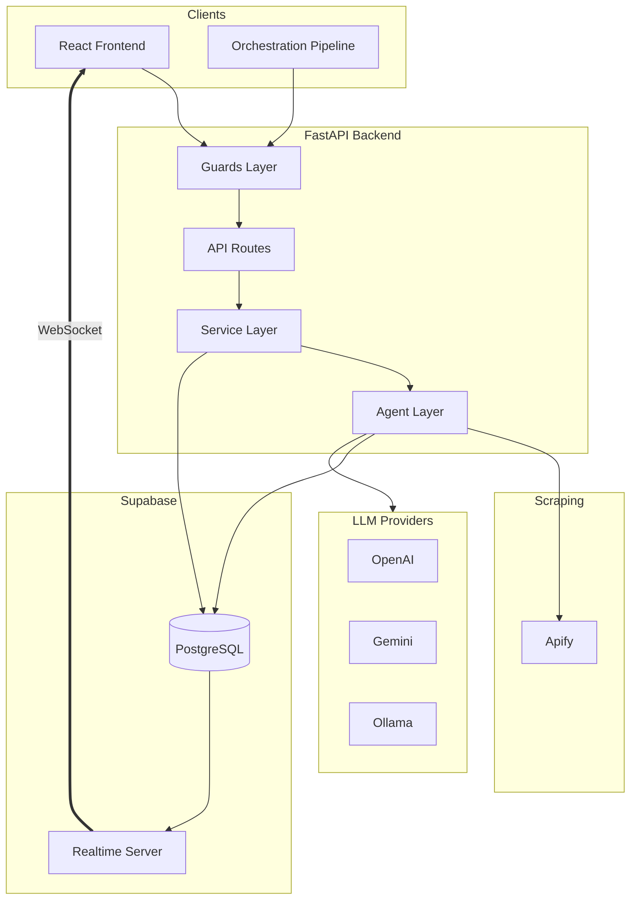
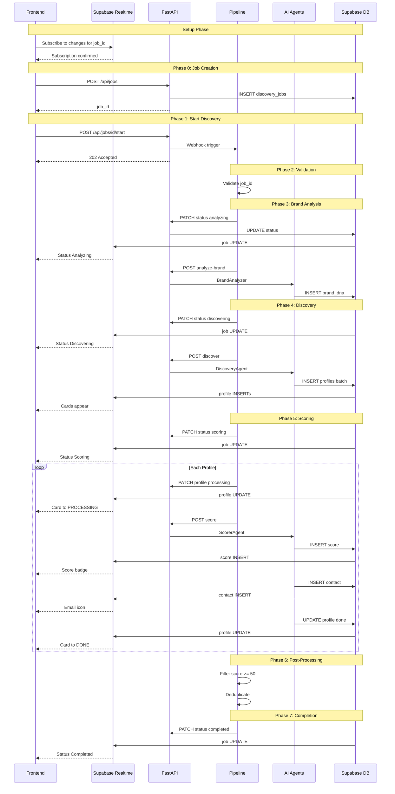
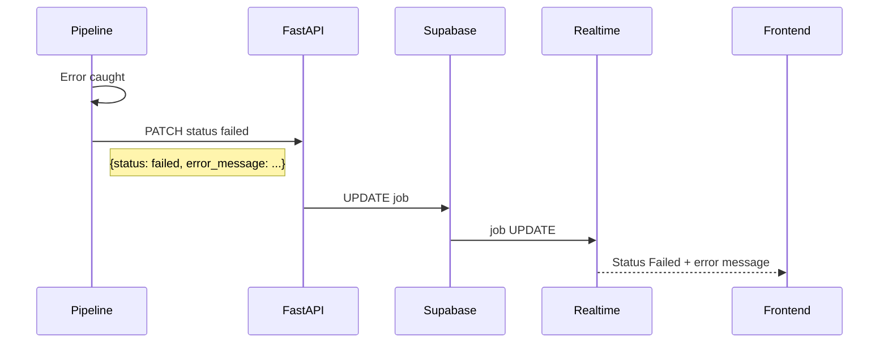

# PartnerScout AI - Backend Implementation Guide

> Complete implementation guide for the FastAPI backend. Use this document as the primary reference when building the backend services.

---

## Table of Contents

1. [System Architecture](#1-system-architecture)
2. [Backend Overview](#2-backend-overview)
3. [Project Structure](#3-project-structure)
4. [Guards Layer](#4-guards-layer)
5. [Configuration Management](#5-configuration-management)
6. [Service Layer](#6-service-layer)
7. [Repository Layer](#7-repository-layer)
8. [API Specifications](#8-api-specifications)
9. [Database Schema](#9-database-schema)
10. [Data Flow Diagrams](#10-data-flow-diagrams)
11. [Error Handling](#11-error-handling)
12. [Mock Data](#12-mock-data)
13. [Implementation Order](#13-implementation-order)
14. [Dependencies](#14-dependencies)

---

## 1. System Architecture

### 1.1 Architecture Diagram



### 1.2 Layered Architecture

```
┌─────────────────────────────────────────────────────────────┐
│                      Guards Layer                            │
│  (guards/auth.py, guards/validation.py, guards/ownership.py)│
│  - Authentication (JWT, Service Key)                         │
│  - Input validation                                          │
│  - Resource ownership verification                           │
│  - Rate limiting                                             │
├─────────────────────────────────────────────────────────────┤
│                      API Layer                               │
│  (routes/jobs.py, routes/agents.py, routes/status.py)       │
│  - HTTP request/response handling                            │
│  - Route definitions                                         │
│  - Response formatting                                       │
├─────────────────────────────────────────────────────────────┤
│                    Service Layer (Business Logic)            │
│  (services/job_service.py, services/scoring_service.py)     │
│  - All business rules                                        │
│  - Workflow orchestration                                    │
│  - Data transformation                                       │
│  - External service coordination                             │
├─────────────────────────────────────────────────────────────┤
│                    Agent Layer                               │
│  (agents/brand_analyzer.py, agents/discovery.py,            │
│   agents/scorer.py)                                          │
│  - AI/ML logic using LangChain                              │
│  - Prompt management                                         │
│  - LLM provider abstraction                                  │
├─────────────────────────────────────────────────────────────┤
│                    Repository Layer                          │
│  (repositories/job_repo.py, repositories/profile_repo.py)  │
│  - Database operations only                                  │
│  - No business logic                                         │
│  - Query builders                                            │
├─────────────────────────────────────────────────────────────┤
│                    Data Layer                                │
│  (db/supabase.py, db/sqlite.py)                             │
│  - Database clients                                          │
│  - Connection management                                     │
└─────────────────────────────────────────────────────────────┘
```

---

## 2. Backend Overview

### 2.1 What the Backend Does

| Responsibility | Description |
|----------------|-------------|
| **API Gateway** | Exposes RESTful endpoints for the React frontend and orchestration pipeline |
| **Request Guards** | Validate authentication, authorization, and input before processing |
| **Business Logic** | All domain logic isolated in service layer |
| **AI Agent Execution** | Runs Brand Analyzer, Discovery, and Scorer agents using LangChain |
| **LLM Abstraction** | Provides unified interface to OpenAI, Gemini, or Ollama |
| **Data Persistence** | Manages all database operations through Supabase client |
| **State Machine** | Enforces valid status transitions for jobs and profiles |
| **External Integration** | Interfaces with Apify for Instagram scraping |

### 2.2 Why This Architecture

| Reason | Explanation |
|--------|-------------|
| **Single Responsibility** | Each layer does one thing well |
| **Business Logic Isolation** | Services contain all rules, easily testable |
| **Guard Pattern** | Validation happens before business logic |
| **Repository Pattern** | Data access separated from business logic |
| **Configuration Centralization** | All configs in one place, no magic strings |
| **Constants Management** | Enums and constants prevent typos |

### 2.3 Architecture Benefits

| Benefit | How It Helps |
|---------|--------------|
| **Modularity** | Add new agents (e.g., TikTok Discovery) without touching API layer |
| **Scalability** | Service layer can be extracted to microservices if needed |
| **Maintainability** | Bug fixes in one layer don't ripple to others |
| **Onboarding** | New developers understand codebase structure quickly |
| **Configuration** | YAML configs in `config/` folder allow runtime customization |
| **Provider Swapping** | Switch LLM providers via environment variable, no code changes |

### 2.4 Repo Expansion Strategy

This architecture is designed for future growth:

| Expansion | How Architecture Supports It |
|-----------|------------------------------|
| **New Social Platforms** | Add `agents/tiktok_discovery.py`, `agents/linkedin_discovery.py` following same pattern |
| **New AI Agents** | Create new agent class inheriting from `BaseAgent`, add route in `routes/agents.py` |
| **New LLM Providers** | Add provider in `llm_service.py` factory, configure via `LLM_PROVIDER` env var |
| **New Data Sources** | Add scraper in `services/` (e.g., `tiktok_service.py`), agents consume via dependency injection |
| **Multi-Tenant SaaS** | Service layer already enforces user isolation via `user_id` filtering |
| **Background Jobs** | Replace orchestrator with Celery by adding `tasks/` folder, agents remain unchanged |
| **Caching Layer** | Add Redis service in `services/cache_service.py`, inject into agents |
| **Billing/Metering** | Add `services/billing_service.py`, wrap agent calls with usage tracking |
| **Webhooks** | Add `services/webhook_service.py` for outbound notifications |
| **Plugin System** | Agent base class enables loading custom agents from `plugins/` directory |

**Directory Structure for Expanded Repo:**

```
backend/
├── app/
│   ├── agents/
│   │   ├── base.py                 # BaseAgent class
│   │   ├── brand_analyzer.py       # Current
│   │   ├── discovery.py            # Current
│   │   ├── scorer.py               # Current
│   │   ├── tiktok_discovery.py     # Future: TikTok
│   │   ├── linkedin_discovery.py   # Future: LinkedIn
│   │   └── email_composer.py       # Future: Email drafting
│   ├── services/
│   │   ├── llm_service.py          # Current
│   │   ├── apify_service.py        # Current
│   │   ├── tiktok_service.py       # Future: TikTok API
│   │   ├── cache_service.py        # Future: Redis
│   │   ├── billing_service.py      # Future: Usage tracking
│   │   └── webhook_service.py      # Future: Notifications
│   ├── plugins/                    # Future: Custom agents
│   └── tasks/                      # Future: Background jobs
```

---

## 3. Project Structure

```
backend/
├── app/
│   ├── __init__.py
│   ├── main.py                         # FastAPI application entry point
│   │
│   ├── core/                           # Core configuration and utilities
│   │   ├── __init__.py
│   │   ├── config.py                   # Environment variables (secrets only)
│   │   ├── constants.py                # All constants, enums, error codes
│   │   ├── exceptions.py               # Custom exception classes
│   │   └── settings/                   # YAML configuration files
│   │       ├── __init__.py             # Config loader utility
│   │       ├── agents.yaml             # Agent-specific settings
│   │       ├── scoring.yaml            # Scoring weights and thresholds
│   │       └── limits.yaml             # Rate limits and timeouts
│   │
│   ├── guards/                         # Request validation layer
│   │   ├── __init__.py
│   │   ├── auth.py                     # AuthGuard, UserGuard, ServiceKeyGuard
│   │   ├── ownership.py                # JobOwnerGuard, ProfileOwnerGuard
│   │   ├── validation.py               # StatusTransitionGuard, InputGuard
│   │   └── rate_limit.py               # RateLimitGuard
│   │
│   ├── api/                            # API layer
│   │   ├── __init__.py
│   │   ├── deps.py                     # Common FastAPI dependencies
│   │   └── routes/                     # Route handlers
│   │       ├── __init__.py
│   │       ├── health.py               # GET /api/health
│   │       ├── jobs.py                 # /api/jobs/* endpoints
│   │       ├── agents.py               # /api/agent/* endpoints
│   │       ├── email.py                # /api/email/* endpoints
│   │       └── status.py               # Status update endpoints
│   │
│   ├── models/                         # Pydantic models
│   │   ├── __init__.py
│   │   ├── job.py                      # DiscoveryJob, CreateJobRequest
│   │   ├── profile.py                  # Profile, ProfileScore, ProfileContact
│   │   ├── brand.py                    # BrandDNA
│   │   ├── agent.py                    # Agent request/response models
│   │   ├── email.py                    # Email generation models
│   │   └── status.py                   # Status update models
│   │
│   ├── services/                       # Business logic layer
│   │   ├── __init__.py
│   │   ├── job_service.py              # Job business logic
│   │   ├── profile_service.py          # Profile business logic
│   │   ├── scoring_service.py          # Scoring calculations
│   │   ├── email_service.py            # Email generation service
│   │   ├── llm_service.py              # LLM provider abstraction
│   │   └── apify_service.py            # Instagram scraping service
│   │
│   ├── repositories/                   # Data access layer
│   │   ├── __init__.py
│   │   ├── base_repo.py                # Base repository class
│   │   ├── job_repo.py                 # Job CRUD operations
│   │   ├── profile_repo.py             # Profile CRUD operations
│   │   ├── brand_repo.py               # BrandDNA operations
│   │   └── score_repo.py               # Score and contact operations
│   │
│   ├── agents/                         # AI agents (LangChain)
│   │   ├── __init__.py
│   │   ├── base.py                     # BaseAgent abstract class
│   │   ├── brand_analyzer.py           # Brand DNA extraction agent
│   │   ├── discovery.py                # Profile discovery agent
│   │   ├── scorer.py                   # Profile scoring agent
│   │   └── email_composer.py           # Email draft generation agent
│   │
│   ├── prompts/                        # LLM prompt templates
│   │   ├── __init__.py
│   │   ├── loader.py                   # Prompt loading utility
│   │   ├── brand_analyzer/
│   │   │   ├── system.txt              # System prompt
│   │   │   └── user.txt                # User prompt template
│   │   ├── discovery/
│   │   │   ├── system.txt
│   │   │   └── user.txt
│   │   ├── scorer/
│   │   │   ├── system.txt
│   │   │   └── user.txt
│   │   └── email_composer/
│   │       ├── system.txt
│   │       └── user.txt
│   │
│   └── db/                             # Database clients
│       ├── __init__.py
│       ├── supabase.py                 # Supabase client
│       └── sqlite.py                   # SQLite fallback client
│
├── scripts/
│   └── run_discovery.py                # Python fallback orchestrator
│
├── tests/
│   ├── __init__.py
│   ├── conftest.py                     # Pytest fixtures
│   ├── unit/                           # Unit tests
│   │   ├── test_guards.py
│   │   ├── test_services.py
│   │   └── test_agents.py
│   ├── integration/                    # Integration tests
│   │   ├── test_api.py
│   │   └── test_db.py
│   └── fixtures/                       # Test data
│       └── mock_data.py
│
├── requirements.txt                    # Python dependencies
├── .env.example                        # Environment variable template
└── README.md                           # Backend README
```

---

## 4. Guards Layer

Guards are FastAPI dependencies that run **before** route handlers. They validate requests and reject invalid ones early.

### 4.1 Guard Definitions

| Guard | File | Purpose | Validates |
|-------|------|---------|-----------|
| `AuthGuard` | guards/auth.py | Authenticate request | JWT token or Service Key exists and is valid |
| `UserGuard` | guards/auth.py | Extract user context | JWT contains valid user_id, user exists |
| `ServiceKeyGuard` | guards/auth.py | Validate orchestrator requests | X-Service-Key header matches config |
| `JobOwnerGuard` | guards/ownership.py | Verify job ownership | User owns the requested job_id |
| `ProfileOwnerGuard` | guards/ownership.py | Verify profile ownership | Profile belongs to user's job |
| `JobExistsGuard` | guards/validation.py | Validate job exists | job_id exists in database |
| `ProfileExistsGuard` | guards/validation.py | Validate profile exists | profile_id exists in database |
| `StatusTransitionGuard` | guards/validation.py | Validate status change | New status is valid transition from current |
| `RateLimitGuard` | guards/rate_limit.py | Prevent abuse | Request count within limits |
| `InputSanitizationGuard` | guards/validation.py | Sanitize inputs | No malicious content in strings |

### 4.2 Guard Implementation Patterns

#### AuthGuard (Base)

```python
# guards/auth.py
from fastapi import Depends, HTTPException, Header
from app.core.constants import ErrorCodes, HttpStatus

class AuthGuard:
    """Base authentication guard - ensures authorization header exists."""
    
    async def __call__(self, authorization: str = Header(None)):
        if not authorization:
            raise HTTPException(
                status_code=HttpStatus.UNAUTHORIZED,
                detail={
                    "code": ErrorCodes.UNAUTHORIZED,
                    "message": "Authorization header required"
                }
            )
        return authorization
```

#### UserGuard

```python
# guards/auth.py
from app.core.config import settings
import jwt

class UserGuard:
    """Validates Supabase JWT and extracts user context."""
    
    async def __call__(self, authorization: str = Header(...)):
        if not authorization.startswith("Bearer "):
            raise HTTPException(
                status_code=HttpStatus.UNAUTHORIZED,
                detail={
                    "code": ErrorCodes.INVALID_TOKEN,
                    "message": "Bearer token required"
                }
            )
        
        token = authorization.replace("Bearer ", "")
        
        try:
            # Decode Supabase JWT
            payload = jwt.decode(
                token,
                settings.SUPABASE_JWT_SECRET,
                algorithms=["HS256"],
                audience="authenticated"
            )
            user_id = payload.get("sub")
            if not user_id:
                raise HTTPException(
                    status_code=HttpStatus.UNAUTHORIZED,
                    detail={
                        "code": ErrorCodes.INVALID_TOKEN,
                        "message": "Invalid token payload"
                    }
                )
            return {"id": user_id, "email": payload.get("email")}
        
        except jwt.ExpiredSignatureError:
            raise HTTPException(
                status_code=HttpStatus.UNAUTHORIZED,
                detail={
                    "code": ErrorCodes.INVALID_TOKEN,
                    "message": "Token expired"
                }
            )
        except jwt.InvalidTokenError:
            raise HTTPException(
                status_code=HttpStatus.UNAUTHORIZED,
                detail={
                    "code": ErrorCodes.INVALID_TOKEN,
                    "message": "Invalid token"
                }
            )

# Dependency instance
require_user = UserGuard()
```

#### ServiceKeyGuard

```python
# guards/auth.py
class ServiceKeyGuard:
    """Validates X-Service-Key header for orchestrator requests."""
    
    async def __call__(
        self,
        x_service_key: str = Header(..., alias="X-Service-Key")
    ):
        if x_service_key != settings.SERVICE_KEY:
            raise HTTPException(
                status_code=HttpStatus.UNAUTHORIZED,
                detail={
                    "code": ErrorCodes.INVALID_SERVICE_KEY,
                    "message": "Invalid service key"
                }
            )
        return True

# Dependency instance
require_service_key = ServiceKeyGuard()
```

#### JobOwnerGuard

```python
# guards/ownership.py
from fastapi import Depends, HTTPException
from app.core.constants import ErrorCodes, HttpStatus
from app.repositories.job_repo import JobRepository
from app.guards.auth import require_user

class JobOwnerGuard:
    """Verifies the authenticated user owns the requested job."""
    
    def __init__(self, job_repo: JobRepository = Depends()):
        self.job_repo = job_repo
    
    async def __call__(
        self,
        job_id: str,
        user: dict = Depends(require_user)
    ):
        # Fetch job from database
        job = await self.job_repo.get_by_id(job_id)
        
        # Check job exists
        if not job:
            raise HTTPException(
                status_code=HttpStatus.NOT_FOUND,
                detail={
                    "code": ErrorCodes.JOB_NOT_FOUND,
                    "message": f"Job {job_id} not found"
                }
            )
        
        # Check ownership
        if job.user_id != user["id"]:
            raise HTTPException(
                status_code=HttpStatus.FORBIDDEN,
                detail={
                    "code": ErrorCodes.FORBIDDEN,
                    "message": "You do not have access to this job"
                }
            )
        
        return job

# Factory function for dependency
def require_job_owner():
    return Depends(JobOwnerGuard())
```

#### StatusTransitionGuard

```python
# guards/validation.py
from fastapi import HTTPException
from app.core.constants import (
    ErrorCodes,
    HttpStatus,
    JobStatus,
    ProfileStatus,
    VALID_JOB_TRANSITIONS,
    VALID_PROFILE_TRANSITIONS
)

class StatusTransitionGuard:
    """Validates that status transition is allowed by state machine."""
    
    async def validate_job_transition(
        self,
        current_status: str,
        new_status: str
    ):
        allowed = VALID_JOB_TRANSITIONS.get(JobStatus(current_status), [])
        if JobStatus(new_status) not in allowed:
            raise HTTPException(
                status_code=HttpStatus.BAD_REQUEST,
                detail={
                    "code": ErrorCodes.INVALID_TRANSITION,
                    "message": f"Cannot transition from '{current_status}' to '{new_status}'"
                }
            )
    
    async def validate_profile_transition(
        self,
        current_status: str,
        new_status: str
    ):
        allowed = VALID_PROFILE_TRANSITIONS.get(ProfileStatus(current_status), [])
        if ProfileStatus(new_status) not in allowed:
            raise HTTPException(
                status_code=HttpStatus.BAD_REQUEST,
                detail={
                    "code": ErrorCodes.INVALID_TRANSITION,
                    "message": f"Cannot transition from '{current_status}' to '{new_status}'"
                }
            )

status_transition_guard = StatusTransitionGuard()
```

### 4.3 Using Guards in Routes

```python
# routes/jobs.py
from fastapi import APIRouter, Depends
from app.guards.auth import require_user
from app.guards.ownership import JobOwnerGuard
from app.services.job_service import JobService

router = APIRouter(prefix="/api/jobs", tags=["jobs"])

@router.get("")
async def list_jobs(
    user: dict = Depends(require_user),  # Guard: must be authenticated
    job_service: JobService = Depends()
):
    """List all jobs for the authenticated user."""
    return await job_service.list_user_jobs(user["id"])


@router.get("/{job_id}")
async def get_job(
    job = Depends(JobOwnerGuard()),  # Guard: must own the job
    job_service: JobService = Depends()
):
    """Get job details with profiles."""
    return await job_service.get_job_with_profiles(job)


@router.post("/{job_id}/start")
async def start_job(
    job = Depends(JobOwnerGuard()),  # Guard: must own the job
    job_service: JobService = Depends()
):
    """Start discovery workflow for the job."""
    return await job_service.trigger_discovery(job)


@router.delete("/{job_id}")
async def delete_job(
    job = Depends(JobOwnerGuard()),  # Guard: must own the job
    job_service: JobService = Depends()
):
    """Delete job and all related data."""
    return await job_service.delete_job(job)


@router.post("/{job_id}/retry")
async def retry_job(
    job = Depends(JobOwnerGuard()),  # Guard: must own the job
    job_service: JobService = Depends()
):
    """Retry a failed job by resetting and restarting."""
    return await job_service.retry_job(job)


@router.patch("/{job_id}")
async def update_job(
    request: UpdateJobRequest,
    job = Depends(JobOwnerGuard()),  # Guard: must own the job
    job_service: JobService = Depends()
):
    """Update job metadata (name)."""
    return await job_service.update_job(job, request)


@router.get("/{job_id}/analytics")
async def get_job_analytics(
    job = Depends(JobOwnerGuard()),  # Guard: must own the job
    job_service: JobService = Depends()
):
    """Get analytics summary for a job."""
    return await job_service.get_analytics(job)
```

```python
# routes/email.py
from fastapi import APIRouter, Depends
from app.guards.auth import require_user
from app.guards.ownership import JobOwnerGuard, ProfileOwnerGuard
from app.services.email_service import EmailService

router = APIRouter(prefix="/api/email", tags=["email"])

@router.post("/generate")
async def generate_email(
    request: GenerateEmailRequest,
    user: dict = Depends(require_user),  # Guard: must be authenticated
    email_service: EmailService = Depends()
):
    """Generate AI-drafted outreach email for a profile."""
    return await email_service.generate_email(
        profile_id=request.profile_id,
        job_id=request.job_id,
        tone=request.tone,
        user_id=user["id"]
    )


@router.post("/send")
async def send_email(
    request: SendEmailRequest,
    user: dict = Depends(require_user),  # Guard: must be authenticated
    email_service: EmailService = Depends()
):
    """Send email (mock - for demo purposes)."""
    return await email_service.send_email_mock(
        profile_id=request.profile_id,
        subject=request.subject,
        body=request.body,
        to_email=request.to_email
    )
```

```python
# routes/agents.py
from fastapi import APIRouter, Depends
from app.guards.auth import require_service_key
from app.services.agent_service import AgentService

router = APIRouter(prefix="/api/agent", tags=["agents"])

@router.post("/analyze-brand")
async def analyze_brand(
    request: AnalyzeBrandRequest,
    _: bool = Depends(require_service_key),  # Guard: orchestrator only
    agent_service: AgentService = Depends()
):
    """Extract brand DNA from reference profiles."""
    return await agent_service.analyze_brand(request.job_id)


@router.post("/discover")
async def discover_profiles(
    request: DiscoverRequest,
    _: bool = Depends(require_service_key),  # Guard: orchestrator only
    agent_service: AgentService = Depends()
):
    """Discover similar Instagram profiles."""
    return await agent_service.discover_profiles(
        job_id=request.job_id,
        hashtags=request.hashtags,
        keywords=request.keywords,
        limit=request.limit
    )


@router.post("/score")
async def score_profile(
    request: ScoreRequest,
    _: bool = Depends(require_service_key),  # Guard: orchestrator only
    agent_service: AgentService = Depends()
):
    """Score a candidate profile against brand DNA."""
    return await agent_service.score_profile(
        profile_id=request.profile_id,
        job_id=request.job_id
    )
```

---

## 5. Configuration Management

### 5.1 Configuration Files Structure

```
backend/app/core/
├── config.py               # Environment variables (secrets)
├── constants.py            # Static constants and enums
└── settings/
    ├── __init__.py         # Config loader
    ├── agents.yaml         # Agent configuration
    ├── scoring.yaml        # Scoring weights
    └── limits.yaml         # Rate limits, thresholds
```

### 5.2 Environment Variables (config.py)

Only secrets and environment-specific values belong here:

```python
# core/config.py
from pydantic_settings import BaseSettings
from functools import lru_cache

class Settings(BaseSettings):
    """
    Environment-specific configuration.
    Only secrets and values that change between environments.
    """
    
    # ==========================================================================
    # Environment
    # ==========================================================================
    ENV: str = "development"  # development | staging | production
    DEBUG: bool = True
    
    # ==========================================================================
    # Database (Supabase)
    # ==========================================================================
    SUPABASE_URL: str
    SUPABASE_KEY: str  # anon key for client-side
    SUPABASE_SERVICE_ROLE_KEY: str  # service key for server-side
    SUPABASE_JWT_SECRET: str  # for JWT validation
    
    # ==========================================================================
    # LLM Providers
    # ==========================================================================
    LLM_PROVIDER: str = "openai"  # openai | gemini | ollama
    
    # OpenAI
    OPENAI_API_KEY: str = ""
    OPENAI_MODEL: str = "gpt-4o"
    
    # Google Gemini
    GOOGLE_API_KEY: str = ""
    GEMINI_MODEL: str = "gemini-1.5-pro"
    
    # Ollama (local)
    OLLAMA_BASE_URL: str = "http://localhost:11434"
    OLLAMA_MODEL: str = "llama3"
    
    # ==========================================================================
    # External Services
    # ==========================================================================
    APIFY_API_KEY: str = ""
    
    # ==========================================================================
    # Orchestration
    # ==========================================================================
    SERVICE_KEY: str
    WEBHOOK_URL: str
    
    class Config:
        env_file = ".env"
        case_sensitive = True


@lru_cache
def get_settings() -> Settings:
    """Cached settings instance."""
    return Settings()


settings = get_settings()
```

### 5.3 Constants (constants.py)

All static values, enums, and magic strings:

```python
# core/constants.py
from enum import Enum
from typing import Dict, List

# =============================================================================
# HTTP Status Codes
# =============================================================================
class HttpStatus:
    """HTTP status codes used in responses."""
    OK = 200
    CREATED = 201
    ACCEPTED = 202
    NO_CONTENT = 204
    BAD_REQUEST = 400
    UNAUTHORIZED = 401
    FORBIDDEN = 403
    NOT_FOUND = 404
    CONFLICT = 409
    UNPROCESSABLE_ENTITY = 422
    TOO_MANY_REQUESTS = 429
    INTERNAL_ERROR = 500
    SERVICE_UNAVAILABLE = 503


# =============================================================================
# Error Codes
# =============================================================================
class ErrorCodes:
    """Application error codes for consistent error responses."""
    
    # Authentication errors
    UNAUTHORIZED = "UNAUTHORIZED"
    INVALID_TOKEN = "INVALID_TOKEN"
    TOKEN_EXPIRED = "TOKEN_EXPIRED"
    INVALID_SERVICE_KEY = "INVALID_SERVICE_KEY"
    FORBIDDEN = "FORBIDDEN"
    
    # Resource errors
    JOB_NOT_FOUND = "JOB_NOT_FOUND"
    PROFILE_NOT_FOUND = "PROFILE_NOT_FOUND"
    BRAND_DNA_NOT_FOUND = "BRAND_DNA_NOT_FOUND"
    
    # Validation errors
    INVALID_INPUT = "INVALID_INPUT"
    INVALID_TRANSITION = "INVALID_TRANSITION"
    VALIDATION_ERROR = "VALIDATION_ERROR"
    
    # Business logic errors
    JOB_ALREADY_STARTED = "JOB_ALREADY_STARTED"
    DAILY_LIMIT_EXCEEDED = "DAILY_LIMIT_EXCEEDED"
    INSUFFICIENT_PROFILES = "INSUFFICIENT_PROFILES"
    
    # Agent errors
    AGENT_ERROR = "AGENT_ERROR"
    SCRAPING_FAILED = "SCRAPING_FAILED"
    LLM_ERROR = "LLM_ERROR"
    RATE_LIMITED = "RATE_LIMITED"
    TIMEOUT = "TIMEOUT"


# =============================================================================
# Status Enums
# =============================================================================
class JobStatus(str, Enum):
    """Discovery job status values."""
    PENDING = "pending"
    ANALYZING = "analyzing"
    DISCOVERING = "discovering"
    SCORING = "scoring"
    COMPLETED = "completed"
    FAILED = "failed"


class ProfileStatus(str, Enum):
    """Discovered profile status values."""
    NEW = "new"
    PROCESSING = "processing"
    DONE = "done"
    SKIPPED = "skipped"


# =============================================================================
# State Machine Transitions
# =============================================================================
VALID_JOB_TRANSITIONS: Dict[JobStatus, List[JobStatus]] = {
    JobStatus.PENDING: [JobStatus.ANALYZING, JobStatus.FAILED],
    JobStatus.ANALYZING: [JobStatus.DISCOVERING, JobStatus.FAILED],
    JobStatus.DISCOVERING: [JobStatus.SCORING, JobStatus.FAILED],
    JobStatus.SCORING: [JobStatus.COMPLETED, JobStatus.FAILED],
    JobStatus.COMPLETED: [],  # Terminal state
    JobStatus.FAILED: [JobStatus.PENDING],  # Allow retry
}

VALID_PROFILE_TRANSITIONS: Dict[ProfileStatus, List[ProfileStatus]] = {
    ProfileStatus.NEW: [ProfileStatus.PROCESSING, ProfileStatus.SKIPPED],
    ProfileStatus.PROCESSING: [ProfileStatus.DONE, ProfileStatus.SKIPPED],
    ProfileStatus.DONE: [],  # Terminal state
    ProfileStatus.SKIPPED: [],  # Terminal state
}


# =============================================================================
# LLM Providers
# =============================================================================
class LLMProvider(str, Enum):
    """Supported LLM providers."""
    OPENAI = "openai"
    GEMINI = "gemini"
    OLLAMA = "ollama"


# =============================================================================
# Database Tables
# =============================================================================
class Tables:
    """Database table names."""
    DISCOVERY_JOBS = "discovery_jobs"
    BRAND_DNA = "brand_dna"
    DISCOVERED_PROFILES = "discovered_profiles"
    PROFILE_SCORES = "profile_scores"
    PROFILE_CONTACTS = "profile_contacts"


# =============================================================================
# API Routes
# =============================================================================
class Routes:
    """API route prefixes."""
    HEALTH = "/api/health"
    JOBS = "/api/jobs"
    PROFILES = "/api/profiles"  # Profile operations (bookmark toggle)
    AGENTS = "/api/agent"
    EMAIL = "/api/email"
    STATUS = "/api"
    DEMO = "/api/demo"  # Demo mode endpoints


# =============================================================================
# Default Values
# =============================================================================
class Defaults:
    """Default configuration values."""
    DISCOVERY_LIMIT = 50
    SCORE_THRESHOLD = 50
    BATCH_SIZE = 5
    RATE_LIMIT_WAIT_SECONDS = 1
    EMBEDDING_DIMENSIONS = 1536
    MIN_REFERENCE_PROFILES = 2
    MAX_REFERENCE_PROFILES = 10


# =============================================================================
# Scoring
# =============================================================================
class ScoringCategories:
    """Scoring category names."""
    VISUAL_AESTHETIC_MATCH = "visual_aesthetic_match"
    CONTENT_THEME_ALIGNMENT = "content_theme_alignment"
    ENGAGEMENT_RATE_SCORE = "engagement_rate_score"
    FOLLOWER_QUALITY = "follower_quality"
    BUSINESS_INDICATORS = "business_indicators"
    ACTIVITY_RECENCY = "activity_recency"


# =============================================================================
# Contact Sources
# =============================================================================
class ContactSources:
    """Where contact info was extracted from."""
    BIO = "bio"
    WEBSITE = "website"
    LINKTREE = "linktree"
    POST = "post"


# =============================================================================
# Email Tones
# =============================================================================
class EmailTone(str, Enum):
    """Email draft tone options."""
    PROFESSIONAL = "professional"
    FRIENDLY = "friendly"
    CASUAL = "casual"


# =============================================================================
# Mock UUIDs for Testing
# =============================================================================
class MockUUIDs:
    """Consistent UUIDs for testing and seed data."""
    JOB = "11111111-1111-1111-1111-111111111111"
    JOB_2 = "22222222-2222-2222-2222-222222222222"
    USER = "user0001-0001-0001-0001-000000000001"
    USER_2 = "user0002-0002-0002-0002-000000000002"
    PROFILE_A = "aaaa1111-aaaa-aaaa-aaaa-aaaaaaaaaaaa"
    PROFILE_B = "bbbb2222-bbbb-bbbb-bbbb-bbbbbbbbbbbb"
    PROFILE_C = "cccc3333-cccc-cccc-cccc-cccccccccccc"
    BRAND_DNA = "dna01111-dna0-dna0-dna0-dna0dna0dna0"
    SCORE_A = "scor1111-scor-scor-scor-scorscorscor"
    CONTACT_A = "cont1111-cont-cont-cont-contcontcont"
```

### 5.4 YAML Configuration Files

#### settings/agents.yaml

```yaml
# Agent-specific configuration
# Change these values to customize agent behavior without code changes

brand_analyzer:
  # Number of hashtags/keywords to extract
  max_hashtags: 10
  max_keywords: 15
  
  # Embedding configuration
  embedding_model: "text-embedding-3-small"
  embedding_dimensions: 1536

discovery:
  # Profile limits
  default_limit: 50
  max_limit: 200
  
  # Follower count filters
  min_followers: 10000
  max_followers: 500000
  
  # Hashtag search settings
  max_hashtags_to_search: 10
  profiles_per_hashtag: 20
  
  # Deduplication
  dedupe_by: "username"

scorer:
  # Minimum score to keep profile
  score_threshold: 50
  
  # Email extraction
  extract_email: true
  email_sources:
    - bio
    - website
    - linktree

email_composer:
  # Default email tone
  default_tone: "professional"
  
  # Max email length
  max_words: 150
  
  # Include profile stats in email
  include_stats: false
```

#### settings/scoring.yaml

```yaml
# Scoring weights and thresholds
# Weights must sum to 1.0

weights:
  visual_aesthetic_match: 0.25   # Visual style and content alignment with brand
  content_theme_alignment: 0.20  # Topic, values, and messaging alignment
  engagement_rate_score: 0.15    # Engagement metrics relative to follower count
  follower_quality: 0.15         # Authenticity signals (fake detection)
  business_indicators: 0.15      # Business account, email, website presence
  activity_recency: 0.10         # Posting frequency and recency

# Score thresholds for recommendations
thresholds:
  excellent: 85    # "Highly recommended"
  good: 70         # "Recommended"
  moderate: 50     # "Consider with caution"
  poor: 0          # "Not recommended"

# Fake profile detection thresholds
fake_detection:
  # Following/Follower ratio thresholds
  following_ratio:
    genuine: 1.0       # < 1.0 = genuine
    suspicious: 2.0    # 1.0 - 2.0 = suspicious, > 2.0 = likely fake
  
  # Minimum posts for follower counts
  min_posts:
    threshold_followers: 5000
    min_posts_required: 20      # < 20 posts for 5K+ followers = suspicious
    good_posts_ratio: 50        # 50+ posts for 5K followers = good
  
  # Engagement rate thresholds
  engagement_rate:
    fake: 1.0          # < 1% = likely fake
    suspicious: 2.0    # 1-2% = suspicious
    genuine: 2.0       # > 2% = genuine

  # Score adjustments
  penalties:
    high_following_ratio: -30    # Ratio > 2.0
    elevated_following_ratio: -15 # Ratio 1.5 - 2.0
    too_few_posts: -25           # < 20 posts for 5K+ followers
  
  bonuses:
    business_account: 5
    email_available: 5
    website_linked: 5

# Engagement rate benchmarks by follower tier
engagement_benchmarks:
  micro:           # 10K-50K followers
    min: 3.0
    good: 5.0
    excellent: 8.0
  mid:             # 50K-200K followers
    min: 2.0
    good: 3.5
    excellent: 5.0
  macro:           # 200K-500K followers
    min: 1.5
    good: 2.5
    excellent: 4.0

# Activity recency thresholds
activity_recency:
  excellent: 7     # Posted within 7 days
  good: 14         # Posted within 14 days
  moderate: 30     # Posted within 30 days
  poor: 60         # Posted within 60 days (or never)
```

#### settings/limits.yaml

```yaml
# Rate limits and timeout configuration

rate_limits:
  # API rate limits
  requests_per_minute: 60
  requests_per_hour: 1000
  
  # Business limits
  jobs_per_user_per_day: 10
  profiles_per_job: 200

timeouts:
  # Agent timeouts in seconds
  brand_analyzer_seconds: 120
  discovery_seconds: 180
  scorer_seconds: 60
  
  # External service timeouts
  webhook_seconds: 30
  apify_seconds: 300

retry:
  # Retry configuration
  max_attempts: 3
  delay_seconds: 5
  exponential_backoff: true
```

### 5.5 Config Loader Utility

```python
# core/settings/__init__.py
from pathlib import Path
from functools import lru_cache
from typing import Any, Dict
import yaml

SETTINGS_DIR = Path(__file__).parent


@lru_cache
def load_yaml(name: str) -> Dict[str, Any]:
    """
    Load a YAML configuration file.
    
    Args:
        name: Config file name without extension (e.g., "agents")
    
    Returns:
        Configuration dictionary
    """
    path = SETTINGS_DIR / f"{name}.yaml"
    
    if not path.exists():
        raise FileNotFoundError(f"Config file not found: {path}")
    
    with open(path) as f:
        return yaml.safe_load(f)


def get_agent_config(agent_name: str) -> Dict[str, Any]:
    """Get configuration for a specific agent."""
    return load_yaml("agents").get(agent_name, {})


def get_scoring_config() -> Dict[str, Any]:
    """Get scoring weights and thresholds."""
    return load_yaml("scoring")


def get_limits_config() -> Dict[str, Any]:
    """Get rate limits and timeout configuration."""
    return load_yaml("limits")


def get_timeout(operation: str) -> int:
    """Get timeout in seconds for an operation."""
    limits = get_limits_config()
    return limits.get("timeouts", {}).get(f"{operation}_seconds", 60)


def get_retry_config() -> Dict[str, Any]:
    """Get retry configuration."""
    return get_limits_config().get("retry", {})
```

---

## 6. Service Layer

The service layer contains all business logic. Routes should be thin and delegate to services.

### 6.1 Service Pattern

```python
# services/job_service.py
from fastapi import Depends
from typing import List, Optional
from app.repositories.job_repo import JobRepository
from app.repositories.profile_repo import ProfileRepository
from app.core.constants import JobStatus, ErrorCodes, Defaults
from app.core.settings import get_limits_config
from app.core.exceptions import BusinessError
from app.models.job import Job, CreateJobRequest, JobWithProfiles
import httpx

class JobService:
    """
    Business logic for discovery jobs.
    
    All business rules and validations live here, not in routes.
    """
    
    def __init__(
        self,
        job_repo: JobRepository = Depends(),
        profile_repo: ProfileRepository = Depends()
    ):
        self.job_repo = job_repo
        self.profile_repo = profile_repo
        self.limits = get_limits_config()
    
    async def create_job(
        self,
        user_id: str,
        data: CreateJobRequest
    ) -> Job:
        """
        Create a new discovery job.
        
        Business Rules:
        - User cannot exceed daily job limit
        - Must have at least 2 reference profiles
        - Must have at most 10 reference profiles
        """
        # Check daily limit
        today_count = await self.job_repo.count_user_jobs_today(user_id)
        max_daily = self.limits["rate_limits"]["jobs_per_user_per_day"]
        
        if today_count >= max_daily:
            raise BusinessError(
                code=ErrorCodes.DAILY_LIMIT_EXCEEDED,
                message=f"Daily limit of {max_daily} jobs exceeded"
            )
        
        # Validate reference profiles count
        profile_count = len(data.reference_profiles)
        
        if profile_count < Defaults.MIN_REFERENCE_PROFILES:
            raise BusinessError(
                code=ErrorCodes.INSUFFICIENT_PROFILES,
                message=f"At least {Defaults.MIN_REFERENCE_PROFILES} reference profiles required"
            )
        
        if profile_count > Defaults.MAX_REFERENCE_PROFILES:
            raise BusinessError(
                code=ErrorCodes.INVALID_INPUT,
                message=f"Maximum {Defaults.MAX_REFERENCE_PROFILES} reference profiles allowed"
            )
        
        # Create job
        return await self.job_repo.create(
            user_id=user_id,
            brand_description=data.brand_description,
            reference_profiles=data.reference_profiles,
            name=data.name
        )
    
    async def list_user_jobs(self, user_id: str) -> List[Job]:
        """List all jobs for a user, ordered by created_at desc."""
        return await self.job_repo.list_by_user(user_id)
    
    async def get_job_with_profiles(self, job: Job) -> JobWithProfiles:
        """Get job with all discovered profiles, scores, and contacts."""
        profiles = await self.profile_repo.list_by_job_with_scores(job.id)
        return JobWithProfiles(
            **job.dict(),
            profiles=profiles
        )
    
    async def trigger_discovery(self, job: Job) -> dict:
        """
        Trigger orchestration pipeline for the job.
        
        Business Rules:
        - Can only start jobs in PENDING status
        """
        if job.status != JobStatus.PENDING:
            raise BusinessError(
                code=ErrorCodes.JOB_ALREADY_STARTED,
                message=f"Job is already in '{job.status}' status"
            )
        
        # Call orchestration webhook
        from app.core.config import settings

        async with httpx.AsyncClient() as client:
            await client.post(
                settings.WEBHOOK_URL,
                json={
                    "job_id": str(job.id),
                    "user_id": str(job.user_id)
                },
                timeout=self.limits["timeouts"]["webhook_seconds"]
            )
        
        return {"status": "accepted", "job_id": str(job.id)}
    
    async def update_status(
        self,
        job: Job,
        new_status: JobStatus,
        error_message: Optional[str] = None
    ) -> Job:
        """
        Update job status.
        
        Note: Status transition validation is done by StatusTransitionGuard.
        """
        return await self.job_repo.update_status(
            job_id=job.id,
            status=new_status,
            error_message=error_message
        )
    
    async def delete_job(self, job: Job) -> dict:
        """Delete job and all related data (cascades in database)."""
        await self.job_repo.delete(job.id)
        return {"deleted": True, "job_id": str(job.id)}
    
    async def retry_job(self, job: Job) -> dict:
        """
        Retry a failed job.
        
        Business Rules:
        - Can only retry jobs in FAILED status
        - Resets status to PENDING and triggers discovery
        """
        if job.status != JobStatus.FAILED:
            raise BusinessError(
                code=ErrorCodes.INVALID_TRANSITION,
                message="Can only retry jobs with 'failed' status"
            )
        
        # Reset job status to pending
        await self.job_repo.update_status(job.id, JobStatus.PENDING)
        
        # Clear previous profiles (optional - or keep them)
        # await self.profile_repo.delete_by_job(job.id)
        
        # Trigger orchestration pipeline
        job.status = JobStatus.PENDING
        return await self.trigger_discovery(job)
    
    async def update_job(self, job: Job, data: UpdateJobRequest) -> Job:
        """Update job metadata."""
        return await self.job_repo.update(
            job_id=job.id,
            name=data.name
        )
    
    async def get_analytics(self, job: Job) -> dict:
        """Get analytics summary for a job."""
        profiles = await self.profile_repo.list_by_job_with_scores(job.id)
        
        scores = [p.score.score for p in profiles if p.score]
        emails = [p for p in profiles if p.contact and p.contact.email]
        
        # Calculate score distribution
        excellent = len([s for s in scores if s >= 85])
        good = len([s for s in scores if 70 <= s < 85])
        moderate = len([s for s in scores if 50 <= s < 70])
        poor = len([s for s in scores if s < 50])
        
        return {
            "job_id": str(job.id),
            "profiles_discovered": job.profiles_discovered,
            "profiles_scored": job.profiles_scored,
            "profiles_with_email": len(emails),
            "average_score": sum(scores) / len(scores) if scores else 0,
            "score_distribution": {
                "excellent": excellent,
                "good": good,
                "moderate": moderate,
                "poor": poor
            },
            "status_distribution": {
                "new": len([p for p in profiles if p.status == "new"]),
                "processing": len([p for p in profiles if p.status == "processing"]),
                "done": len([p for p in profiles if p.status == "done"]),
                "skipped": len([p for p in profiles if p.status == "skipped"])
            }
        }
```

### 6.2 Scoring Service Example

```python
# services/scoring_service.py
from app.core.settings import get_scoring_config
from app.core.constants import ScoringCategories

class ScoringService:
    """Business logic for profile scoring calculations."""
    
    def __init__(self):
        self.config = get_scoring_config()
        self.weights = self.config["weights"]
        self.thresholds = self.config["thresholds"]
    
    def calculate_final_score(
        self,
        visual_aesthetic_match: int,
        content_theme_alignment: int,
        engagement_rate_score: int,
        follower_quality: int,
        business_indicators: int,
        activity_recency: int
    ) -> int:
        """
        Calculate weighted final score.
        
        Uses weights from scoring.yaml configuration.
        Weights: visual_aesthetic_match (25%), content_theme_alignment (20%),
        engagement_rate_score (15%), follower_quality (15%), 
        business_indicators (15%), activity_recency (10%)
        """
        score = (
            visual_aesthetic_match * self.weights[ScoringCategories.VISUAL_AESTHETIC_MATCH] +
            content_theme_alignment * self.weights[ScoringCategories.CONTENT_THEME_ALIGNMENT] +
            engagement_rate_score * self.weights[ScoringCategories.ENGAGEMENT_RATE_SCORE] +
            follower_quality * self.weights[ScoringCategories.FOLLOWER_QUALITY] +
            business_indicators * self.weights[ScoringCategories.BUSINESS_INDICATORS] +
            activity_recency * self.weights[ScoringCategories.ACTIVITY_RECENCY]
        )
        
        return int(min(100, max(0, score)))
    
    def get_recommendation(self, score: int) -> str:
        """Get recommendation text based on score thresholds."""
        if score >= self.thresholds["excellent"]:
            return "Highly recommended for partnership outreach"
        elif score >= self.thresholds["good"]:
            return "Recommended for partnership"
        elif score >= self.thresholds["moderate"]:
            return "Consider with further review"
        else:
            return "Not recommended"
    
    def get_engagement_tier(self, followers: int) -> str:
        """Determine engagement tier based on follower count."""
        if followers < 50000:
            return "micro"
        elif followers < 200000:
            return "mid"
        else:
            return "macro"
    
    def evaluate_engagement(
        self,
        engagement_rate: float,
        followers: int
    ) -> int:
        """
        Score engagement quality based on tier benchmarks.
        
        Returns score 0-100 based on how engagement compares to benchmarks.
        """
        tier = self.get_engagement_tier(followers)
        benchmarks = self.config["engagement_benchmarks"][tier]
        
        if engagement_rate >= benchmarks["excellent"]:
            return 100
        elif engagement_rate >= benchmarks["good"]:
            return 80
        elif engagement_rate >= benchmarks["min"]:
            return 60
        else:
            return 30
```

### 6.3 Email Service Example

```python
# services/email_service.py
from fastapi import Depends
from app.repositories.profile_repo import ProfileRepository
from app.repositories.job_repo import JobRepository
from app.repositories.brand_repo import BrandRepository
from app.agents.email_composer import EmailComposerAgent
from app.core.constants import EmailTone
from app.core.settings import get_agent_config
from datetime import datetime
import uuid

class EmailService:
    """Business logic for email generation."""
    
    def __init__(
        self,
        profile_repo: ProfileRepository = Depends(),
        job_repo: JobRepository = Depends(),
        brand_repo: BrandRepository = Depends(),
        email_agent: EmailComposerAgent = Depends()
    ):
        self.profile_repo = profile_repo
        self.job_repo = job_repo
        self.brand_repo = brand_repo
        self.email_agent = email_agent
        self.config = get_agent_config("email_composer")
    
    async def generate_email(
        self,
        profile_id: str,
        job_id: str,
        tone: str,
        user_id: str
    ) -> dict:
        """
        Generate AI-drafted outreach email.
        
        Uses profile data and brand DNA to create personalized email.
        """
        # Fetch profile and brand data
        profile = await self.profile_repo.get_by_id_with_score(profile_id)
        brand_dna = await self.brand_repo.get_by_job(job_id)
        job = await self.job_repo.get_by_id(job_id)
        
        # Generate email using AI agent
        email = await self.email_agent.compose(
            profile=profile,
            brand_dna=brand_dna,
            brand_description=job.brand_description,
            tone=tone or self.config.get("default_tone", "professional")
        )
        
        return {
            "subject": email.subject,
            "body": email.body,
            "profile": {
                "username": profile.username,
                "email": profile.contact.email if profile.contact else None,
                "followers": profile.followers,
                "score": profile.score.score if profile.score else None
            },
            "metadata": {
                "generated_at": datetime.utcnow().isoformat() + "Z",
                "tone": tone,
                "word_count": len(email.body.split())
            }
        }
    
    async def send_email_mock(
        self,
        profile_id: str,
        subject: str,
        body: str,
        to_email: str
    ) -> dict:
        """
        Mock email sending for demo purposes.
        
        In production, integrate with SendGrid, Mailgun, etc.
        """
        return {
            "status": "sent",
            "message": "Email sent successfully (demo mode)",
            "email_id": f"email-mock-{uuid.uuid4().hex[:8]}",
            "sent_at": datetime.utcnow().isoformat() + "Z"
        }
```

---

## 7. Repository Layer

Repositories handle data access only - no business logic.

### 7.1 Base Repository

```python
# repositories/base_repo.py
from typing import Generic, TypeVar, Optional, List
from supabase import Client
from fastapi import Depends
from app.db.supabase import get_db

T = TypeVar("T")

class BaseRepository(Generic[T]):
    """Base repository with common CRUD operations."""
    
    table_name: str = ""
    
    def __init__(self, db: Client = Depends(get_db)):
        self.db = db
    
    async def get_by_id(self, id: str) -> Optional[T]:
        """Get single record by ID."""
        result = self.db.table(self.table_name)\
            .select("*")\
            .eq("id", id)\
            .single()\
            .execute()
        return result.data if result.data else None
    
    async def list_all(self) -> List[T]:
        """Get all records."""
        result = self.db.table(self.table_name)\
            .select("*")\
            .execute()
        return result.data
    
    async def delete(self, id: str) -> bool:
        """Delete record by ID."""
        self.db.table(self.table_name)\
            .delete()\
            .eq("id", id)\
            .execute()
        return True
```

### 7.2 Job Repository

```python
# repositories/job_repo.py
from typing import List, Optional
from datetime import datetime, timedelta
from app.repositories.base_repo import BaseRepository
from app.core.constants import Tables, JobStatus
from app.models.job import Job

class JobRepository(BaseRepository[Job]):
    """Repository for discovery_jobs table."""
    
    table_name = Tables.DISCOVERY_JOBS
    
    async def create(
        self,
        user_id: str,
        brand_description: str,
        reference_profiles: List[str],
        name: Optional[str] = None
    ) -> Job:
        """Create a new discovery job."""
        result = self.db.table(self.table_name).insert({
            "user_id": user_id,
            "brand_description": brand_description,
            "reference_profiles": reference_profiles,
            "name": name,
            "status": JobStatus.PENDING.value
        }).execute()
        
        return Job(**result.data[0])
    
    async def list_by_user(self, user_id: str) -> List[Job]:
        """List jobs for a user, newest first."""
        result = self.db.table(self.table_name)\
            .select("*")\
            .eq("user_id", user_id)\
            .order("created_at", desc=True)\
            .execute()
        
        return [Job(**row) for row in result.data]
    
    async def count_user_jobs_today(self, user_id: str) -> int:
        """Count jobs created by user today."""
        today = datetime.utcnow().replace(hour=0, minute=0, second=0, microsecond=0)
        
        result = self.db.table(self.table_name)\
            .select("id", count="exact")\
            .eq("user_id", user_id)\
            .gte("created_at", today.isoformat())\
            .execute()
        
        return result.count or 0
    
    async def update_status(
        self,
        job_id: str,
        status: JobStatus,
        error_message: Optional[str] = None
    ) -> Job:
        """Update job status."""
        update_data = {"status": status.value}
        if error_message:
            update_data["error_message"] = error_message
        
        result = self.db.table(self.table_name)\
            .update(update_data)\
            .eq("id", job_id)\
            .execute()
        
        return Job(**result.data[0])
```

---

## 8. API Specifications

### 8.1 Authentication

| Endpoint Pattern | Auth Type | Header |
|------------------|-----------|--------|
| `/api/health` | None | - |
| `/api/jobs/*` | User JWT | `Authorization: Bearer <token>` |
| `/api/agent/*` | Service Key | `X-Service-Key: <key>` |
| `/api/profiles/*/status` | Service Key | `X-Service-Key: <key>` |
| `/api/profiles/*/bookmark` | User JWT | `Authorization: Bearer <token>` |
| `/api/email/*` | User JWT | `Authorization: Bearer <token>` |

### 8.2 Job Endpoints

#### POST /api/jobs - Create Session

**Request:**
```json
{
  "brand_description": "Sustainable fashion brand focused on minimalist aesthetics, ethical production, and timeless wardrobe essentials.",
  "reference_profiles": [
    "https://instagram.com/everlane",
    "https://instagram.com/reformation",
    "https://instagram.com/kotn"
  ],
  "name": "Q1 Partner Search"
}
```

| Field | Type | Required | Description |
|-------|------|----------|-------------|
| `brand_description` | string | Yes | Description of the brand |
| `reference_profiles` | string[] | Yes | 2-10 Instagram profile URLs |
| `name` | string | No | Optional session name |

**Response (201 Created):**
```json
{
  "id": "11111111-1111-1111-1111-111111111111",
  "user_id": "user0001-0001-0001-0001-000000000001",
  "name": "Q1 Partner Search",
  "brand_description": "Sustainable fashion brand...",
  "reference_profiles": [
    "https://instagram.com/everlane",
    "https://instagram.com/reformation",
    "https://instagram.com/kotn"
  ],
  "status": "pending",
  "profiles_discovered": 0,
  "profiles_scored": 0,
  "created_at": "2026-01-31T10:00:00Z",
  "updated_at": "2026-01-31T10:00:00Z"
}
```

#### GET /api/jobs - List Sessions

**Response (200 OK):**
```json
{
  "jobs": [
    {
      "id": "11111111-1111-1111-1111-111111111111",
      "name": "Q1 Partner Search",
      "status": "completed",
      "profiles_discovered": 47,
      "profiles_scored": 47,
      "created_at": "2026-01-31T10:00:00Z",
      "updated_at": "2026-01-31T10:15:00Z"
    }
  ]
}
```

#### GET /api/jobs/{job_id} - Get Session Details

**Query Parameters:**

| Parameter | Type | Default | Description |
|-----------|------|---------|-------------|
| `min_score` | integer | - | Filter profiles with score >= value |
| `sort` | string | `score` | Sort by: `score`, `followers`, `created_at` |
| `order` | string | `desc` | Sort order: `asc`, `desc` |
| `status` | string | - | Filter by profile status: `new`, `processing`, `done`, `skipped` |
| `is_bookmarked` | boolean | - | Filter only bookmarked profiles |

**Example:** `GET /api/jobs/{id}?min_score=50&sort=score&order=desc`

**Response (200 OK):**
```json
{
  "id": "11111111-1111-1111-1111-111111111111",
  "user_id": "user0001-0001-0001-0001-000000000001",
  "name": "Q1 Partner Search",
  "brand_description": "Sustainable fashion brand...",
  "reference_profiles": ["..."],
  "status": "completed",
  "profiles_discovered": 47,
  "profiles_scored": 47,
  "created_at": "2026-01-31T10:00:00Z",
  "updated_at": "2026-01-31T10:15:00Z",
  "brand_dna": {
    "hashtags": ["#sustainablefashion", "#slowfashion"],
    "keywords": ["sustainable", "minimalist", "ethical"]
  },
  "profiles": [
    {
      "id": "aaaa1111-aaaa-aaaa-aaaa-aaaaaaaaaaaa",
      "instagram_url": "https://instagram.com/the_sustainable_closet",
      "username": "the_sustainable_closet",
      "full_name": "The Sustainable Closet",
      "profile_picture_url": "https://instagram.com/...",
      "bio": "Curating ethical fashion | Slow fashion advocate",
      "followers": 45200,
      "following": 1250,
      "posts_count": 847,
      "engagement_rate": 3.2,
      "is_verified": false,
      "is_business": true,
      "status": "done",
      "score": {
        "score": 92,
        "visual_aesthetic_match": 95,
        "content_theme_alignment": 90,
        "engagement_rate_score": 88,
        "follower_quality": 95,
        "business_indicators": 100,
        "activity_recency": 90,
        "reasoning": {
          "summary": "Excellent match...",
          "recommendation": "Highly recommended..."
        }
      },
      "contact": {
        "email": "hello@sustainablecloset.com",
        "source": "bio"
      }
    }
  ]
}
```

#### POST /api/jobs/{job_id}/start - Start Discovery

**Response (202 Accepted):**
```json
{
  "status": "accepted",
  "job_id": "11111111-1111-1111-1111-111111111111"
}
```

#### DELETE /api/jobs/{job_id} - Delete Session

**Response (200 OK):**
```json
{
  "deleted": true,
  "job_id": "11111111-1111-1111-1111-111111111111"
}
```

#### POST /api/jobs/{job_id}/retry - Retry Failed Session

Retries a failed job by resetting status to pending and triggering discovery.

**Response (202 Accepted):**
```json
{
  "status": "accepted",
  "job_id": "11111111-1111-1111-1111-111111111111",
  "message": "Job has been reset and restarted"
}
```

**Error Response (400 Bad Request):**
```json
{
  "error": {
    "code": "INVALID_TRANSITION",
    "message": "Can only retry jobs with 'failed' status"
  }
}
```

#### PATCH /api/jobs/{job_id} - Update Session

Update session metadata (name).

**Request:**
```json
{
  "name": "Updated Session Name"
}
```

**Response (200 OK):**
```json
{
  "id": "11111111-1111-1111-1111-111111111111",
  "name": "Updated Session Name",
  "updated_at": "2026-01-31T10:05:00Z"
}
```

#### GET /api/jobs/{job_id}/analytics - Get Session Analytics

Get pre-calculated analytics for a session.

**Response (200 OK):**
```json
{
  "job_id": "11111111-1111-1111-1111-111111111111",
  "profiles_discovered": 47,
  "profiles_scored": 47,
  "profiles_with_email": 38,
  "average_score": 68.5,
  "score_distribution": {
    "excellent": 12,
    "good": 18,
    "moderate": 10,
    "poor": 7
  },
  "status_distribution": {
    "new": 0,
    "processing": 0,
    "done": 45,
    "skipped": 2
  }
}
```

#### POST /api/jobs/{job_id}/cancel - Cancel Job

Cancel a running discovery job mid-execution.

**Request:** None (job_id in path)

**Response:**
```json
{
  "status": "cancelled",
  "job_id": "11111111-1111-1111-1111-111111111111",
  "cancelled_at": "2026-02-06T10:00:00Z",
  "message": "Discovery job cancelled successfully"
}
```

**Cancellable States:** `pending`, `analyzing`, `discovering`, `scoring`

---

### 8.2b Profile Endpoints

#### PATCH /api/profiles/{profile_id}/bookmark - Toggle Bookmark

Toggle the `is_bookmarked` flag on a discovered profile. Each call flips the boolean.

**Auth:** User JWT (`Authorization: Bearer <token>`)

**Response (200 OK):**
```json
{
  "id": "aaaa1111-aaaa-aaaa-aaaa-aaaaaaaaaaaa",
  "is_bookmarked": true
}
```

**Notes:**
- First call sets `is_bookmarked: true`, second call sets `is_bookmarked: false`
- Frontend uses optimistic updates with rollback on error
- Bookmarked profiles can be filtered via `GET /api/jobs/{id}?is_bookmarked=true`

---

### 8.3 Demo Endpoints

#### POST /api/demo/start - Start Demo

Create a demo job with 10 pre-seeded, pre-scored profiles. Works without authentication.

**Request:** None

**Response:**
```json
{
  "job_id": "11111111-1111-1111-1111-111111111111",
  "status": "completed",
  "message": "Demo job created with 10 sample profiles",
  "profiles_count": 10,
  "redirect_url": "/jobs/11111111-1111-1111-1111-111111111111",
  "is_demo": true
}
```

---

### 8.4 Agent Endpoints

#### POST /api/agent/analyze-brand

**Request:**
```json
{
  "job_id": "11111111-1111-1111-1111-111111111111"
}
```

**Response (200 OK):**
```json
{
  "brand_dna": {
    "hashtags": [
      "#sustainablefashion",
      "#slowfashion",
      "#ethicalfashion",
      "#minimalistwardrobe",
      "#consciousfashion"
    ],
    "keywords": [
      "sustainable",
      "minimalist",
      "ethical",
      "organic",
      "timeless",
      "capsule wardrobe"
    ],
    "embedding_vector": [0.0234, -0.0891, 0.0456, "...1536 floats"]
  }
}
```

#### POST /api/agent/discover

**Request:**
```json
{
  "job_id": "11111111-1111-1111-1111-111111111111",
  "hashtags": ["#sustainablefashion", "#slowfashion", "#ethicalfashion"],
  "keywords": ["sustainable", "minimalist", "ethical"],
  "limit": 50
}
```

| Field | Type | Required | Default | Description |
|-------|------|----------|---------|-------------|
| `job_id` | string | Yes | - | Job UUID |
| `hashtags` | string[] | Yes | - | Hashtags to search |
| `keywords` | string[] | Yes | - | Keywords for filtering |
| `limit` | integer | No | 50 | Max profiles to discover |

**Response (200 OK):**
```json
{
  "profiles": [
    {
      "id": "aaaa1111-aaaa-aaaa-aaaa-aaaaaaaaaaaa",
      "instagram_url": "https://instagram.com/the_sustainable_closet",
      "username": "the_sustainable_closet",
      "full_name": "The Sustainable Closet",
      "profile_picture_url": "https://instagram.com/...",
      "bio": "Curating ethical fashion | Slow fashion advocate",
      "followers": 45200,
      "following": 1250,
      "posts_count": 847,
      "engagement_rate": 3.2,
      "is_verified": false,
      "is_business": true
    },
    {
      "id": "bbbb2222-bbbb-bbbb-bbbb-bbbbbbbbbbbb",
      "instagram_url": "https://instagram.com/eco.boutique",
      "username": "eco.boutique",
      "full_name": "Eco Boutique",
      "profile_picture_url": "https://instagram.com/...",
      "bio": "Sustainable living | Eco-friendly products",
      "followers": 28500,
      "following": 890,
      "posts_count": 432,
      "engagement_rate": 4.1,
      "is_verified": false,
      "is_business": true
    }
  ],
  "total_discovered": 2,
  "deduplicated": 0
}
```

#### POST /api/agent/score

**Request:**
```json
{
  "profile_id": "aaaa1111-aaaa-aaaa-aaaa-aaaaaaaaaaaa",
  "job_id": "11111111-1111-1111-1111-111111111111"
}
```

**Response (200 OK):**
```json
{
  "score": 92,
  "reasoning": {
    "visual_aesthetic_match": 95,
    "content_theme_alignment": 90,
    "engagement_rate_score": 88,
    "follower_quality": 95,
    "business_indicators": 100,
    "activity_recency": 90,
    "summary": "Excellent match. Strong alignment with sustainable fashion values, consistent minimalist aesthetic, and engaged audience. Genuine profile with healthy engagement.",
    "recommendation": "Highly recommended for partnership outreach."
  },
  "contact": {
    "email": "hello@sustainablecloset.com",
    "source": "bio"
  }
}
```

### 8.5 Email Endpoints

#### POST /api/email/generate - Generate Outreach Email

Generate an AI-drafted partnership outreach email for a discovered profile.

**Request:**
```json
{
  "profile_id": "aaaa1111-aaaa-aaaa-aaaa-aaaaaaaaaaaa",
  "job_id": "11111111-1111-1111-1111-111111111111",
  "tone": "friendly"
}
```

| Field | Type | Required | Default | Description |
|-------|------|----------|---------|-------------|
| `profile_id` | string | Yes | - | Profile UUID |
| `job_id` | string | Yes | - | Job UUID (for brand context) |
| `tone` | string | No | `professional` | Email tone: `professional`, `friendly`, `casual` |

**Response (200 OK):**
```json
{
  "subject": "Partnership Opportunity - Sustainable Fashion Collaboration",
  "body": "Hi @the_sustainable_closet,\n\nI came across your profile and was impressed by your commitment to ethical fashion and minimalist aesthetics. Your content around capsule wardrobes really resonates with our brand values.\n\nWe're a sustainable fashion brand focused on timeless wardrobe essentials, and I think there could be a great opportunity for us to collaborate.\n\nWould you be open to a quick chat about potential partnership opportunities?\n\nBest regards,\n[Your Name]",
  "profile": {
    "username": "the_sustainable_closet",
    "email": "hello@sustainablecloset.com",
    "followers": 45200,
    "score": 92
  },
  "metadata": {
    "generated_at": "2026-01-31T10:20:00Z",
    "tone": "friendly",
    "word_count": 87
  }
}
```

#### POST /api/email/send - Send Email (Mock)

Mock endpoint for demo purposes. Does not actually send email.

**Request:**
```json
{
  "profile_id": "aaaa1111-aaaa-aaaa-aaaa-aaaaaaaaaaaa",
  "subject": "Partnership Opportunity",
  "body": "Hi @the_sustainable_closet...",
  "to_email": "hello@sustainablecloset.com"
}
```

**Response (200 OK):**
```json
{
  "status": "sent",
  "message": "Email sent successfully (demo mode)",
  "email_id": "email-mock-12345",
  "sent_at": "2026-01-31T10:22:00Z"
}
```

> **Note:** This is a mock endpoint for demonstration. In production, integrate with email providers like SendGrid, Mailgun, or SMTP.

---

### 8.6 Status Update Endpoints

#### PATCH /api/jobs/{job_id}/status

**Request:**
```json
{
  "status": "analyzing",
  "error_message": null
}
```

| Field | Type | Required | Description |
|-------|------|----------|-------------|
| `status` | enum | Yes | New status value |
| `error_message` | string | No | Error details (only when status=failed) |

**Valid Status Values:** `pending`, `analyzing`, `discovering`, `scoring`, `completed`, `failed`

**Response (200 OK):**
```json
{
  "id": "11111111-1111-1111-1111-111111111111",
  "status": "analyzing",
  "updated_at": "2026-01-31T10:00:05Z"
}
```

#### PATCH /api/profiles/{profile_id}/status

**Request:**
```json
{
  "status": "processing"
}
```

**Valid Status Values:** `new`, `processing`, `done`, `skipped`

**Response (200 OK):**
```json
{
  "id": "aaaa1111-aaaa-aaaa-aaaa-aaaaaaaaaaaa",
  "status": "processing",
  "updated_at": "2026-01-31T10:02:00Z"
}
```

#### PATCH /api/jobs/{job_id}/profiles/status (Batch)

**Request:**
```json
{
  "profile_ids": [
    "aaaa1111-aaaa-aaaa-aaaa-aaaaaaaaaaaa",
    "bbbb2222-bbbb-bbbb-bbbb-bbbbbbbbbbbb"
  ],
  "status": "done"
}
```

**Response (200 OK):**
```json
{
  "updated_count": 2,
  "status": "done"
}
```

---

## 9. Database Schema

### 9.1 discovery_jobs

| Column | Type | Constraints | Default |
|--------|------|-------------|---------|
| `id` | UUID | PRIMARY KEY | `uuid_generate_v4()` |
| `user_id` | UUID | FK → auth.users, ON DELETE CASCADE | - |
| `name` | TEXT | nullable | `NULL` |
| `brand_description` | TEXT | NOT NULL | - |
| `reference_profiles` | TEXT[] | NOT NULL | `'{}'` |
| `status` | discovery_job_status | NOT NULL | `'pending'` |
| `profiles_discovered` | INTEGER | NOT NULL | `0` |
| `profiles_scored` | INTEGER | NOT NULL | `0` |
| `error_message` | TEXT | nullable | `NULL` |
| `created_at` | TIMESTAMPTZ | NOT NULL | `NOW()` |
| `updated_at` | TIMESTAMPTZ | NOT NULL | `NOW()` |

**Indexes:**
- `idx_discovery_jobs_user_id` on `user_id`
- `idx_discovery_jobs_status` on `status`
- `idx_discovery_jobs_created_at` on `created_at DESC`

### 9.2 brand_dna

| Column | Type | Constraints | Default |
|--------|------|-------------|---------|
| `id` | UUID | PRIMARY KEY | `uuid_generate_v4()` |
| `job_id` | UUID | FK → discovery_jobs, ON DELETE CASCADE, UNIQUE | - |
| `hashtags` | TEXT[] | NOT NULL | `'{}'` |
| `keywords` | TEXT[] | NOT NULL | `'{}'` |
| `embedding_vector` | vector(1536) | nullable | `NULL` |
| `created_at` | TIMESTAMPTZ | NOT NULL | `NOW()` |

### 9.3 discovered_profiles

| Column | Type | Constraints | Default |
|--------|------|-------------|---------|
| `id` | UUID | PRIMARY KEY | `uuid_generate_v4()` |
| `job_id` | UUID | FK → discovery_jobs, ON DELETE CASCADE | - |
| `instagram_url` | TEXT | NOT NULL | - |
| `username` | TEXT | NOT NULL | - |
| `full_name` | TEXT | nullable | `NULL` |
| `profile_picture_url` | TEXT | nullable | `NULL` |
| `bio` | TEXT | nullable | `NULL` |
| `followers` | INTEGER | NOT NULL | `0` |
| `following` | INTEGER | nullable | `NULL` |
| `posts_count` | INTEGER | nullable | `NULL` |
| `engagement_rate` | DECIMAL(5,2) | nullable | `NULL` |
| `is_verified` | BOOLEAN | NOT NULL | `false` |
| `is_business` | BOOLEAN | nullable | `NULL` |
| `external_url` | TEXT | nullable | `NULL` |
| `business_email` | TEXT | nullable | `NULL` |
| `business_category` | TEXT | nullable | `NULL` |
| `following_ratio` | DECIMAL(5,2) | nullable | `NULL` |
| `status` | profile_status | NOT NULL | `'new'` |
| `created_at` | TIMESTAMPTZ | NOT NULL | `NOW()` |

**Constraints:**
- `unique_profile_per_job` UNIQUE (`job_id`, `instagram_url`)

**Indexes:**
- `idx_discovered_profiles_job_id` on `job_id`
- `idx_discovered_profiles_status` on `status`
- `idx_discovered_profiles_followers` on `followers`

### 9.4 profile_scores

| Column | Type | Constraints | Default |
|--------|------|-------------|---------|
| `id` | UUID | PRIMARY KEY | `uuid_generate_v4()` |
| `profile_id` | UUID | FK → discovered_profiles, ON DELETE CASCADE, UNIQUE | - |
| `score` | INTEGER | NOT NULL, CHECK (0-100) | - |
| `visual_aesthetic_match` | INTEGER | CHECK (0-100) | `NULL` |
| `content_theme_alignment` | INTEGER | CHECK (0-100) | `NULL` |
| `engagement_rate_score` | INTEGER | CHECK (0-100) | `NULL` |
| `follower_quality` | INTEGER | CHECK (0-100) | `NULL` |
| `business_indicators` | INTEGER | CHECK (0-100) | `NULL` |
| `activity_recency` | INTEGER | CHECK (0-100) | `NULL` |
| `reasoning` | JSONB | NOT NULL | `'{}'` |
| `created_at` | TIMESTAMPTZ | NOT NULL | `NOW()` |

### 9.5 profile_contacts

| Column | Type | Constraints | Default |
|--------|------|-------------|---------|
| `id` | UUID | PRIMARY KEY | `uuid_generate_v4()` |
| `profile_id` | UUID | FK → discovered_profiles, ON DELETE CASCADE, UNIQUE | - |
| `email` | TEXT | nullable | `NULL` |
| `source` | TEXT | nullable | `NULL` |
| `created_at` | TIMESTAMPTZ | NOT NULL | `NOW()` |

---

## 10. Data Flow Diagrams

### 10.1 Complete Data Flow with Realtime



### 10.2 Error Handling Flow



### 10.3 Realtime Events

| Phase | Table | Event | Frontend Action |
|-------|-------|-------|-----------------|
| 3 | `discovery_jobs` | UPDATE (analyzing) | Progress: Analyzing brand |
| 4 | `discovery_jobs` | UPDATE (discovering) | Progress: Finding profiles |
| 4 | `discovered_profiles` | INSERT (batch) | Profile cards appear |
| 5 | `discovery_jobs` | UPDATE (scoring) | Progress: Scoring profiles |
| 5 | `discovered_profiles` | UPDATE (processing) | Card moves to PROCESSING |
| 5 | `profile_scores` | INSERT | Score badge appears |
| 5 | `profile_contacts` | INSERT | Email icon appears |
| 5 | `discovered_profiles` | UPDATE (done) | Card moves to DONE |
| 7 | `discovery_jobs` | UPDATE (completed) | Show completion summary |
| Error | `discovery_jobs` | UPDATE (failed) | Show error message |

---

## 11. Error Handling

### 11.1 Error Response Format

All error responses follow this format:

```json
{
  "error": {
    "code": "ERROR_CODE",
    "message": "Human readable message"
  }
}
```

### 11.2 Error Codes Reference

| Code | HTTP Status | Description |
|------|-------------|-------------|
| `UNAUTHORIZED` | 401 | No authorization header |
| `INVALID_TOKEN` | 401 | JWT is invalid or expired |
| `INVALID_SERVICE_KEY` | 401 | X-Service-Key doesn't match |
| `FORBIDDEN` | 403 | User doesn't own the resource |
| `JOB_NOT_FOUND` | 404 | Job ID doesn't exist |
| `PROFILE_NOT_FOUND` | 404 | Profile ID doesn't exist |
| `INVALID_INPUT` | 400 | Request validation failed |
| `INVALID_TRANSITION` | 400 | Status transition not allowed |
| `JOB_ALREADY_STARTED` | 400 | Job is not in pending status |
| `DAILY_LIMIT_EXCEEDED` | 429 | Too many jobs created today |
| `AGENT_ERROR` | 500 | AI agent failed |
| `SCRAPING_FAILED` | 500 | Apify scraping failed |
| `LLM_ERROR` | 500 | LLM provider error |

### 11.3 Custom Exception Classes

```python
# core/exceptions.py
from fastapi import HTTPException
from app.core.constants import HttpStatus, ErrorCodes

class BusinessError(HTTPException):
    """Exception for business logic errors."""
    
    def __init__(self, code: str, message: str, status_code: int = HttpStatus.BAD_REQUEST):
        super().__init__(
            status_code=status_code,
            detail={"code": code, "message": message}
        )

class NotFoundError(BusinessError):
    """Exception for resource not found."""
    
    def __init__(self, resource: str, id: str):
        super().__init__(
            code=f"{resource.upper()}_NOT_FOUND",
            message=f"{resource} {id} not found",
            status_code=HttpStatus.NOT_FOUND
        )

class UnauthorizedError(BusinessError):
    """Exception for authentication failures."""
    
    def __init__(self, message: str = "Authentication required"):
        super().__init__(
            code=ErrorCodes.UNAUTHORIZED,
            message=message,
            status_code=HttpStatus.UNAUTHORIZED
        )

class ForbiddenError(BusinessError):
    """Exception for authorization failures."""
    
    def __init__(self, message: str = "Access denied"):
        super().__init__(
            code=ErrorCodes.FORBIDDEN,
            message=message,
            status_code=HttpStatus.FORBIDDEN
        )

class AgentError(BusinessError):
    """Exception for AI agent failures."""
    
    def __init__(self, agent: str, message: str):
        super().__init__(
            code=ErrorCodes.AGENT_ERROR,
            message=f"{agent} agent error: {message}",
            status_code=HttpStatus.INTERNAL_ERROR
        )
```

---

## 12. Mock Data

### 12.1 Test UUIDs

| Entity | UUID | Usage |
|--------|------|-------|
| Job 1 | `11111111-1111-1111-1111-111111111111` | Primary test job |
| Job 2 | `22222222-2222-2222-2222-222222222222` | Secondary test job |
| User 1 | `user0001-0001-0001-0001-000000000001` | Primary test user |
| User 2 | `user0002-0002-0002-0002-000000000002` | Secondary test user |
| Profile A | `aaaa1111-aaaa-aaaa-aaaa-aaaaaaaaaaaa` | High score profile |
| Profile B | `bbbb2222-bbbb-bbbb-bbbb-bbbbbbbbbbbb` | Medium score profile |
| Profile C | `cccc3333-cccc-cccc-cccc-cccccccccccc` | Low score profile |

### 12.2 Sample Brand Data

```json
{
  "brand_description": "Sustainable fashion brand focused on minimalist aesthetics, ethical production, and timeless wardrobe essentials.",
  "reference_profiles": [
    "https://instagram.com/everlane",
    "https://instagram.com/reformation",
    "https://instagram.com/kotn"
  ]
}
```

### 12.3 Sample Hashtags

```
#sustainablefashion
#slowfashion
#ethicalfashion
#minimalistwardrobe
#consciousfashion
#capsulewardrobe
```

### 12.4 Sample Profile

```json
{
  "id": "aaaa1111-aaaa-aaaa-aaaa-aaaaaaaaaaaa",
  "job_id": "11111111-1111-1111-1111-111111111111",
  "instagram_url": "https://instagram.com/the_sustainable_closet",
  "username": "the_sustainable_closet",
  "full_name": "The Sustainable Closet",
  "profile_picture_url": "https://instagram.com/p/abc123/media",
  "bio": "Curating ethical fashion | Slow fashion advocate | hello@sustainablecloset.com",
  "followers": 45200,
  "following": 1250,
  "posts_count": 847,
  "engagement_rate": 3.2,
  "is_verified": false,
  "is_business": true,
  "status": "done"
}
```

### 12.5 Sample Score Result

```json
{
  "score": 92,
  "visual_aesthetic_match": 95,
  "content_theme_alignment": 90,
  "engagement_rate_score": 88,
  "follower_quality": 95,
  "business_indicators": 100,
  "activity_recency": 90,
  "reasoning": {
    "summary": "Excellent match. Strong alignment with sustainable fashion values, consistent minimalist aesthetic, and engaged genuine audience with healthy engagement metrics.",
    "recommendation": "Highly recommended for partnership outreach."
  }
}
```

### 12.6 Sample Generated Email

```json
{
  "subject": "Partnership Opportunity - Sustainable Fashion Collaboration",
  "body": "Hi @the_sustainable_closet,\n\nI came across your profile and was impressed by your commitment to ethical fashion and minimalist aesthetics. Your content around capsule wardrobes really resonates with our brand values.\n\nWe're a sustainable fashion brand focused on timeless wardrobe essentials, and I think there could be a great opportunity for us to collaborate.\n\nWould you be open to a quick chat about potential partnership opportunities?\n\nBest regards,\n[Your Name]",
  "tone": "friendly",
  "word_count": 87
}
```

---

## 13. Implementation Order

| Phase | Component | Files to Create | Dependencies |
|-------|-----------|-----------------|--------------|
| 1 | Core Configuration | `config.py`, `constants.py`, `exceptions.py` | None |
| 2 | Settings | `settings/__init__.py`, `*.yaml` | Phase 1 |
| 3 | Database | `db/supabase.py`, `db/sqlite.py` | Phase 1 |
| 4 | Repositories | `repositories/base_repo.py`, `*_repo.py` | Phase 3 |
| 5 | Models | `models/*.py` | Phase 1 |
| 6 | Guards | `guards/auth.py`, `guards/ownership.py`, `guards/validation.py` | Phase 1, 4, 5 |
| 7 | Services | `services/job_service.py`, `services/profile_service.py` | Phase 4, 6 |
| 8 | Routes | `routes/jobs.py`, `routes/status.py` | Phase 5, 6, 7 |
| 9 | LLM Service | `services/llm_service.py` | Phase 1, 2 |
| 10 | Agents | `agents/base.py`, `agents/brand_analyzer.py` | Phase 9 |
| 11 | Discovery Agent | `agents/discovery.py`, `services/apify_service.py` | Phase 10 |
| 12 | Scorer Agent | `agents/scorer.py`, `services/scoring_service.py` | Phase 10 |
| 13 | Agent Routes | `routes/agents.py` | Phase 10, 11, 12 |
| 14 | Email Composer | `agents/email_composer.py`, `services/email_service.py`, `routes/email.py` | Phase 9, 4 |
| 15 | Fallback | `scripts/run_discovery.py` | All phases |
| 16 | Main App | `main.py` | All phases |

---

## 14. Dependencies

### requirements.txt

```
# =============================================================================
# Core Framework
# =============================================================================
fastapi>=0.109.0
uvicorn[standard]>=0.27.0
pydantic>=2.5.0
pydantic-settings>=2.1.0
python-dotenv>=1.0.0

# =============================================================================
# Database
# =============================================================================
supabase>=2.0.0

# =============================================================================
# AI/LLM
# =============================================================================
langchain>=0.1.0
langchain-openai>=0.0.5
langchain-google-genai>=0.0.6
langchain-community>=0.0.13

# =============================================================================
# HTTP Client
# =============================================================================
httpx>=0.26.0

# =============================================================================
# Scraping
# =============================================================================
apify-client>=1.6.0

# =============================================================================
# Configuration
# =============================================================================
pyyaml>=6.0

# =============================================================================
# Authentication
# =============================================================================
python-jose[cryptography]>=3.3.0
PyJWT>=2.8.0

# =============================================================================
# Testing
# =============================================================================
pytest>=8.0.0
pytest-asyncio>=0.23.0
pytest-cov>=4.1.0

# =============================================================================
# Development
# =============================================================================
black>=24.0.0
isort>=5.13.0
mypy>=1.8.0
```

### .env.example

```bash
# =============================================================================
# Environment
# =============================================================================
ENV=development
DEBUG=true

# =============================================================================
# Database (Supabase)
# =============================================================================
SUPABASE_URL=https://xxxxx.supabase.co
SUPABASE_KEY=eyJhbGciOiJIUzI1NiIsInR5cCI6IkpXVCJ9...
SUPABASE_SERVICE_ROLE_KEY=eyJhbGciOiJIUzI1NiIsInR5cCI6IkpXVCJ9...
SUPABASE_JWT_SECRET=your-jwt-secret

# =============================================================================
# LLM Providers
# =============================================================================
LLM_PROVIDER=openai

# OpenAI (primary for demos)
OPENAI_API_KEY=sk-...
OPENAI_MODEL=gpt-4o

# Google Gemini (cost-effective production)
GOOGLE_API_KEY=AIza...
GEMINI_MODEL=gemini-1.5-pro

# Ollama (local development)
OLLAMA_BASE_URL=http://localhost:11434
OLLAMA_MODEL=llama3

# =============================================================================
# External Services
# =============================================================================
APIFY_API_KEY=apify_api_...

# =============================================================================
# Orchestration
# =============================================================================
SERVICE_KEY=your-secret-service-key-123
WEBHOOK_URL=http://localhost:8000/webhook/start-discovery
```

---

## Cross-References

| Document | Purpose |
|----------|---------|
| `docs/Partner_Scout_AI_PRD.md` | Product requirements and user stories |
| `docs/Supabase_Database_Guide.md` | Database schema, migrations, and queries |
| `docs/Agents_Documentation.md` | AI agent implementation details |
| `docs/Agents_Documentation.md` (Section 6) | Orchestration pipeline details |

---

*Last updated: February 2026*

