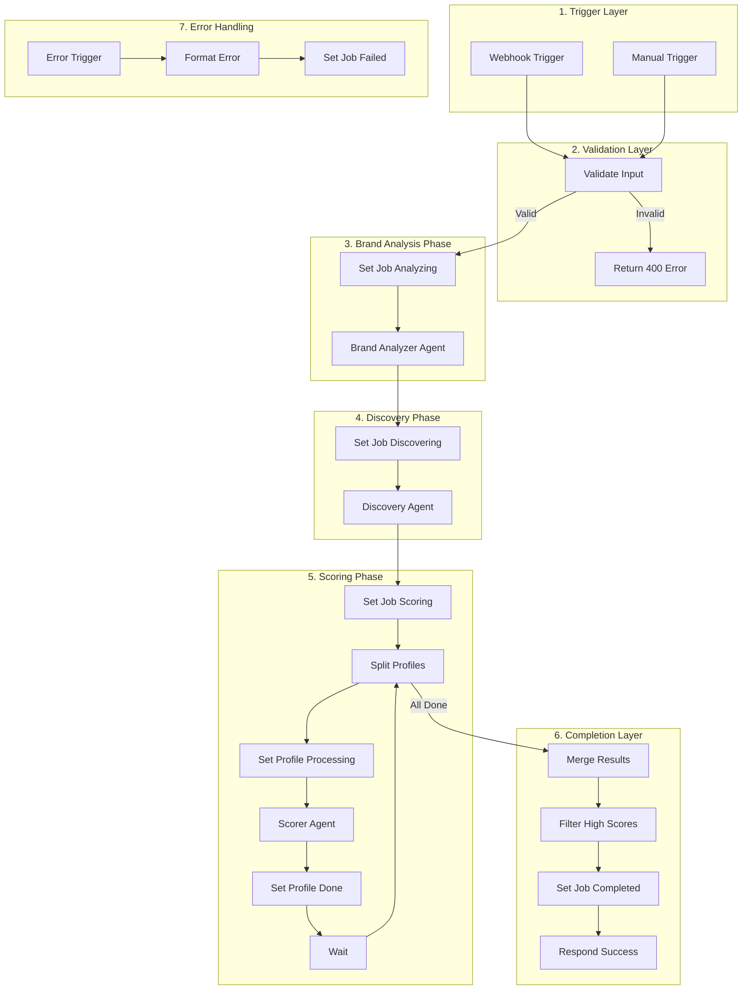

# PartnerScout AI - Orchestration Guide

> Complete guide for implementing workflow orchestration using N8N (primary) or Python (fallback).

---

## Table of Contents

1. [Overview](#1-overview)
2. [Prerequisites: Status Update APIs](#2-prerequisites-status-update-apis)
3. [N8N Orchestration](#3-n8n-orchestration)
4. [Python Orchestration (Fallback)](#4-python-orchestration-fallback)
5. [Appendix](#5-appendix)

---

## 1. Overview

### 1.1 What is Orchestration?

The orchestration layer coordinates the execution of AI agents, manages workflow state, and handles errors. It sits between the frontend and the agent APIs.

```
Frontend Dashboard
       │
       ▼
┌─────────────────────┐
│   Orchestration     │  ◄── This document
│   (N8N or Python)   │
└─────────────────────┘
       │
       ▼
┌─────────────────────┐
│   Agent APIs        │  ◄── See docs/Agents_Documentation.md
│   (FastAPI)         │
└─────────────────────┘
       │
       ▼
┌─────────────────────┐
│   Database          │  ◄── See docs/Supabase_Database_Guide.md
│   (Supabase)        │
└─────────────────────┘
```

### 1.2 Two Orchestration Options

| Option | Use Case | Advantages |
|--------|----------|------------|
| **N8N** (Primary) | Production, Demos | Visual debugging, parallel execution, built-in retry |
| **Python** (Fallback) | Local dev, CI/CD, N8N unavailable | No external dependencies, testable |

### 1.3 Shared Foundation

Both orchestrators use the **same APIs** for consistency:

- **Status Update APIs** (Section 2) - Update job/profile status
- **Agent APIs** - Call Brand Analyzer, Discovery, Scorer (see `docs/Agents_Documentation.md`)

This ensures identical behavior regardless of which orchestrator runs the workflow.

### 1.4 Cross-References

| Topic | Document |
|-------|----------|
| Agent API contracts | `docs/Agents_Documentation.md` |
| Database schema | `docs/Supabase_Database_Guide.md` |
| Product requirements | `docs/Partner_Scout_AI_PRD.md` |

---

## 2. Prerequisites: Status Update APIs

Before implementing orchestration, these Status Update APIs must be implemented in the FastAPI backend. Both N8N (Section 3) and Python (Section 4) orchestrators call these APIs.

### 2.1 Job Status API

Updates the status of a discovery job.

```
PATCH /api/jobs/{job_id}/status
```

**Authentication:** `X-Service-Key` header (same key used by N8N and Python)

**Request Body:**

```json
{
  "status": "analyzing",
  "error_message": null
}
```

| Field | Type | Required | Description |
|-------|------|----------|-------------|
| `status` | enum | Yes | New status value |
| `error_message` | string | No | Error details (only when status=failed) |

**Valid Status Values:**

| Status | Description |
|--------|-------------|
| `pending` | Job created, not started |
| `analyzing` | Brand Analyzer running |
| `discovering` | Discovery Agent running |
| `scoring` | Scorer Agent running |
| `completed` | All agents finished successfully |
| `failed` | Error occurred |

**Response (200 OK):**

```json
{
  "id": "11111111-1111-1111-1111-111111111111",
  "status": "analyzing",
  "updated_at": "2026-01-31T10:00:05Z"
}
```

**Error Response (400 Bad Request):**

```json
{
  "error": {
    "code": "INVALID_TRANSITION",
    "message": "Cannot transition from 'completed' to 'analyzing'"
  }
}
```

---

### 2.2 Profile Status API

Updates the status of a single discovered profile.

```
PATCH /api/profiles/{profile_id}/status
```

**Authentication:** `X-Service-Key` header

**Request Body:**

```json
{
  "status": "processing"
}
```

| Field | Type | Required | Description |
|-------|------|----------|-------------|
| `status` | enum | Yes | New status value |

**Valid Status Values:**

| Status | Description |
|--------|-------------|
| `new` | Just discovered, not scored |
| `processing` | Scorer Agent working on it |
| `done` | Scoring complete |
| `skipped` | Skipped (e.g., insufficient data) |

**Response (200 OK):**

```json
{
  "id": "aaaa1111-aaaa-aaaa-aaaa-aaaaaaaaaaaa",
  "status": "processing",
  "updated_at": "2026-01-31T10:02:00Z"
}
```

---

### 2.3 Batch Profile Status API

Updates multiple profile statuses in one call (for efficiency).

```
PATCH /api/jobs/{job_id}/profiles/status
```

**Authentication:** `X-Service-Key` header

**Request Body:**

```json
{
  "profile_ids": [
    "aaaa1111-aaaa-aaaa-aaaa-aaaaaaaaaaaa",
    "bbbb2222-bbbb-bbbb-bbbb-bbbbbbbbbbbb"
  ],
  "status": "done"
}
```

**Response (200 OK):**

```json
{
  "updated_count": 2,
  "status": "done"
}
```

---

### 2.4 FastAPI Implementation (Pseudo Code)

```python
# backend/app/api/status.py
"""
Status Update API endpoints.
Called by N8N (Section 3) and Python fallback (Section 4).
"""

from fastapi import APIRouter, Depends, HTTPException
from app.models.status import (
    UpdateJobStatusRequest,
    UpdateProfileStatusRequest,
    BatchUpdateProfileStatusRequest,
    JobStatusResponse,
    ProfileStatusResponse
)
from app.core.auth import verify_service_key
from app.db.supabase import get_db

router = APIRouter(prefix="/api", tags=["status"])

# Valid status transitions for jobs
VALID_JOB_TRANSITIONS = {
    "pending": ["analyzing", "failed"],
    "analyzing": ["discovering", "failed"],
    "discovering": ["scoring", "failed"],
    "scoring": ["completed", "failed"],
    "completed": [],  # Terminal state
    "failed": ["pending"]  # Allow retry
}

# Valid status transitions for profiles
VALID_PROFILE_TRANSITIONS = {
    "new": ["processing", "skipped"],
    "processing": ["done", "skipped"],
    "done": [],  # Terminal state
    "skipped": []  # Terminal state
}


@router.patch("/jobs/{job_id}/status", response_model=JobStatusResponse)
async def update_job_status(
    job_id: str,
    request: UpdateJobStatusRequest,
    _: None = Depends(verify_service_key),
    db = Depends(get_db)
):
    """
    Update job status.
    
    Used by:
    - N8N workflow nodes (see Section 3.3)
    - Python fallback orchestrator (see Section 4.2)
    
    Pseudo code:
    1. Fetch current job from database by job_id
    2. If job not found, raise 404 error
    3. Get current status from job
    4. Validate transition: check if new status is in VALID_JOB_TRANSITIONS[current_status]
    5. If invalid transition, raise 400 error with INVALID_TRANSITION code
    6. Update job status in database
    7. If status == 'failed' and error_message provided, store error_message
    8. Update job.updated_at timestamp
    9. Return updated job data
    """
    # 1. Fetch job
    job = db.table("discovery_jobs").select("*").eq("id", job_id).single().execute()
    
    if not job.data:
        raise HTTPException(status_code=404, detail={
            "code": "JOB_NOT_FOUND",
            "message": f"Job {job_id} not found"
        })
    
    current_status = job.data["status"]
    new_status = request.status
    
    # 3. Validate transition
    allowed_transitions = VALID_JOB_TRANSITIONS.get(current_status, [])
    if new_status not in allowed_transitions:
        raise HTTPException(status_code=400, detail={
            "code": "INVALID_TRANSITION",
            "message": f"Cannot transition from '{current_status}' to '{new_status}'"
        })
    
    # 4. Update database
    update_data = {"status": new_status}
    if new_status == "failed" and request.error_message:
        update_data["error_message"] = request.error_message
    
    result = db.table("discovery_jobs").update(update_data).eq("id", job_id).execute()
    
    return JobStatusResponse(
        id=job_id,
        status=new_status,
        updated_at=result.data[0]["updated_at"]
    )


@router.patch("/profiles/{profile_id}/status", response_model=ProfileStatusResponse)
async def update_profile_status(
    profile_id: str,
    request: UpdateProfileStatusRequest,
    _: None = Depends(verify_service_key),
    db = Depends(get_db)
):
    """
    Update single profile status.
    
    Used by:
    - N8N nodes: Set Profile Processing, Set Profile Done (Section 3.3)
    - Python fallback: update_profile_status() function (Section 4.2)
    
    Pseudo code:
    1. Fetch profile from discovered_profiles table
    2. If not found, raise 404 error
    3. Validate status transition using VALID_PROFILE_TRANSITIONS
    4. If invalid, raise 400 error
    5. Update profile status in database
    6. Return updated profile
    """
    # Implementation follows same pattern as update_job_status
    pass


@router.patch("/jobs/{job_id}/profiles/status")
async def batch_update_profile_status(
    job_id: str,
    request: BatchUpdateProfileStatusRequest,
    _: None = Depends(verify_service_key),
    db = Depends(get_db)
):
    """
    Batch update multiple profile statuses.
    
    Used by N8N when processing profiles in batches (see Section 3.3, Node 10).
    
    Pseudo code:
    1. Validate all profile_ids belong to the given job_id
    2. If any profile doesn't belong to job, raise 400 error
    3. Update all profiles in a single database transaction
    4. Return count of updated profiles
    """
    # Validate ownership
    profiles = db.table("discovered_profiles") \
        .select("id") \
        .eq("job_id", job_id) \
        .in_("id", request.profile_ids) \
        .execute()
    
    if len(profiles.data) != len(request.profile_ids):
        raise HTTPException(status_code=400, detail={
            "code": "INVALID_PROFILES",
            "message": "Some profile IDs do not belong to this job"
        })
    
    # Batch update
    result = db.table("discovered_profiles") \
        .update({"status": request.status}) \
        .in_("id", request.profile_ids) \
        .execute()
    
    return {"updated_count": len(result.data), "status": request.status}
```

---

### 2.5 Pydantic Models

```python
# backend/app/models/status.py
"""
Pydantic models for Status Update APIs.
"""

from pydantic import BaseModel
from typing import Optional
from enum import Enum
from datetime import datetime


class JobStatus(str, Enum):
    """Valid job status values."""
    PENDING = "pending"
    ANALYZING = "analyzing"
    DISCOVERING = "discovering"
    SCORING = "scoring"
    COMPLETED = "completed"
    FAILED = "failed"


class ProfileStatus(str, Enum):
    """Valid profile status values."""
    NEW = "new"
    PROCESSING = "processing"
    DONE = "done"
    SKIPPED = "skipped"


class UpdateJobStatusRequest(BaseModel):
    """Request body for PATCH /api/jobs/{job_id}/status"""
    status: JobStatus
    error_message: Optional[str] = None
    
    class Config:
        json_schema_extra = {
            "example": {
                "status": "analyzing",
                "error_message": None
            }
        }


class UpdateProfileStatusRequest(BaseModel):
    """Request body for PATCH /api/profiles/{profile_id}/status"""
    status: ProfileStatus
    
    class Config:
        json_schema_extra = {
            "example": {
                "status": "processing"
            }
        }


class BatchUpdateProfileStatusRequest(BaseModel):
    """Request body for PATCH /api/jobs/{job_id}/profiles/status"""
    profile_ids: list[str]
    status: ProfileStatus
    
    class Config:
        json_schema_extra = {
            "example": {
                "profile_ids": [
                    "aaaa1111-aaaa-aaaa-aaaa-aaaaaaaaaaaa",
                    "bbbb2222-bbbb-bbbb-bbbb-bbbbbbbbbbbb"
                ],
                "status": "done"
            }
        }


class JobStatusResponse(BaseModel):
    """Response for job status update."""
    id: str
    status: JobStatus
    updated_at: datetime


class ProfileStatusResponse(BaseModel):
    """Response for profile status update."""
    id: str
    status: ProfileStatus
    updated_at: datetime
```

---

### 2.6 Register Routes

```python
# backend/app/main.py
from fastapi import FastAPI
from app.api import agent, jobs, status  # Add status

app = FastAPI(title="PartnerScout API")

# Agent endpoints (called by orchestrators)
app.include_router(agent.router)

# Job endpoints (called by frontend)
app.include_router(jobs.router)

# Status endpoints (called by orchestrators) - NEW
app.include_router(status.router)
```

---

## 3. N8N Orchestration

N8N is the primary orchestrator for PartnerScout AI. It provides visual workflow debugging, which is excellent for demos and troubleshooting.

### 3.1 Why N8N

| Benefit | Description |
|---------|-------------|
| **Visual Debugging** | See data flow through each node in real-time |
| **Demo Storytelling** | Reviewers can watch the workflow execute step-by-step |
| **Parallel Execution** | Score multiple profiles simultaneously |
| **Built-in Retry** | Automatic retry on API failures |
| **No Code Deployment** | Import workflow JSON, configure credentials, done |

### 3.2 Workflow Architecture



---

### 3.3 Complete Node Reference (21 Nodes)

---

#### Node 01: Webhook Trigger

| Property | Value |
|----------|-------|
| **Node ID** | `webhook_trigger` |
| **N8N Type** | `n8n-nodes-base.webhook` |
| **Purpose** | Entry point - receives discovery start request from frontend |

**Configuration:**

| Setting | Value |
|---------|-------|
| HTTP Method | POST |
| Path | `start-discovery` |
| Response Mode | On Received (async) |
| Response Code | 202 Accepted |

**Expected Webhook URL:** `https://your-n8n-instance.com/webhook/start-discovery`

**Expected Payload:**

```json
{
  "job_id": "11111111-1111-1111-1111-111111111111",
  "user_id": "user0001-0001-0001-0001-000000000001"
}
```

**Output Data (available to subsequent nodes):**

```json
{
  "body": {
    "job_id": "11111111-1111-1111-1111-111111111111",
    "user_id": "user0001-0001-0001-0001-000000000001"
  },
  "headers": { ... },
  "query": { ... }
}
```

**N8N JSON Configuration:**

```json
{
  "parameters": {
    "httpMethod": "POST",
    "path": "start-discovery",
    "responseMode": "onReceived",
    "responseCode": 202,
    "responseData": "allEntries",
    "options": {}
  },
  "name": "Webhook Trigger",
  "type": "n8n-nodes-base.webhook",
  "position": [0, 0]
}
```

---

#### Node 02: Manual Trigger

| Property | Value |
|----------|-------|
| **Node ID** | `manual_trigger` |
| **N8N Type** | `n8n-nodes-base.manualTrigger` |
| **Purpose** | Alternative trigger for testing/demos without frontend |

**Usage:** Click "Execute Workflow" in N8N UI. Configure test data in a Set node after this trigger.

**Test Data (add via Set node):**

```json
{
  "body": {
    "job_id": "11111111-1111-1111-1111-111111111111",
    "user_id": "user0001-0001-0001-0001-000000000001"
  }
}
```

**N8N JSON Configuration:**

```json
{
  "parameters": {},
  "name": "Manual Trigger",
  "type": "n8n-nodes-base.manualTrigger",
  "position": [0, 200]
}
```

---

#### Node 03: Validate Input

| Property | Value |
|----------|-------|
| **Node ID** | `validate_input` |
| **N8N Type** | `n8n-nodes-base.if` |
| **Purpose** | Validates required fields exist before processing |

**Condition Logic:**
- Check: `$json.body.job_id` is not empty
- True: Continue to Phase 1
- False: Return 400 Error

**N8N JSON Configuration:**

```json
{
  "parameters": {
    "conditions": {
      "options": {
        "caseSensitive": true,
        "leftValue": "",
        "typeValidation": "strict"
      },
      "conditions": [
        {
          "id": "condition_job_id",
          "leftValue": "={{ $json.body.job_id }}",
          "rightValue": "",
          "operator": {
            "type": "string",
            "operation": "isNotEmpty"
          }
        }
      ],
      "combinator": "and"
    }
  },
  "name": "Validate Input",
  "type": "n8n-nodes-base.if",
  "position": [220, 100]
}
```

---

#### Node 04: Return 400 Error

| Property | Value |
|----------|-------|
| **Node ID** | `return_400` |
| **N8N Type** | `n8n-nodes-base.respondToWebhook` |
| **Purpose** | Returns error response for invalid requests |

**Response:**

```json
{
  "error": {
    "code": "INVALID_INPUT",
    "message": "job_id is required"
  }
}
```

**N8N JSON Configuration:**

```json
{
  "parameters": {
    "respondWith": "json",
    "responseCode": 400,
    "responseBody": "={{ JSON.stringify({ error: { code: 'INVALID_INPUT', message: 'job_id is required' } }) }}"
  },
  "name": "Return 400 Error",
  "type": "n8n-nodes-base.respondToWebhook",
  "position": [440, 200]
}
```

---

#### Node 05: Set Job Analyzing

| Property | Value |
|----------|-------|
| **Node ID** | `set_job_analyzing` |
| **N8N Type** | `n8n-nodes-base.httpRequest` |
| **Purpose** | Updates job status to "analyzing" |
| **API Endpoint** | `PATCH /api/jobs/{job_id}/status` |
| **API Reference** | Section 2.1 |

**Request Details:**

| Setting | Value |
|---------|-------|
| Method | PATCH |
| URL | `{{$env.FASTAPI_BASE_URL}}/api/jobs/{{$json.body.job_id}}/status` |
| Headers | `X-Service-Key: {{$env.N8N_SERVICE_KEY}}`, `Content-Type: application/json` |
| Body | `{ "status": "analyzing" }` |

**N8N JSON Configuration:**

```json
{
  "parameters": {
    "method": "PATCH",
    "url": "={{ $env.FASTAPI_BASE_URL }}/api/jobs/{{ $json.body.job_id }}/status",
    "sendHeaders": true,
    "headerParameters": {
      "parameters": [
        {
          "name": "X-Service-Key",
          "value": "={{ $env.N8N_SERVICE_KEY }}"
        },
        {
          "name": "Content-Type",
          "value": "application/json"
        }
      ]
    },
    "sendBody": true,
    "specifyBody": "json",
    "jsonBody": "{ \"status\": \"analyzing\" }",
    "options": {}
  },
  "name": "Set Job Analyzing",
  "type": "n8n-nodes-base.httpRequest",
  "position": [440, 0]
}
```

---

#### Node 06: Brand Analyzer Agent

| Property | Value |
|----------|-------|
| **Node ID** | `brand_analyzer` |
| **N8N Type** | `n8n-nodes-base.httpRequest` |
| **Purpose** | Calls Brand Analyzer API to extract brand DNA |
| **API Endpoint** | `POST /api/agent/analyze-brand` |
| **Agent Reference** | `docs/Agents_Documentation.md` Section 2 |

**Request Details:**

| Setting | Value |
|---------|-------|
| Method | POST |
| URL | `{{$env.FASTAPI_BASE_URL}}/api/agent/analyze-brand` |
| Headers | `X-Service-Key`, `Content-Type: application/json` |
| Timeout | 120 seconds |
| Retry on Fail | Yes, 2 attempts, 5s delay |

**Request Body:**

```json
{
  "job_id": "={{$json.body.job_id}}"
}
```

**Expected Response:**

```json
{
  "brand_dna": {
    "hashtags": ["#sustainablefashion", "#slowfashion", "#ethicalfashion"],
    "keywords": ["sustainable", "minimalist", "ethical", "organic"],
    "embedding_vector": [0.0234, -0.0891, 0.0456, ...]
  }
}
```

**N8N JSON Configuration:**

```json
{
  "parameters": {
    "method": "POST",
    "url": "={{ $env.FASTAPI_BASE_URL }}/api/agent/analyze-brand",
    "sendHeaders": true,
    "headerParameters": {
      "parameters": [
        {
          "name": "X-Service-Key",
          "value": "={{ $env.N8N_SERVICE_KEY }}"
        },
        {
          "name": "Content-Type",
          "value": "application/json"
        }
      ]
    },
    "sendBody": true,
    "specifyBody": "json",
    "jsonBody": "={ \"job_id\": \"{{ $json.body.job_id }}\" }",
    "options": {
      "timeout": 120000
    }
  },
  "name": "Brand Analyzer Agent",
  "type": "n8n-nodes-base.httpRequest",
  "position": [660, 0],
  "retryOnFail": true,
  "maxTries": 3,
  "waitBetweenTries": 5000
}
```

---

#### Node 07: Set Job Discovering

| Property | Value |
|----------|-------|
| **Node ID** | `set_job_discovering` |
| **N8N Type** | `n8n-nodes-base.httpRequest` |
| **Purpose** | Updates job status to "discovering" |
| **API Endpoint** | `PATCH /api/jobs/{job_id}/status` |
| **API Reference** | Section 2.1 |

**Request Body:**

```json
{
  "status": "discovering"
}
```

**N8N JSON Configuration:**

```json
{
  "parameters": {
    "method": "PATCH",
    "url": "={{ $env.FASTAPI_BASE_URL }}/api/jobs/{{ $node['Webhook Trigger'].json.body.job_id }}/status",
    "sendHeaders": true,
    "headerParameters": {
      "parameters": [
        {
          "name": "X-Service-Key",
          "value": "={{ $env.N8N_SERVICE_KEY }}"
        },
        {
          "name": "Content-Type",
          "value": "application/json"
        }
      ]
    },
    "sendBody": true,
    "specifyBody": "json",
    "jsonBody": "{ \"status\": \"discovering\" }"
  },
  "name": "Set Job Discovering",
  "type": "n8n-nodes-base.httpRequest",
  "position": [880, 0]
}
```

---

#### Node 08: Discovery Agent

| Property | Value |
|----------|-------|
| **Node ID** | `discovery_agent` |
| **N8N Type** | `n8n-nodes-base.httpRequest` |
| **Purpose** | Calls Discovery API to find similar Instagram profiles |
| **API Endpoint** | `POST /api/agent/discover` |
| **Agent Reference** | `docs/Agents_Documentation.md` Section 3 |

**Request Details:**

| Setting | Value |
|---------|-------|
| Method | POST |
| URL | `{{$env.FASTAPI_BASE_URL}}/api/agent/discover` |
| Timeout | 180 seconds |
| Retry on Fail | Yes, 2 attempts |

**Request Body:**

```json
{
  "job_id": "={{$node['Webhook Trigger'].json.body.job_id}}",
  "hashtags": "={{$node['Brand Analyzer Agent'].json.brand_dna.hashtags}}",
  "keywords": "={{$node['Brand Analyzer Agent'].json.brand_dna.keywords}}",
  "limit": 50
}
```

**Expected Response:**

**Note:** The response includes `id` for each profile because the Discovery Agent inserts profiles into the `discovered_profiles` database table and returns the generated UUIDs. All profile metadata is stored at discovery time.

```json
{
  "profiles": [
    {
      "id": "aaaa1111-aaaa-aaaa-aaaa-aaaaaaaaaaaa",
      "instagram_url": "https://instagram.com/the_sustainable_closet",
      "username": "the_sustainable_closet",
      "full_name": "The Sustainable Closet",
      "profile_picture_url": "https://instagram.com/...",
      "bio": "Curating ethical fashion | Slow fashion advocate",
      "followers": 45200,
      "following": 1250,
      "posts_count": 847,
      "engagement_rate": 3.2,
      "is_verified": false,
      "is_business": true,
      "external_url": "https://sustainablecloset.com",
      "business_email": "hello@sustainablecloset.com",
      "business_category": "Clothing Store",
      "following_ratio": 0.03
    },
    {
      "id": "bbbb2222-bbbb-bbbb-bbbb-bbbbbbbbbbbb",
      "instagram_url": "https://instagram.com/eco.boutique",
      "username": "eco.boutique",
      "full_name": "Eco Boutique",
      "profile_picture_url": "https://instagram.com/...",
      "bio": "Sustainable living | Eco-friendly products",
      "followers": 28500,
      "following": 890,
      "posts_count": 432,
      "engagement_rate": 4.1,
      "is_verified": false,
      "is_business": true,
      "external_url": "https://ecoboutique.co",
      "business_email": "contact@ecoboutique.co",
      "business_category": "Home Goods Store",
      "following_ratio": 0.03
    }
  ],
  "total_discovered": 2,
  "deduplicated": 0
}
```

**N8N JSON Configuration:**

```json
{
  "parameters": {
    "method": "POST",
    "url": "={{ $env.FASTAPI_BASE_URL }}/api/agent/discover",
    "sendHeaders": true,
    "headerParameters": {
      "parameters": [
        {
          "name": "X-Service-Key",
          "value": "={{ $env.N8N_SERVICE_KEY }}"
        },
        {
          "name": "Content-Type",
          "value": "application/json"
        }
      ]
    },
    "sendBody": true,
    "specifyBody": "json",
    "jsonBody": "={ \"job_id\": \"{{ $node['Webhook Trigger'].json.body.job_id }}\", \"hashtags\": {{ JSON.stringify($node['Brand Analyzer Agent'].json.brand_dna.hashtags) }}, \"keywords\": {{ JSON.stringify($node['Brand Analyzer Agent'].json.brand_dna.keywords) }}, \"limit\": 50 }",
    "options": {
      "timeout": 180000
    }
  },
  "name": "Discovery Agent",
  "type": "n8n-nodes-base.httpRequest",
  "position": [1100, 0],
  "retryOnFail": true,
  "maxTries": 3,
  "waitBetweenTries": 5000
}
```

---

#### Node 09: Set Job Scoring

| Property | Value |
|----------|-------|
| **Node ID** | `set_job_scoring` |
| **N8N Type** | `n8n-nodes-base.httpRequest` |
| **Purpose** | Updates job status to "scoring" |
| **API Endpoint** | `PATCH /api/jobs/{job_id}/status` |
| **API Reference** | Section 2.1 |

**Request Body:**

```json
{
  "status": "scoring"
}
```

**N8N JSON Configuration:**

```json
{
  "parameters": {
    "method": "PATCH",
    "url": "={{ $env.FASTAPI_BASE_URL }}/api/jobs/{{ $node['Webhook Trigger'].json.body.job_id }}/status",
    "sendHeaders": true,
    "headerParameters": {
      "parameters": [
        {
          "name": "X-Service-Key",
          "value": "={{ $env.N8N_SERVICE_KEY }}"
        },
        {
          "name": "Content-Type",
          "value": "application/json"
        }
      ]
    },
    "sendBody": true,
    "specifyBody": "json",
    "jsonBody": "{ \"status\": \"scoring\" }"
  },
  "name": "Set Job Scoring",
  "type": "n8n-nodes-base.httpRequest",
  "position": [1320, 0]
}
```

---

#### Node 10: Split Profiles

| Property | Value |
|----------|-------|
| **Node ID** | `split_profiles` |
| **N8N Type** | `n8n-nodes-base.splitInBatches` |
| **Purpose** | Splits profile array into batches for parallel scoring |

**Configuration:**

| Setting | Value |
|---------|-------|
| Batch Size | 5 profiles per batch |
| Reset | false |

**Input:** `$node['Discovery Agent'].json.profiles` (array of 50 profiles)

**Output:** 10 batches of 5 profiles each, processed sequentially

**N8N JSON Configuration:**

```json
{
  "parameters": {
    "batchSize": 5,
    "options": {
      "reset": false
    }
  },
  "name": "Split Profiles",
  "type": "n8n-nodes-base.splitInBatches",
  "position": [1540, 0]
}
```

---

#### Node 11: Set Profile Processing

| Property | Value |
|----------|-------|
| **Node ID** | `set_profile_processing` |
| **N8N Type** | `n8n-nodes-base.httpRequest` |
| **Purpose** | Updates profile status to "processing" before scoring |
| **API Endpoint** | `PATCH /api/profiles/{profile_id}/status` |
| **API Reference** | Section 2.2 |

**Request Body:**

```json
{
  "status": "processing"
}
```

**N8N JSON Configuration:**

```json
{
  "parameters": {
    "method": "PATCH",
    "url": "={{ $env.FASTAPI_BASE_URL }}/api/profiles/{{ $json.id }}/status",
    "sendHeaders": true,
    "headerParameters": {
      "parameters": [
        {
          "name": "X-Service-Key",
          "value": "={{ $env.N8N_SERVICE_KEY }}"
        },
        {
          "name": "Content-Type",
          "value": "application/json"
        }
      ]
    },
    "sendBody": true,
    "specifyBody": "json",
    "jsonBody": "{ \"status\": \"processing\" }"
  },
  "name": "Set Profile Processing",
  "type": "n8n-nodes-base.httpRequest",
  "position": [1760, 0]
}
```

---

#### Node 12: Scorer Agent

| Property | Value |
|----------|-------|
| **Node ID** | `scorer_agent` |
| **N8N Type** | `n8n-nodes-base.httpRequest` |
| **Purpose** | Calls Scorer API to evaluate profile match and extract contact |
| **API Endpoint** | `POST /api/agent/score` |
| **Agent Reference** | `docs/Agents_Documentation.md` Section 4 |

**Request Details:**

| Setting | Value |
|---------|-------|
| Method | POST |
| URL | `{{$env.FASTAPI_BASE_URL}}/api/agent/score` |
| Timeout | 60 seconds |
| Retry on Fail | Yes, 2 attempts |

**Request Body:**

The Scorer Agent accepts a simplified request with IDs. The backend fetches `brand_dna` from the database and uses stored `profile_data` from `discovered_profiles` table. It fetches only `recent_posts` from Apify at runtime for engagement analysis. See `docs/Agents_Documentation.md` Section 4 for details.

```json
{
  "profile_id": "={{$json.id}}",
  "job_id": "={{$node['Webhook Trigger'].json.body.job_id}}"
}
```

**Note:** The backend internally uses stored profile data from `discovered_profiles` table plus fetches `recent_posts` from Apify for engagement analysis. See `Agents_Documentation.md` Section 4 for field mapping.

**Expected Response:**

```json
{
  "score": 92,
  "reasoning": {
    "visual_aesthetic_match": 95,
    "content_theme_alignment": 90,
    "engagement_rate_score": 88,
    "follower_quality": 95,
    "business_indicators": 100,
    "activity_recency": 90,
    "summary": "Excellent match. Strong alignment with sustainable fashion values, consistent minimalist aesthetic. Genuine profile with healthy engagement and complete business presence.",
    "recommendation": "Highly recommended for partnership outreach."
  },
  "contact": {
    "email": "hello@sustainablecloset.com",
    "source": "business_email"
  }
}
```

**N8N JSON Configuration:**

```json
{
  "parameters": {
    "method": "POST",
    "url": "={{ $env.FASTAPI_BASE_URL }}/api/agent/score",
    "sendHeaders": true,
    "headerParameters": {
      "parameters": [
        {
          "name": "X-Service-Key",
          "value": "={{ $env.N8N_SERVICE_KEY }}"
        },
        {
          "name": "Content-Type",
          "value": "application/json"
        }
      ]
    },
    "sendBody": true,
    "specifyBody": "json",
    "jsonBody": "={ \"profile_id\": \"{{ $json.id }}\", \"job_id\": \"{{ $node['Webhook Trigger'].json.body.job_id }}\" }",
    "options": {
      "timeout": 60000
    }
  },
  "name": "Scorer Agent",
  "type": "n8n-nodes-base.httpRequest",
  "position": [1980, 0],
  "retryOnFail": true,
  "maxTries": 3,
  "waitBetweenTries": 3000
}
```

---

#### Node 13: Set Profile Done

| Property | Value |
|----------|-------|
| **Node ID** | `set_profile_done` |
| **N8N Type** | `n8n-nodes-base.httpRequest` |
| **Purpose** | Updates profile status to "done" after successful scoring |
| **API Endpoint** | `PATCH /api/profiles/{profile_id}/status` |
| **API Reference** | Section 2.2 |

**Request Body:**

```json
{
  "status": "done"
}
```

**N8N JSON Configuration:**

```json
{
  "parameters": {
    "method": "PATCH",
    "url": "={{ $env.FASTAPI_BASE_URL }}/api/profiles/{{ $node['Set Profile Processing'].json.id }}/status",
    "sendHeaders": true,
    "headerParameters": {
      "parameters": [
        {
          "name": "X-Service-Key",
          "value": "={{ $env.N8N_SERVICE_KEY }}"
        },
        {
          "name": "Content-Type",
          "value": "application/json"
        }
      ]
    },
    "sendBody": true,
    "specifyBody": "json",
    "jsonBody": "{ \"status\": \"done\" }"
  },
  "name": "Set Profile Done",
  "type": "n8n-nodes-base.httpRequest",
  "position": [2200, 0]
}
```

---

#### Node 14: Wait

| Property | Value |
|----------|-------|
| **Node ID** | `wait_rate_limit` |
| **N8N Type** | `n8n-nodes-base.wait` |
| **Purpose** | Rate limiting between scoring batches to avoid API overload |

**Configuration:**

| Setting | Value |
|---------|-------|
| Wait Time | 1 second |
| Unit | seconds |

**N8N JSON Configuration:**

```json
{
  "parameters": {
    "amount": 1,
    "unit": "seconds"
  },
  "name": "Wait",
  "type": "n8n-nodes-base.wait",
  "position": [2420, 0]
}
```

---

#### Node 15: Merge Results

| Property | Value |
|----------|-------|
| **Node ID** | `merge_results` |
| **N8N Type** | `n8n-nodes-base.merge` |
| **Purpose** | Combines all scored profiles from all batches into single array |

**Configuration:**

| Setting | Value |
|---------|-------|
| Mode | Append |

**N8N JSON Configuration:**

```json
{
  "parameters": {
    "mode": "append"
  },
  "name": "Merge Results",
  "type": "n8n-nodes-base.merge",
  "position": [2640, 0]
}
```

---

#### Node 16: Filter High Scores

| Property | Value |
|----------|-------|
| **Node ID** | `filter_high_scores` |
| **N8N Type** | `n8n-nodes-base.filter` |
| **Purpose** | Filters to keep only profiles with score >= 50 |

**Condition:** `$json.score >= 50`

**N8N JSON Configuration:**

```json
{
  "parameters": {
    "conditions": {
      "options": {
        "caseSensitive": true,
        "leftValue": "",
        "typeValidation": "strict"
      },
      "conditions": [
        {
          "id": "filter_score",
          "leftValue": "={{ $json.score }}",
          "rightValue": 50,
          "operator": {
            "type": "number",
            "operation": "gte"
          }
        }
      ],
      "combinator": "and"
    }
  },
  "name": "Filter High Scores",
  "type": "n8n-nodes-base.filter",
  "position": [2860, 0]
}
```

---

#### Node 17: Set Job Completed

| Property | Value |
|----------|-------|
| **Node ID** | `set_job_completed` |
| **N8N Type** | `n8n-nodes-base.httpRequest` |
| **Purpose** | Updates job status to "completed" |
| **API Endpoint** | `PATCH /api/jobs/{job_id}/status` |
| **API Reference** | Section 2.1 |

**Request Body:**

```json
{
  "status": "completed"
}
```

**N8N JSON Configuration:**

```json
{
  "parameters": {
    "method": "PATCH",
    "url": "={{ $env.FASTAPI_BASE_URL }}/api/jobs/{{ $node['Webhook Trigger'].json.body.job_id }}/status",
    "sendHeaders": true,
    "headerParameters": {
      "parameters": [
        {
          "name": "X-Service-Key",
          "value": "={{ $env.N8N_SERVICE_KEY }}"
        },
        {
          "name": "Content-Type",
          "value": "application/json"
        }
      ]
    },
    "sendBody": true,
    "specifyBody": "json",
    "jsonBody": "{ \"status\": \"completed\" }"
  },
  "name": "Set Job Completed",
  "type": "n8n-nodes-base.httpRequest",
  "position": [3080, 0]
}
```

---

#### Node 18: Respond Success

| Property | Value |
|----------|-------|
| **Node ID** | `respond_success` |
| **N8N Type** | `n8n-nodes-base.respondToWebhook` |
| **Purpose** | Returns success response (only used if webhook is in sync mode) |

**Response Body:**

```json
{
  "success": true,
  "job_id": "={{$node['Webhook Trigger'].json.body.job_id}}",
  "message": "Discovery completed successfully"
}
```

**N8N JSON Configuration:**

```json
{
  "parameters": {
    "respondWith": "json",
    "responseCode": 200,
    "responseBody": "={{ JSON.stringify({ success: true, job_id: $node['Webhook Trigger'].json.body.job_id, message: 'Discovery completed successfully' }) }}"
  },
  "name": "Respond Success",
  "type": "n8n-nodes-base.respondToWebhook",
  "position": [3300, 0]
}
```

---

#### Node 19: Error Trigger

| Property | Value |
|----------|-------|
| **Node ID** | `error_trigger` |
| **N8N Type** | `n8n-nodes-base.errorTrigger` |
| **Purpose** | Catches errors from any node in the workflow |

**Note:** This node automatically receives error information when any other node fails.

**Error Data Available:**

```json
{
  "error": {
    "message": "Request failed with status code 500",
    "name": "Error"
  },
  "execution": {
    "id": "execution-id",
    "mode": "webhook"
  },
  "workflow": {
    "id": "workflow-id",
    "name": "Partner Discovery"
  }
}
```

**N8N JSON Configuration:**

```json
{
  "parameters": {},
  "name": "Error Trigger",
  "type": "n8n-nodes-base.errorTrigger",
  "position": [0, 400]
}
```

---

#### Node 20: Format Error

| Property | Value |
|----------|-------|
| **Node ID** | `format_error` |
| **N8N Type** | `n8n-nodes-base.set` |
| **Purpose** | Formats error data for the failed status update |

**Output Data:**

```json
{
  "job_id": "={{$node['Webhook Trigger'].json.body.job_id}}",
  "error_message": "={{$json.error.message}}"
}
```

**N8N JSON Configuration:**

```json
{
  "parameters": {
    "mode": "raw",
    "jsonOutput": "={\n  \"job_id\": \"{{ $node['Webhook Trigger'].json.body.job_id }}\",\n  \"error_message\": \"{{ $json.error.message || 'Unknown error occurred' }}\"\n}"
  },
  "name": "Format Error",
  "type": "n8n-nodes-base.set",
  "position": [220, 400]
}
```

---

#### Node 21: Set Job Failed

| Property | Value |
|----------|-------|
| **Node ID** | `set_job_failed` |
| **N8N Type** | `n8n-nodes-base.httpRequest` |
| **Purpose** | Updates job status to "failed" with error message |
| **API Endpoint** | `PATCH /api/jobs/{job_id}/status` |
| **API Reference** | Section 2.1 |

**Request Body:**

```json
{
  "status": "failed",
  "error_message": "={{$json.error_message}}"
}
```

**N8N JSON Configuration:**

```json
{
  "parameters": {
    "method": "PATCH",
    "url": "={{ $env.FASTAPI_BASE_URL }}/api/jobs/{{ $json.job_id }}/status",
    "sendHeaders": true,
    "headerParameters": {
      "parameters": [
        {
          "name": "X-Service-Key",
          "value": "={{ $env.N8N_SERVICE_KEY }}"
        },
        {
          "name": "Content-Type",
          "value": "application/json"
        }
      ]
    },
    "sendBody": true,
    "specifyBody": "json",
    "jsonBody": "={ \"status\": \"failed\", \"error_message\": \"{{ $json.error_message }}\" }"
  },
  "name": "Set Job Failed",
  "type": "n8n-nodes-base.httpRequest",
  "position": [440, 400]
}
```

---

### 3.4 Node Connections Summary

| # | From Node | To Node | Condition |
|---|-----------|---------|-----------|
| 1 | Webhook Trigger | Validate Input | Always |
| 2 | Manual Trigger | Validate Input | Always |
| 3 | Validate Input | Set Job Analyzing | True (valid) |
| 4 | Validate Input | Return 400 Error | False (invalid) |
| 5 | Set Job Analyzing | Brand Analyzer Agent | Always |
| 6 | Brand Analyzer Agent | Set Job Discovering | Always |
| 7 | Set Job Discovering | Discovery Agent | Always |
| 8 | Discovery Agent | Set Job Scoring | Always |
| 9 | Set Job Scoring | Split Profiles | Always |
| 10 | Split Profiles | Set Profile Processing | Each item |
| 11 | Set Profile Processing | Scorer Agent | Always |
| 12 | Scorer Agent | Set Profile Done | Always |
| 13 | Set Profile Done | Wait | Always |
| 14 | Wait | Split Profiles | Loop back |
| 15 | Split Profiles | Merge Results | No more items |
| 16 | Merge Results | Filter High Scores | Always |
| 17 | Filter High Scores | Set Job Completed | Always |
| 18 | Set Job Completed | Respond Success | Always |
| 19 | Error Trigger | Format Error | On any error |
| 20 | Format Error | Set Job Failed | Always |

---

### 3.5 Environment Variables

Configure these in N8N Settings > Variables:

| Variable | Description | Example Value |
|----------|-------------|---------------|
| `FASTAPI_BASE_URL` | Backend API base URL | `http://localhost:8000` |
| `N8N_SERVICE_KEY` | Service key for API auth | `your-secret-service-key-123` |

**Important:** Use the same `N8N_SERVICE_KEY` value in both N8N and the backend `.env` file.

---

### 3.6 Demo Instructions

#### Pre-Demo Checklist

1. [ ] N8N server running and accessible
2. [ ] FastAPI backend running (`uvicorn app.main:app --reload`)
3. [ ] Supabase connection configured
4. [ ] Environment variables set in N8N
5. [ ] Workflow imported and activated
6. [ ] Test job created in database (or frontend ready)

#### Demo Flow

1. **Open N8N workflow editor** - Show the visual workflow
2. **Open frontend dashboard** in another window
3. **Start discovery** from frontend (or use Manual Trigger)
4. **Watch nodes light up** in sequence in N8N
5. **Show profiles appearing** in real-time on dashboard
6. **Click a high-scoring profile** to show score breakdown
7. **Show email extracted** from profile

#### Demo Talking Points by Phase

| Phase | Node | Talking Point |
|-------|------|---------------|
| Trigger | Webhook Trigger | "Frontend triggers the workflow via webhook" |
| Phase 1 | Brand Analyzer | "AI is extracting brand DNA from reference profiles" |
| Phase 2 | Discovery Agent | "Now finding similar Instagram profiles based on hashtags" |
| Phase 3 | Scorer Agent | "Scoring each profile in parallel - watch the dashboard update" |
| Completion | Filter High Scores | "Only keeping profiles with 50+ score" |

---

### 3.7 Workflow Export

After building the workflow in N8N:

1. Click the three dots menu in N8N
2. Select "Download"
3. Save as `n8n/workflows/partner-discovery.json`

To import:

1. Go to N8N Workflows
2. Click "Import from File"
3. Select `partner-discovery.json`
4. Configure credentials
5. Set environment variables
6. Activate workflow

---

## 4. Python Orchestration (Fallback)

The Python fallback orchestrator provides identical functionality to N8N but runs as a Python script. Use it when N8N is unavailable.

### 4.1 When to Use

| Scenario | Use Python Fallback |
|----------|---------------------|
| N8N server is down | Yes |
| Local development without N8N | Yes |
| CI/CD integration tests | Yes |
| Demo environment without N8N setup | Yes |
| Production with N8N available | No, use N8N |

### 4.2 Implementation (Pseudo Code)

```python
# backend/scripts/run_discovery.py
"""
Python Fallback Orchestrator.

Uses the same APIs as N8N workflow (see Section 3) for consistency.
All status updates go through the Status APIs (see Section 2).

Usage:
    python -m scripts.run_discovery <job_id>
    
Example:
    python -m scripts.run_discovery 11111111-1111-1111-1111-111111111111
"""

import asyncio
import sys
import httpx
from typing import Optional

# Configuration - use same values as N8N environment variables
FASTAPI_BASE_URL = "http://localhost:8000"  # From settings
SERVICE_KEY = "your-secret-service-key-123"  # Same as N8N_SERVICE_KEY


# =============================================================================
# Status Update Functions (calls Section 2 APIs)
# =============================================================================

async def update_job_status(
    job_id: str, 
    status: str, 
    error_message: Optional[str] = None
) -> dict:
    """
    Update job status via API.
    
    Calls: PATCH /api/jobs/{job_id}/status (Section 2.1)
    Same endpoint used by N8N nodes: Set Job Analyzing, Set Job Discovering, etc.
    
    Args:
        job_id: UUID of the discovery job
        status: One of: analyzing, discovering, scoring, completed, failed
        error_message: Error details (only when status=failed)
    
    Returns:
        Updated job data from API response
    """
    async with httpx.AsyncClient() as client:
        payload = {"status": status}
        if error_message:
            payload["error_message"] = error_message
        
        response = await client.patch(
            f"{FASTAPI_BASE_URL}/api/jobs/{job_id}/status",
            headers={
                "X-Service-Key": SERVICE_KEY,
                "Content-Type": "application/json"
            },
            json=payload,
            timeout=30.0
        )
        response.raise_for_status()
        return response.json()


async def update_profile_status(profile_id: str, status: str) -> dict:
    """
    Update profile status via API.
    
    Calls: PATCH /api/profiles/{profile_id}/status (Section 2.2)
    Same endpoint used by N8N nodes: Set Profile Processing, Set Profile Done.
    
    Args:
        profile_id: UUID of the discovered profile
        status: One of: new, processing, done, skipped
    
    Returns:
        Updated profile data from API response
    """
    async with httpx.AsyncClient() as client:
        response = await client.patch(
            f"{FASTAPI_BASE_URL}/api/profiles/{profile_id}/status",
            headers={
                "X-Service-Key": SERVICE_KEY,
                "Content-Type": "application/json"
            },
            json={"status": status},
            timeout=30.0
        )
        response.raise_for_status()
        return response.json()


# =============================================================================
# Agent Call Functions (calls Agent APIs from docs/Agents_Documentation.md)
# =============================================================================

async def call_brand_analyzer(job_id: str) -> dict:
    """
    Call Brand Analyzer Agent API.
    
    Calls: POST /api/agent/analyze-brand
    Same endpoint used by N8N Node 06: Brand Analyzer Agent.
    See docs/Agents_Documentation.md Section 2 for details.
    
    Returns:
        {"brand_dna": {"hashtags": [...], "keywords": [...], "embedding_vector": [...]}}
    """
    async with httpx.AsyncClient() as client:
        response = await client.post(
            f"{FASTAPI_BASE_URL}/api/agent/analyze-brand",
            headers={
                "X-Service-Key": SERVICE_KEY,
                "Content-Type": "application/json"
            },
            json={"job_id": job_id},
            timeout=120.0  # Same timeout as N8N node
        )
        response.raise_for_status()
        return response.json()


async def call_discovery_agent(
    job_id: str, 
    hashtags: list[str], 
    keywords: list[str],
    limit: int = 50
) -> dict:
    """
    Call Discovery Agent API.
    
    Calls: POST /api/agent/discover
    Same endpoint used by N8N Node 08: Discovery Agent.
    See docs/Agents_Documentation.md Section 3 for details.
    
    Returns:
        {"profiles": [{"id": "...", "instagram_url": "...", "username": "...", "full_name": "...", 
         "profile_picture_url": "...", "bio": "...", "followers": ..., "following": ..., 
         "posts_count": ..., "engagement_rate": ..., "is_verified": ..., "is_business": ...,
         "external_url": "...", "business_email": "...", "business_category": "...", "following_ratio": ...}],
         "total_discovered": ..., "deduplicated": ...}
    """
    async with httpx.AsyncClient() as client:
        response = await client.post(
            f"{FASTAPI_BASE_URL}/api/agent/discover",
            headers={
                "X-Service-Key": SERVICE_KEY,
                "Content-Type": "application/json"
            },
            json={
                "job_id": job_id,
                "hashtags": hashtags,
                "keywords": keywords,
                "limit": limit
            },
            timeout=180.0  # Same timeout as N8N node
        )
        response.raise_for_status()
        return response.json()


async def call_scorer_agent(profile_id: str, job_id: str) -> dict:
    """
    Call Scorer Agent API.
    
    Calls: POST /api/agent/score
    Same endpoint used by N8N Node 12: Scorer Agent.
    See docs/Agents_Documentation.md Section 4 for the full data structure.
    
    Note: We send simplified request (just IDs). The backend fetches:
    - brand_dna from the job's brand_dna table entry
    - profile_data from discovered_profiles table (stored at discovery time)
    - recent_posts from Apify at runtime for engagement analysis
    
    Returns:
        {"score": 92, "reasoning": {...}, "contact": {"email": "...", "source": "..."}}
    """
    async with httpx.AsyncClient() as client:
        response = await client.post(
            f"{FASTAPI_BASE_URL}/api/agent/score",
            headers={
                "X-Service-Key": SERVICE_KEY,
                "Content-Type": "application/json"
            },
            json={
                "profile_id": profile_id,
                "job_id": job_id
            },
            timeout=60.0  # Same timeout as N8N node
        )
        response.raise_for_status()
        return response.json()


# =============================================================================
# Main Orchestration Function
# =============================================================================

async def run_discovery(job_id: str) -> None:
    """
    Main orchestration function.
    
    Mirrors the N8N workflow (Section 3) exactly, using the same APIs.
    
    Workflow:
    1. Set job status to 'analyzing'
    2. Call Brand Analyzer Agent
    3. Set job status to 'discovering'
    4. Call Discovery Agent
    5. Set job status to 'scoring'
    6. For each profile:
       a. Set profile status to 'processing'
       b. Call Scorer Agent
       c. Set profile status to 'done'
    7. Set job status to 'completed'
    
    On any error:
    - Set job status to 'failed' with error message
    """
    print(f"[Orchestrator] Starting discovery for job: {job_id}")
    
    try:
        # =====================================================================
        # Phase 1: Brand Analysis
        # Equivalent to N8N Nodes 05-06
        # =====================================================================
        print("[Phase 1] Analyzing brand...")
        await update_job_status(job_id, "analyzing")
        
        brand_result = await call_brand_analyzer(job_id)
        brand_dna = brand_result["brand_dna"]
        print(f"[Phase 1] Extracted {len(brand_dna['hashtags'])} hashtags, {len(brand_dna['keywords'])} keywords")
        
        # =====================================================================
        # Phase 2: Profile Discovery
        # Equivalent to N8N Nodes 07-08
        # =====================================================================
        print("[Phase 2] Discovering profiles...")
        await update_job_status(job_id, "discovering")
        
        discovery_result = await call_discovery_agent(
            job_id=job_id,
            hashtags=brand_dna["hashtags"],
            keywords=brand_dna["keywords"],
            limit=50
        )
        profiles = discovery_result["profiles"]
        print(f"[Phase 2] Discovered {len(profiles)} profiles")
        
        # =====================================================================
        # Phase 3: Scoring
        # Equivalent to N8N Nodes 09-14
        # =====================================================================
        print("[Phase 3] Scoring profiles...")
        await update_job_status(job_id, "scoring")
        
        scored_count = 0
        high_score_count = 0
        
        for i, profile in enumerate(profiles):
            profile_id = profile["id"]
            username = profile["username"]
            
            print(f"[Phase 3] Scoring profile {i+1}/{len(profiles)}: @{username}")
            
            # Set profile to processing (N8N Node 11)
            await update_profile_status(profile_id, "processing")
            
            # Call scorer (N8N Node 12)
            score_result = await call_scorer_agent(profile_id, job_id)
            
            # Set profile to done (N8N Node 13)
            await update_profile_status(profile_id, "done")
            
            scored_count += 1
            if score_result["score"] >= 50:
                high_score_count += 1
            
            # Rate limiting - equivalent to N8N Node 14 (Wait)
            await asyncio.sleep(1)
        
        # =====================================================================
        # Completion
        # Equivalent to N8N Nodes 15-17
        # =====================================================================
        print(f"[Complete] Scored {scored_count} profiles, {high_score_count} with score >= 50")
        await update_job_status(job_id, "completed")
        print(f"[Complete] Discovery job {job_id} completed successfully!")
        
    except Exception as e:
        # =====================================================================
        # Error Handling
        # Equivalent to N8N Nodes 19-21
        # =====================================================================
        error_message = str(e)
        print(f"[Error] Discovery failed: {error_message}")
        
        try:
            await update_job_status(job_id, "failed", error_message=error_message)
        except Exception as status_error:
            print(f"[Error] Failed to update job status: {status_error}")
        
        raise


# =============================================================================
# CLI Entry Point
# =============================================================================

def main():
    """CLI entry point."""
    if len(sys.argv) != 2:
        print("Usage: python -m scripts.run_discovery <job_id>")
        print("Example: python -m scripts.run_discovery 11111111-1111-1111-1111-111111111111")
        sys.exit(1)
    
    job_id = sys.argv[1]
    
    # Validate UUID format (basic check)
    if len(job_id) != 36 or job_id.count('-') != 4:
        print(f"Error: Invalid job_id format: {job_id}")
        print("Expected format: xxxxxxxx-xxxx-xxxx-xxxx-xxxxxxxxxxxx")
        sys.exit(1)
    
    # Run the async orchestrator
    asyncio.run(run_discovery(job_id))


if __name__ == "__main__":
    main()
```

---

### 4.3 CLI Usage

```bash
# Navigate to backend directory
cd backend

# Activate virtual environment
source venv/bin/activate

# Run discovery for a specific job
python -m scripts.run_discovery 11111111-1111-1111-1111-111111111111
```

**Expected Output:**

```
[Orchestrator] Starting discovery for job: 11111111-1111-1111-1111-111111111111
[Phase 1] Analyzing brand...
[Phase 1] Extracted 5 hashtags, 6 keywords
[Phase 2] Discovering profiles...
[Phase 2] Discovered 50 profiles
[Phase 3] Scoring profiles...
[Phase 3] Scoring profile 1/50: @the_sustainable_closet
[Phase 3] Scoring profile 2/50: @eco.boutique
...
[Complete] Scored 50 profiles, 32 with score >= 50
[Complete] Discovery job 11111111-1111-1111-1111-111111111111 completed successfully!
```

---

### 4.4 Testing the Fallback

#### Unit Test (Pseudo Code)

```python
# backend/tests/test_orchestrator.py
import pytest
from unittest.mock import patch, AsyncMock
from scripts.run_discovery import run_discovery

@pytest.mark.asyncio
async def test_run_discovery_success():
    """Test successful discovery flow."""
    with patch('scripts.run_discovery.update_job_status', new_callable=AsyncMock) as mock_status:
        with patch('scripts.run_discovery.call_brand_analyzer', new_callable=AsyncMock) as mock_brand:
            with patch('scripts.run_discovery.call_discovery_agent', new_callable=AsyncMock) as mock_discover:
                with patch('scripts.run_discovery.call_scorer_agent', new_callable=AsyncMock) as mock_score:
                    # Setup mocks
                    mock_brand.return_value = {
                        "brand_dna": {"hashtags": ["#test"], "keywords": ["test"]}
                    }
                    mock_discover.return_value = {
                        "profiles": [{"id": "test-id", "username": "test"}]
                    }
                    mock_score.return_value = {"score": 75}
                    
                    # Run orchestrator
                    await run_discovery("test-job-id")
                    
                    # Verify status transitions
                    status_calls = [call[0][1] for call in mock_status.call_args_list]
                    assert status_calls == ["analyzing", "discovering", "scoring", "completed"]
```

---

## 5. Appendix

### 5.1 Status State Machines

#### Job Status Transitions

```
                    ┌─────────────────────────────────────────────┐
                    │                                             │
                    ▼                                             │
┌─────────┐    ┌───────────┐    ┌─────────────┐    ┌─────────┐   │   ┌───────────┐
│ pending │───▶│ analyzing │───▶│ discovering │───▶│ scoring │───┼──▶│ completed │
└─────────┘    └───────────┘    └─────────────┘    └─────────┘   │   └───────────┘
     │              │                  │                │        │
     │              │                  │                │        │
     │              ▼                  ▼                ▼        │
     │         ┌────────┐         ┌────────┐       ┌────────┐   │
     └────────▶│ failed │◀────────│ failed │◀──────│ failed │◀──┘
               └────────┘         └────────┘       └────────┘
                    │
                    │ (retry)
                    ▼
               ┌─────────┐
               │ pending │
               └─────────┘
```

#### Profile Status Transitions

```
┌─────┐    ┌────────────┐    ┌──────┐
│ new │───▶│ processing │───▶│ done │
└─────┘    └────────────┘    └──────┘
   │              │
   │              ▼
   │         ┌─────────┐
   └────────▶│ skipped │
             └─────────┘
```

---

### 5.2 Data Flow Summary

| Phase | Input | Output | Database Changes |
|-------|-------|--------|------------------|
| Trigger | job_id, user_id | Validated input | None |
| Brand Analysis | job_id | brand_dna | INSERT brand_dna, UPDATE job status |
| Discovery | brand_dna | profiles[] | INSERT discovered_profiles, UPDATE job status |
| Scoring | profiles[] | scores[] | INSERT profile_scores, profile_contacts, UPDATE profile/job status |
| Completion | - | - | UPDATE job status to completed |

---

### 5.3 Troubleshooting

| Issue | Symptom | Solution |
|-------|---------|----------|
| Webhook not triggering | No execution in N8N | Verify webhook URL, check N8N is running |
| 401 Unauthorized | API calls fail | Check X-Service-Key matches in N8N and backend |
| Agent timeout | Node hangs then fails | Increase timeout, check backend logs |
| Status transition error | 400 INVALID_TRANSITION | Check current job status, verify sequence |
| Rate limiting | 429 errors | Increase Wait node duration |
| Database connection | Supabase errors | Verify SUPABASE_URL and keys in backend |

---

### 5.4 Performance Benchmarks

| Profile Count | Expected Duration | Notes |
|---------------|-------------------|-------|
| 10 profiles | ~1-2 minutes | Quick test |
| 50 profiles | ~4-5 minutes | Standard demo |
| 100 profiles | ~8-10 minutes | Extended demo |

**Factors affecting performance:**
- LLM response time (OpenAI vs Gemini vs Ollama)
- Apify scraping duration
- Network latency
- Database write speed

---

*Last updated: January 2026*

