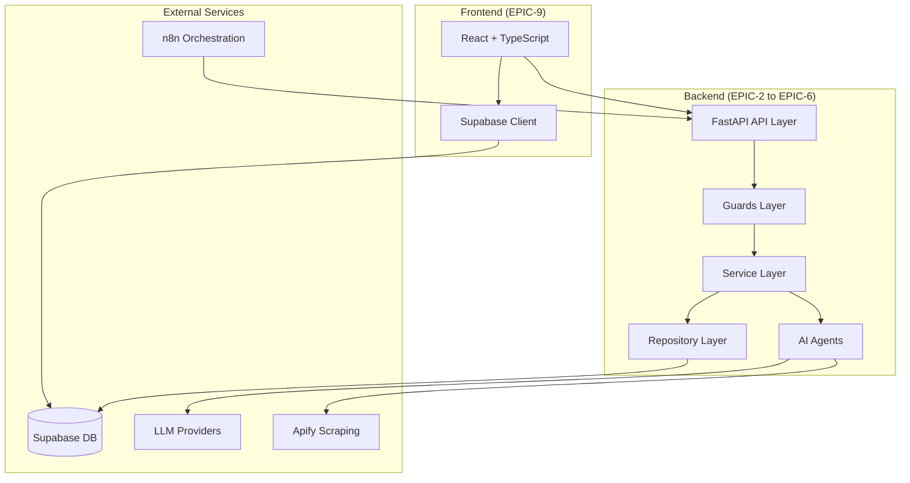
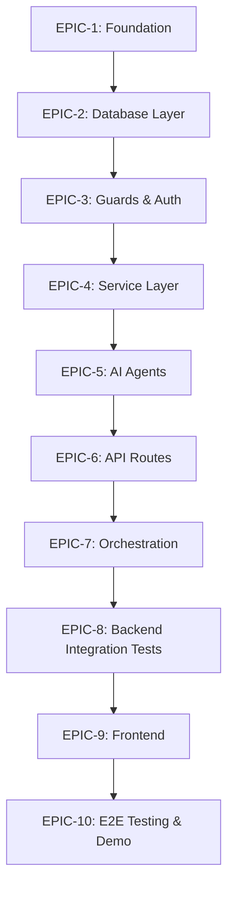
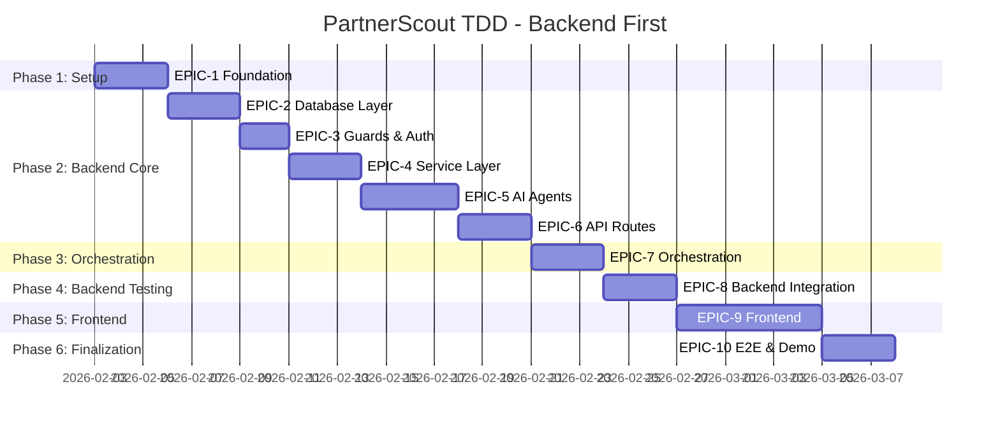

# PartnerScout AI - TDD Implementation Master Plan

## Document Index

| Document | EPIC | Description | Est. Duration |
|----------|------|-------------|---------------|
| [01-EPIC-FOUNDATION.md](./01-EPIC-FOUNDATION.md) | EPIC-1 | Project setup, database schema, config | 2-3 days |
| [02-EPIC-DATABASE.md](./02-EPIC-DATABASE.md) | EPIC-2 | Database clients, models, repositories | 2-3 days |
| [03-EPIC-GUARDS.md](./03-EPIC-GUARDS.md) | EPIC-3 | Authentication, authorization, guards | 1-2 days |
| [04-EPIC-SERVICES.md](./04-EPIC-SERVICES.md) | EPIC-4 | Business logic, LLM, Apify services | 2-3 days |
| [05-EPIC-AGENTS.md](./05-EPIC-AGENTS.md) | EPIC-5 | AI Agents implementation | 3-4 days |
| [06-EPIC-API-ROUTES.md](./06-EPIC-API-ROUTES.md) | EPIC-6 | FastAPI endpoints | 2-3 days |
| [07-EPIC-ORCHESTRATION.md](./07-EPIC-ORCHESTRATION.md) | EPIC-7 | n8n workflow, Python fallback | 2-3 days |
| [08-EPIC-BACKEND-TESTING.md](./08-EPIC-BACKEND-TESTING.md) | EPIC-8 | Integration tests | 2-3 days |
| [09-EPIC-FRONTEND.md](./09-EPIC-FRONTEND.md) | EPIC-9 | React + TypeScript frontend | 5-6 days |
| [10-EPIC-E2E-DEMO.md](./10-EPIC-E2E-DEMO.md) | EPIC-10 | E2E testing & demo prep | 2-3 days |

**Total Estimated Duration: 24-33 days**

---

## Execution Order: Backend First, Frontend Last

This plan prioritizes building a complete, tested backend before frontend development. This ensures:

- Stable API contracts before UI development
- All endpoints tested and documented
- Real API responses for frontend development
- Reduced integration issues

---

## Architecture Overview



---

## EPIC Dependency Flow



---

## Implementation Timeline



---

## Project Structure

```
partner-scout/
├── backend/
│   ├── app/
│   │   ├── __init__.py
│   │   ├── main.py                    # FastAPI app entry point
│   │   ├── core/
│   │   │   ├── __init__.py
│   │   │   ├── config.py              # Settings (Pydantic BaseSettings)
│   │   │   ├── constants.py           # Enums, status values
│   │   │   ├── exceptions.py          # Custom exceptions
│   │   │   └── settings.py            # YAML config loader
│   │   ├── guards/
│   │   │   ├── __init__.py
│   │   │   ├── auth.py                # AuthGuard, UserGuard
│   │   │   ├── ownership.py           # JobOwnerGuard, ProfileOwnerGuard
│   │   │   ├── rate_limit.py          # RateLimitGuard
│   │   │   ├── service_key.py         # ServiceKeyGuard
│   │   │   └── status.py              # StatusTransitionGuard
│   │   ├── api/
│   │   │   ├── __init__.py
│   │   │   ├── deps.py                # FastAPI dependencies
│   │   │   └── routes/
│   │   │       ├── __init__.py
│   │   │       ├── health.py          # Health check endpoints
│   │   │       ├── jobs.py            # Job CRUD endpoints
│   │   │       ├── status.py          # Status update endpoints
│   │   │       ├── agents.py          # Agent trigger endpoints
│   │   │       └── email.py           # Email generation endpoints
│   │   ├── models/
│   │   │   ├── __init__.py
│   │   │   ├── job.py                 # DiscoveryJob models
│   │   │   ├── profile.py             # Profile, Score, Contact models
│   │   │   ├── brand.py               # BrandDNA models
│   │   │   ├── status.py              # Status update models
│   │   │   └── agent.py               # Agent request/response models
│   │   ├── services/
│   │   │   ├── __init__.py
│   │   │   ├── job_service.py         # Job business logic
│   │   │   ├── scoring_service.py     # Score calculations
│   │   │   ├── llm_service.py         # LLM provider abstraction
│   │   │   ├── apify_service.py       # Apify integration
│   │   │   └── email_service.py       # Email generation
│   │   ├── repositories/
│   │   │   ├── __init__.py
│   │   │   ├── base_repo.py           # Base repository class
│   │   │   ├── job_repo.py            # Job data access
│   │   │   ├── profile_repo.py        # Profile data access
│   │   │   ├── brand_repo.py          # BrandDNA data access
│   │   │   └── score_repo.py          # Score & contact data access
│   │   ├── agents/
│   │   │   ├── __init__.py
│   │   │   ├── base_agent.py          # Abstract base agent
│   │   │   ├── brand_analyzer.py      # Brand Analyzer Agent
│   │   │   ├── discovery_agent.py     # Profile Discovery Agent
│   │   │   ├── scorer_agent.py        # Scorer Agent
│   │   │   ├── email_composer.py      # Email Composer Agent
│   │   │   └── prompts/
│   │   │       ├── brand_analyzer.yaml
│   │   │       ├── scorer.yaml
│   │   │       └── email_composer.yaml
│   │   └── db/
│   │       ├── __init__.py
│   │       └── supabase.py            # Supabase client
│   ├── config/
│   │   ├── agents.yaml                # Agent-specific settings
│   │   ├── scoring.yaml               # Scoring weights
│   │   └── limits.yaml                # Rate limits, timeouts
│   ├── tests/
│   │   ├── __init__.py
│   │   ├── conftest.py                # Shared fixtures
│   │   ├── fixtures/                  # Test data layer (input/output)
│   │   │   ├── __init__.py
│   │   │   ├── discovery_jobs.py      # Job fixtures
│   │   │   ├── profiles.py            # Profile fixtures
│   │   │   └── agents/                # Agent test data
│   │   │       ├── __init__.py
│   │   │       ├── brand_analyzer.py
│   │   │       └── scorer.py
│   │   ├── unit/
│   │   │   ├── __init__.py
│   │   │   ├── test_config.py
│   │   │   ├── test_models.py
│   │   │   ├── test_repositories.py
│   │   │   ├── test_services.py
│   │   │   ├── test_guards.py
│   │   │   └── test_agents.py
│   │   ├── integration/
│   │   │   ├── __init__.py
│   │   │   ├── test_db.py
│   │   │   ├── test_api.py
│   │   │   └── test_workflows.py
│   │   └── e2e/
│   │       ├── __init__.py
│   │       └── test_full_flow.py
│   ├── scripts/
│   │   ├── validate_setup.sh
│   │   ├── validate_database.py
│   │   └── run_demo.py
│   ├── supabase/
│   │   └── migrations/
│   │       ├── 001_initial_schema.sql
│   │       ├── 002_indexes.sql
│   │       ├── 003_rls_policies.sql
│   │       ├── 004_realtime.sql
│   │       ├── 005_triggers.sql
│   │       └── seed.sql
│   ├── requirements.txt
│   ├── requirements-dev.txt
│   ├── pytest.ini
│   ├── .env.example
│   └── README.md
├── frontend/                          # Created in EPIC-9
│   ├── src/
│   │   ├── components/
│   │   ├── pages/
│   │   ├── hooks/
│   │   ├── services/
│   │   ├── types/
│   │   └── utils/
│   ├── package.json
│   └── ...
├── n8n/
│   ├── README.md
│   └── workflows/
│       └── discovery_workflow.json
└── docs/
    └── implementation/
        ├── 00-MASTER-PLAN.md
        ├── 01-EPIC-FOUNDATION.md
        └── ...
```

---

## Environment Variables Reference

### Backend (`backend/.env`)

```bash
# =============================================================================
# Environment
# =============================================================================
ENV=development
DEBUG=true

# =============================================================================
# Supabase
# =============================================================================
SUPABASE_URL=https://xxxxx.supabase.co
SUPABASE_KEY=eyJ...                          # anon key
SUPABASE_SERVICE_ROLE_KEY=eyJ...             # service role key
SUPABASE_JWT_SECRET=your-jwt-secret

# =============================================================================
# LLM Providers
# =============================================================================
LLM_PROVIDER=openai                          # openai | gemini | ollama
OPENAI_API_KEY=sk-...
OPENAI_MODEL=gpt-4o
GOOGLE_API_KEY=AIza...
GEMINI_MODEL=gemini-1.5-pro
OLLAMA_BASE_URL=http://localhost:11434
OLLAMA_MODEL=llama3

# =============================================================================
# External Services
# =============================================================================
APIFY_API_KEY=apify_api_...

# =============================================================================
# Orchestration
# =============================================================================
N8N_SERVICE_KEY=your-secret-service-key-123
N8N_WEBHOOK_URL=http://localhost:5678/webhook/start-discovery
```

### Frontend (`frontend/.env`) - Created in EPIC-9

```bash
VITE_SUPABASE_URL=https://xxxxx.supabase.co
VITE_SUPABASE_ANON_KEY=eyJ...
VITE_API_URL=http://localhost:8000
```

---

## TDD Methodology

### Red-Green-Refactor Cycle

For each task in this plan:

1. **RED**: Write a failing test first
2. **GREEN**: Write minimum code to pass the test
3. **REFACTOR**: Clean up code while keeping tests green

### Test Organization

```
tests/
├── unit/           # Fast, isolated tests (mocked dependencies)
├── integration/    # Tests with real database (test environment)
└── e2e/            # Full system tests
```

### Test Naming Convention

```python
def test_<method_name>_<scenario>_<expected_result>():
    """<What the test verifies>."""
    pass

# Examples:
def test_create_job_with_valid_data_returns_job_id():
def test_create_job_with_missing_profiles_raises_validation_error():
def test_update_status_with_invalid_transition_raises_error():
```

### Test Data Layer Pattern

Tests follow a **layered format** where input data and expected outputs are stored in dedicated fixture files. This enables multiple agents to modify test data independently without changing test logic.

**Fixture Directory Structure:**

```
tests/
├── fixtures/
│   ├── __init__.py
│   ├── discovery_jobs.py      # Job input/output fixtures
│   ├── profiles.py            # Profile fixtures
│   ├── brand_dna.py           # Brand DNA fixtures
│   └── agents/
│       ├── __init__.py
│       ├── brand_analyzer.py  # Brand analyzer test data
│       ├── discovery.py       # Discovery agent test data
│       └── scorer.py          # Scorer agent test data
├── unit/
├── integration/
└── e2e/
```

**Fixture File Format:**

Each fixture file contains both input and expected output as Python dicts:

```python
# tests/fixtures/discovery_jobs.py

# === INPUT DATA ===
VALID_JOB_INPUT = {
    "user_id": "user-123",
    "status": "pending",
    "reference_profiles": '["brand1", "brand2"]',
    "settings": '{"limit": 50}'
}

INVALID_JOB_INPUT = {
    "user_id": "",  # Missing required field
}

# === EXPECTED OUTPUT ===
VALID_JOB_OUTPUT = {
    "user_id": "user-123",
    "status": "pending"
}

# === MOCK RESPONSES (for external services) ===
MOCK_LLM_RESPONSE = {
    "hashtags": ["fashion", "style"],
    "keywords": ["trendy", "modern"]
}
```

**Test References Fixtures:**

```python
from tests.fixtures.discovery_jobs import (
    VALID_JOB_INPUT,
    VALID_JOB_OUTPUT,
    INVALID_JOB_INPUT
)

def test_create_job_with_valid_data(self, db_client):
    job = repo.create(VALID_JOB_INPUT)
    assert job.user_id == VALID_JOB_OUTPUT["user_id"]

def test_create_job_with_invalid_data_raises_error(self, db_client):
    with pytest.raises(ValidationError):
        repo.create(INVALID_JOB_INPUT)
```

> **Benefits:**
> - Input/output changes don't require modifying test logic
> - Multiple agents can update fixture files independently
> - Easy to add new test cases by extending fixtures
> - Clear separation of concerns

---

### PRD-Aligned Mock Data Strategy

All implementation EPICs include **mock data that maps directly to PRD specifications**. This ensures:

1. **Correctness Validation** - Tests verify implementation matches PRD requirements
2. **Demo Readiness** - Mock data provides realistic demo scenarios
3. **Fake Detection Testing** - Mock profiles include both genuine and fake indicators (PRD 5.3.1)
4. **User Isolation Testing** - Multiple mock users test data isolation (PRD Section 6)

#### Mock Data Directory Structure

```
backend/tests/fixtures/mock_data/
├── __init__.py          # Loader utilities
├── users.json           # PRD 10.2: User data
├── discovery_jobs.json  # PRD 10.3: All job statuses (pending→completed→failed)
├── brand_dna.json       # PRD 10.4: Brand DNA with embeddings
├── profiles.json        # PRD 10.5: Genuine + fake profiles
├── scores.json          # PRD 10.6: 6-dimension scores
└── contacts.json        # PRD 10.7: Contact extraction
```

#### PRD Coverage in Mock Data

| PRD Section | Coverage | Mock Data Location |
|-------------|----------|-------------------|
| 5.1 Brand Analyzer | ✅ | `brand_dna.json` |
| 5.2 Discovery Agent | ✅ | `profiles.json` |
| 5.3 Scorer Agent | ✅ | `scores.json` (6 dimensions) |
| 5.3.1 Fake Detection | ✅ | `profiles.json` (fake indicators) |
| 5.4 Session Management | ✅ | `discovery_jobs.json` (all statuses) |
| 6 Multi-User | ✅ | Multiple users with isolated data |
| 8 API Contracts | ✅ | Request/response test fixtures |
| 10 Database Schema | ✅ | All tables with relationships |

#### Mock Data Validation Rules

Each validation script (`validate_epicX.py`) includes PRD compliance checks:

```python
def validate_prd_compliance():
    """Validate implementation matches PRD."""
    from tests.fixtures.mock_data import (
        PRD_JOB_STATUSES,
        PRD_SCORING_WEIGHTS,
        get_fake_profiles,
        get_genuine_profiles,
    )
    
    # 1. All job statuses exist
    # 2. All 6 scoring dimensions present
    # 3. Scoring weights sum to 1.0
    # 4. Fake profiles score < 50
    # 5. Genuine profiles score >= 50
    # 6. User isolation enforced
```

#### Using Mock Data in Tests

```python
# In any test file
from tests.fixtures.mock_data import (
    load_mock_data,
    get_user,
    get_job,
    get_profiles_for_job,
    get_genuine_profiles,
    get_fake_profiles,
    PRD_JOB_STATUSES,
    PRD_SCORING_WEIGHTS,
)

def test_scorer_with_fake_detection():
    """Test scorer penalizes fake profiles per PRD 5.3.1."""
    fake_profiles = get_fake_profiles()
    
    for profile in fake_profiles:
        score = scorer.score(profile)
        assert score < 50, f"Fake profile should score below 50"
```

#### Database Seeding

Mock data can be seeded for development and demos:

```bash
# Seed all mock data
python scripts/seed_database.py

# Seed specific demo scenario
python scripts/seed_demo_data.py --scenario sustainable_fashion

# Verify seeded data matches PRD
python scripts/seed_database.py --verify
```

---

## Validation Approach

Each EPIC includes:

1. **Unit Test Coverage** - All functions tested in isolation
2. **Integration Test Coverage** - Database and API integration tests
3. **Validation Scripts** - Runnable scripts to verify EPIC completion
4. **Acceptance Criteria Checklist** - Manual verification steps

### Validation Script Template

```bash
#!/bin/bash
echo "=== EPIC-X Validation ==="

# 1. Check file structure
echo "1. Checking file structure..."

# 2. Run unit tests
echo "2. Running unit tests..."
pytest tests/unit/test_xxx.py -v

# 3. Run integration tests
echo "3. Running integration tests..."
pytest tests/integration/test_xxx.py -v

# 4. Check test coverage
echo "4. Checking coverage..."
pytest --cov=app.xxx --cov-report=term-missing

echo "=== EPIC-X Complete ==="
```

---

## Quick Reference: Key Files by EPIC

| EPIC | Key Implementation Files | Key Test Files |
|------|-------------------------|----------------|
| 1 | `config.py`, `constants.py`, `exceptions.py` | `test_config.py`, `test_exceptions.py` |
| 2 | `supabase/migrations/*.sql`, `db/*.py`, `models/*.py`, `repositories/*.py` | `test_models*.py`, `test_*_client.py` |
| 3 | `guards/*.py` | `test_guards.py` |
| 4 | `services/*.py` | `test_services.py` |
| 5 | `agents/*.py`, `prompts/*.yaml` | `test_agents.py` |
| 6 | `api/routes/*.py` | `test_api.py` |
| 7 | `n8n/workflows/*.json`, `orchestrator.py` | `test_workflows.py` |
| 8 | N/A (tests only) | `tests/integration/*.py` |
| 9 | `frontend/src/**/*` | `frontend/src/**/*.test.tsx` |
| 10 | `tests/e2e/*.py` | N/A |

---

## Next Steps

1. Start with [01-EPIC-FOUNDATION.md](./01-EPIC-FOUNDATION.md)
2. Complete each EPIC in order (dependencies shown in flowchart)
3. Run validation scripts after each EPIC
4. Do not proceed to next EPIC until current one passes all validations


