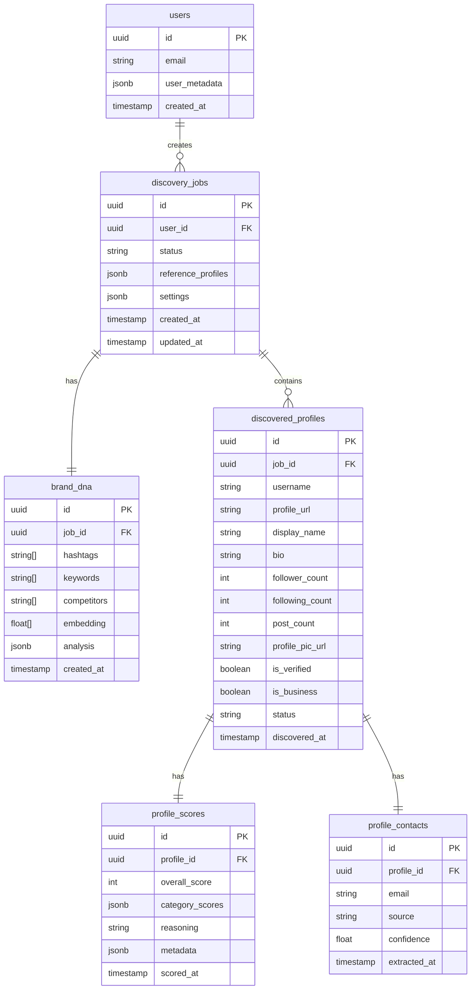

# EPIC-2: Database Layer

## Overview

**Goal:** Implement the complete database layer with Supabase integration, SQLite fallback, repository pattern, and Pydantic models for all entities.

**Duration:** 2-3 days  
**Dependencies:** EPIC-1 (Project Foundation)  
**Deliverables:** Working database layer with full test coverage

---

> [!NOTE]
> **Test Data Layer Pattern**: All tests in this EPIC follow the layered format (`input → test → output`) with fixtures stored in `tests/fixtures/`. See [00-MASTER-PLAN.md](./00-MASTER-PLAN.md#test-data-layer-pattern) for details.

## Environment Variables Required

```bash
# Supabase Configuration (Primary Database)
SUPABASE_URL=https://xxxxx.supabase.co
SUPABASE_KEY=eyJhbGciOiJIUzI1NiIsInR5cCI6IkpXVCJ9...
SUPABASE_SERVICE_ROLE_KEY=eyJhbGciOiJIUzI1NiIsInR5cCI6IkpXVCJ9...

# SQLite Fallback (for offline development)
USE_SQLITE_FALLBACK=false
SQLITE_DATABASE_PATH=./data/partner_scout.db
```

---

## Database Schema Reference



---

## FEATURE-2.0: Supabase Database Migrations

### Overview

Create all PostgreSQL tables, indexes, RLS policies, triggers, views, and seed data for Supabase.

**Location:** `backend/supabase/migrations/`

---

### STORY-2.0.1: Create Supabase Migration Files

**As a** developer  
**I want** SQL migration files for Supabase  
**So that** I can set up the production database with proper schema

---

#### TASK-2.0.1.1: Initial Schema Migration

**File:** `backend/supabase/migrations/001_initial_schema.sql`

**Creates:**
- Extensions: `vector` (pgvector), `uuid-ossp`
- Enum types: `discovery_job_status`, `profile_status`
- Tables: `discovery_jobs`, `brand_dna`, `discovered_profiles`, `profile_scores`, `profile_contacts`
- Constraints: foreign keys, unique constraints, check constraints

**PRD References:**
- PRD 10.3: discovery_jobs
- PRD 10.4: brand_dna
- PRD 10.5: discovered_profiles
- PRD 10.6: profile_scores (6 dimensions)
- PRD 10.7: profile_contacts

---

#### TASK-2.0.1.2: Indexes Migration

**File:** `backend/supabase/migrations/002_indexes.sql`

**Creates indexes for:**
- Foreign key columns (all tables)
- `discovery_jobs.user_id`, `status`, `created_at`
- `discovered_profiles.job_id`, `status`, `followers`
- `profile_scores.score`, `follower_quality`
- `profile_contacts.email` (partial index)

---

#### TASK-2.0.1.3: Row Level Security Migration

**File:** `backend/supabase/migrations/003_rls_policies.sql`

**Implements PRD Section 6 & 10.1.2:**
- Enable RLS on all tables
- User isolation policies on `discovery_jobs`
- Cascading access via job ownership chain
- Service role bypass for backend operations

---

#### TASK-2.0.1.4: Triggers Migration

**File:** `backend/supabase/migrations/004_triggers.sql`

**Creates:**
- `update_updated_at_column()` - auto-update timestamps
- `update_profiles_discovered()` - auto-increment counter on INSERT
- `update_profiles_scored()` - auto-increment counter when status='done'
- `auto_complete_job()` - set status='completed' when all scored

---

#### TASK-2.0.1.5: Realtime Migration

**File:** `backend/supabase/migrations/005_realtime.sql`

**Enables realtime subscriptions for:**
- `discovery_jobs` - status updates
- `discovered_profiles` - new profiles appearing
- `profile_scores` - score updates
- `profile_contacts` - email extraction

---

#### TASK-2.0.1.6: Views Migration

**File:** `backend/supabase/migrations/006_views.sql`

**Creates convenience views:**
- `v_complete_profiles` - profile with score and contact joined
- `v_job_summary` - job with aggregated statistics
- `v_high_score_profiles` - profiles scoring >= 70
- `v_suspicious_profiles` - profiles with low follower_quality (PRD 5.3.1)

---

#### TASK-2.0.1.7: Seed Data Migration

**File:** `backend/supabase/migrations/007_seed.sql`

**PRD-aligned demo data:**
- 1 completed job with 5 profiles (mix of genuine and fake)
- 3 additional jobs (pending, scoring, failed)
- All 6 scoring dimensions populated
- Contact emails for genuine profiles
- Fake detection test cases per PRD 5.3.1

---

### STORY-2.0.2: Validate Supabase Migrations

**As a** developer  
**I want** to validate migrations before running in production  
**So that** I avoid schema errors

---

#### TASK-2.0.2.1: Add Migration Validation to validate_epic2.py

```python
def validate_supabase_migrations():
    """Validate Supabase migration files exist and are valid."""
    print("Validating Supabase migrations...")
    
    migration_dir = Path(__file__).parent.parent / "supabase" / "migrations"
    
    required_files = [
        "001_initial_schema.sql",
        "002_indexes.sql",
        "003_rls_policies.sql",
        "004_triggers.sql",
        "005_realtime.sql",
        "006_views.sql",
        "007_seed.sql",
        "README.md",
    ]
    
    all_exist = True
    for filename in required_files:
        filepath = migration_dir / filename
        exists = filepath.exists()
        status = "✓" if exists else "✗"
        print(f"  {status} {filename}")
        if not exists:
            all_exist = False
    
    # Validate SQL syntax (basic check)
    for filename in required_files:
        if filename.endswith(".sql"):
            filepath = migration_dir / filename
            if filepath.exists():
                content = filepath.read_text()
                # Check for common SQL keywords
                if "CREATE" not in content and "ALTER" not in content and "INSERT" not in content:
                    print(f"  ⚠ {filename} may be empty or invalid")
    
    print(f"\nResult: {'PASS' if all_exist else 'FAIL'}")
    return all_exist
```

---

### Definition of Done for FEATURE-2.0

- [ ] `001_initial_schema.sql` creates all tables with correct schema
- [ ] `002_indexes.sql` creates performance indexes
- [ ] `003_rls_policies.sql` implements user isolation (PRD 6)
- [ ] `004_triggers.sql` auto-updates timestamps and counters
- [ ] `005_realtime.sql` enables live updates
- [ ] `006_views.sql` creates convenience views
- [ ] `007_seed.sql` contains PRD-aligned demo data
- [ ] `README.md` documents migration process
- [ ] All migrations can be run in Supabase SQL Editor without errors

---

## FEATURE-2.1: Database Clients

### STORY-2.1.1: Implement Supabase Client

**As a** developer  
**I want** a typed Supabase client wrapper  
**So that** I can interact with the database safely

#### TASK-2.1.1.1: Write Supabase Client Tests (TDD)

**Priority:** P0 (Critical)  
**Estimated Time:** 2 hours

**ENV VARIABLES NEEDED:**
```
SUPABASE_URL=https://xxxxx.supabase.co
SUPABASE_KEY=your-anon-key
SUPABASE_SERVICE_ROLE_KEY=your-service-role-key
```

##### SUB-TASK-2.1.1.1.1: Write Supabase Client Unit Tests

**File:** `backend/tests/unit/test_supabase_client.py`

```python
"""
Unit tests for Supabase client wrapper.
TDD: Write these tests FIRST, then implement supabase_client.py
"""
import pytest
from unittest.mock import AsyncMock, MagicMock, patch


class TestSupabaseClient:
    """Test suite for SupabaseClient wrapper."""

    @pytest.fixture
    def mock_settings(self):
        """Create mock settings for testing."""
        settings = MagicMock()
        settings.supabase_url = "https://test.supabase.co"
        settings.supabase_key = "test-anon-key"
        settings.supabase_service_role_key = "test-service-key"
        settings.use_sqlite_fallback = False
        return settings

    def test_client_initializes_with_settings(self, mock_settings):
        """Client should initialize with provided settings."""
        with patch("app.db.supabase_client.create_client") as mock_create:
            mock_create.return_value = MagicMock()
            
            from app.db.supabase_client import SupabaseClient
            client = SupabaseClient(mock_settings)
            
            mock_create.assert_called_once_with(
                mock_settings.supabase_url,
                mock_settings.supabase_key
            )

    def test_client_provides_table_access(self, mock_settings):
        """Client should provide access to database tables."""
        with patch("app.db.supabase_client.create_client") as mock_create:
            mock_supabase = MagicMock()
            mock_create.return_value = mock_supabase
            
            from app.db.supabase_client import SupabaseClient
            client = SupabaseClient(mock_settings)
            
            # Access table
            table = client.table("discovery_jobs")
            mock_supabase.table.assert_called_with("discovery_jobs")

    def test_client_uses_service_role_for_admin(self, mock_settings):
        """Client should use service role key for admin operations."""
        with patch("app.db.supabase_client.create_client") as mock_create:
            mock_create.return_value = MagicMock()
            
            from app.db.supabase_client import SupabaseClient
            client = SupabaseClient(mock_settings, use_service_role=True)
            
            mock_create.assert_called_with(
                mock_settings.supabase_url,
                mock_settings.supabase_service_role_key
            )


class TestSupabaseClientOperations:
    """Test CRUD operations on Supabase client."""

    @pytest.fixture
    def client(self):
        """Create a mocked client for testing."""
        with patch("app.db.supabase_client.create_client") as mock_create:
            mock_supabase = MagicMock()
            mock_create.return_value = mock_supabase
            
            settings = MagicMock()
            settings.supabase_url = "https://test.supabase.co"
            settings.supabase_key = "test-key"
            settings.use_sqlite_fallback = False
            
            from app.db.supabase_client import SupabaseClient
            return SupabaseClient(settings)

    def test_insert_returns_created_record(self, client):
        """Insert should return the created record."""
        mock_response = MagicMock()
        mock_response.data = [{"id": "123", "name": "test"}]
        client._client.table().insert().execute.return_value = mock_response
        
        result = client.insert("test_table", {"name": "test"})
        assert result["id"] == "123"

    def test_select_returns_records(self, client):
        """Select should return matching records."""
        mock_response = MagicMock()
        mock_response.data = [{"id": "1"}, {"id": "2"}]
        client._client.table().select().execute.return_value = mock_response
        
        result = client.select("test_table")
        assert len(result) == 2

    def test_select_with_filters(self, client):
        """Select should apply filters correctly."""
        mock_table = client._client.table()
        mock_response = MagicMock()
        mock_response.data = [{"id": "1"}]
        mock_table.select().eq().execute.return_value = mock_response
        
        result = client.select("test_table", filters={"status": "active"})
        mock_table.select().eq.assert_called()

    def test_update_modifies_record(self, client):
        """Update should modify existing record."""
        mock_response = MagicMock()
        mock_response.data = [{"id": "123", "name": "updated"}]
        client._client.table().update().eq().execute.return_value = mock_response
        
        result = client.update("test_table", "123", {"name": "updated"})
        assert result["name"] == "updated"

    def test_delete_removes_record(self, client):
        """Delete should remove record from table."""
        mock_response = MagicMock()
        mock_response.data = [{"id": "123"}]
        client._client.table().delete().eq().execute.return_value = mock_response
        
        result = client.delete("test_table", "123")
        assert result is True

    def test_handles_supabase_errors(self, client):
        """Client should handle Supabase errors gracefully."""
        from postgrest.exceptions import APIError
        client._client.table().select().execute.side_effect = APIError({
            "message": "Table not found",
            "code": "42P01"
        })
        
        from app.core.exceptions import DatabaseError
        with pytest.raises(DatabaseError):
            client.select("nonexistent_table")


class TestGetSupabaseClient:
    """Test get_supabase_client factory function."""

    def test_get_client_returns_singleton(self):
        """get_supabase_client should return cached instance."""
        with patch("app.db.supabase_client.create_client"):
            from app.db.supabase_client import get_supabase_client
            
            client1 = get_supabase_client()
            client2 = get_supabase_client()
            
            assert client1 is client2

    def test_get_client_respects_sqlite_fallback(self):
        """Should return None when SQLite fallback is enabled."""
        with patch("app.db.supabase_client.get_settings") as mock_settings:
            mock_settings.return_value.use_sqlite_fallback = True
            
            from app.db.supabase_client import get_supabase_client
            # Clear cache first
            get_supabase_client.cache_clear()
            
            result = get_supabase_client()
            assert result is None
```

##### SUB-TASK-2.1.1.1.2: Implement Supabase Client

**File:** `backend/app/db/supabase_client.py`

```python
"""
Supabase client wrapper with typed operations and error handling.
"""
from functools import lru_cache
from typing import Any, Dict, List, Optional, TypeVar

from supabase import create_client, Client

from app.core.config import Settings, get_settings
from app.core.exceptions import DatabaseError
from app.core.logging import get_logger

logger = get_logger(__name__)

T = TypeVar("T", bound=Dict[str, Any])


class SupabaseClient:
    """
    Wrapper around Supabase client with typed operations.
    
    Provides a simplified interface for common database operations
    with proper error handling and logging.
    """
    
    def __init__(
        self,
        settings: Optional[Settings] = None,
        use_service_role: bool = False
    ):
        """
        Initialize Supabase client.
        
        Args:
            settings: Application settings (uses get_settings() if not provided)
            use_service_role: Use service role key for admin operations
        """
        self._settings = settings or get_settings()
        
        key = (
            self._settings.supabase_service_role_key
            if use_service_role
            else self._settings.supabase_key
        )
        
        self._client: Client = create_client(
            self._settings.supabase_url,
            key
        )
        
        logger.debug(
            "Supabase client initialized",
            url=self._settings.supabase_url,
            service_role=use_service_role
        )
    
    def table(self, name: str):
        """
        Get a table reference for chained operations.
        
        Args:
            name: Table name
            
        Returns:
            Supabase table reference
        """
        return self._client.table(name)
    
    def insert(
        self,
        table: str,
        data: Dict[str, Any],
        returning: str = "*"
    ) -> Dict[str, Any]:
        """
        Insert a record into a table.
        
        Args:
            table: Table name
            data: Record data to insert
            returning: Columns to return (default: all)
            
        Returns:
            Created record
            
        Raises:
            DatabaseError: If insert fails
        """
        try:
            response = (
                self._client
                .table(table)
                .insert(data)
                .execute()
            )
            
            if response.data:
                logger.debug(f"Inserted record into {table}", id=response.data[0].get("id"))
                return response.data[0]
            
            raise DatabaseError(f"Insert into {table} returned no data", operation="insert")
            
        except Exception as e:
            logger.error(f"Insert failed", table=table, error=str(e))
            raise DatabaseError(f"Failed to insert into {table}: {str(e)}", operation="insert")
    
    def select(
        self,
        table: str,
        columns: str = "*",
        filters: Optional[Dict[str, Any]] = None,
        order_by: Optional[str] = None,
        limit: Optional[int] = None,
        offset: Optional[int] = None
    ) -> List[Dict[str, Any]]:
        """
        Select records from a table.
        
        Args:
            table: Table name
            columns: Columns to select (default: all)
            filters: Key-value filters to apply
            order_by: Column to order by (prefix with - for desc)
            limit: Maximum records to return
            offset: Records to skip
            
        Returns:
            List of matching records
            
        Raises:
            DatabaseError: If select fails
        """
        try:
            query = self._client.table(table).select(columns)
            
            if filters:
                for key, value in filters.items():
                    query = query.eq(key, value)
            
            if order_by:
                if order_by.startswith("-"):
                    query = query.order(order_by[1:], desc=True)
                else:
                    query = query.order(order_by)
            
            if limit:
                query = query.limit(limit)
            
            if offset:
                query = query.offset(offset)
            
            response = query.execute()
            return response.data or []
            
        except Exception as e:
            logger.error(f"Select failed", table=table, error=str(e))
            raise DatabaseError(f"Failed to select from {table}: {str(e)}", operation="select")
    
    def select_one(
        self,
        table: str,
        record_id: str,
        columns: str = "*"
    ) -> Optional[Dict[str, Any]]:
        """
        Select a single record by ID.
        
        Args:
            table: Table name
            record_id: Record UUID
            columns: Columns to select
            
        Returns:
            Record if found, None otherwise
        """
        try:
            response = (
                self._client
                .table(table)
                .select(columns)
                .eq("id", record_id)
                .maybe_single()
                .execute()
            )
            return response.data
            
        except Exception as e:
            logger.error(f"Select one failed", table=table, id=record_id, error=str(e))
            raise DatabaseError(f"Failed to select from {table}: {str(e)}", operation="select_one")
    
    def update(
        self,
        table: str,
        record_id: str,
        data: Dict[str, Any]
    ) -> Dict[str, Any]:
        """
        Update a record by ID.
        
        Args:
            table: Table name
            record_id: Record UUID
            data: Fields to update
            
        Returns:
            Updated record
            
        Raises:
            DatabaseError: If update fails
        """
        try:
            response = (
                self._client
                .table(table)
                .update(data)
                .eq("id", record_id)
                .execute()
            )
            
            if response.data:
                logger.debug(f"Updated record in {table}", id=record_id)
                return response.data[0]
            
            raise DatabaseError(f"Update in {table} returned no data", operation="update")
            
        except Exception as e:
            logger.error(f"Update failed", table=table, id=record_id, error=str(e))
            raise DatabaseError(f"Failed to update {table}: {str(e)}", operation="update")
    
    def delete(
        self,
        table: str,
        record_id: str
    ) -> bool:
        """
        Delete a record by ID.
        
        Args:
            table: Table name
            record_id: Record UUID
            
        Returns:
            True if deleted successfully
            
        Raises:
            DatabaseError: If delete fails
        """
        try:
            response = (
                self._client
                .table(table)
                .delete()
                .eq("id", record_id)
                .execute()
            )
            
            logger.debug(f"Deleted record from {table}", id=record_id)
            return True
            
        except Exception as e:
            logger.error(f"Delete failed", table=table, id=record_id, error=str(e))
            raise DatabaseError(f"Failed to delete from {table}: {str(e)}", operation="delete")
    
    def upsert(
        self,
        table: str,
        data: Dict[str, Any],
        on_conflict: str = "id"
    ) -> Dict[str, Any]:
        """
        Insert or update a record.
        
        Args:
            table: Table name
            data: Record data
            on_conflict: Column to check for conflicts
            
        Returns:
            Upserted record
        """
        try:
            response = (
                self._client
                .table(table)
                .upsert(data, on_conflict=on_conflict)
                .execute()
            )
            
            if response.data:
                return response.data[0]
            
            raise DatabaseError(f"Upsert into {table} returned no data", operation="upsert")
            
        except Exception as e:
            logger.error(f"Upsert failed", table=table, error=str(e))
            raise DatabaseError(f"Failed to upsert into {table}: {str(e)}", operation="upsert")
    
    def count(
        self,
        table: str,
        filters: Optional[Dict[str, Any]] = None
    ) -> int:
        """
        Count records in a table.
        
        Args:
            table: Table name
            filters: Optional filters to apply
            
        Returns:
            Count of matching records
        """
        try:
            query = self._client.table(table).select("*", count="exact")
            
            if filters:
                for key, value in filters.items():
                    query = query.eq(key, value)
            
            response = query.execute()
            return response.count or 0
            
        except Exception as e:
            logger.error(f"Count failed", table=table, error=str(e))
            raise DatabaseError(f"Failed to count {table}: {str(e)}", operation="count")
    
    @property
    def auth(self):
        """Access Supabase auth client."""
        return self._client.auth


@lru_cache()
def get_supabase_client() -> Optional[SupabaseClient]:
    """
    Get cached Supabase client instance.
    
    Returns:
        SupabaseClient instance, or None if using SQLite fallback
    """
    settings = get_settings()
    
    if settings.use_sqlite_fallback:
        logger.info("SQLite fallback enabled, Supabase client not created")
        return None
    
    return SupabaseClient(settings)


def get_admin_client() -> SupabaseClient:
    """
    Get Supabase client with service role (admin) privileges.
    
    Use for operations that bypass RLS policies.
    
    Returns:
        SupabaseClient with service role key
    """
    return SupabaseClient(use_service_role=True)
```

---

### STORY-2.1.2: Implement SQLite Fallback Client

**As a** developer  
**I want** a SQLite fallback for offline development  
**So that** I can work without Supabase connection

#### TASK-2.1.2.1: Write SQLite Client Tests (TDD)

**Priority:** P1 (High)  
**Estimated Time:** 2 hours

**ENV VARIABLES NEEDED:**
```
USE_SQLITE_FALLBACK=true
SQLITE_DATABASE_PATH=./data/test.db
```

##### SUB-TASK-2.1.2.1.1: Write SQLite Client Unit Tests

**File:** `backend/tests/unit/test_sqlite_client.py`

```python
"""
Unit tests for SQLite fallback client.
TDD: Write these tests FIRST, then implement sqlite_client.py
"""
import os
import pytest
import tempfile
from pathlib import Path


class TestSQLiteClient:
    """Test suite for SQLiteClient fallback."""

    @pytest.fixture
    def temp_db(self):
        """Create a temporary database file."""
        fd, path = tempfile.mkstemp(suffix=".db")
        os.close(fd)
        yield path
        if os.path.exists(path):
            os.unlink(path)

    @pytest.fixture
    def client(self, temp_db):
        """Create SQLite client with temp database."""
        from app.db.sqlite_client import SQLiteClient
        return SQLiteClient(temp_db)

    def test_client_creates_database_file(self, temp_db):
        """Client should create database file if not exists."""
        os.unlink(temp_db)  # Remove file
        
        from app.db.sqlite_client import SQLiteClient
        client = SQLiteClient(temp_db)
        
        assert os.path.exists(temp_db)

    def test_client_initializes_schema(self, client):
        """Client should create required tables on init."""
        # Check tables exist
        result = client.execute(
            "SELECT name FROM sqlite_master WHERE type='table'"
        )
        tables = [row["name"] for row in result]
        
        assert "discovery_jobs" in tables
        assert "brand_dna" in tables
        assert "discovered_profiles" in tables
        assert "profile_scores" in tables
        assert "profile_contacts" in tables

    def test_insert_creates_record(self, client):
        """Insert should create and return record with ID."""
        result = client.insert("discovery_jobs", {
            "user_id": "test-user",
            "status": "pending",
            "reference_profiles": "[]",
            "settings": "{}"
        })
        
        assert "id" in result
        assert result["status"] == "pending"

    def test_select_returns_records(self, client):
        """Select should return matching records."""
        # Insert test data
        client.insert("discovery_jobs", {
            "user_id": "user-1",
            "status": "pending",
            "reference_profiles": "[]",
            "settings": "{}"
        })
        client.insert("discovery_jobs", {
            "user_id": "user-1",
            "status": "completed",
            "reference_profiles": "[]",
            "settings": "{}"
        })
        
        result = client.select("discovery_jobs", filters={"user_id": "user-1"})
        assert len(result) == 2

    def test_select_with_limit_and_offset(self, client):
        """Select should respect limit and offset."""
        for i in range(5):
            client.insert("discovery_jobs", {
                "user_id": "user-1",
                "status": "pending",
                "reference_profiles": "[]",
                "settings": "{}"
            })
        
        result = client.select("discovery_jobs", limit=2, offset=2)
        assert len(result) == 2

    def test_update_modifies_record(self, client):
        """Update should modify existing record."""
        created = client.insert("discovery_jobs", {
            "user_id": "user-1",
            "status": "pending",
            "reference_profiles": "[]",
            "settings": "{}"
        })
        
        updated = client.update("discovery_jobs", created["id"], {
            "status": "completed"
        })
        
        assert updated["status"] == "completed"

    def test_delete_removes_record(self, client):
        """Delete should remove record."""
        created = client.insert("discovery_jobs", {
            "user_id": "user-1",
            "status": "pending",
            "reference_profiles": "[]",
            "settings": "{}"
        })
        
        result = client.delete("discovery_jobs", created["id"])
        assert result is True
        
        # Verify deleted
        found = client.select_one("discovery_jobs", created["id"])
        assert found is None

    def test_count_returns_record_count(self, client):
        """Count should return number of matching records."""
        for i in range(3):
            client.insert("discovery_jobs", {
                "user_id": "user-1",
                "status": "pending",
                "reference_profiles": "[]",
                "settings": "{}"
            })
        
        count = client.count("discovery_jobs")
        assert count == 3


class TestSQLiteClientInterface:
    """Test that SQLite client matches Supabase client interface."""

    def test_interface_compatibility(self):
        """SQLite client should have same methods as Supabase client."""
        from app.db.sqlite_client import SQLiteClient
        from app.db.supabase_client import SupabaseClient
        
        sqlite_methods = {m for m in dir(SQLiteClient) if not m.startswith("_")}
        supabase_methods = {m for m in dir(SupabaseClient) if not m.startswith("_")}
        
        # SQLite should implement core methods
        required_methods = {"insert", "select", "select_one", "update", "delete", "count"}
        assert required_methods.issubset(sqlite_methods)
```

##### SUB-TASK-2.1.2.1.2: Implement SQLite Client

**File:** `backend/app/db/sqlite_client.py`

```python
"""
SQLite fallback client for offline development.
Provides same interface as SupabaseClient for seamless switching.
"""
import json
import sqlite3
import uuid
from datetime import datetime
from pathlib import Path
from typing import Any, Dict, List, Optional

from app.core.exceptions import DatabaseError
from app.core.logging import get_logger

logger = get_logger(__name__)

# SQL schema for creating tables
SCHEMA = """
-- Users table (simplified, auth handled separately)
CREATE TABLE IF NOT EXISTS users (
    id TEXT PRIMARY KEY,
    email TEXT UNIQUE NOT NULL,
    user_metadata TEXT DEFAULT '{}',
    created_at TEXT DEFAULT CURRENT_TIMESTAMP
);

-- Discovery jobs
CREATE TABLE IF NOT EXISTS discovery_jobs (
    id TEXT PRIMARY KEY,
    user_id TEXT NOT NULL,
    status TEXT DEFAULT 'pending',
    reference_profiles TEXT DEFAULT '[]',
    settings TEXT DEFAULT '{}',
    created_at TEXT DEFAULT CURRENT_TIMESTAMP,
    updated_at TEXT DEFAULT CURRENT_TIMESTAMP,
    FOREIGN KEY (user_id) REFERENCES users(id)
);

-- Brand DNA extracted from reference profiles
CREATE TABLE IF NOT EXISTS brand_dna (
    id TEXT PRIMARY KEY,
    job_id TEXT UNIQUE NOT NULL,
    hashtags TEXT DEFAULT '[]',
    keywords TEXT DEFAULT '[]',
    competitors TEXT DEFAULT '[]',
    embedding TEXT DEFAULT '[]',
    analysis TEXT DEFAULT '{}',
    created_at TEXT DEFAULT CURRENT_TIMESTAMP,
    FOREIGN KEY (job_id) REFERENCES discovery_jobs(id) ON DELETE CASCADE
);

-- Discovered Instagram profiles
CREATE TABLE IF NOT EXISTS discovered_profiles (
    id TEXT PRIMARY KEY,
    job_id TEXT NOT NULL,
    username TEXT NOT NULL,
    profile_url TEXT,
    display_name TEXT,
    bio TEXT,
    follower_count INTEGER DEFAULT 0,
    following_count INTEGER DEFAULT 0,
    post_count INTEGER DEFAULT 0,
    profile_pic_url TEXT,
    is_verified INTEGER DEFAULT 0,
    is_business INTEGER DEFAULT 0,
    status TEXT DEFAULT 'new',
    discovered_at TEXT DEFAULT CURRENT_TIMESTAMP,
    FOREIGN KEY (job_id) REFERENCES discovery_jobs(id) ON DELETE CASCADE
);

-- Profile scores from AI scoring
CREATE TABLE IF NOT EXISTS profile_scores (
    id TEXT PRIMARY KEY,
    profile_id TEXT UNIQUE NOT NULL,
    overall_score INTEGER DEFAULT 0,
    category_scores TEXT DEFAULT '{}',
    reasoning TEXT,
    metadata TEXT DEFAULT '{}',
    scored_at TEXT DEFAULT CURRENT_TIMESTAMP,
    FOREIGN KEY (profile_id) REFERENCES discovered_profiles(id) ON DELETE CASCADE
);

-- Extracted contact information
CREATE TABLE IF NOT EXISTS profile_contacts (
    id TEXT PRIMARY KEY,
    profile_id TEXT UNIQUE NOT NULL,
    email TEXT,
    source TEXT,
    confidence REAL DEFAULT 0.0,
    extracted_at TEXT DEFAULT CURRENT_TIMESTAMP,
    FOREIGN KEY (profile_id) REFERENCES discovered_profiles(id) ON DELETE CASCADE
);

-- Indexes for common queries
CREATE INDEX IF NOT EXISTS idx_discovery_jobs_user_id ON discovery_jobs(user_id);
CREATE INDEX IF NOT EXISTS idx_discovery_jobs_status ON discovery_jobs(status);
CREATE INDEX IF NOT EXISTS idx_discovered_profiles_job_id ON discovered_profiles(job_id);
CREATE INDEX IF NOT EXISTS idx_discovered_profiles_status ON discovered_profiles(status);
CREATE INDEX IF NOT EXISTS idx_profile_scores_overall ON profile_scores(overall_score);
"""


def dict_factory(cursor: sqlite3.Cursor, row: tuple) -> Dict[str, Any]:
    """Convert sqlite3 row to dictionary."""
    return {col[0]: row[idx] for idx, col in enumerate(cursor.description)}


class SQLiteClient:
    """
    SQLite client with Supabase-compatible interface.
    
    Provides fallback database functionality for offline development.
    """
    
    def __init__(self, database_path: str):
        """
        Initialize SQLite client.
        
        Args:
            database_path: Path to SQLite database file
        """
        self.database_path = Path(database_path)
        
        # Ensure directory exists
        self.database_path.parent.mkdir(parents=True, exist_ok=True)
        
        # Initialize database
        self._init_schema()
        
        logger.info("SQLite client initialized", path=str(self.database_path))
    
    def _get_connection(self) -> sqlite3.Connection:
        """Get database connection with row factory."""
        conn = sqlite3.connect(str(self.database_path))
        conn.row_factory = dict_factory
        conn.execute("PRAGMA foreign_keys = ON")
        return conn
    
    def _init_schema(self) -> None:
        """Initialize database schema."""
        conn = self._get_connection()
        try:
            conn.executescript(SCHEMA)
            conn.commit()
        finally:
            conn.close()
    
    def execute(
        self,
        query: str,
        params: Optional[tuple] = None
    ) -> List[Dict[str, Any]]:
        """
        Execute raw SQL query.
        
        Args:
            query: SQL query string
            params: Query parameters
            
        Returns:
            List of result rows
        """
        conn = self._get_connection()
        try:
            cursor = conn.execute(query, params or ())
            results = cursor.fetchall()
            conn.commit()
            return results
        except sqlite3.Error as e:
            logger.error("SQL execution failed", query=query, error=str(e))
            raise DatabaseError(f"SQL error: {str(e)}", operation="execute")
        finally:
            conn.close()
    
    def insert(
        self,
        table: str,
        data: Dict[str, Any]
    ) -> Dict[str, Any]:
        """
        Insert a record into a table.
        
        Args:
            table: Table name
            data: Record data
            
        Returns:
            Created record with ID
        """
        # Generate UUID if not provided
        if "id" not in data:
            data["id"] = str(uuid.uuid4())
        
        # Add timestamps
        now = datetime.utcnow().isoformat()
        if "created_at" not in data:
            data["created_at"] = now
        if "updated_at" not in data and table == "discovery_jobs":
            data["updated_at"] = now
        
        columns = list(data.keys())
        placeholders = ["?" for _ in columns]
        values = list(data.values())
        
        query = f"""
            INSERT INTO {table} ({', '.join(columns)})
            VALUES ({', '.join(placeholders)})
        """
        
        conn = self._get_connection()
        try:
            conn.execute(query, tuple(values))
            conn.commit()
            
            # Return the created record
            return self.select_one(table, data["id"])
        except sqlite3.Error as e:
            logger.error("Insert failed", table=table, error=str(e))
            raise DatabaseError(f"Insert failed: {str(e)}", operation="insert")
        finally:
            conn.close()
    
    def select(
        self,
        table: str,
        columns: str = "*",
        filters: Optional[Dict[str, Any]] = None,
        order_by: Optional[str] = None,
        limit: Optional[int] = None,
        offset: Optional[int] = None
    ) -> List[Dict[str, Any]]:
        """
        Select records from a table.
        
        Args:
            table: Table name
            columns: Columns to select
            filters: Key-value filters
            order_by: Column to order by (prefix with - for desc)
            limit: Maximum records
            offset: Records to skip
            
        Returns:
            List of matching records
        """
        query = f"SELECT {columns} FROM {table}"
        params = []
        
        if filters:
            conditions = []
            for key, value in filters.items():
                conditions.append(f"{key} = ?")
                params.append(value)
            query += " WHERE " + " AND ".join(conditions)
        
        if order_by:
            if order_by.startswith("-"):
                query += f" ORDER BY {order_by[1:]} DESC"
            else:
                query += f" ORDER BY {order_by} ASC"
        
        if limit:
            query += f" LIMIT {limit}"
        
        if offset:
            query += f" OFFSET {offset}"
        
        return self.execute(query, tuple(params))
    
    def select_one(
        self,
        table: str,
        record_id: str,
        columns: str = "*"
    ) -> Optional[Dict[str, Any]]:
        """
        Select a single record by ID.
        
        Args:
            table: Table name
            record_id: Record UUID
            columns: Columns to select
            
        Returns:
            Record if found, None otherwise
        """
        results = self.select(table, columns, filters={"id": record_id}, limit=1)
        return results[0] if results else None
    
    def update(
        self,
        table: str,
        record_id: str,
        data: Dict[str, Any]
    ) -> Dict[str, Any]:
        """
        Update a record by ID.
        
        Args:
            table: Table name
            record_id: Record UUID
            data: Fields to update
            
        Returns:
            Updated record
        """
        # Add updated_at timestamp
        if table == "discovery_jobs":
            data["updated_at"] = datetime.utcnow().isoformat()
        
        set_clauses = [f"{key} = ?" for key in data.keys()]
        values = list(data.values()) + [record_id]
        
        query = f"""
            UPDATE {table}
            SET {', '.join(set_clauses)}
            WHERE id = ?
        """
        
        conn = self._get_connection()
        try:
            cursor = conn.execute(query, tuple(values))
            conn.commit()
            
            if cursor.rowcount == 0:
                raise DatabaseError(f"Record not found: {record_id}", operation="update")
            
            return self.select_one(table, record_id)
        except sqlite3.Error as e:
            logger.error("Update failed", table=table, id=record_id, error=str(e))
            raise DatabaseError(f"Update failed: {str(e)}", operation="update")
        finally:
            conn.close()
    
    def delete(
        self,
        table: str,
        record_id: str
    ) -> bool:
        """
        Delete a record by ID.
        
        Args:
            table: Table name
            record_id: Record UUID
            
        Returns:
            True if deleted
        """
        query = f"DELETE FROM {table} WHERE id = ?"
        
        conn = self._get_connection()
        try:
            cursor = conn.execute(query, (record_id,))
            conn.commit()
            return cursor.rowcount > 0
        except sqlite3.Error as e:
            logger.error("Delete failed", table=table, id=record_id, error=str(e))
            raise DatabaseError(f"Delete failed: {str(e)}", operation="delete")
        finally:
            conn.close()
    
    def upsert(
        self,
        table: str,
        data: Dict[str, Any],
        on_conflict: str = "id"
    ) -> Dict[str, Any]:
        """
        Insert or update a record.
        
        Args:
            table: Table name
            data: Record data
            on_conflict: Column to check for conflicts
            
        Returns:
            Upserted record
        """
        existing = None
        if on_conflict in data:
            existing = self.select_one(table, data[on_conflict])
        
        if existing:
            return self.update(table, data[on_conflict], data)
        else:
            return self.insert(table, data)
    
    def count(
        self,
        table: str,
        filters: Optional[Dict[str, Any]] = None
    ) -> int:
        """
        Count records in a table.
        
        Args:
            table: Table name
            filters: Optional filters
            
        Returns:
            Count of matching records
        """
        query = f"SELECT COUNT(*) as count FROM {table}"
        params = []
        
        if filters:
            conditions = []
            for key, value in filters.items():
                conditions.append(f"{key} = ?")
                params.append(value)
            query += " WHERE " + " AND ".join(conditions)
        
        results = self.execute(query, tuple(params))
        return results[0]["count"] if results else 0


def get_sqlite_client() -> SQLiteClient:
    """
    Get SQLite client instance.
    
    Returns:
        SQLiteClient instance
    """
    from app.core.config import get_settings
    settings = get_settings()
    return SQLiteClient(settings.sqlite_database_path)
```

---

## FEATURE-2.2: Pydantic Models

### STORY-2.2.1: Implement Base and User Models

#### TASK-2.2.1.1: Write Model Tests (TDD)

**Priority:** P0 (Critical)  
**Estimated Time:** 2 hours

##### SUB-TASK-2.2.1.1.1: Write Base Model Tests

**File:** `backend/tests/unit/test_models_base.py`

```python
"""
Unit tests for base Pydantic models.
TDD: Write these tests FIRST, then implement models.
"""
import pytest
from datetime import datetime
from uuid import UUID


class TestBaseModel:
    """Test suite for base model functionality."""

    def test_base_model_has_id(self):
        """Base model should have optional UUID id field."""
        from app.models.base import BaseDBModel
        
        model = BaseDBModel()
        assert hasattr(model, "id")

    def test_base_model_generates_uuid(self):
        """Base model should auto-generate UUID if not provided."""
        from app.models.base import BaseDBModel
        
        model = BaseDBModel()
        assert model.id is not None
        assert isinstance(model.id, UUID)

    def test_base_model_accepts_uuid_string(self):
        """Base model should accept UUID as string."""
        from app.models.base import BaseDBModel
        
        uuid_str = "550e8400-e29b-41d4-a716-446655440000"
        model = BaseDBModel(id=uuid_str)
        assert str(model.id) == uuid_str

    def test_base_model_has_timestamps(self):
        """Base model should have created_at and updated_at."""
        from app.models.base import TimestampMixin
        
        class TestModel(TimestampMixin):
            pass
        
        model = TestModel()
        assert hasattr(model, "created_at")
        assert hasattr(model, "updated_at")

    def test_timestamps_auto_generated(self):
        """Timestamps should be auto-generated."""
        from app.models.base import TimestampMixin
        
        class TestModel(TimestampMixin):
            pass
        
        model = TestModel()
        assert model.created_at is not None
        assert isinstance(model.created_at, datetime)


class TestResponseModel:
    """Test API response model patterns."""

    def test_api_response_has_data_field(self):
        """API response should wrap data."""
        from app.models.base import APIResponse
        
        response = APIResponse(data={"key": "value"})
        assert response.data == {"key": "value"}

    def test_api_response_has_meta_field(self):
        """API response should have optional meta."""
        from app.models.base import APIResponse
        
        response = APIResponse(data={}, meta={"total": 100})
        assert response.meta["total"] == 100

    def test_paginated_response(self):
        """Paginated response should include pagination info."""
        from app.models.base import PaginatedResponse
        
        response = PaginatedResponse(
            data=[{"id": 1}, {"id": 2}],
            total=100,
            page=1,
            page_size=20
        )
        
        assert response.total == 100
        assert response.page == 1
        assert response.page_size == 20
        assert response.total_pages == 5
```

##### SUB-TASK-2.2.1.1.2: Implement Base Models

**File:** `backend/app/models/base.py`

```python
"""
Base Pydantic models for the application.
"""
from datetime import datetime
from typing import Any, Dict, Generic, List, Optional, TypeVar
from uuid import UUID, uuid4

from pydantic import BaseModel, Field, ConfigDict


class BaseDBModel(BaseModel):
    """
    Base model for database entities.
    
    Provides UUID id field with auto-generation.
    """
    
    model_config = ConfigDict(
        from_attributes=True,
        populate_by_name=True,
    )
    
    id: UUID = Field(default_factory=uuid4)


class TimestampMixin(BaseModel):
    """
    Mixin for models with timestamps.
    """
    
    created_at: datetime = Field(default_factory=datetime.utcnow)
    updated_at: Optional[datetime] = None


class BaseEntity(BaseDBModel, TimestampMixin):
    """
    Base entity with ID and timestamps.
    
    Use as base class for all database entities.
    """
    pass


# Type variable for generic responses
T = TypeVar("T")


class APIResponse(BaseModel, Generic[T]):
    """
    Standard API response wrapper.
    
    Attributes:
        data: Response payload
        meta: Optional metadata
    """
    
    data: T
    meta: Optional[Dict[str, Any]] = None


class ErrorResponse(BaseModel):
    """
    Standard API error response.
    
    Matches the error format from exceptions.
    """
    
    error: Dict[str, Any] = Field(
        ...,
        example={
            "code": "VALIDATION_ERROR",
            "message": "Invalid input provided",
            "details": {}
        }
    )


class PaginatedResponse(BaseModel, Generic[T]):
    """
    Paginated API response.
    
    Attributes:
        data: List of items
        total: Total count of items
        page: Current page number
        page_size: Items per page
    """
    
    data: List[T]
    total: int
    page: int
    page_size: int
    
    @property
    def total_pages(self) -> int:
        """Calculate total number of pages."""
        if self.page_size <= 0:
            return 0
        return (self.total + self.page_size - 1) // self.page_size
    
    @property
    def has_next(self) -> bool:
        """Check if there's a next page."""
        return self.page < self.total_pages
    
    @property
    def has_previous(self) -> bool:
        """Check if there's a previous page."""
        return self.page > 1


class PaginationParams(BaseModel):
    """
    Pagination query parameters.
    """
    
    page: int = Field(default=1, ge=1)
    page_size: int = Field(default=20, ge=1, le=100)
    
    @property
    def offset(self) -> int:
        """Calculate offset for database query."""
        return (self.page - 1) * self.page_size
```

##### SUB-TASK-2.2.1.1.3: Write User Model Tests

**File:** `backend/tests/unit/test_models_user.py`

```python
"""
Unit tests for User models.
"""
import pytest


class TestUserModels:
    """Test suite for User Pydantic models."""

    def test_user_model_has_required_fields(self):
        """User should have email and id."""
        from app.models.user import User
        
        user = User(email="test@example.com")
        assert user.email == "test@example.com"
        assert user.id is not None

    def test_user_email_validation(self):
        """User email should be validated."""
        from app.models.user import User
        from pydantic import ValidationError
        
        with pytest.raises(ValidationError):
            User(email="invalid-email")

    def test_user_metadata_defaults_empty(self):
        """User metadata should default to empty dict."""
        from app.models.user import User
        
        user = User(email="test@example.com")
        assert user.user_metadata == {}

    def test_user_create_request(self):
        """UserCreate should validate registration data."""
        from app.models.user import UserCreate
        
        user = UserCreate(
            email="test@example.com",
            password="SecurePass123!"
        )
        assert user.email == "test@example.com"
        assert user.password == "SecurePass123!"

    def test_user_create_password_min_length(self):
        """Password should have minimum length."""
        from app.models.user import UserCreate
        from pydantic import ValidationError
        
        with pytest.raises(ValidationError):
            UserCreate(email="test@example.com", password="short")

    def test_user_response_excludes_sensitive(self):
        """UserResponse should not include password."""
        from app.models.user import UserResponse
        
        user = UserResponse(
            id="550e8400-e29b-41d4-a716-446655440000",
            email="test@example.com"
        )
        
        assert not hasattr(user, "password")
        assert not hasattr(user, "password_hash")
```

##### SUB-TASK-2.2.1.1.4: Implement User Models

**File:** `backend/app/models/user.py`

```python
"""
User-related Pydantic models.
"""
from datetime import datetime
from typing import Any, Dict, Optional
from uuid import UUID

from pydantic import BaseModel, EmailStr, Field, field_validator

from app.models.base import BaseEntity


class User(BaseEntity):
    """
    User entity model.
    
    Represents a user in the system (from Supabase Auth).
    """
    
    email: EmailStr
    user_metadata: Dict[str, Any] = Field(default_factory=dict)


class UserCreate(BaseModel):
    """
    User registration request.
    """
    
    email: EmailStr
    password: str = Field(..., min_length=8)
    
    @field_validator("password")
    @classmethod
    def validate_password(cls, v: str) -> str:
        """Validate password strength."""
        if len(v) < 8:
            raise ValueError("Password must be at least 8 characters")
        if not any(c.isupper() for c in v):
            raise ValueError("Password must contain uppercase letter")
        if not any(c.islower() for c in v):
            raise ValueError("Password must contain lowercase letter")
        if not any(c.isdigit() for c in v):
            raise ValueError("Password must contain a digit")
        return v


class UserLogin(BaseModel):
    """
    User login request.
    """
    
    email: EmailStr
    password: str


class UserResponse(BaseModel):
    """
    User API response (excludes sensitive data).
    """
    
    id: UUID
    email: EmailStr
    user_metadata: Dict[str, Any] = Field(default_factory=dict)
    created_at: Optional[datetime] = None


class UserSession(BaseModel):
    """
    User session information.
    """
    
    user: UserResponse
    access_token: str
    refresh_token: str
    expires_at: datetime


class TokenPayload(BaseModel):
    """
    JWT token payload.
    """
    
    sub: str  # User ID
    email: Optional[EmailStr] = None
    exp: Optional[datetime] = None
```

---

### STORY-2.2.2: Implement Discovery and Profile Models

#### TASK-2.2.2.1: Write Discovery Model Tests (TDD)

**Priority:** P0 (Critical)  
**Estimated Time:** 2 hours

##### SUB-TASK-2.2.2.1.1: Write Discovery Job Model Tests

**File:** `backend/tests/unit/test_models_discovery.py`

```python
"""
Unit tests for Discovery Job models.
"""
import pytest
from datetime import datetime


class TestDiscoveryJobModels:
    """Test suite for DiscoveryJob Pydantic models."""

    def test_discovery_job_has_required_fields(self):
        """DiscoveryJob should have user_id and status."""
        from app.models.discovery import DiscoveryJob
        
        job = DiscoveryJob(user_id="test-user-id")
        assert job.user_id == "test-user-id"
        assert job.status == "pending"

    def test_discovery_job_status_validation(self):
        """Status should only accept valid values."""
        from app.models.discovery import DiscoveryJob
        from pydantic import ValidationError
        
        with pytest.raises(ValidationError):
            DiscoveryJob(user_id="test", status="invalid_status")

    def test_discovery_job_reference_profiles(self):
        """Reference profiles should be a list of URLs."""
        from app.models.discovery import DiscoveryJob
        
        job = DiscoveryJob(
            user_id="test",
            reference_profiles=["https://instagram.com/profile1"]
        )
        assert len(job.reference_profiles) == 1

    def test_discovery_job_settings(self):
        """Settings should have proper defaults."""
        from app.models.discovery import DiscoveryJob, DiscoverySettings
        
        job = DiscoveryJob(user_id="test")
        assert job.settings.discovery_limit == 50
        assert job.settings.min_followers == 1000

    def test_discovery_create_request(self):
        """DiscoveryCreate should validate input."""
        from app.models.discovery import DiscoveryCreate
        
        request = DiscoveryCreate(
            reference_profiles=["https://instagram.com/brand1"],
            settings={"discovery_limit": 100}
        )
        assert len(request.reference_profiles) >= 1

    def test_discovery_create_max_profiles(self):
        """Should enforce max reference profiles limit."""
        from app.models.discovery import DiscoveryCreate
        from pydantic import ValidationError
        
        with pytest.raises(ValidationError):
            DiscoveryCreate(
                reference_profiles=[f"profile{i}" for i in range(10)]
            )


class TestBrandDNAModels:
    """Test suite for Brand DNA models."""

    def test_brand_dna_has_required_fields(self):
        """BrandDNA should have job_id and analysis data."""
        from app.models.discovery import BrandDNA
        
        dna = BrandDNA(job_id="job-123")
        assert dna.job_id == "job-123"
        assert dna.hashtags == []

    def test_brand_dna_hashtags_list(self):
        """Hashtags should be a list of strings."""
        from app.models.discovery import BrandDNA
        
        dna = BrandDNA(
            job_id="job-123",
            hashtags=["fashion", "style", "ootd"]
        )
        assert len(dna.hashtags) == 3

    def test_brand_dna_embedding_vector(self):
        """Embedding should be a list of floats."""
        from app.models.discovery import BrandDNA
        
        dna = BrandDNA(
            job_id="job-123",
            embedding=[0.1, 0.2, 0.3]
        )
        assert len(dna.embedding) == 3
        assert all(isinstance(x, float) for x in dna.embedding)
```

##### SUB-TASK-2.2.2.1.2: Implement Discovery Models

**File:** `backend/app/models/discovery.py`

```python
"""
Discovery job and Brand DNA Pydantic models.
"""
from datetime import datetime
from typing import Any, Dict, List, Optional
from uuid import UUID

from pydantic import BaseModel, Field, field_validator, HttpUrl

from app.core.constants import DiscoveryStatus, MAX_REFERENCE_PROFILES, DEFAULT_DISCOVERY_LIMIT, MIN_FOLLOWER_COUNT, MAX_FOLLOWER_COUNT
from app.models.base import BaseEntity


class DiscoverySettings(BaseModel):
    """
    Settings for a discovery job.
    """
    
    discovery_limit: int = Field(
        default=DEFAULT_DISCOVERY_LIMIT,
        ge=10,
        le=200,
        description="Maximum profiles to discover"
    )
    min_followers: int = Field(
        default=MIN_FOLLOWER_COUNT,
        ge=0,
        description="Minimum follower count"
    )
    max_followers: int = Field(
        default=MAX_FOLLOWER_COUNT,
        ge=0,
        description="Maximum follower count"
    )
    score_threshold: int = Field(
        default=70,
        ge=0,
        le=100,
        description="Minimum score to include"
    )
    include_verified: bool = Field(
        default=True,
        description="Include verified accounts"
    )
    business_only: bool = Field(
        default=False,
        description="Only include business accounts"
    )
    
    @field_validator("max_followers")
    @classmethod
    def validate_max_followers(cls, v: int, info) -> int:
        """Ensure max_followers >= min_followers."""
        if "min_followers" in info.data and v < info.data["min_followers"]:
            raise ValueError("max_followers must be >= min_followers")
        return v


class DiscoveryJob(BaseEntity):
    """
    Discovery job entity.
    
    Represents a partner discovery session.
    """
    
    user_id: str
    status: DiscoveryStatus = DiscoveryStatus.PENDING
    reference_profiles: List[str] = Field(default_factory=list)
    settings: DiscoverySettings = Field(default_factory=DiscoverySettings)
    
    @field_validator("status", mode="before")
    @classmethod
    def validate_status(cls, v):
        """Convert string to enum if needed."""
        if isinstance(v, str):
            return DiscoveryStatus(v)
        return v


class DiscoveryCreate(BaseModel):
    """
    Request to create a new discovery job.
    """
    
    reference_profiles: List[str] = Field(
        ...,
        min_length=1,
        max_length=MAX_REFERENCE_PROFILES,
        description="Instagram profile URLs or usernames to analyze"
    )
    settings: Optional[Dict[str, Any]] = Field(
        default_factory=dict,
        description="Discovery settings"
    )
    
    @field_validator("reference_profiles")
    @classmethod
    def validate_profiles(cls, v: List[str]) -> List[str]:
        """Validate and normalize profile references."""
        if len(v) > MAX_REFERENCE_PROFILES:
            raise ValueError(f"Maximum {MAX_REFERENCE_PROFILES} reference profiles allowed")
        return v


class DiscoveryUpdate(BaseModel):
    """
    Request to update a discovery job.
    """
    
    status: Optional[DiscoveryStatus] = None
    settings: Optional[Dict[str, Any]] = None


class DiscoveryResponse(BaseModel):
    """
    Discovery job API response.
    """
    
    id: UUID
    user_id: str
    status: DiscoveryStatus
    reference_profiles: List[str]
    settings: DiscoverySettings
    created_at: datetime
    updated_at: Optional[datetime] = None
    
    # Computed fields for response
    profile_count: int = 0
    scored_count: int = 0
    avg_score: Optional[float] = None


class BrandDNA(BaseEntity):
    """
    Brand DNA extracted from reference profiles.
    """
    
    job_id: str
    hashtags: List[str] = Field(default_factory=list)
    keywords: List[str] = Field(default_factory=list)
    competitors: List[str] = Field(default_factory=list)
    embedding: List[float] = Field(default_factory=list)
    analysis: Dict[str, Any] = Field(default_factory=dict)


class BrandDNAResponse(BaseModel):
    """
    Brand DNA API response.
    """
    
    id: UUID
    job_id: str
    hashtags: List[str]
    keywords: List[str]
    competitors: List[str]
    analysis: Dict[str, Any]
    created_at: datetime
```

##### SUB-TASK-2.2.2.1.3: Write Profile Model Tests

**File:** `backend/tests/unit/test_models_profile.py`

```python
"""
Unit tests for Profile models.
"""
import pytest


class TestDiscoveredProfileModels:
    """Test suite for DiscoveredProfile models."""

    def test_profile_has_required_fields(self):
        """Profile should have job_id and username."""
        from app.models.profile import DiscoveredProfile
        
        profile = DiscoveredProfile(
            job_id="job-123",
            username="testuser"
        )
        assert profile.username == "testuser"
        assert profile.status == "new"

    def test_profile_url_generated(self):
        """Profile URL should be generated from username."""
        from app.models.profile import DiscoveredProfile
        
        profile = DiscoveredProfile(
            job_id="job-123",
            username="testuser"
        )
        assert "instagram.com" in profile.profile_url

    def test_profile_stats_defaults(self):
        """Profile stats should have sensible defaults."""
        from app.models.profile import DiscoveredProfile
        
        profile = DiscoveredProfile(
            job_id="job-123",
            username="testuser"
        )
        assert profile.follower_count == 0
        assert profile.following_count == 0
        assert profile.post_count == 0

    def test_profile_engagement_rate(self):
        """Profile should calculate engagement rate."""
        from app.models.profile import DiscoveredProfile
        
        profile = DiscoveredProfile(
            job_id="job-123",
            username="testuser",
            follower_count=10000,
            avg_likes=500,
            avg_comments=50
        )
        # Engagement = (likes + comments) / followers * 100
        assert profile.engagement_rate == 5.5


class TestProfileScoreModels:
    """Test suite for ProfileScore models."""

    def test_score_has_required_fields(self):
        """Score should have profile_id and overall_score."""
        from app.models.profile import ProfileScore
        
        score = ProfileScore(
            profile_id="profile-123",
            overall_score=85
        )
        assert score.overall_score == 85

    def test_score_range_validation(self):
        """Score should be between 0 and 100."""
        from app.models.profile import ProfileScore
        from pydantic import ValidationError
        
        with pytest.raises(ValidationError):
            ProfileScore(profile_id="123", overall_score=150)

    def test_score_category_breakdown(self):
        """Score should include category breakdown."""
        from app.models.profile import ProfileScore
        
        score = ProfileScore(
            profile_id="profile-123",
            overall_score=85,
            category_scores={
                "brand_alignment": 90,
                "audience_fit": 80,
                "engagement_quality": 85
            }
        )
        assert score.category_scores["brand_alignment"] == 90


class TestProfileContactModels:
    """Test suite for ProfileContact models."""

    def test_contact_has_email(self):
        """Contact should have email field."""
        from app.models.profile import ProfileContact
        
        contact = ProfileContact(
            profile_id="profile-123",
            email="creator@example.com"
        )
        assert contact.email == "creator@example.com"

    def test_contact_confidence_range(self):
        """Confidence should be between 0 and 1."""
        from app.models.profile import ProfileContact
        from pydantic import ValidationError
        
        with pytest.raises(ValidationError):
            ProfileContact(
                profile_id="123",
                email="test@test.com",
                confidence=1.5
            )

    def test_contact_source_tracking(self):
        """Contact should track extraction source."""
        from app.models.profile import ProfileContact
        
        contact = ProfileContact(
            profile_id="profile-123",
            email="creator@example.com",
            source="bio"
        )
        assert contact.source == "bio"
```

##### SUB-TASK-2.2.2.1.4: Implement Profile Models

**File:** `backend/app/models/profile.py`

```python
"""
Profile-related Pydantic models.
"""
from datetime import datetime
from typing import Any, Dict, List, Optional
from uuid import UUID

from pydantic import BaseModel, EmailStr, Field, computed_field, field_validator

from app.core.constants import ProfileStatus, MIN_SCORE, MAX_SCORE
from app.models.base import BaseEntity


class DiscoveredProfile(BaseEntity):
    """
    Discovered Instagram profile entity.
    """
    
    job_id: str
    username: str
    profile_url: str = ""
    display_name: Optional[str] = None
    bio: Optional[str] = None
    follower_count: int = 0
    following_count: int = 0
    post_count: int = 0
    profile_pic_url: Optional[str] = None
    is_verified: bool = False
    is_business: bool = False
    status: ProfileStatus = ProfileStatus.NEW
    discovered_at: datetime = Field(default_factory=datetime.utcnow)
    
    # Engagement metrics (optional)
    avg_likes: Optional[int] = None
    avg_comments: Optional[int] = None
    
    def __init__(self, **data):
        super().__init__(**data)
        if not self.profile_url and self.username:
            self.profile_url = f"https://www.instagram.com/{self.username}/"
    
    @field_validator("status", mode="before")
    @classmethod
    def validate_status(cls, v):
        """Convert string to enum if needed."""
        if isinstance(v, str):
            return ProfileStatus(v)
        return v
    
    @computed_field
    @property
    def engagement_rate(self) -> Optional[float]:
        """Calculate engagement rate as percentage."""
        if self.follower_count > 0 and self.avg_likes is not None:
            comments = self.avg_comments or 0
            return round((self.avg_likes + comments) / self.follower_count * 100, 2)
        return None


class ProfileCreate(BaseModel):
    """
    Request to create a discovered profile.
    """
    
    job_id: str
    username: str
    display_name: Optional[str] = None
    bio: Optional[str] = None
    follower_count: int = 0
    following_count: int = 0
    post_count: int = 0
    profile_pic_url: Optional[str] = None
    is_verified: bool = False
    is_business: bool = False


class ProfileUpdate(BaseModel):
    """
    Request to update a discovered profile.
    """
    
    status: Optional[ProfileStatus] = None
    bio: Optional[str] = None
    follower_count: Optional[int] = None
    is_verified: Optional[bool] = None
    is_business: Optional[bool] = None


class ProfileResponse(BaseModel):
    """
    Profile API response.
    """
    
    id: UUID
    job_id: str
    username: str
    profile_url: str
    display_name: Optional[str]
    bio: Optional[str]
    follower_count: int
    following_count: int
    post_count: int
    profile_pic_url: Optional[str]
    is_verified: bool
    is_business: bool
    status: ProfileStatus
    discovered_at: datetime
    engagement_rate: Optional[float] = None
    
    # Include score and contact if available
    score: Optional["ProfileScoreResponse"] = None
    contact: Optional["ProfileContactResponse"] = None


class ProfileScore(BaseEntity):
    """
    AI-generated score for a discovered profile.
    """
    
    profile_id: str
    overall_score: int = Field(ge=MIN_SCORE, le=MAX_SCORE)
    category_scores: Dict[str, int] = Field(default_factory=dict)
    reasoning: Optional[str] = None
    metadata: Dict[str, Any] = Field(default_factory=dict)
    scored_at: datetime = Field(default_factory=datetime.utcnow)
    
    @field_validator("category_scores")
    @classmethod
    def validate_category_scores(cls, v: Dict[str, int]) -> Dict[str, int]:
        """Validate all category scores are in range."""
        for category, score in v.items():
            if not MIN_SCORE <= score <= MAX_SCORE:
                raise ValueError(f"Score for {category} must be between {MIN_SCORE} and {MAX_SCORE}")
        return v


class ProfileScoreCreate(BaseModel):
    """
    Request to create a profile score.
    """
    
    profile_id: str
    overall_score: int = Field(ge=MIN_SCORE, le=MAX_SCORE)
    category_scores: Dict[str, int] = Field(default_factory=dict)
    reasoning: Optional[str] = None


class ProfileScoreResponse(BaseModel):
    """
    Profile score API response.
    """
    
    id: UUID
    profile_id: str
    overall_score: int
    category_scores: Dict[str, int]
    reasoning: Optional[str]
    scored_at: datetime


class ProfileContact(BaseEntity):
    """
    Extracted contact information for a profile.
    """
    
    profile_id: str
    email: Optional[EmailStr] = None
    source: Optional[str] = None
    confidence: float = Field(default=0.0, ge=0.0, le=1.0)
    extracted_at: datetime = Field(default_factory=datetime.utcnow)


class ProfileContactCreate(BaseModel):
    """
    Request to create a profile contact.
    """
    
    profile_id: str
    email: EmailStr
    source: Optional[str] = None
    confidence: float = Field(default=0.5, ge=0.0, le=1.0)


class ProfileContactResponse(BaseModel):
    """
    Profile contact API response.
    """
    
    id: UUID
    profile_id: str
    email: Optional[str]
    source: Optional[str]
    confidence: float
    extracted_at: datetime


# Update forward references
ProfileResponse.model_rebuild()
```

---

## FEATURE-2.3: Repository Pattern

### STORY-2.3.1: Implement Base Repository

#### TASK-2.3.1.1: Write Repository Tests (TDD)

**Priority:** P0 (Critical)  
**Estimated Time:** 3 hours

##### SUB-TASK-2.3.1.1.1: Write Base Repository Tests

**File:** `backend/tests/unit/test_repositories_base.py`

```python
"""
Unit tests for base repository pattern.
"""
import pytest
from unittest.mock import MagicMock, AsyncMock


class TestBaseRepository:
    """Test suite for BaseRepository class."""

    @pytest.fixture
    def mock_client(self):
        """Create a mock database client."""
        client = MagicMock()
        client.insert = MagicMock(return_value={"id": "123", "name": "test"})
        client.select = MagicMock(return_value=[{"id": "123"}])
        client.select_one = MagicMock(return_value={"id": "123"})
        client.update = MagicMock(return_value={"id": "123", "name": "updated"})
        client.delete = MagicMock(return_value=True)
        client.count = MagicMock(return_value=5)
        return client

    def test_repository_requires_table_name(self):
        """Repository should have table name defined."""
        from app.repositories.base import BaseRepository
        
        class TestRepo(BaseRepository):
            table_name = "test_table"
        
        repo = TestRepo(MagicMock())
        assert repo.table_name == "test_table"

    def test_create_inserts_record(self, mock_client):
        """Create should insert record and return entity."""
        from app.repositories.base import BaseRepository
        from app.models.base import BaseDBModel
        
        class TestRepo(BaseRepository):
            table_name = "test_table"
            model_class = BaseDBModel
        
        repo = TestRepo(mock_client)
        result = repo.create({"name": "test"})
        
        mock_client.insert.assert_called_once()
        assert result is not None

    def test_get_by_id_returns_entity(self, mock_client):
        """Get by ID should return entity or None."""
        from app.repositories.base import BaseRepository
        from app.models.base import BaseDBModel
        
        class TestRepo(BaseRepository):
            table_name = "test_table"
            model_class = BaseDBModel
        
        repo = TestRepo(mock_client)
        result = repo.get_by_id("123")
        
        mock_client.select_one.assert_called_with("test_table", "123", "*")

    def test_get_all_returns_list(self, mock_client):
        """Get all should return list of entities."""
        from app.repositories.base import BaseRepository
        from app.models.base import BaseDBModel
        
        class TestRepo(BaseRepository):
            table_name = "test_table"
            model_class = BaseDBModel
        
        repo = TestRepo(mock_client)
        result = repo.get_all()
        
        assert isinstance(result, list)

    def test_update_modifies_entity(self, mock_client):
        """Update should modify and return entity."""
        from app.repositories.base import BaseRepository
        from app.models.base import BaseDBModel
        
        class TestRepo(BaseRepository):
            table_name = "test_table"
            model_class = BaseDBModel
        
        repo = TestRepo(mock_client)
        result = repo.update("123", {"name": "updated"})
        
        mock_client.update.assert_called_once()

    def test_delete_removes_entity(self, mock_client):
        """Delete should remove entity."""
        from app.repositories.base import BaseRepository
        from app.models.base import BaseDBModel
        
        class TestRepo(BaseRepository):
            table_name = "test_table"
            model_class = BaseDBModel
        
        repo = TestRepo(mock_client)
        result = repo.delete("123")
        
        mock_client.delete.assert_called_with("test_table", "123")
        assert result is True

    def test_count_returns_integer(self, mock_client):
        """Count should return number of records."""
        from app.repositories.base import BaseRepository
        from app.models.base import BaseDBModel
        
        class TestRepo(BaseRepository):
            table_name = "test_table"
            model_class = BaseDBModel
        
        repo = TestRepo(mock_client)
        result = repo.count()
        
        assert result == 5
```

##### SUB-TASK-2.3.1.1.2: Implement Base Repository

**File:** `backend/app/repositories/base.py`

```python
"""
Base repository pattern implementation.
Provides common CRUD operations for all entities.
"""
from abc import ABC, abstractmethod
from typing import Any, Dict, Generic, List, Optional, Type, TypeVar

from pydantic import BaseModel

from app.core.exceptions import NotFoundError
from app.core.logging import get_logger

logger = get_logger(__name__)

# Type variable for entity models
T = TypeVar("T", bound=BaseModel)


class BaseRepository(ABC, Generic[T]):
    """
    Abstract base repository with common CRUD operations.
    
    Subclasses must define:
    - table_name: Database table name
    - model_class: Pydantic model class for the entity
    """
    
    table_name: str
    model_class: Type[T]
    
    def __init__(self, db_client):
        """
        Initialize repository with database client.
        
        Args:
            db_client: Database client (Supabase or SQLite)
        """
        self._db = db_client
    
    def create(self, data: Dict[str, Any]) -> T:
        """
        Create a new entity.
        
        Args:
            data: Entity data
            
        Returns:
            Created entity
        """
        result = self._db.insert(self.table_name, data)
        logger.debug(f"Created {self.table_name} record", id=result.get("id"))
        return self._to_model(result)
    
    def get_by_id(self, entity_id: str) -> Optional[T]:
        """
        Get entity by ID.
        
        Args:
            entity_id: Entity UUID
            
        Returns:
            Entity if found, None otherwise
        """
        result = self._db.select_one(self.table_name, entity_id, "*")
        if result:
            return self._to_model(result)
        return None
    
    def get_by_id_or_raise(self, entity_id: str) -> T:
        """
        Get entity by ID or raise NotFoundError.
        
        Args:
            entity_id: Entity UUID
            
        Returns:
            Entity
            
        Raises:
            NotFoundError: If entity not found
        """
        entity = self.get_by_id(entity_id)
        if not entity:
            raise NotFoundError(
                f"{self.table_name} not found: {entity_id}",
                resource_type=self.table_name
            )
        return entity
    
    def get_all(
        self,
        filters: Optional[Dict[str, Any]] = None,
        order_by: Optional[str] = None,
        limit: Optional[int] = None,
        offset: Optional[int] = None
    ) -> List[T]:
        """
        Get all entities matching filters.
        
        Args:
            filters: Key-value filters
            order_by: Column to order by
            limit: Maximum records
            offset: Records to skip
            
        Returns:
            List of entities
        """
        results = self._db.select(
            self.table_name,
            "*",
            filters=filters,
            order_by=order_by,
            limit=limit,
            offset=offset
        )
        return [self._to_model(r) for r in results]
    
    def update(self, entity_id: str, data: Dict[str, Any]) -> T:
        """
        Update an entity.
        
        Args:
            entity_id: Entity UUID
            data: Fields to update
            
        Returns:
            Updated entity
        """
        result = self._db.update(self.table_name, entity_id, data)
        logger.debug(f"Updated {self.table_name} record", id=entity_id)
        return self._to_model(result)
    
    def delete(self, entity_id: str) -> bool:
        """
        Delete an entity.
        
        Args:
            entity_id: Entity UUID
            
        Returns:
            True if deleted
        """
        result = self._db.delete(self.table_name, entity_id)
        logger.debug(f"Deleted {self.table_name} record", id=entity_id)
        return result
    
    def count(self, filters: Optional[Dict[str, Any]] = None) -> int:
        """
        Count entities matching filters.
        
        Args:
            filters: Optional filters
            
        Returns:
            Count
        """
        return self._db.count(self.table_name, filters)
    
    def exists(self, entity_id: str) -> bool:
        """
        Check if entity exists.
        
        Args:
            entity_id: Entity UUID
            
        Returns:
            True if exists
        """
        result = self._db.select_one(self.table_name, entity_id, "id")
        return result is not None
    
    def _to_model(self, data: Dict[str, Any]) -> T:
        """
        Convert database record to Pydantic model.
        
        Args:
            data: Database record
            
        Returns:
            Pydantic model instance
        """
        return self.model_class.model_validate(data)
    
    def _serialize(self, model: T) -> Dict[str, Any]:
        """
        Serialize Pydantic model to database format.
        
        Args:
            model: Pydantic model
            
        Returns:
            Dict for database
        """
        return model.model_dump(mode="json")
```

##### SUB-TASK-2.3.1.1.3: Implement Discovery Repository

**File:** `backend/app/repositories/discovery_repository.py`

```python
"""
Repository for DiscoveryJob entities.
"""
from typing import List, Optional

from app.core.constants import DiscoveryStatus
from app.models.discovery import DiscoveryJob, BrandDNA
from app.repositories.base import BaseRepository


class DiscoveryJobRepository(BaseRepository[DiscoveryJob]):
    """
    Repository for DiscoveryJob CRUD operations.
    """
    
    table_name = "discovery_jobs"
    model_class = DiscoveryJob
    
    def get_by_user(
        self,
        user_id: str,
        status: Optional[DiscoveryStatus] = None,
        limit: int = 20,
        offset: int = 0
    ) -> List[DiscoveryJob]:
        """
        Get discovery jobs for a user.
        
        Args:
            user_id: User UUID
            status: Optional status filter
            limit: Maximum records
            offset: Records to skip
            
        Returns:
            List of discovery jobs
        """
        filters = {"user_id": user_id}
        if status:
            filters["status"] = status.value
        
        return self.get_all(
            filters=filters,
            order_by="-created_at",
            limit=limit,
            offset=offset
        )
    
    def get_pending(self) -> List[DiscoveryJob]:
        """
        Get all pending discovery jobs.
        
        Returns:
            List of pending jobs
        """
        return self.get_all(
            filters={"status": DiscoveryStatus.PENDING.value},
            order_by="created_at"
        )
    
    def update_status(
        self,
        job_id: str,
        status: DiscoveryStatus
    ) -> DiscoveryJob:
        """
        Update job status.
        
        Args:
            job_id: Job UUID
            status: New status
            
        Returns:
            Updated job
        """
        return self.update(job_id, {"status": status.value})
    
    def count_by_user(self, user_id: str) -> int:
        """
        Count jobs for a user.
        
        Args:
            user_id: User UUID
            
        Returns:
            Count
        """
        return self.count(filters={"user_id": user_id})


class BrandDNARepository(BaseRepository[BrandDNA]):
    """
    Repository for BrandDNA CRUD operations.
    """
    
    table_name = "brand_dna"
    model_class = BrandDNA
    
    def get_by_job(self, job_id: str) -> Optional[BrandDNA]:
        """
        Get Brand DNA for a discovery job.
        
        Args:
            job_id: Job UUID
            
        Returns:
            BrandDNA if exists
        """
        results = self.get_all(filters={"job_id": job_id}, limit=1)
        return results[0] if results else None
    
    def upsert_for_job(
        self,
        job_id: str,
        data: dict
    ) -> BrandDNA:
        """
        Create or update Brand DNA for a job.
        
        Args:
            job_id: Job UUID
            data: Brand DNA data
            
        Returns:
            BrandDNA entity
        """
        existing = self.get_by_job(job_id)
        if existing:
            return self.update(str(existing.id), data)
        else:
            data["job_id"] = job_id
            return self.create(data)
```

##### SUB-TASK-2.3.1.1.4: Implement Profile Repository

**File:** `backend/app/repositories/profile_repository.py`

```python
"""
Repository for Profile-related entities.
"""
from typing import List, Optional

from app.core.constants import ProfileStatus
from app.models.profile import DiscoveredProfile, ProfileScore, ProfileContact
from app.repositories.base import BaseRepository


class ProfileRepository(BaseRepository[DiscoveredProfile]):
    """
    Repository for DiscoveredProfile CRUD operations.
    """
    
    table_name = "discovered_profiles"
    model_class = DiscoveredProfile
    
    def get_by_job(
        self,
        job_id: str,
        status: Optional[ProfileStatus] = None,
        min_score: Optional[int] = None,
        limit: int = 50,
        offset: int = 0
    ) -> List[DiscoveredProfile]:
        """
        Get profiles for a discovery job.
        
        Args:
            job_id: Job UUID
            status: Optional status filter
            min_score: Minimum score filter (requires join)
            limit: Maximum records
            offset: Records to skip
            
        Returns:
            List of profiles
        """
        filters = {"job_id": job_id}
        if status:
            filters["status"] = status.value
        
        return self.get_all(
            filters=filters,
            order_by="-discovered_at",
            limit=limit,
            offset=offset
        )
    
    def get_by_username(
        self,
        job_id: str,
        username: str
    ) -> Optional[DiscoveredProfile]:
        """
        Get profile by username within a job.
        
        Args:
            job_id: Job UUID
            username: Instagram username
            
        Returns:
            Profile if found
        """
        results = self.get_all(
            filters={"job_id": job_id, "username": username},
            limit=1
        )
        return results[0] if results else None
    
    def update_status(
        self,
        profile_id: str,
        status: ProfileStatus
    ) -> DiscoveredProfile:
        """
        Update profile status.
        
        Args:
            profile_id: Profile UUID
            status: New status
            
        Returns:
            Updated profile
        """
        return self.update(profile_id, {"status": status.value})
    
    def count_by_job(
        self,
        job_id: str,
        status: Optional[ProfileStatus] = None
    ) -> int:
        """
        Count profiles for a job.
        
        Args:
            job_id: Job UUID
            status: Optional status filter
            
        Returns:
            Count
        """
        filters = {"job_id": job_id}
        if status:
            filters["status"] = status.value
        return self.count(filters)
    
    def bulk_create(
        self,
        profiles: List[dict]
    ) -> List[DiscoveredProfile]:
        """
        Create multiple profiles.
        
        Args:
            profiles: List of profile data
            
        Returns:
            List of created profiles
        """
        return [self.create(p) for p in profiles]


class ProfileScoreRepository(BaseRepository[ProfileScore]):
    """
    Repository for ProfileScore CRUD operations.
    """
    
    table_name = "profile_scores"
    model_class = ProfileScore
    
    def get_by_profile(self, profile_id: str) -> Optional[ProfileScore]:
        """
        Get score for a profile.
        
        Args:
            profile_id: Profile UUID
            
        Returns:
            Score if exists
        """
        results = self.get_all(filters={"profile_id": profile_id}, limit=1)
        return results[0] if results else None
    
    def get_top_scores(
        self,
        job_id: str,
        limit: int = 10
    ) -> List[ProfileScore]:
        """
        Get top scoring profiles for a job.
        
        Note: Requires join with profiles table for job_id filter.
        This is a simplified version.
        
        Args:
            job_id: Job UUID
            limit: Maximum records
            
        Returns:
            List of top scores
        """
        # This would need a custom query for proper implementation
        return self.get_all(order_by="-overall_score", limit=limit)
    
    def upsert_for_profile(
        self,
        profile_id: str,
        score_data: dict
    ) -> ProfileScore:
        """
        Create or update score for a profile.
        
        Args:
            profile_id: Profile UUID
            score_data: Score data
            
        Returns:
            ProfileScore entity
        """
        existing = self.get_by_profile(profile_id)
        if existing:
            return self.update(str(existing.id), score_data)
        else:
            score_data["profile_id"] = profile_id
            return self.create(score_data)


class ProfileContactRepository(BaseRepository[ProfileContact]):
    """
    Repository for ProfileContact CRUD operations.
    """
    
    table_name = "profile_contacts"
    model_class = ProfileContact
    
    def get_by_profile(self, profile_id: str) -> Optional[ProfileContact]:
        """
        Get contact for a profile.
        
        Args:
            profile_id: Profile UUID
            
        Returns:
            Contact if exists
        """
        results = self.get_all(filters={"profile_id": profile_id}, limit=1)
        return results[0] if results else None
    
    def get_with_email(
        self,
        job_id: str,
        min_confidence: float = 0.5
    ) -> List[ProfileContact]:
        """
        Get contacts with emails for a job.
        
        Note: Requires join for job_id filter.
        
        Args:
            job_id: Job UUID
            min_confidence: Minimum confidence threshold
            
        Returns:
            List of contacts with emails
        """
        # Simplified - would need custom query
        results = self.get_all()
        return [c for c in results if c.email and c.confidence >= min_confidence]
```

---

## VALIDATION PLAN: EPIC-2

### Validation Script

**File:** `backend/scripts/validate_epic2.py`

```python
#!/usr/bin/env python3
"""
Validation script for EPIC-2: Database Layer.
"""
import subprocess
import sys
import os
from pathlib import Path


def run_command(cmd: list[str], description: str) -> bool:
    """Run a command and return success status."""
    print(f"\n{'='*60}")
    print(f"VALIDATION: {description}")
    print(f"Command: {' '.join(cmd)}")
    print("="*60)
    
    result = subprocess.run(cmd, capture_output=False)
    success = result.returncode == 0
    
    print(f"Result: {'PASS' if success else 'FAIL'}")
    return success


def validate_structure() -> bool:
    """Validate database layer structure exists."""
    required_files = [
        "app/db/__init__.py",
        "app/db/supabase_client.py",
        "app/db/sqlite_client.py",
        "app/models/__init__.py",
        "app/models/base.py",
        "app/models/user.py",
        "app/models/discovery.py",
        "app/models/profile.py",
        "app/repositories/__init__.py",
        "app/repositories/base.py",
        "app/repositories/discovery_repository.py",
        "app/repositories/profile_repository.py",
        "tests/unit/test_supabase_client.py",
        "tests/unit/test_sqlite_client.py",
        "tests/unit/test_models_base.py",
        "tests/unit/test_models_discovery.py",
        "tests/unit/test_models_profile.py",
        "tests/unit/test_repositories_base.py",
    ]
    
    backend_dir = Path(__file__).parent.parent
    
    print("\n" + "="*60)
    print("VALIDATION: Database Layer Structure")
    print("="*60)
    
    all_exist = True
    for file in required_files:
        path = backend_dir / file
        exists = path.exists()
        status = "✓" if exists else "✗"
        print(f"  {status} {file}")
        if not exists:
            all_exist = False
    
    print(f"\nResult: {'PASS' if all_exist else 'FAIL'}")
    return all_exist


def validate_sqlite_operations() -> bool:
    """Validate SQLite client operations work."""
    print("\n" + "="*60)
    print("VALIDATION: SQLite Operations")
    print("="*60)
    
    try:
        # Create a test database
        import tempfile
        fd, path = tempfile.mkstemp(suffix=".db")
        os.close(fd)
        
        # Import and test
        sys.path.insert(0, str(Path(__file__).parent.parent))
        from app.db.sqlite_client import SQLiteClient
        
        client = SQLiteClient(path)
        
        # Test insert
        result = client.insert("discovery_jobs", {
            "user_id": "test-user",
            "status": "pending",
            "reference_profiles": "[]",
            "settings": "{}"
        })
        assert "id" in result, "Insert should return ID"
        
        # Test select
        records = client.select("discovery_jobs")
        assert len(records) == 1, "Should have 1 record"
        
        # Test update
        updated = client.update("discovery_jobs", result["id"], {"status": "completed"})
        assert updated["status"] == "completed", "Status should be updated"
        
        # Test delete
        deleted = client.delete("discovery_jobs", result["id"])
        assert deleted, "Delete should return True"
        
        # Cleanup
        os.unlink(path)
        
        print("  ✓ Insert operation")
        print("  ✓ Select operation")
        print("  ✓ Update operation")
        print("  ✓ Delete operation")
        print("\nResult: PASS")
        return True
        
    except Exception as e:
        print(f"  ✗ Error: {str(e)}")
        print("\nResult: FAIL")
        return False


def main():
    """Run all validations."""
    print("\n" + "#"*60)
    print("# EPIC-2 VALIDATION: Database Layer")
    print("#"*60)
    
    results = []
    
    # 1. Structure validation
    results.append(validate_structure())
    
    # 2. Run model tests
    results.append(run_command(
        ["pytest", "tests/unit/test_models_*.py", "-v", "--tb=short"],
        "Model Unit Tests"
    ))
    
    # 3. Run repository tests
    results.append(run_command(
        ["pytest", "tests/unit/test_repositories_*.py", "-v", "--tb=short"],
        "Repository Unit Tests"
    ))
    
    # 4. Run database client tests
    results.append(run_command(
        ["pytest", "tests/unit/test_*_client.py", "-v", "--tb=short"],
        "Database Client Tests"
    ))
    
    # 5. SQLite operations test
    results.append(validate_sqlite_operations())
    
    # 6. Type checking
    results.append(run_command(
        ["mypy", "app/db/", "app/models/", "app/repositories/", "--ignore-missing-imports"],
        "Type Checking (mypy)"
    ))
    
    # Summary
    print("\n" + "#"*60)
    print("# VALIDATION SUMMARY")
    print("#"*60)
    
    passed = sum(results)
    total = len(results)
    
    print(f"\nPassed: {passed}/{total}")
    
    if all(results):
        print("\n✓ EPIC-2 VALIDATION PASSED")
        return 0
    else:
        print("\n✗ EPIC-2 VALIDATION FAILED")
        return 1


if __name__ == "__main__":
    sys.exit(main())
```

### Integration Test

**File:** `backend/tests/integration/test_database.py`

```python
"""
Integration tests for database layer.
Tests real database operations with SQLite.
"""
import pytest
import tempfile
import os


@pytest.fixture
def sqlite_client():
    """Create SQLite client with temp database."""
    fd, path = tempfile.mkstemp(suffix=".db")
    os.close(fd)
    
    from app.db.sqlite_client import SQLiteClient
    client = SQLiteClient(path)
    
    yield client
    
    os.unlink(path)


class TestDatabaseIntegration:
    """Integration tests for database operations."""

    def test_full_discovery_workflow(self, sqlite_client):
        """Test complete discovery job workflow."""
        from app.repositories.discovery_repository import DiscoveryJobRepository, BrandDNARepository
        from app.repositories.profile_repository import ProfileRepository, ProfileScoreRepository
        
        job_repo = DiscoveryJobRepository(sqlite_client)
        dna_repo = BrandDNARepository(sqlite_client)
        profile_repo = ProfileRepository(sqlite_client)
        score_repo = ProfileScoreRepository(sqlite_client)
        
        # 1. Create discovery job
        job = job_repo.create({
            "user_id": "user-123",
            "status": "pending",
            "reference_profiles": '["https://instagram.com/brand"]',
            "settings": "{}"
        })
        assert job.id is not None
        
        # 2. Add brand DNA
        dna = dna_repo.create({
            "job_id": str(job.id),
            "hashtags": '["fashion", "style"]',
            "keywords": '["trendy", "modern"]',
            "embedding": "[]"
        })
        assert dna.job_id == str(job.id)
        
        # 3. Discover profiles
        profile = profile_repo.create({
            "job_id": str(job.id),
            "username": "influencer1",
            "follower_count": 50000,
            "status": "new"
        })
        assert profile.username == "influencer1"
        
        # 4. Score profile
        score = score_repo.create({
            "profile_id": str(profile.id),
            "overall_score": 85,
            "category_scores": '{"brand_alignment": 90}'
        })
        assert score.overall_score == 85
        
        # 5. Update job status
        updated_job = job_repo.update_status(str(job.id), "completed")
        assert updated_job.status.value == "completed"
        
        # 6. Query profiles
        profiles = profile_repo.get_by_job(str(job.id))
        assert len(profiles) == 1
```

---

## FEATURE 2.6: Seed Data & PRD-Aligned Mock Data

### Overview

Create comprehensive seed data that:
1. Matches all PRD schema specifications exactly
2. Covers all entity states and edge cases
3. Enables validation testing against PRD requirements
4. Provides realistic demo data

---

### STORY 2.6.1: Create PRD-Aligned Mock Data Fixtures

**As a** developer  
**I want** mock data that exactly matches PRD specifications  
**So that** I can validate implementations against requirements

---

#### TASK 2.6.1.1: Create Mock Data JSON Files

**File:** `backend/tests/fixtures/mock_data/`

Create structured mock data matching PRD Section 10 (Database Schema):

```
backend/tests/fixtures/mock_data/
├── users.json           # PRD 10.2: User data
├── discovery_jobs.json  # PRD 10.3: All job statuses
├── brand_dna.json       # PRD 10.4: Brand DNA with embeddings
├── profiles.json        # PRD 10.5: Discovered profiles
├── scores.json          # PRD 10.6: 6-dimension scores
├── contacts.json        # PRD 10.7: Contact info
└── __init__.py          # Loader utilities
```

---

##### SUB-TASK 2.6.1.1.1: Users Mock Data (PRD 10.2)

**File:** `backend/tests/fixtures/mock_data/users.json`

```json
{
  "_prd_reference": "PRD Section 10.2 - users (Supabase Auth)",
  "_description": "Mock users for testing multi-user isolation",
  "users": [
    {
      "id": "user-001-uuid-0000-000000000001",
      "email": "demo@partnerscout.ai",
      "full_name": "Demo User",
      "avatar_url": "https://api.dicebear.com/7.x/avataaars/svg?seed=demo",
      "created_at": "2026-01-15T10:00:00Z",
      "_test_role": "primary_demo_user"
    },
    {
      "id": "user-002-uuid-0000-000000000002",
      "email": "test@partnerscout.ai",
      "full_name": "Test User",
      "avatar_url": "https://api.dicebear.com/7.x/avataaars/svg?seed=test",
      "created_at": "2026-01-20T14:30:00Z",
      "_test_role": "secondary_user_for_isolation_tests"
    },
    {
      "id": "user-003-uuid-0000-000000000003",
      "email": "edge@partnerscout.ai",
      "full_name": "Edge Case User",
      "avatar_url": null,
      "created_at": "2026-02-01T00:00:00Z",
      "_test_role": "edge_case_null_avatar"
    }
  ]
}
```

---

##### SUB-TASK 2.6.1.1.2: Discovery Jobs Mock Data (PRD 10.3)

**File:** `backend/tests/fixtures/mock_data/discovery_jobs.json`

```json
{
  "_prd_reference": "PRD Section 10.3 - discovery_jobs",
  "_prd_statuses": ["pending", "analyzing", "discovering", "scoring", "completed", "failed"],
  "_description": "Jobs covering all PRD-defined statuses",
  "discovery_jobs": [
    {
      "id": "job-001-uuid-0000-000000000001",
      "user_id": "user-001-uuid-0000-000000000001",
      "name": "Sustainable Fashion Discovery",
      "brand_description": "Eco-friendly sustainable fashion brand targeting millennials who value ethical production and minimalist aesthetics.",
      "reference_profiles": [
        "https://instagram.com/everlane",
        "https://instagram.com/reformation",
        "https://instagram.com/patagonia"
      ],
      "status": "completed",
      "profiles_discovered": 47,
      "profiles_scored": 47,
      "created_at": "2026-01-31T10:00:00Z",
      "updated_at": "2026-01-31T10:15:00Z",
      "_test_purpose": "completed_job_with_full_results"
    },
    {
      "id": "job-002-uuid-0000-000000000002",
      "user_id": "user-001-uuid-0000-000000000001",
      "name": "Fitness Brand Partners",
      "brand_description": "Premium fitness apparel brand focused on high-performance athletes.",
      "reference_profiles": [
        "https://instagram.com/lululemon",
        "https://instagram.com/gymshark"
      ],
      "status": "scoring",
      "profiles_discovered": 35,
      "profiles_scored": 12,
      "created_at": "2026-02-01T09:00:00Z",
      "updated_at": "2026-02-01T09:20:00Z",
      "_test_purpose": "in_progress_scoring_job"
    },
    {
      "id": "job-003-uuid-0000-000000000003",
      "user_id": "user-001-uuid-0000-000000000001",
      "name": "Beauty Brand Search",
      "brand_description": "Clean beauty brand with focus on natural ingredients.",
      "reference_profiles": ["https://instagram.com/glossier"],
      "status": "discovering",
      "profiles_discovered": 8,
      "profiles_scored": 0,
      "created_at": "2026-02-01T11:00:00Z",
      "updated_at": "2026-02-01T11:05:00Z",
      "_test_purpose": "in_progress_discovering_job"
    },
    {
      "id": "job-004-uuid-0000-000000000004",
      "user_id": "user-001-uuid-0000-000000000001",
      "name": "Home Decor Partners",
      "brand_description": "Modern minimalist home decor.",
      "reference_profiles": ["https://instagram.com/westelm"],
      "status": "analyzing",
      "profiles_discovered": 0,
      "profiles_scored": 0,
      "created_at": "2026-02-01T12:00:00Z",
      "updated_at": "2026-02-01T12:01:00Z",
      "_test_purpose": "analyzing_brand_dna"
    },
    {
      "id": "job-005-uuid-0000-000000000005",
      "user_id": "user-001-uuid-0000-000000000001",
      "name": "Tech Accessories",
      "brand_description": "Premium tech accessories.",
      "reference_profiles": [],
      "status": "pending",
      "profiles_discovered": 0,
      "profiles_scored": 0,
      "created_at": "2026-02-01T13:00:00Z",
      "updated_at": "2026-02-01T13:00:00Z",
      "_test_purpose": "pending_not_started"
    },
    {
      "id": "job-006-uuid-0000-000000000006",
      "user_id": "user-001-uuid-0000-000000000001",
      "name": "Failed Discovery Test",
      "brand_description": "Test brand for failure scenarios.",
      "reference_profiles": ["https://instagram.com/invalid_profile_404"],
      "status": "failed",
      "profiles_discovered": 0,
      "profiles_scored": 0,
      "created_at": "2026-01-30T08:00:00Z",
      "updated_at": "2026-01-30T08:05:00Z",
      "_test_purpose": "failed_job_for_retry_testing"
    },
    {
      "id": "job-007-uuid-0000-000000000007",
      "user_id": "user-002-uuid-0000-000000000002",
      "name": "Other User Job",
      "brand_description": "Job belonging to different user for isolation testing.",
      "reference_profiles": ["https://instagram.com/otheruser"],
      "status": "completed",
      "profiles_discovered": 25,
      "profiles_scored": 25,
      "created_at": "2026-01-28T10:00:00Z",
      "updated_at": "2026-01-28T10:30:00Z",
      "_test_purpose": "user_isolation_test_should_not_be_visible_to_user_001"
    }
  ]
}
```

---

##### SUB-TASK 2.6.1.1.3: Brand DNA Mock Data (PRD 10.4)

**File:** `backend/tests/fixtures/mock_data/brand_dna.json`

```json
{
  "_prd_reference": "PRD Section 10.4 - brand_dna",
  "_prd_fields": ["id", "job_id", "hashtags", "keywords", "embedding_vector", "created_at"],
  "brand_dna": [
    {
      "id": "dna-001-uuid-0000-000000000001",
      "job_id": "job-001-uuid-0000-000000000001",
      "hashtags": [
        "#sustainablefashion",
        "#ecofriendly",
        "#ethicalfashion",
        "#slowfashion",
        "#consciousfashion",
        "#minimalistfashion",
        "#capsulewardrobe",
        "#sustainablestyle"
      ],
      "keywords": [
        "sustainable",
        "ethical",
        "eco-friendly",
        "minimalist",
        "conscious",
        "organic",
        "fair-trade",
        "transparency",
        "capsule wardrobe",
        "timeless style"
      ],
      "embedding_vector": [0.123, -0.456, 0.789, 0.234, -0.567],
      "created_at": "2026-01-31T10:02:00Z",
      "_test_purpose": "complete_brand_dna_for_sustainable_fashion"
    },
    {
      "id": "dna-002-uuid-0000-000000000002",
      "job_id": "job-002-uuid-0000-000000000002",
      "hashtags": [
        "#fitness",
        "#activewear",
        "#workout",
        "#gymlife",
        "#athleisure"
      ],
      "keywords": [
        "performance",
        "athletic",
        "training",
        "workout",
        "fitness lifestyle"
      ],
      "embedding_vector": [0.321, -0.654, 0.987, 0.432, -0.765],
      "created_at": "2026-02-01T09:05:00Z",
      "_test_purpose": "fitness_brand_dna"
    }
  ]
}
```

---

##### SUB-TASK 2.6.1.1.4: Discovered Profiles Mock Data (PRD 10.5)

**File:** `backend/tests/fixtures/mock_data/profiles.json`

```json
{
  "_prd_reference": "PRD Section 10.5 - discovered_profiles",
  "_prd_statuses": ["new", "processing", "done", "skipped"],
  "_prd_fake_detection_signals": {
    "following_ratio": { "genuine": "<1.0", "suspicious": "1.0-2.0", "likely_fake": ">2.0" },
    "posts_vs_followers": { "genuine": "50+ posts for 5K", "suspicious": "20-50", "likely_fake": "<20 for 5K+" }
  },
  "profiles": [
    {
      "id": "profile-001-uuid-0000-000000000001",
      "job_id": "job-001-uuid-0000-000000000001",
      "instagram_url": "https://instagram.com/eco_boutique_nyc",
      "username": "eco_boutique_nyc",
      "full_name": "Eco Boutique NYC",
      "profile_picture_url": "https://instagram.com/eco_boutique_nyc/avatar.jpg",
      "bio": "🌿 Sustainable fashion boutique in Brooklyn. Curated ethical brands. Shop consciously. 📧 hello@ecoboutique.nyc",
      "followers": 45000,
      "following": 1200,
      "posts_count": 520,
      "engagement_rate": 3.5,
      "is_verified": false,
      "is_business": true,
      "external_url": "https://ecoboutique.nyc",
      "business_email": "hello@ecoboutique.nyc",
      "business_category": "Clothing Store",
      "following_ratio": 0.027,
      "status": "done",
      "created_at": "2026-01-31T10:05:00Z",
      "_test_purpose": "high_quality_genuine_profile_excellent_match",
      "_expected_score_range": [75, 95]
    },
    {
      "id": "profile-002-uuid-0000-000000000002",
      "job_id": "job-001-uuid-0000-000000000001",
      "instagram_url": "https://instagram.com/sustainable_style_co",
      "username": "sustainable_style_co",
      "full_name": "Sustainable Style Co",
      "profile_picture_url": "https://instagram.com/sustainable_style_co/avatar.jpg",
      "bio": "Ethical fashion for the modern woman ✨ Free shipping on orders $75+",
      "followers": 28000,
      "following": 890,
      "posts_count": 340,
      "engagement_rate": 4.2,
      "is_verified": false,
      "is_business": true,
      "external_url": "https://sustainablestyle.co",
      "business_email": "contact@sustainablestyle.co",
      "business_category": "Clothing Store",
      "following_ratio": 0.032,
      "status": "done",
      "created_at": "2026-01-31T10:06:00Z",
      "_test_purpose": "good_quality_genuine_profile",
      "_expected_score_range": [70, 90]
    },
    {
      "id": "profile-003-uuid-0000-000000000003",
      "job_id": "job-001-uuid-0000-000000000001",
      "instagram_url": "https://instagram.com/fashion_deals_daily",
      "username": "fashion_deals_daily",
      "full_name": "Fashion Deals 🔥",
      "profile_picture_url": "https://instagram.com/fashion_deals_daily/avatar.jpg",
      "bio": "Best deals! DM for promos 💰💰💰 Follow for follows!",
      "followers": 52000,
      "following": 48500,
      "posts_count": 45,
      "engagement_rate": 0.3,
      "is_verified": false,
      "is_business": false,
      "external_url": null,
      "business_email": null,
      "business_category": null,
      "following_ratio": 0.933,
      "status": "done",
      "_test_purpose": "suspicious_profile_high_following_ratio_low_engagement",
      "_prd_fake_signals": ["following_ratio > 0.9", "low_engagement < 1%", "not_business_account", "no_email"],
      "_expected_score_range": [20, 45],
      "created_at": "2026-01-31T10:07:00Z"
    },
    {
      "id": "profile-004-uuid-0000-000000000004",
      "job_id": "job-001-uuid-0000-000000000001",
      "instagram_url": "https://instagram.com/bot_follower_farm",
      "username": "bot_follower_farm",
      "full_name": "Get Followers Fast",
      "profile_picture_url": "https://instagram.com/bot_follower_farm/avatar.jpg",
      "bio": "Get 10K followers in 24hrs! DM NOW! 🚀🚀🚀",
      "followers": 85000,
      "following": 78000,
      "posts_count": 12,
      "engagement_rate": 0.1,
      "is_verified": false,
      "is_business": false,
      "external_url": null,
      "business_email": null,
      "business_category": null,
      "following_ratio": 0.918,
      "status": "skipped",
      "_test_purpose": "fake_profile_should_be_filtered_score_below_50",
      "_prd_fake_signals": ["following_ratio > 0.9", "posts < 20 for 85K followers", "engagement < 1%"],
      "_expected_score_range": [0, 30],
      "created_at": "2026-01-31T10:08:00Z"
    },
    {
      "id": "profile-005-uuid-0000-000000000005",
      "job_id": "job-001-uuid-0000-000000000001",
      "instagram_url": "https://instagram.com/green_threads_la",
      "username": "green_threads_la",
      "full_name": "Green Threads LA",
      "profile_picture_url": "https://instagram.com/green_threads_la/avatar.jpg",
      "bio": "Plant-based fashion brand 🌱 Made in LA. Organic cotton. Carbon neutral.",
      "followers": 67000,
      "following": 2100,
      "posts_count": 890,
      "engagement_rate": 5.1,
      "is_verified": true,
      "is_business": true,
      "external_url": "https://greenthreads.la",
      "business_email": "partnerships@greenthreads.la",
      "business_category": "Clothing Brand",
      "following_ratio": 0.031,
      "status": "done",
      "_test_purpose": "verified_high_quality_profile",
      "_expected_score_range": [85, 100],
      "created_at": "2026-01-31T10:09:00Z"
    },
    {
      "id": "profile-006-uuid-0000-000000000006",
      "job_id": "job-001-uuid-0000-000000000001",
      "instagram_url": "https://instagram.com/vintage_finds_sf",
      "username": "vintage_finds_sf",
      "full_name": "Vintage Finds SF",
      "profile_picture_url": "https://instagram.com/vintage_finds_sf/avatar.jpg",
      "bio": "Curated vintage clothing. Sustainable by nature. SF Bay Area.",
      "followers": 15000,
      "following": 800,
      "posts_count": 450,
      "engagement_rate": 6.2,
      "is_verified": false,
      "is_business": true,
      "external_url": "https://vintagefinds.sf",
      "business_email": null,
      "business_category": "Vintage Store",
      "following_ratio": 0.053,
      "status": "done",
      "_test_purpose": "good_profile_missing_email",
      "_expected_score_range": [65, 85],
      "created_at": "2026-01-31T10:10:00Z"
    },
    {
      "id": "profile-007-uuid-0000-000000000007",
      "job_id": "job-002-uuid-0000-000000000002",
      "instagram_url": "https://instagram.com/fitlife_apparel",
      "username": "fitlife_apparel",
      "full_name": "FitLife Apparel",
      "profile_picture_url": "https://instagram.com/fitlife_apparel/avatar.jpg",
      "bio": "Premium athletic wear for serious athletes 💪",
      "followers": 89000,
      "following": 1500,
      "posts_count": 720,
      "engagement_rate": 4.8,
      "is_verified": false,
      "is_business": true,
      "external_url": "https://fitlife.com",
      "business_email": "collab@fitlife.com",
      "business_category": "Sportswear Store",
      "following_ratio": 0.017,
      "status": "processing",
      "_test_purpose": "profile_currently_being_scored",
      "created_at": "2026-02-01T09:10:00Z"
    },
    {
      "id": "profile-008-uuid-0000-000000000008",
      "job_id": "job-002-uuid-0000-000000000002",
      "instagram_url": "https://instagram.com/yoga_athletics",
      "username": "yoga_athletics",
      "full_name": "Yoga Athletics",
      "profile_picture_url": "https://instagram.com/yoga_athletics/avatar.jpg",
      "bio": "Where yoga meets performance 🧘‍♀️",
      "followers": 42000,
      "following": 900,
      "posts_count": 380,
      "engagement_rate": 5.5,
      "is_verified": false,
      "is_business": true,
      "external_url": "https://yoga-athletics.com",
      "business_email": "hello@yoga-athletics.com",
      "business_category": "Yoga Studio",
      "following_ratio": 0.021,
      "status": "new",
      "_test_purpose": "profile_waiting_to_be_scored",
      "created_at": "2026-02-01T09:15:00Z"
    }
  ]
}
```

---

##### SUB-TASK 2.6.1.1.5: Profile Scores Mock Data (PRD 10.6)

**File:** `backend/tests/fixtures/mock_data/scores.json`

```json
{
  "_prd_reference": "PRD Section 10.6 - profile_scores and Section 5.3 Scoring Dimensions",
  "_prd_scoring_dimensions": {
    "visual_aesthetic_match": { "weight": "25%", "description": "Visual style alignment" },
    "content_theme_alignment": { "weight": "20%", "description": "Topic/messaging match" },
    "engagement_rate_score": { "weight": "15%", "description": "Engagement metrics" },
    "follower_quality": { "weight": "15%", "description": "Authenticity/fake detection" },
    "business_indicators": { "weight": "15%", "description": "Business presence" },
    "activity_recency": { "weight": "10%", "description": "Posting frequency" }
  },
  "_prd_fake_detection": {
    "high_following_ratio": "-30 points",
    "too_few_posts": "-25 points",
    "business_verified": "+5 points",
    "email_available": "+5 points",
    "website_linked": "+5 points"
  },
  "scores": [
    {
      "id": "score-001-uuid-0000-000000000001",
      "profile_id": "profile-001-uuid-0000-000000000001",
      "score": 87,
      "visual_aesthetic_match": 92,
      "content_theme_alignment": 88,
      "engagement_rate_score": 82,
      "follower_quality": 95,
      "business_indicators": 90,
      "activity_recency": 85,
      "reasoning": {
        "summary": "Excellent match for sustainable fashion brand. Strong visual alignment with minimalist aesthetic. High-quality genuine following with excellent engagement.",
        "recommendation": "Highly recommended for partnership outreach.",
        "visual_notes": "Clean, minimalist feed with earth tones matching brand aesthetic.",
        "content_notes": "Consistent sustainable fashion messaging aligned with brand values.",
        "engagement_notes": "3.5% engagement rate indicates genuine, engaged audience.",
        "authenticity_notes": "Low following ratio (0.027), high post count - genuine profile.",
        "business_notes": "Business account with email, website, and category.",
        "activity_notes": "Active posting schedule, recent content within last week."
      },
      "created_at": "2026-01-31T10:08:00Z",
      "_test_purpose": "high_score_excellent_match",
      "_prd_score_calculation": "(92*0.25 + 88*0.20 + 82*0.15 + 95*0.15 + 90*0.15 + 85*0.10) = 88.85 ≈ 87"
    },
    {
      "id": "score-002-uuid-0000-000000000002",
      "profile_id": "profile-002-uuid-0000-000000000002",
      "score": 78,
      "visual_aesthetic_match": 80,
      "content_theme_alignment": 82,
      "engagement_rate_score": 88,
      "follower_quality": 90,
      "business_indicators": 85,
      "activity_recency": 75,
      "reasoning": {
        "summary": "Good match with strong content alignment. Genuine profile with above-average engagement.",
        "recommendation": "Recommended for partnership consideration.",
        "visual_notes": "Aesthetic partially aligned, some variance in style.",
        "content_notes": "Strong ethical fashion focus.",
        "engagement_notes": "4.2% engagement rate - excellent for follower count.",
        "authenticity_notes": "Genuine profile indicators across all metrics.",
        "business_notes": "Full business presence verified.",
        "activity_notes": "Consistent but slightly less frequent posting."
      },
      "created_at": "2026-01-31T10:09:00Z",
      "_test_purpose": "good_score_solid_match"
    },
    {
      "id": "score-003-uuid-0000-000000000003",
      "profile_id": "profile-003-uuid-0000-000000000003",
      "score": 32,
      "visual_aesthetic_match": 25,
      "content_theme_alignment": 20,
      "engagement_rate_score": 15,
      "follower_quality": 35,
      "business_indicators": 20,
      "activity_recency": 60,
      "reasoning": {
        "summary": "Poor match. Multiple fake profile indicators detected. Not recommended.",
        "recommendation": "Skip - likely engagement farm or spam account.",
        "visual_notes": "Inconsistent visual style, promotional content.",
        "content_notes": "Generic deals content, no brand alignment.",
        "engagement_notes": "0.3% engagement rate - suspiciously low for follower count.",
        "authenticity_notes": "WARNING: Following ratio 0.93, only 45 posts for 52K followers.",
        "business_notes": "No business account, no email, no website.",
        "activity_notes": "Sporadic posting pattern."
      },
      "created_at": "2026-01-31T10:10:00Z",
      "_test_purpose": "low_score_suspicious_profile",
      "_prd_fake_detection_applied": ["follower_quality penalized for high following ratio"]
    },
    {
      "id": "score-004-uuid-0000-000000000004",
      "profile_id": "profile-004-uuid-0000-000000000004",
      "score": 18,
      "visual_aesthetic_match": 10,
      "content_theme_alignment": 5,
      "engagement_rate_score": 5,
      "follower_quality": 10,
      "business_indicators": 10,
      "activity_recency": 40,
      "reasoning": {
        "summary": "Fake/bot account. All indicators point to purchased followers or bot farm.",
        "recommendation": "SKIP - Bot/fake account detected.",
        "visual_notes": "Promotional spam content only.",
        "content_notes": "No relevant content, follower-selling messaging.",
        "engagement_notes": "0.1% engagement - definitively fake.",
        "authenticity_notes": "CRITICAL: 12 posts for 85K followers, following ratio 0.92.",
        "business_notes": "No business indicators whatsoever.",
        "activity_notes": "Minimal posting activity."
      },
      "created_at": "2026-01-31T10:11:00Z",
      "_test_purpose": "very_low_score_fake_profile_should_be_skipped"
    },
    {
      "id": "score-005-uuid-0000-000000000005",
      "profile_id": "profile-005-uuid-0000-000000000001",
      "score": 94,
      "visual_aesthetic_match": 95,
      "content_theme_alignment": 96,
      "engagement_rate_score": 92,
      "follower_quality": 98,
      "business_indicators": 100,
      "activity_recency": 90,
      "reasoning": {
        "summary": "Exceptional match. Verified account with perfect brand alignment and excellent engagement.",
        "recommendation": "Priority outreach recommended - ideal partner.",
        "visual_notes": "Perfect aesthetic match with sustainable fashion focus.",
        "content_notes": "Organic, carbon neutral messaging perfectly aligned.",
        "engagement_notes": "5.1% engagement - exceptional for 67K followers.",
        "authenticity_notes": "Verified account, genuine organic growth indicators.",
        "business_notes": "Complete business profile with partnership email.",
        "activity_notes": "High activity, consistent posting schedule."
      },
      "created_at": "2026-01-31T10:12:00Z",
      "_test_purpose": "highest_score_verified_excellent_match"
    }
  ]
}
```

---

##### SUB-TASK 2.6.1.1.6: Profile Contacts Mock Data (PRD 10.7)

**File:** `backend/tests/fixtures/mock_data/contacts.json`

```json
{
  "_prd_reference": "PRD Section 10.7 - profile_contacts",
  "_prd_fields": ["id", "profile_id", "email", "source", "created_at"],
  "contacts": [
    {
      "id": "contact-001-uuid-0000-000000000001",
      "profile_id": "profile-001-uuid-0000-000000000001",
      "email": "hello@ecoboutique.nyc",
      "source": "business_email",
      "created_at": "2026-01-31T10:08:00Z",
      "_test_purpose": "email_from_business_account"
    },
    {
      "id": "contact-002-uuid-0000-000000000002",
      "profile_id": "profile-002-uuid-0000-000000000002",
      "email": "contact@sustainablestyle.co",
      "source": "business_email",
      "created_at": "2026-01-31T10:09:00Z",
      "_test_purpose": "email_from_business_account"
    },
    {
      "id": "contact-003-uuid-0000-000000000003",
      "profile_id": "profile-005-uuid-0000-000000000001",
      "email": "partnerships@greenthreads.la",
      "source": "business_email",
      "created_at": "2026-01-31T10:12:00Z",
      "_test_purpose": "partnership_email_from_verified_business"
    },
    {
      "id": "contact-004-uuid-0000-000000000004",
      "profile_id": "profile-006-uuid-0000-000000000006",
      "email": null,
      "source": null,
      "created_at": "2026-01-31T10:13:00Z",
      "_test_purpose": "no_email_found_for_profile"
    }
  ]
}
```

---

##### SUB-TASK 2.6.1.1.7: Mock Data Loader Utility

**File:** `backend/tests/fixtures/mock_data/__init__.py`

```python
"""
Mock data loader for PRD-aligned test fixtures.

Usage:
    from tests.fixtures.mock_data import load_mock_data, get_user, get_job, get_profiles_for_job
    
    # Load all mock data
    data = load_mock_data()
    
    # Get specific entities
    user = get_user("user-001-uuid-0000-000000000001")
    job = get_job("job-001-uuid-0000-000000000001")
    profiles = get_profiles_for_job("job-001-uuid-0000-000000000001")
"""

import json
from pathlib import Path
from typing import Any

# Path to mock data directory
MOCK_DATA_DIR = Path(__file__).parent


def load_json_file(filename: str) -> dict[str, Any]:
    """Load a JSON file from the mock data directory."""
    filepath = MOCK_DATA_DIR / filename
    with open(filepath, "r") as f:
        return json.load(f)


def load_mock_data() -> dict[str, Any]:
    """Load all mock data files into a single dictionary."""
    return {
        "users": load_json_file("users.json")["users"],
        "discovery_jobs": load_json_file("discovery_jobs.json")["discovery_jobs"],
        "brand_dna": load_json_file("brand_dna.json")["brand_dna"],
        "profiles": load_json_file("profiles.json")["profiles"],
        "scores": load_json_file("scores.json")["scores"],
        "contacts": load_json_file("contacts.json")["contacts"],
    }


def get_user(user_id: str) -> dict[str, Any] | None:
    """Get a specific user by ID."""
    users = load_json_file("users.json")["users"]
    return next((u for u in users if u["id"] == user_id), None)


def get_job(job_id: str) -> dict[str, Any] | None:
    """Get a specific discovery job by ID."""
    jobs = load_json_file("discovery_jobs.json")["discovery_jobs"]
    return next((j for j in jobs if j["id"] == job_id), None)


def get_jobs_for_user(user_id: str) -> list[dict[str, Any]]:
    """Get all jobs for a specific user."""
    jobs = load_json_file("discovery_jobs.json")["discovery_jobs"]
    return [j for j in jobs if j["user_id"] == user_id]


def get_profiles_for_job(job_id: str) -> list[dict[str, Any]]:
    """Get all profiles for a specific job."""
    profiles = load_json_file("profiles.json")["profiles"]
    return [p for p in profiles if p["job_id"] == job_id]


def get_score_for_profile(profile_id: str) -> dict[str, Any] | None:
    """Get the score for a specific profile."""
    scores = load_json_file("scores.json")["scores"]
    return next((s for s in scores if s["profile_id"] == profile_id), None)


def get_brand_dna_for_job(job_id: str) -> dict[str, Any] | None:
    """Get brand DNA for a specific job."""
    dna_list = load_json_file("brand_dna.json")["brand_dna"]
    return next((d for d in dna_list if d["job_id"] == job_id), None)


def get_profiles_by_status(status: str) -> list[dict[str, Any]]:
    """Get all profiles with a specific status."""
    profiles = load_json_file("profiles.json")["profiles"]
    return [p for p in profiles if p["status"] == status]


def get_genuine_profiles() -> list[dict[str, Any]]:
    """Get profiles expected to score above 50 (genuine profiles)."""
    profiles = load_json_file("profiles.json")["profiles"]
    return [p for p in profiles if p.get("_expected_score_range", [0, 0])[0] >= 50]


def get_fake_profiles() -> list[dict[str, Any]]:
    """Get profiles expected to score below 50 (fake/suspicious profiles)."""
    profiles = load_json_file("profiles.json")["profiles"]
    return [p for p in profiles if p.get("_expected_score_range", [100, 100])[1] < 50]


# PRD Reference constants for validation
PRD_JOB_STATUSES = ["pending", "analyzing", "discovering", "scoring", "completed", "failed"]
PRD_PROFILE_STATUSES = ["new", "processing", "done", "skipped"]
PRD_SCORING_WEIGHTS = {
    "visual_aesthetic_match": 0.25,
    "content_theme_alignment": 0.20,
    "engagement_rate_score": 0.15,
    "follower_quality": 0.15,
    "business_indicators": 0.15,
    "activity_recency": 0.10,
}
```

---

### STORY 2.6.2: Create Database Seed Script

**As a** developer  
**I want** a script to populate the database with mock data  
**So that** I can test and demo with realistic data

---

#### TASK 2.6.2.1: Implement Python Seed Script

**File:** `backend/scripts/seed_database.py`

```python
#!/usr/bin/env python3
"""
Database seed script for PartnerScout AI.

Seeds the database with PRD-aligned mock data for testing and demos.

Usage:
    # Seed with default mock data
    python scripts/seed_database.py
    
    # Seed specific tables only
    python scripts/seed_database.py --tables users,discovery_jobs
    
    # Clear and reseed
    python scripts/seed_database.py --reset
    
    # Verify seeded data against PRD
    python scripts/seed_database.py --verify
"""

import argparse
import asyncio
import sys
from pathlib import Path

# Add project root to path
sys.path.insert(0, str(Path(__file__).parent.parent))

from app.core.config import get_settings
from app.core.logging import get_logger

logger = get_logger(__name__)


async def load_mock_data():
    """Load mock data from fixtures."""
    from tests.fixtures.mock_data import load_mock_data
    return load_mock_data()


async def seed_users(db_client, users: list[dict]):
    """Seed users table."""
    logger.info(f"Seeding {len(users)} users...")
    for user in users:
        # Remove test metadata
        user_data = {k: v for k, v in user.items() if not k.startswith("_")}
        await db_client.upsert("users", user_data, on_conflict="id")
    logger.info("✓ Users seeded")


async def seed_discovery_jobs(db_client, jobs: list[dict]):
    """Seed discovery_jobs table."""
    logger.info(f"Seeding {len(jobs)} discovery jobs...")
    for job in jobs:
        job_data = {k: v for k, v in job.items() if not k.startswith("_")}
        await db_client.upsert("discovery_jobs", job_data, on_conflict="id")
    logger.info("✓ Discovery jobs seeded")


async def seed_brand_dna(db_client, dna_list: list[dict]):
    """Seed brand_dna table."""
    logger.info(f"Seeding {len(dna_list)} brand DNA records...")
    for dna in dna_list:
        dna_data = {k: v for k, v in dna.items() if not k.startswith("_")}
        await db_client.upsert("brand_dna", dna_data, on_conflict="id")
    logger.info("✓ Brand DNA seeded")


async def seed_profiles(db_client, profiles: list[dict]):
    """Seed discovered_profiles table."""
    logger.info(f"Seeding {len(profiles)} profiles...")
    for profile in profiles:
        profile_data = {k: v for k, v in profile.items() if not k.startswith("_")}
        await db_client.upsert("discovered_profiles", profile_data, on_conflict="id")
    logger.info("✓ Profiles seeded")


async def seed_scores(db_client, scores: list[dict]):
    """Seed profile_scores table."""
    logger.info(f"Seeding {len(scores)} profile scores...")
    for score in scores:
        score_data = {k: v for k, v in score.items() if not k.startswith("_")}
        await db_client.upsert("profile_scores", score_data, on_conflict="id")
    logger.info("✓ Profile scores seeded")


async def seed_contacts(db_client, contacts: list[dict]):
    """Seed profile_contacts table."""
    logger.info(f"Seeding {len(contacts)} profile contacts...")
    for contact in contacts:
        contact_data = {k: v for k, v in contact.items() if not k.startswith("_")}
        await db_client.upsert("profile_contacts", contact_data, on_conflict="id")
    logger.info("✓ Profile contacts seeded")


async def reset_database(db_client):
    """Clear all tables (in correct order for FK constraints)."""
    logger.warning("Resetting database - clearing all data...")
    tables = [
        "profile_contacts",
        "profile_scores",
        "discovered_profiles",
        "brand_dna",
        "discovery_jobs",
        # Note: Don't delete users if using Supabase Auth
    ]
    for table in tables:
        await db_client.execute(f"DELETE FROM {table}")
    logger.info("✓ Database reset complete")


async def verify_seeded_data(db_client):
    """Verify seeded data matches PRD requirements."""
    from tests.fixtures.mock_data import (
        PRD_JOB_STATUSES,
        PRD_PROFILE_STATUSES,
        PRD_SCORING_WEIGHTS,
    )
    
    logger.info("Verifying seeded data against PRD...")
    errors = []
    
    # Verify job statuses
    jobs = await db_client.select("discovery_jobs")
    job_statuses = {j["status"] for j in jobs}
    missing_statuses = set(PRD_JOB_STATUSES) - job_statuses
    if missing_statuses:
        errors.append(f"Missing job statuses in seed data: {missing_statuses}")
    
    # Verify profile statuses
    profiles = await db_client.select("discovered_profiles")
    profile_statuses = {p["status"] for p in profiles}
    missing_profile_statuses = set(PRD_PROFILE_STATUSES) - profile_statuses
    if missing_profile_statuses:
        errors.append(f"Missing profile statuses in seed data: {missing_profile_statuses}")
    
    # Verify scoring dimensions exist
    scores = await db_client.select("profile_scores")
    if scores:
        first_score = scores[0]
        for dimension in PRD_SCORING_WEIGHTS.keys():
            if dimension not in first_score:
                errors.append(f"Missing scoring dimension: {dimension}")
    
    # Verify user isolation (user-002 jobs should exist)
    user2_jobs = [j for j in jobs if j["user_id"] == "user-002-uuid-0000-000000000002"]
    if not user2_jobs:
        errors.append("Missing user isolation test data (user-002 jobs)")
    
    # Verify fake profile indicators exist
    fake_profiles = [p for p in profiles if p.get("following_ratio", 0) > 0.5]
    if not fake_profiles:
        errors.append("Missing fake profile test data for PRD 5.3.1 validation")
    
    if errors:
        logger.error("PRD Verification FAILED:")
        for error in errors:
            logger.error(f"  ✗ {error}")
        return False
    
    logger.info("✓ All PRD verifications passed")
    return True


async def main(args):
    """Main seed function."""
    settings = get_settings()
    
    # Initialize database client
    from app.db.factory import get_database_client
    db_client = get_database_client(settings)
    
    try:
        if args.reset:
            await reset_database(db_client)
        
        if args.verify:
            success = await verify_seeded_data(db_client)
            return 0 if success else 1
        
        # Load mock data
        data = await load_mock_data()
        
        # Determine which tables to seed
        tables_to_seed = args.tables.split(",") if args.tables else [
            "users", "discovery_jobs", "brand_dna", "profiles", "scores", "contacts"
        ]
        
        # Seed in correct order (respecting FK constraints)
        if "users" in tables_to_seed:
            await seed_users(db_client, data["users"])
        if "discovery_jobs" in tables_to_seed:
            await seed_discovery_jobs(db_client, data["discovery_jobs"])
        if "brand_dna" in tables_to_seed:
            await seed_brand_dna(db_client, data["brand_dna"])
        if "profiles" in tables_to_seed:
            await seed_profiles(db_client, data["profiles"])
        if "scores" in tables_to_seed:
            await seed_scores(db_client, data["scores"])
        if "contacts" in tables_to_seed:
            await seed_contacts(db_client, data["contacts"])
        
        logger.info("=" * 50)
        logger.info("Database seeding completed successfully!")
        logger.info("=" * 50)
        
        # Always verify after seeding
        await verify_seeded_data(db_client)
        
    finally:
        await db_client.close()
    
    return 0


if __name__ == "__main__":
    parser = argparse.ArgumentParser(description="Seed database with mock data")
    parser.add_argument(
        "--tables",
        type=str,
        help="Comma-separated list of tables to seed (default: all)"
    )
    parser.add_argument(
        "--reset",
        action="store_true",
        help="Clear all data before seeding"
    )
    parser.add_argument(
        "--verify",
        action="store_true",
        help="Only verify existing data against PRD (no seeding)"
    )
    
    args = parser.parse_args()
    exit_code = asyncio.run(main(args))
    sys.exit(exit_code)
```

---

### STORY 2.6.3: Update Validation Script with Mock Data Tests

**As a** developer  
**I want** the validation script to test with mock data  
**So that** I can verify the database layer works correctly with PRD-defined data

---

#### TASK 2.6.3.1: Update validate_epic2.py with Mock Data Validation

**File:** `backend/scripts/validate_epic2.py` (update)

Add the following section to the validation script:

```python
# === MOCK DATA VALIDATION ===

def validate_mock_data_loading():
    """Validate that mock data loads correctly."""
    print("Testing mock data loading...")
    
    try:
        from tests.fixtures.mock_data import (
            load_mock_data,
            get_user,
            get_job,
            get_profiles_for_job,
            get_genuine_profiles,
            get_fake_profiles,
            PRD_JOB_STATUSES,
            PRD_PROFILE_STATUSES,
            PRD_SCORING_WEIGHTS,
        )
        
        data = load_mock_data()
        
        # Verify all entity types loaded
        assert len(data["users"]) >= 2, "Should have at least 2 users"
        assert len(data["discovery_jobs"]) >= 6, "Should have jobs covering all statuses"
        assert len(data["profiles"]) >= 5, "Should have diverse profiles"
        assert len(data["scores"]) >= 4, "Should have scores with various ranges"
        
        # Verify PRD status coverage
        job_statuses = {j["status"] for j in data["discovery_jobs"]}
        assert job_statuses == set(PRD_JOB_STATUSES), f"Missing statuses: {set(PRD_JOB_STATUSES) - job_statuses}"
        
        # Verify fake detection test data
        genuine = get_genuine_profiles()
        fake = get_fake_profiles()
        assert len(genuine) >= 3, "Should have genuine profiles for positive testing"
        assert len(fake) >= 1, "Should have fake profiles for fake detection testing"
        
        print("  ✓ Mock data loading validated")
        return True
        
    except Exception as e:
        print(f"  ✗ Mock data loading failed: {e}")
        return False


def validate_prd_schema_compliance():
    """Validate mock data matches PRD schema exactly."""
    print("Validating PRD schema compliance...")
    
    try:
        from tests.fixtures.mock_data import load_mock_data
        
        data = load_mock_data()
        
        # PRD 10.3: discovery_jobs required fields
        job_required_fields = [
            "id", "user_id", "name", "brand_description", 
            "reference_profiles", "status", "profiles_discovered",
            "profiles_scored", "created_at", "updated_at"
        ]
        for job in data["discovery_jobs"]:
            for field in job_required_fields:
                assert field in job, f"Job missing PRD field: {field}"
        
        # PRD 10.5: discovered_profiles required fields
        profile_required_fields = [
            "id", "job_id", "instagram_url", "username", "followers",
            "following", "posts_count", "engagement_rate", "is_verified",
            "is_business", "following_ratio", "status"
        ]
        for profile in data["profiles"]:
            for field in profile_required_fields:
                assert field in profile, f"Profile missing PRD field: {field}"
        
        # PRD 10.6: profile_scores with 6 dimensions
        score_dimensions = [
            "visual_aesthetic_match", "content_theme_alignment",
            "engagement_rate_score", "follower_quality",
            "business_indicators", "activity_recency"
        ]
        for score in data["scores"]:
            for dimension in score_dimensions:
                assert dimension in score, f"Score missing PRD dimension: {dimension}"
                assert 0 <= score[dimension] <= 100, f"{dimension} must be 0-100"
        
        print("  ✓ PRD schema compliance validated")
        return True
        
    except Exception as e:
        print(f"  ✗ PRD schema compliance failed: {e}")
        return False


def validate_fake_detection_data():
    """Validate fake detection test data per PRD 5.3.1."""
    print("Validating fake detection data (PRD 5.3.1)...")
    
    try:
        from tests.fixtures.mock_data import load_mock_data
        
        data = load_mock_data()
        
        # Find profiles with fake indicators
        fake_indicators_found = {
            "high_following_ratio": False,
            "low_posts_high_followers": False,
            "low_engagement": False,
            "no_business_account": False,
        }
        
        for profile in data["profiles"]:
            if profile.get("following_ratio", 0) > 0.5:
                fake_indicators_found["high_following_ratio"] = True
            if profile.get("followers", 0) > 50000 and profile.get("posts_count", 100) < 20:
                fake_indicators_found["low_posts_high_followers"] = True
            if profile.get("engagement_rate", 5) < 1.0:
                fake_indicators_found["low_engagement"] = True
            if not profile.get("is_business", True):
                fake_indicators_found["no_business_account"] = True
        
        missing = [k for k, v in fake_indicators_found.items() if not v]
        assert not missing, f"Missing fake detection test cases: {missing}"
        
        # Verify scores for fake profiles are low
        for score in data["scores"]:
            if score.get("_test_purpose", "").startswith("very_low"):
                assert score["score"] < 30, "Fake profile should score below 30"
            if score.get("_test_purpose", "").startswith("low_score"):
                assert score["score"] < 50, "Suspicious profile should score below 50"
        
        print("  ✓ Fake detection data validated (PRD 5.3.1)")
        return True
        
    except Exception as e:
        print(f"  ✗ Fake detection data validation failed: {e}")
        return False


def validate_user_isolation_data():
    """Validate multi-user isolation test data per PRD 6."""
    print("Validating user isolation data (PRD Section 6)...")
    
    try:
        from tests.fixtures.mock_data import load_mock_data, get_jobs_for_user
        
        data = load_mock_data()
        
        # Verify multiple users exist
        assert len(data["users"]) >= 2, "Need at least 2 users for isolation tests"
        
        user1_id = data["users"][0]["id"]
        user2_id = data["users"][1]["id"]
        
        # Each user should have their own jobs
        user1_jobs = get_jobs_for_user(user1_id)
        user2_jobs = get_jobs_for_user(user2_id)
        
        assert len(user1_jobs) >= 1, "User 1 should have jobs"
        assert len(user2_jobs) >= 1, "User 2 should have jobs for isolation testing"
        
        # Verify no job belongs to multiple users
        job_user_map = {}
        for job in data["discovery_jobs"]:
            assert job["id"] not in job_user_map, "Duplicate job ID found"
            job_user_map[job["id"]] = job["user_id"]
        
        print("  ✓ User isolation data validated")
        return True
        
    except Exception as e:
        print(f"  ✗ User isolation data validation failed: {e}")
        return False


def validate_scoring_weights():
    """Validate score calculations match PRD weights."""
    print("Validating scoring weight calculations (PRD 5.3)...")
    
    try:
        from tests.fixtures.mock_data import load_mock_data, PRD_SCORING_WEIGHTS
        
        data = load_mock_data()
        
        for score_data in data["scores"]:
            # Calculate expected weighted score
            calculated = sum(
                score_data.get(dim, 0) * weight
                for dim, weight in PRD_SCORING_WEIGHTS.items()
            )
            
            actual = score_data["score"]
            
            # Allow small rounding tolerance
            assert abs(calculated - actual) <= 2, (
                f"Score mismatch for {score_data['id']}: "
                f"calculated={calculated:.1f}, actual={actual}"
            )
        
        print("  ✓ Scoring weight calculations validated (PRD 5.3)")
        return True
        
    except Exception as e:
        print(f"  ✗ Scoring weight validation failed: {e}")
        return False


# Add to main validation run
def run_mock_data_validations():
    """Run all mock data validations."""
    print("\n" + "=" * 50)
    print("MOCK DATA & PRD COMPLIANCE VALIDATION")
    print("=" * 50 + "\n")
    
    results = [
        ("Mock Data Loading", validate_mock_data_loading()),
        ("PRD Schema Compliance", validate_prd_schema_compliance()),
        ("Fake Detection Data (PRD 5.3.1)", validate_fake_detection_data()),
        ("User Isolation Data (PRD 6)", validate_user_isolation_data()),
        ("Scoring Weights (PRD 5.3)", validate_scoring_weights()),
    ]
    
    print("\n" + "-" * 50)
    print("MOCK DATA VALIDATION SUMMARY")
    print("-" * 50)
    
    all_passed = True
    for name, passed in results:
        status = "✓ PASS" if passed else "✗ FAIL"
        print(f"  {status}: {name}")
        if not passed:
            all_passed = False
    
    return all_passed
```

---

## Definition of Done

### Supabase Migrations (FEATURE-2.0)
- [x] `001_initial_schema.sql` - Tables, enums, constraints
- [x] `002_indexes.sql` - Performance indexes
- [x] `003_rls_policies.sql` - Row Level Security (PRD 6)
- [x] `004_triggers.sql` - Auto-update timestamps and counters
- [x] `005_realtime.sql` - Enable live subscriptions
- [x] `006_views.sql` - Convenience views
- [x] `007_seed.sql` - PRD-aligned demo data
- [x] `README.md` - Migration documentation

### Database Clients (FEATURE-2.1)
- [ ] Supabase client implemented with tests
- [ ] SQLite fallback client implemented with tests

### Pydantic Models (FEATURE-2.2)
- [ ] All Pydantic models implemented (base, user, discovery, profile)
- [ ] All model validation tests passing

### Repositories (FEATURE-2.3, 2.4, 2.5)
- [ ] Base repository pattern implemented
- [ ] Discovery repositories implemented (DiscoveryJobRepository, BrandDNARepository)
- [ ] Profile repositories implemented (ProfileRepository, ProfileScoreRepository, ProfileContactRepository)
- [ ] All repository tests passing

### Mock Data & Seed (FEATURE-2.6)
- [ ] **Mock data fixtures created matching PRD schema**
- [ ] **Seed database script implemented and tested**
- [ ] **Mock data covers all PRD statuses and edge cases**
- [ ] **Fake detection test data included (PRD 5.3.1)**
- [ ] **User isolation test data included (PRD 6)**

### Integration & Validation
- [ ] Integration test for full workflow passing
- [ ] **validate_epic2.py includes mock data validations**
- [ ] **validate_epic2.py includes Supabase migration validation**
- [ ] Type checking with mypy passing
- [ ] `validate_epic2.py` runs successfully with all tests

---

## Next EPIC

After completing EPIC-2, proceed to:
- **[03-EPIC-GUARDS.md](./03-EPIC-GUARDS.md)** - Authentication and Authorization Guards
