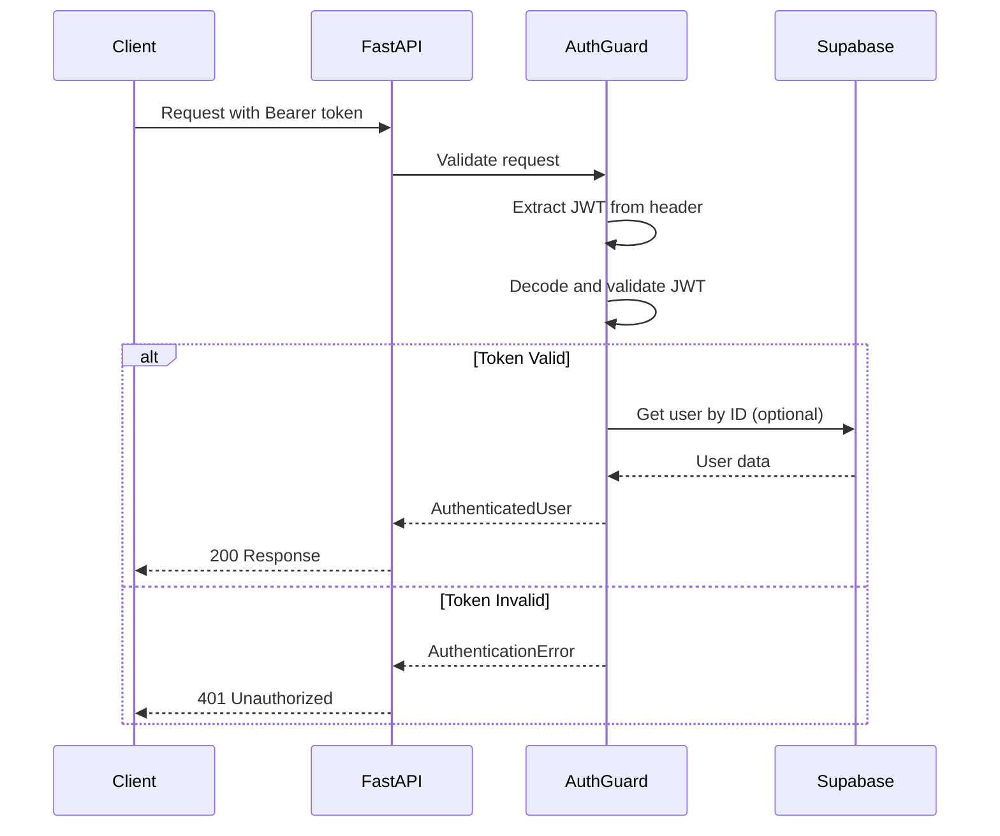

# EPIC-3: Guards and Authentication

## Overview

**Goal:** Implement authentication and authorization guards using Supabase Auth, JWT validation, rate limiting, and API key management.

**Duration:** 1-2 days  
**Dependencies:** EPIC-1 (Foundation), EPIC-2 (Database Layer)  
**Deliverables:** Secure API with authentication middleware and rate limiting

---

## Environment Variables Required

```bash
# Supabase Auth Configuration
SUPABASE_URL=https://xxxxx.supabase.co
SUPABASE_KEY=eyJhbGciOiJIUzI1NiIsInR5cCI6IkpXVCJ9...
SUPABASE_JWT_SECRET=your-jwt-secret-here

# Rate Limiting
RATE_LIMIT_REQUESTS=100
RATE_LIMIT_PERIOD=60

# API Key (for external integrations)
API_SECRET_KEY=your-api-secret-key
```

---

## Authentication Flow



---

## FEATURE-3.1: JWT Authentication Guard

### STORY-3.1.1: Implement JWT Validation

**As a** developer  
**I want** to validate JWT tokens from Supabase Auth  
**So that** I can secure API endpoints

#### TASK-3.1.1.1: Write Auth Guard Tests (TDD)

**Priority:** P0 (Critical)  
**Estimated Time:** 2 hours

**ENV VARIABLES NEEDED:**
```
SUPABASE_JWT_SECRET=your-jwt-secret-here
```

##### SUB-TASK-3.1.1.1.1: Write JWT Validation Tests

**File:** `backend/tests/unit/test_auth_guard.py`

```python
"""
Unit tests for authentication guard.
TDD: Write these tests FIRST, then implement auth_guard.py
"""
import pytest
from datetime import datetime, timedelta
from unittest.mock import MagicMock, patch
import jwt


class TestJWTValidation:
    """Test JWT token validation."""

    @pytest.fixture
    def valid_token(self):
        """Create a valid JWT token for testing."""
        secret = "test-secret-key"
        payload = {
            "sub": "user-123",
            "email": "test@example.com",
            "exp": datetime.utcnow() + timedelta(hours=1),
            "iat": datetime.utcnow(),
            "aud": "authenticated"
        }
        return jwt.encode(payload, secret, algorithm="HS256")

    @pytest.fixture
    def expired_token(self):
        """Create an expired JWT token."""
        secret = "test-secret-key"
        payload = {
            "sub": "user-123",
            "email": "test@example.com",
            "exp": datetime.utcnow() - timedelta(hours=1),
            "iat": datetime.utcnow() - timedelta(hours=2)
        }
        return jwt.encode(payload, secret, algorithm="HS256")

    def test_decode_valid_token(self, valid_token):
        """Should decode valid JWT token successfully."""
        with patch("app.guards.auth_guard.get_settings") as mock_settings:
            mock_settings.return_value.supabase_jwt_secret = "test-secret-key"
            
            from app.guards.auth_guard import decode_jwt
            
            payload = decode_jwt(valid_token)
            assert payload["sub"] == "user-123"
            assert payload["email"] == "test@example.com"

    def test_reject_expired_token(self, expired_token):
        """Should reject expired JWT token."""
        with patch("app.guards.auth_guard.get_settings") as mock_settings:
            mock_settings.return_value.supabase_jwt_secret = "test-secret-key"
            
            from app.guards.auth_guard import decode_jwt
            from app.core.exceptions import AuthenticationError
            
            with pytest.raises(AuthenticationError, match="expired"):
                decode_jwt(expired_token)

    def test_reject_invalid_signature(self, valid_token):
        """Should reject token with invalid signature."""
        with patch("app.guards.auth_guard.get_settings") as mock_settings:
            mock_settings.return_value.supabase_jwt_secret = "wrong-secret"
            
            from app.guards.auth_guard import decode_jwt
            from app.core.exceptions import AuthenticationError
            
            with pytest.raises(AuthenticationError, match="Invalid"):
                decode_jwt(valid_token)

    def test_reject_malformed_token(self):
        """Should reject malformed JWT token."""
        with patch("app.guards.auth_guard.get_settings") as mock_settings:
            mock_settings.return_value.supabase_jwt_secret = "test-secret"
            
            from app.guards.auth_guard import decode_jwt
            from app.core.exceptions import AuthenticationError
            
            with pytest.raises(AuthenticationError):
                decode_jwt("not-a-valid-jwt")


class TestAuthGuard:
    """Test authentication guard dependency."""

    @pytest.fixture
    def mock_request(self):
        """Create mock FastAPI request."""
        request = MagicMock()
        request.headers = {"Authorization": "Bearer valid-token"}
        return request

    def test_extracts_token_from_header(self, mock_request):
        """Should extract Bearer token from Authorization header."""
        from app.guards.auth_guard import extract_token
        
        token = extract_token(mock_request)
        assert token == "valid-token"

    def test_raises_on_missing_header(self):
        """Should raise AuthenticationError if no Authorization header."""
        from app.guards.auth_guard import extract_token
        from app.core.exceptions import AuthenticationError
        
        request = MagicMock()
        request.headers = {}
        
        with pytest.raises(AuthenticationError, match="Missing"):
            extract_token(request)

    def test_raises_on_invalid_scheme(self):
        """Should raise if not Bearer scheme."""
        from app.guards.auth_guard import extract_token
        from app.core.exceptions import AuthenticationError
        
        request = MagicMock()
        request.headers = {"Authorization": "Basic abc123"}
        
        with pytest.raises(AuthenticationError, match="Bearer"):
            extract_token(request)

    def test_auth_guard_returns_user(self):
        """Auth guard should return AuthenticatedUser."""
        with patch("app.guards.auth_guard.decode_jwt") as mock_decode:
            mock_decode.return_value = {
                "sub": "user-123",
                "email": "test@example.com"
            }
            
            from app.guards.auth_guard import get_current_user, AuthenticatedUser
            from fastapi import Request
            
            request = MagicMock()
            request.headers = {"Authorization": "Bearer valid-token"}
            
            # This would be called in FastAPI dependency injection
            # user = get_current_user(request)
            # assert isinstance(user, AuthenticatedUser)


class TestAuthenticatedUser:
    """Test AuthenticatedUser model."""

    def test_authenticated_user_has_required_fields(self):
        """AuthenticatedUser should have id and email."""
        from app.guards.auth_guard import AuthenticatedUser
        
        user = AuthenticatedUser(id="user-123", email="test@example.com")
        assert user.id == "user-123"
        assert user.email == "test@example.com"

    def test_authenticated_user_optional_metadata(self):
        """AuthenticatedUser can have optional metadata."""
        from app.guards.auth_guard import AuthenticatedUser
        
        user = AuthenticatedUser(
            id="user-123",
            email="test@example.com",
            metadata={"role": "admin"}
        )
        assert user.metadata["role"] == "admin"
```

##### SUB-TASK-3.1.1.1.2: Implement Auth Guard

**File:** `backend/app/guards/auth_guard.py`

```python
"""
Authentication guard for FastAPI endpoints.
Validates JWT tokens from Supabase Auth.
"""
from datetime import datetime
from typing import Any, Dict, Optional

import jwt
from fastapi import Depends, Request
from pydantic import BaseModel, EmailStr

from app.core.config import get_settings
from app.core.exceptions import AuthenticationError
from app.core.logging import get_logger

logger = get_logger(__name__)


class AuthenticatedUser(BaseModel):
    """
    Represents an authenticated user.
    
    Attributes:
        id: User UUID from Supabase Auth
        email: User email
        metadata: Optional user metadata
    """
    
    id: str
    email: Optional[EmailStr] = None
    metadata: Dict[str, Any] = {}


def extract_token(request: Request) -> str:
    """
    Extract Bearer token from Authorization header.
    
    Args:
        request: FastAPI request object
        
    Returns:
        JWT token string
        
    Raises:
        AuthenticationError: If token is missing or invalid format
    """
    auth_header = request.headers.get("Authorization")
    
    if not auth_header:
        raise AuthenticationError("Missing Authorization header")
    
    parts = auth_header.split()
    
    if len(parts) != 2:
        raise AuthenticationError("Invalid Authorization header format")
    
    scheme, token = parts
    
    if scheme.lower() != "bearer":
        raise AuthenticationError("Authorization scheme must be Bearer")
    
    return token


def decode_jwt(token: str) -> Dict[str, Any]:
    """
    Decode and validate a JWT token.
    
    Args:
        token: JWT token string
        
    Returns:
        Decoded token payload
        
    Raises:
        AuthenticationError: If token is invalid or expired
    """
    settings = get_settings()
    
    try:
        payload = jwt.decode(
            token,
            settings.supabase_jwt_secret,
            algorithms=["HS256"],
            audience="authenticated"
        )
        return payload
        
    except jwt.ExpiredSignatureError:
        logger.warning("JWT token expired")
        raise AuthenticationError("Token has expired")
        
    except jwt.InvalidAudienceError:
        logger.warning("JWT invalid audience")
        raise AuthenticationError("Invalid token audience")
        
    except jwt.InvalidTokenError as e:
        logger.warning("JWT validation failed", error=str(e))
        raise AuthenticationError(f"Invalid token: {str(e)}")


async def get_current_user(request: Request) -> AuthenticatedUser:
    """
    FastAPI dependency to get the current authenticated user.
    
    Usage:
        @app.get("/protected")
        async def protected_route(user: AuthenticatedUser = Depends(get_current_user)):
            return {"user_id": user.id}
    
    Args:
        request: FastAPI request object
        
    Returns:
        AuthenticatedUser with user details
        
    Raises:
        AuthenticationError: If authentication fails
    """
    token = extract_token(request)
    payload = decode_jwt(token)
    
    user = AuthenticatedUser(
        id=payload.get("sub"),
        email=payload.get("email"),
        metadata=payload.get("user_metadata", {})
    )
    
    logger.debug("User authenticated", user_id=user.id)
    return user


async def get_optional_user(request: Request) -> Optional[AuthenticatedUser]:
    """
    FastAPI dependency that returns user if authenticated, None otherwise.
    
    Useful for endpoints that work with or without authentication.
    
    Args:
        request: FastAPI request object
        
    Returns:
        AuthenticatedUser if authenticated, None otherwise
    """
    try:
        return await get_current_user(request)
    except AuthenticationError:
        return None


class RequireRole:
    """
    Dependency class to require specific user role.
    
    Usage:
        @app.get("/admin")
        async def admin_route(
            user: AuthenticatedUser = Depends(RequireRole("admin"))
        ):
            return {"message": "Admin access granted"}
    """
    
    def __init__(self, required_role: str):
        self.required_role = required_role
    
    async def __call__(
        self,
        user: AuthenticatedUser = Depends(get_current_user)
    ) -> AuthenticatedUser:
        """
        Verify user has required role.
        
        Args:
            user: Authenticated user from dependency
            
        Returns:
            AuthenticatedUser if authorized
            
        Raises:
            AuthorizationError: If user lacks required role
        """
        from app.core.exceptions import AuthorizationError
        
        user_role = user.metadata.get("role", "user")
        
        if user_role != self.required_role:
            logger.warning(
                "Access denied",
                user_id=user.id,
                required_role=self.required_role,
                user_role=user_role
            )
            raise AuthorizationError(
                f"Role '{self.required_role}' required"
            )
        
        return user
```

---

### STORY-3.1.2: Implement Supabase Auth Service

**As a** developer  
**I want** to interact with Supabase Auth  
**So that** I can manage user authentication

#### TASK-3.1.2.1: Write Auth Service Tests (TDD)

**Priority:** P1 (High)  
**Estimated Time:** 2 hours

##### SUB-TASK-3.1.2.1.1: Write Auth Service Tests

**File:** `backend/tests/unit/test_auth_service.py`

```python
"""
Unit tests for Supabase Auth service.
"""
import pytest
from unittest.mock import MagicMock, patch, AsyncMock


class TestAuthService:
    """Test suite for AuthService."""

    @pytest.fixture
    def mock_supabase(self):
        """Create mock Supabase client."""
        client = MagicMock()
        client.auth = MagicMock()
        return client

    def test_sign_up_creates_user(self, mock_supabase):
        """Sign up should create user and return session."""
        mock_supabase.auth.sign_up.return_value = MagicMock(
            user=MagicMock(id="user-123", email="test@example.com"),
            session=MagicMock(
                access_token="access-token",
                refresh_token="refresh-token"
            )
        )
        
        from app.services.auth_service import AuthService
        
        service = AuthService(mock_supabase)
        result = service.sign_up("test@example.com", "password123")
        
        mock_supabase.auth.sign_up.assert_called_once()
        assert result.user.email == "test@example.com"

    def test_sign_in_returns_session(self, mock_supabase):
        """Sign in should return valid session."""
        mock_supabase.auth.sign_in_with_password.return_value = MagicMock(
            user=MagicMock(id="user-123", email="test@example.com"),
            session=MagicMock(
                access_token="access-token",
                refresh_token="refresh-token"
            )
        )
        
        from app.services.auth_service import AuthService
        
        service = AuthService(mock_supabase)
        result = service.sign_in("test@example.com", "password123")
        
        assert result.session.access_token == "access-token"

    def test_sign_in_invalid_credentials(self, mock_supabase):
        """Sign in should raise on invalid credentials."""
        from gotrue.errors import AuthApiError
        
        mock_supabase.auth.sign_in_with_password.side_effect = AuthApiError(
            message="Invalid credentials",
            status=401
        )
        
        from app.services.auth_service import AuthService
        from app.core.exceptions import AuthenticationError
        
        service = AuthService(mock_supabase)
        
        with pytest.raises(AuthenticationError):
            service.sign_in("test@example.com", "wrong-password")

    def test_sign_out_invalidates_session(self, mock_supabase):
        """Sign out should invalidate the session."""
        from app.services.auth_service import AuthService
        
        service = AuthService(mock_supabase)
        service.sign_out()
        
        mock_supabase.auth.sign_out.assert_called_once()

    def test_get_user_returns_current_user(self, mock_supabase):
        """Get user should return current authenticated user."""
        mock_supabase.auth.get_user.return_value = MagicMock(
            user=MagicMock(id="user-123", email="test@example.com")
        )
        
        from app.services.auth_service import AuthService
        
        service = AuthService(mock_supabase)
        user = service.get_user("access-token")
        
        assert user.email == "test@example.com"

    def test_refresh_token_returns_new_session(self, mock_supabase):
        """Refresh token should return new session."""
        mock_supabase.auth.refresh_session.return_value = MagicMock(
            session=MagicMock(
                access_token="new-access-token",
                refresh_token="new-refresh-token"
            )
        )
        
        from app.services.auth_service import AuthService
        
        service = AuthService(mock_supabase)
        session = service.refresh_session("old-refresh-token")
        
        assert session.access_token == "new-access-token"
```

##### SUB-TASK-3.1.2.1.2: Implement Auth Service

**File:** `backend/app/services/auth_service.py`

```python
"""
Authentication service using Supabase Auth.
"""
from typing import Optional

from gotrue.errors import AuthApiError
from gotrue.types import AuthResponse, Session, User

from app.core.exceptions import AuthenticationError, ValidationError
from app.core.logging import get_logger
from app.db.supabase_client import SupabaseClient

logger = get_logger(__name__)


class AuthService:
    """
    Service for authentication operations using Supabase Auth.
    """
    
    def __init__(self, supabase_client: SupabaseClient):
        """
        Initialize auth service.
        
        Args:
            supabase_client: Supabase client instance
        """
        self._client = supabase_client
    
    def sign_up(
        self,
        email: str,
        password: str,
        metadata: Optional[dict] = None
    ) -> AuthResponse:
        """
        Register a new user.
        
        Args:
            email: User email
            password: User password
            metadata: Optional user metadata
            
        Returns:
            AuthResponse with user and session
            
        Raises:
            ValidationError: If registration fails
        """
        try:
            response = self._client.auth.sign_up({
                "email": email,
                "password": password,
                "options": {
                    "data": metadata or {}
                }
            })
            
            if response.user:
                logger.info("User registered", user_id=response.user.id)
            
            return response
            
        except AuthApiError as e:
            logger.warning("Sign up failed", email=email, error=str(e))
            raise ValidationError(f"Registration failed: {e.message}")
    
    def sign_in(
        self,
        email: str,
        password: str
    ) -> AuthResponse:
        """
        Authenticate a user.
        
        Args:
            email: User email
            password: User password
            
        Returns:
            AuthResponse with user and session
            
        Raises:
            AuthenticationError: If credentials are invalid
        """
        try:
            response = self._client.auth.sign_in_with_password({
                "email": email,
                "password": password
            })
            
            if response.user:
                logger.info("User signed in", user_id=response.user.id)
            
            return response
            
        except AuthApiError as e:
            logger.warning("Sign in failed", email=email, error=str(e))
            raise AuthenticationError("Invalid email or password")
    
    def sign_out(self) -> None:
        """
        Sign out the current user.
        
        Invalidates the current session.
        """
        try:
            self._client.auth.sign_out()
            logger.info("User signed out")
        except AuthApiError as e:
            logger.warning("Sign out failed", error=str(e))
    
    def get_user(self, access_token: str) -> Optional[User]:
        """
        Get user by access token.
        
        Args:
            access_token: JWT access token
            
        Returns:
            User if valid, None otherwise
        """
        try:
            response = self._client.auth.get_user(access_token)
            return response.user
        except AuthApiError as e:
            logger.warning("Get user failed", error=str(e))
            return None
    
    def refresh_session(self, refresh_token: str) -> Session:
        """
        Refresh an expired session.
        
        Args:
            refresh_token: Refresh token
            
        Returns:
            New session with fresh tokens
            
        Raises:
            AuthenticationError: If refresh fails
        """
        try:
            response = self._client.auth.refresh_session(refresh_token)
            
            if response.session:
                logger.debug("Session refreshed")
                return response.session
            
            raise AuthenticationError("Session refresh failed")
            
        except AuthApiError as e:
            logger.warning("Refresh failed", error=str(e))
            raise AuthenticationError("Session refresh failed")
    
    def reset_password(self, email: str) -> bool:
        """
        Send password reset email.
        
        Args:
            email: User email
            
        Returns:
            True if email sent
        """
        try:
            self._client.auth.reset_password_for_email(email)
            logger.info("Password reset email sent", email=email)
            return True
        except AuthApiError as e:
            logger.warning("Password reset failed", email=email, error=str(e))
            return False
    
    def update_password(
        self,
        access_token: str,
        new_password: str
    ) -> bool:
        """
        Update user password.
        
        Args:
            access_token: Current access token
            new_password: New password
            
        Returns:
            True if updated
        """
        try:
            self._client.auth.update_user({
                "password": new_password
            })
            logger.info("Password updated")
            return True
        except AuthApiError as e:
            logger.warning("Password update failed", error=str(e))
            return False


def get_auth_service() -> AuthService:
    """
    Get AuthService instance.
    
    Returns:
        Configured AuthService
    """
    from app.db.supabase_client import get_supabase_client
    
    client = get_supabase_client()
    if not client:
        raise RuntimeError("Supabase client not available")
    
    return AuthService(client)
```

---

## FEATURE-3.2: Rate Limiting Guard

### STORY-3.2.1: Implement Rate Limiter

**As a** developer  
**I want** rate limiting on API endpoints  
**So that** I can prevent abuse

#### TASK-3.2.1.1: Write Rate Limiter Tests (TDD)

**Priority:** P1 (High)  
**Estimated Time:** 1 hour

**ENV VARIABLES NEEDED:**
```
RATE_LIMIT_REQUESTS=100
RATE_LIMIT_PERIOD=60
```

##### SUB-TASK-3.2.1.1.1: Write Rate Limiter Tests

**File:** `backend/tests/unit/test_rate_limit_guard.py`

```python
"""
Unit tests for rate limiting guard.
"""
import pytest
import time
from unittest.mock import MagicMock


class TestRateLimiter:
    """Test suite for rate limiter."""

    def test_allows_requests_under_limit(self):
        """Should allow requests under the rate limit."""
        from app.guards.rate_limit_guard import RateLimiter
        
        limiter = RateLimiter(max_requests=10, period=60)
        
        for _ in range(10):
            result = limiter.is_allowed("user-123")
            assert result is True

    def test_blocks_requests_over_limit(self):
        """Should block requests over the rate limit."""
        from app.guards.rate_limit_guard import RateLimiter
        
        limiter = RateLimiter(max_requests=5, period=60)
        
        # Use up the limit
        for _ in range(5):
            limiter.is_allowed("user-123")
        
        # Next request should be blocked
        result = limiter.is_allowed("user-123")
        assert result is False

    def test_resets_after_period(self):
        """Should reset count after period expires."""
        from app.guards.rate_limit_guard import RateLimiter
        
        # Use very short period for testing
        limiter = RateLimiter(max_requests=2, period=0.1)  # 100ms
        
        limiter.is_allowed("user-123")
        limiter.is_allowed("user-123")
        
        # Should be blocked
        assert limiter.is_allowed("user-123") is False
        
        # Wait for reset
        time.sleep(0.15)
        
        # Should be allowed again
        assert limiter.is_allowed("user-123") is True

    def test_separate_limits_per_key(self):
        """Each key should have separate rate limit."""
        from app.guards.rate_limit_guard import RateLimiter
        
        limiter = RateLimiter(max_requests=2, period=60)
        
        # User 1 uses their limit
        limiter.is_allowed("user-1")
        limiter.is_allowed("user-1")
        assert limiter.is_allowed("user-1") is False
        
        # User 2 should still have their limit
        assert limiter.is_allowed("user-2") is True

    def test_get_remaining_returns_count(self):
        """Should return remaining request count."""
        from app.guards.rate_limit_guard import RateLimiter
        
        limiter = RateLimiter(max_requests=10, period=60)
        
        limiter.is_allowed("user-123")
        limiter.is_allowed("user-123")
        limiter.is_allowed("user-123")
        
        remaining = limiter.get_remaining("user-123")
        assert remaining == 7

    def test_get_reset_time(self):
        """Should return time until reset."""
        from app.guards.rate_limit_guard import RateLimiter
        
        limiter = RateLimiter(max_requests=10, period=60)
        limiter.is_allowed("user-123")
        
        reset_time = limiter.get_reset_time("user-123")
        assert reset_time > 0
        assert reset_time <= 60


class TestRateLimitGuard:
    """Test rate limit FastAPI dependency."""

    def test_guard_allows_request(self):
        """Guard should allow request under limit."""
        from app.guards.rate_limit_guard import RateLimitGuard
        
        guard = RateLimitGuard(max_requests=100, period=60)
        
        request = MagicMock()
        request.client.host = "127.0.0.1"
        
        # Should not raise
        guard(request)

    def test_guard_blocks_exceeded(self):
        """Guard should raise when limit exceeded."""
        from app.guards.rate_limit_guard import RateLimitGuard
        from app.core.exceptions import RateLimitError
        
        guard = RateLimitGuard(max_requests=1, period=60)
        
        request = MagicMock()
        request.client.host = "127.0.0.1"
        
        guard(request)  # First request OK
        
        with pytest.raises(RateLimitError):
            guard(request)  # Second request blocked

    def test_guard_uses_user_id_if_authenticated(self):
        """Guard should use user ID for authenticated requests."""
        from app.guards.rate_limit_guard import RateLimitGuard
        from app.guards.auth_guard import AuthenticatedUser
        
        guard = RateLimitGuard(max_requests=2, period=60)
        
        request1 = MagicMock()
        request1.client.host = "127.0.0.1"
        request1.state.user = AuthenticatedUser(id="user-1", email="a@a.com")
        
        request2 = MagicMock()
        request2.client.host = "127.0.0.1"
        request2.state.user = AuthenticatedUser(id="user-2", email="b@b.com")
        
        # Both users should have separate limits
        guard(request1)
        guard(request1)
        guard(request2)
        guard(request2)
        
        # Both at limit now
        from app.core.exceptions import RateLimitError
        
        with pytest.raises(RateLimitError):
            guard(request1)
```

##### SUB-TASK-3.2.1.1.2: Implement Rate Limiter

**File:** `backend/app/guards/rate_limit_guard.py`

```python
"""
Rate limiting guard for API endpoints.
Uses in-memory storage with sliding window algorithm.
"""
import time
from collections import defaultdict
from dataclasses import dataclass
from threading import Lock
from typing import Dict, Optional

from fastapi import Request, Depends

from app.core.config import get_settings
from app.core.exceptions import RateLimitError
from app.core.logging import get_logger

logger = get_logger(__name__)


@dataclass
class RateLimitEntry:
    """Entry tracking rate limit for a key."""
    count: int
    window_start: float


class RateLimiter:
    """
    In-memory rate limiter using sliding window algorithm.
    
    Thread-safe implementation suitable for single-process deployments.
    For multi-process, use Redis-based implementation.
    """
    
    def __init__(self, max_requests: int, period: int):
        """
        Initialize rate limiter.
        
        Args:
            max_requests: Maximum requests allowed per period
            period: Time window in seconds
        """
        self.max_requests = max_requests
        self.period = period
        self._entries: Dict[str, RateLimitEntry] = {}
        self._lock = Lock()
    
    def is_allowed(self, key: str) -> bool:
        """
        Check if request is allowed for the given key.
        
        Args:
            key: Identifier (user ID, IP address, etc.)
            
        Returns:
            True if allowed, False if rate limited
        """
        now = time.time()
        
        with self._lock:
            entry = self._entries.get(key)
            
            if entry is None:
                # First request from this key
                self._entries[key] = RateLimitEntry(count=1, window_start=now)
                return True
            
            # Check if window has expired
            if now - entry.window_start >= self.period:
                # Reset window
                self._entries[key] = RateLimitEntry(count=1, window_start=now)
                return True
            
            # Check if under limit
            if entry.count < self.max_requests:
                entry.count += 1
                return True
            
            return False
    
    def get_remaining(self, key: str) -> int:
        """
        Get remaining requests for a key.
        
        Args:
            key: Identifier
            
        Returns:
            Number of remaining requests
        """
        with self._lock:
            entry = self._entries.get(key)
            
            if entry is None:
                return self.max_requests
            
            now = time.time()
            if now - entry.window_start >= self.period:
                return self.max_requests
            
            return max(0, self.max_requests - entry.count)
    
    def get_reset_time(self, key: str) -> int:
        """
        Get seconds until rate limit resets.
        
        Args:
            key: Identifier
            
        Returns:
            Seconds until reset
        """
        with self._lock:
            entry = self._entries.get(key)
            
            if entry is None:
                return 0
            
            now = time.time()
            elapsed = now - entry.window_start
            remaining = self.period - elapsed
            
            return max(0, int(remaining))
    
    def reset(self, key: str) -> None:
        """
        Reset rate limit for a key.
        
        Args:
            key: Identifier to reset
        """
        with self._lock:
            if key in self._entries:
                del self._entries[key]


# Global rate limiter instance
_rate_limiter: Optional[RateLimiter] = None


def get_rate_limiter() -> RateLimiter:
    """
    Get global rate limiter instance.
    
    Returns:
        Configured RateLimiter
    """
    global _rate_limiter
    
    if _rate_limiter is None:
        settings = get_settings()
        _rate_limiter = RateLimiter(
            max_requests=settings.rate_limit_requests,
            period=settings.rate_limit_period
        )
    
    return _rate_limiter


class RateLimitGuard:
    """
    FastAPI dependency for rate limiting.
    
    Usage:
        @app.get("/api/resource")
        async def get_resource(
            _: None = Depends(RateLimitGuard())
        ):
            return {"data": "value"}
    """
    
    def __init__(
        self,
        max_requests: Optional[int] = None,
        period: Optional[int] = None,
        key_func: Optional[callable] = None
    ):
        """
        Initialize rate limit guard.
        
        Args:
            max_requests: Max requests (defaults to config)
            period: Time period in seconds (defaults to config)
            key_func: Optional function to extract key from request
        """
        settings = get_settings()
        self.max_requests = max_requests or settings.rate_limit_requests
        self.period = period or settings.rate_limit_period
        self.key_func = key_func
        self._limiter = RateLimiter(self.max_requests, self.period)
    
    def __call__(self, request: Request) -> None:
        """
        Check rate limit for request.
        
        Args:
            request: FastAPI request
            
        Raises:
            RateLimitError: If rate limit exceeded
        """
        # Determine rate limit key
        if self.key_func:
            key = self.key_func(request)
        else:
            key = self._get_default_key(request)
        
        if not self._limiter.is_allowed(key):
            reset_time = self._limiter.get_reset_time(key)
            logger.warning(
                "Rate limit exceeded",
                key=key,
                reset_in=reset_time
            )
            raise RateLimitError(
                "Rate limit exceeded. Try again later.",
                retry_after=reset_time
            )
        
        # Add rate limit headers to response
        remaining = self._limiter.get_remaining(key)
        reset_time = self._limiter.get_reset_time(key)
        
        # Store for middleware to add headers
        request.state.rate_limit = {
            "limit": self.max_requests,
            "remaining": remaining,
            "reset": reset_time
        }
    
    def _get_default_key(self, request: Request) -> str:
        """
        Get default rate limit key from request.
        
        Uses user ID if authenticated, otherwise client IP.
        
        Args:
            request: FastAPI request
            
        Returns:
            Rate limit key
        """
        # Check if user is authenticated
        if hasattr(request.state, "user") and request.state.user:
            return f"user:{request.state.user.id}"
        
        # Fall back to IP address
        client_ip = request.client.host if request.client else "unknown"
        return f"ip:{client_ip}"


def rate_limit(
    max_requests: int = 100,
    period: int = 60
) -> RateLimitGuard:
    """
    Create a rate limit dependency with custom limits.
    
    Usage:
        @app.get("/api/expensive")
        async def expensive_operation(
            _: None = Depends(rate_limit(max_requests=10, period=60))
        ):
            return {"result": "data"}
    
    Args:
        max_requests: Maximum requests per period
        period: Time period in seconds
        
    Returns:
        Configured RateLimitGuard
    """
    return RateLimitGuard(max_requests=max_requests, period=period)
```

---

## FEATURE-3.3: API Key Guard

### STORY-3.3.1: Implement API Key Authentication

**As a** developer  
**I want** API key authentication for external integrations  
**So that** services can authenticate without JWT

#### TASK-3.3.1.1: Write API Key Guard Tests (TDD)

**Priority:** P2 (Medium)  
**Estimated Time:** 1 hour

**ENV VARIABLES NEEDED:**
```
API_SECRET_KEY=your-api-secret-key
```

##### SUB-TASK-3.3.1.1.1: Write API Key Tests

**File:** `backend/tests/unit/test_api_key_guard.py`

```python
"""
Unit tests for API key authentication guard.
"""
import pytest
from unittest.mock import MagicMock, patch


class TestAPIKeyGuard:
    """Test API key authentication."""

    def test_accepts_valid_api_key(self):
        """Should accept valid API key in header."""
        with patch("app.guards.api_key_guard.get_settings") as mock_settings:
            mock_settings.return_value.api_secret_key = "valid-key"
            
            from app.guards.api_key_guard import validate_api_key
            
            request = MagicMock()
            request.headers = {"X-API-Key": "valid-key"}
            
            result = validate_api_key(request)
            assert result is True

    def test_rejects_invalid_api_key(self):
        """Should reject invalid API key."""
        with patch("app.guards.api_key_guard.get_settings") as mock_settings:
            mock_settings.return_value.api_secret_key = "valid-key"
            
            from app.guards.api_key_guard import validate_api_key
            from app.core.exceptions import AuthenticationError
            
            request = MagicMock()
            request.headers = {"X-API-Key": "invalid-key"}
            
            with pytest.raises(AuthenticationError):
                validate_api_key(request)

    def test_rejects_missing_api_key(self):
        """Should reject request without API key."""
        from app.guards.api_key_guard import validate_api_key
        from app.core.exceptions import AuthenticationError
        
        request = MagicMock()
        request.headers = {}
        
        with pytest.raises(AuthenticationError):
            validate_api_key(request)

    def test_accepts_api_key_in_query(self):
        """Should accept API key in query parameter."""
        with patch("app.guards.api_key_guard.get_settings") as mock_settings:
            mock_settings.return_value.api_secret_key = "valid-key"
            
            from app.guards.api_key_guard import validate_api_key
            
            request = MagicMock()
            request.headers = {}
            request.query_params = {"api_key": "valid-key"}
            
            result = validate_api_key(request)
            assert result is True
```

##### SUB-TASK-3.3.1.1.2: Implement API Key Guard

**File:** `backend/app/guards/api_key_guard.py`

```python
"""
API Key authentication guard for external integrations.
"""
from typing import Optional

from fastapi import Request, Depends, Security
from fastapi.security import APIKeyHeader, APIKeyQuery

from app.core.config import get_settings
from app.core.exceptions import AuthenticationError
from app.core.logging import get_logger

logger = get_logger(__name__)

# Define API key security schemes
api_key_header = APIKeyHeader(name="X-API-Key", auto_error=False)
api_key_query = APIKeyQuery(name="api_key", auto_error=False)


def validate_api_key(request: Request) -> bool:
    """
    Validate API key from request.
    
    Checks X-API-Key header first, then api_key query parameter.
    
    Args:
        request: FastAPI request
        
    Returns:
        True if valid
        
    Raises:
        AuthenticationError: If API key is invalid or missing
    """
    settings = get_settings()
    
    if not settings.api_secret_key:
        raise AuthenticationError("API key authentication not configured")
    
    # Check header first
    api_key = request.headers.get("X-API-Key")
    
    # Fall back to query parameter
    if not api_key:
        api_key = request.query_params.get("api_key")
    
    if not api_key:
        raise AuthenticationError("API key required")
    
    if api_key != settings.api_secret_key:
        logger.warning("Invalid API key attempt", key_prefix=api_key[:4] + "...")
        raise AuthenticationError("Invalid API key")
    
    logger.debug("API key validated")
    return True


async def get_api_key(
    api_key_header: Optional[str] = Security(api_key_header),
    api_key_query: Optional[str] = Security(api_key_query)
) -> str:
    """
    FastAPI dependency to get and validate API key.
    
    Usage:
        @app.get("/api/webhook")
        async def webhook(api_key: str = Depends(get_api_key)):
            return {"status": "ok"}
    
    Args:
        api_key_header: API key from header
        api_key_query: API key from query
        
    Returns:
        Validated API key
        
    Raises:
        AuthenticationError: If invalid
    """
    settings = get_settings()
    
    api_key = api_key_header or api_key_query
    
    if not api_key:
        raise AuthenticationError("API key required")
    
    if api_key != settings.api_secret_key:
        raise AuthenticationError("Invalid API key")
    
    return api_key


class APIKeyGuard:
    """
    Dependency class for API key authentication.
    
    Allows custom validation logic.
    """
    
    def __init__(self, required: bool = True):
        """
        Initialize API key guard.
        
        Args:
            required: If True, raise error when key missing
        """
        self.required = required
    
    async def __call__(
        self,
        api_key_header: Optional[str] = Security(api_key_header),
        api_key_query: Optional[str] = Security(api_key_query)
    ) -> Optional[str]:
        """
        Validate API key.
        
        Args:
            api_key_header: Key from header
            api_key_query: Key from query
            
        Returns:
            API key if valid, None if not required
            
        Raises:
            AuthenticationError: If required and invalid
        """
        api_key = api_key_header or api_key_query
        
        if not api_key:
            if self.required:
                raise AuthenticationError("API key required")
            return None
        
        settings = get_settings()
        
        if api_key != settings.api_secret_key:
            raise AuthenticationError("Invalid API key")
        
        return api_key
```

---

## FEATURE-3.4: Guards Integration

### STORY-3.4.1: Create API Dependencies Module

**As a** developer  
**I want** centralized API dependencies  
**So that** routes can easily use guards

#### TASK-3.4.1.1: Implement API Dependencies

**File:** `backend/app/api/deps.py`

```python
"""
FastAPI dependency injection utilities.
Provides common dependencies for API routes.
"""
from typing import Optional

from fastapi import Depends, Request

from app.core.config import get_settings, Settings
from app.db.supabase_client import get_supabase_client, SupabaseClient
from app.db.sqlite_client import get_sqlite_client, SQLiteClient
from app.guards.auth_guard import (
    get_current_user,
    get_optional_user,
    AuthenticatedUser,
    RequireRole
)
from app.guards.rate_limit_guard import RateLimitGuard, rate_limit
from app.guards.api_key_guard import get_api_key, APIKeyGuard
from app.repositories.discovery_repository import DiscoveryJobRepository, BrandDNARepository
from app.repositories.profile_repository import (
    ProfileRepository,
    ProfileScoreRepository,
    ProfileContactRepository
)


def get_db_client():
    """
    Get database client based on configuration.
    
    Returns Supabase client or SQLite fallback.
    
    Returns:
        Database client
    """
    settings = get_settings()
    
    if settings.use_sqlite_fallback:
        return get_sqlite_client()
    
    client = get_supabase_client()
    if not client:
        raise RuntimeError("Database client not available")
    
    return client


def get_discovery_repository(
    db = Depends(get_db_client)
) -> DiscoveryJobRepository:
    """Get DiscoveryJobRepository instance."""
    return DiscoveryJobRepository(db)


def get_brand_dna_repository(
    db = Depends(get_db_client)
) -> BrandDNARepository:
    """Get BrandDNARepository instance."""
    return BrandDNARepository(db)


def get_profile_repository(
    db = Depends(get_db_client)
) -> ProfileRepository:
    """Get ProfileRepository instance."""
    return ProfileRepository(db)


def get_profile_score_repository(
    db = Depends(get_db_client)
) -> ProfileScoreRepository:
    """Get ProfileScoreRepository instance."""
    return ProfileScoreRepository(db)


def get_profile_contact_repository(
    db = Depends(get_db_client)
) -> ProfileContactRepository:
    """Get ProfileContactRepository instance."""
    return ProfileContactRepository(db)


# Common dependency combinations
async def authenticated_user(
    user: AuthenticatedUser = Depends(get_current_user)
) -> AuthenticatedUser:
    """Require authenticated user."""
    return user


async def admin_user(
    user: AuthenticatedUser = Depends(RequireRole("admin"))
) -> AuthenticatedUser:
    """Require admin user."""
    return user


# Rate limited + authenticated
async def rate_limited_user(
    request: Request,
    _: None = Depends(RateLimitGuard()),
    user: AuthenticatedUser = Depends(get_current_user)
) -> AuthenticatedUser:
    """Require authenticated user with rate limiting."""
    return user
```

---

## VALIDATION PLAN: EPIC-3

### Validation Script

**File:** `backend/scripts/validate_epic3.py`

```python
#!/usr/bin/env python3
"""
Validation script for EPIC-3: Guards and Authentication.
"""
import subprocess
import sys
from pathlib import Path


def run_command(cmd: list[str], description: str) -> bool:
    """Run a command and return success status."""
    print(f"\n{'='*60}")
    print(f"VALIDATION: {description}")
    print(f"Command: {' '.join(cmd)}")
    print("="*60)
    
    result = subprocess.run(cmd, capture_output=False)
    success = result.returncode == 0
    
    print(f"Result: {'PASS' if success else 'FAIL'}")
    return success


def validate_structure() -> bool:
    """Validate guards structure exists."""
    required_files = [
        "app/guards/__init__.py",
        "app/guards/auth_guard.py",
        "app/guards/rate_limit_guard.py",
        "app/guards/api_key_guard.py",
        "app/services/auth_service.py",
        "app/api/deps.py",
        "tests/unit/test_auth_guard.py",
        "tests/unit/test_rate_limit_guard.py",
        "tests/unit/test_api_key_guard.py",
        "tests/unit/test_auth_service.py",
    ]
    
    backend_dir = Path(__file__).parent.parent
    
    print("\n" + "="*60)
    print("VALIDATION: Guards Structure")
    print("="*60)
    
    all_exist = True
    for file in required_files:
        path = backend_dir / file
        exists = path.exists()
        status = "✓" if exists else "✗"
        print(f"  {status} {file}")
        if not exists:
            all_exist = False
    
    print(f"\nResult: {'PASS' if all_exist else 'FAIL'}")
    return all_exist


def validate_jwt_flow() -> bool:
    """Validate JWT encoding/decoding works."""
    print("\n" + "="*60)
    print("VALIDATION: JWT Flow")
    print("="*60)
    
    try:
        import jwt
        from datetime import datetime, timedelta
        
        secret = "test-secret"
        payload = {
            "sub": "test-user",
            "exp": datetime.utcnow() + timedelta(hours=1)
        }
        
        # Encode
        token = jwt.encode(payload, secret, algorithm="HS256")
        print(f"  ✓ JWT encoding works")
        
        # Decode
        decoded = jwt.decode(token, secret, algorithms=["HS256"])
        assert decoded["sub"] == "test-user"
        print(f"  ✓ JWT decoding works")
        
        # Verify expiry detection
        expired_payload = {
            "sub": "test-user",
            "exp": datetime.utcnow() - timedelta(hours=1)
        }
        expired_token = jwt.encode(expired_payload, secret, algorithm="HS256")
        
        try:
            jwt.decode(expired_token, secret, algorithms=["HS256"])
            print(f"  ✗ Should have detected expired token")
            return False
        except jwt.ExpiredSignatureError:
            print(f"  ✓ Expired token detection works")
        
        print("\nResult: PASS")
        return True
        
    except Exception as e:
        print(f"  ✗ Error: {str(e)}")
        print("\nResult: FAIL")
        return False


def main():
    """Run all validations."""
    print("\n" + "#"*60)
    print("# EPIC-3 VALIDATION: Guards and Authentication")
    print("#"*60)
    
    results = []
    
    # 1. Structure validation
    results.append(validate_structure())
    
    # 2. Run guard tests
    results.append(run_command(
        ["pytest", "tests/unit/test_auth_guard.py", "-v", "--tb=short"],
        "Auth Guard Tests"
    ))
    
    results.append(run_command(
        ["pytest", "tests/unit/test_rate_limit_guard.py", "-v", "--tb=short"],
        "Rate Limit Guard Tests"
    ))
    
    results.append(run_command(
        ["pytest", "tests/unit/test_api_key_guard.py", "-v", "--tb=short"],
        "API Key Guard Tests"
    ))
    
    # 3. JWT flow validation
    results.append(validate_jwt_flow())
    
    # 4. Type checking
    results.append(run_command(
        ["mypy", "app/guards/", "--ignore-missing-imports"],
        "Type Checking (mypy)"
    ))
    
    # Summary
    print("\n" + "#"*60)
    print("# VALIDATION SUMMARY")
    print("#"*60)
    
    passed = sum(results)
    total = len(results)
    
    print(f"\nPassed: {passed}/{total}")
    
    if all(results):
        print("\n✓ EPIC-3 VALIDATION PASSED")
        return 0
    else:
        print("\n✗ EPIC-3 VALIDATION FAILED")
        return 1


if __name__ == "__main__":
    sys.exit(main())
```

---

## Definition of Done

- [ ] Auth guard implemented with JWT validation
- [ ] All auth guard tests passing
- [ ] Auth service implemented with Supabase Auth
- [ ] Rate limiter implemented with sliding window
- [ ] All rate limit tests passing
- [ ] API key guard implemented
- [ ] All API key tests passing
- [ ] API dependencies module created
- [ ] Type checking with mypy passing
- [ ] `validate_epic3.py` runs successfully

---

## Next EPIC

After completing EPIC-3, proceed to:
- **[04-EPIC-SERVICES.md](./04-EPIC-SERVICES.md)** - Business Logic Services
