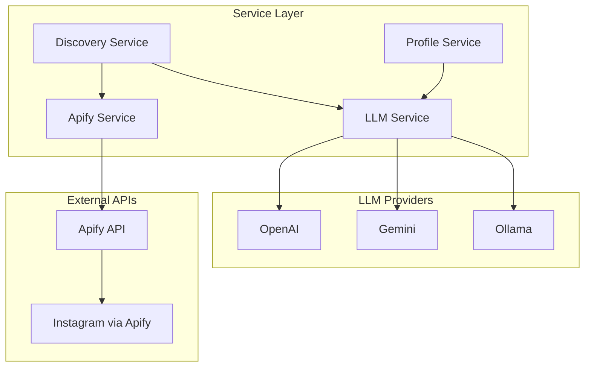

# EPIC-4: Business Logic Services

## Overview

**Goal:** Implement core business logic services including LLM abstraction, Apify integration, Discovery orchestration, and Profile management services.

**Duration:** 2-3 days  
**Dependencies:** EPIC-1, EPIC-2, EPIC-3  
**Deliverables:** Complete service layer with provider abstraction and error handling

---

## Environment Variables Required

```bash
# LLM Provider Configuration
LLM_PROVIDER=openai              # openai | gemini | ollama
OPENAI_API_KEY=sk-...
GOOGLE_API_KEY=AIza...
OLLAMA_BASE_URL=http://localhost:11434

# Apify Configuration
APIFY_API_KEY=apify_api_...
APIFY_INSTAGRAM_SCRAPER_ID=apify/instagram-scraper
APIFY_PROFILE_SCRAPER_ID=apify/instagram-profile-scraper

# Service Configuration
LLM_MAX_RETRIES=3
LLM_TIMEOUT=30
APIFY_TIMEOUT=300
```

---

## Service Architecture



---

## FEATURE-4.1: LLM Service Abstraction

### STORY-4.1.1: Implement Multi-Provider LLM Service

**As a** developer  
**I want** an abstracted LLM service  
**So that** I can switch providers without code changes

#### TASK-4.1.1.1: Write LLM Service Tests (TDD)

**Priority:** P0 (Critical)  
**Estimated Time:** 3 hours

**ENV VARIABLES NEEDED:**
```
LLM_PROVIDER=openai
OPENAI_API_KEY=sk-test-key
```

##### SUB-TASK-4.1.1.1.1: Write LLM Provider Interface Tests

**File:** `backend/tests/unit/test_llm_service.py`

```python
"""
Unit tests for LLM service abstraction.
TDD: Write these tests FIRST, then implement llm_service.py
"""
import pytest
from unittest.mock import MagicMock, patch, AsyncMock


class TestLLMProvider:
    """Test LLM provider interface."""

    def test_provider_has_generate_method(self):
        """Provider should have generate method."""
        from app.services.llm_service import BaseLLMProvider
        
        assert hasattr(BaseLLMProvider, "generate")
        assert hasattr(BaseLLMProvider, "generate_structured")

    def test_provider_has_embed_method(self):
        """Provider should have embed method for embeddings."""
        from app.services.llm_service import BaseLLMProvider
        
        assert hasattr(BaseLLMProvider, "embed")


class TestOpenAIProvider:
    """Test OpenAI provider implementation."""

    @pytest.fixture
    def provider(self):
        """Create OpenAI provider with mock client."""
        with patch("app.services.llm_service.OpenAI") as mock_openai:
            mock_client = MagicMock()
            mock_openai.return_value = mock_client
            
            from app.services.llm_service import OpenAIProvider
            return OpenAIProvider(api_key="test-key")

    def test_generate_calls_chat_completion(self, provider):
        """Generate should call OpenAI chat completion."""
        provider._client.chat.completions.create.return_value = MagicMock(
            choices=[MagicMock(message=MagicMock(content="Generated text"))]
        )
        
        result = provider.generate("Test prompt")
        
        provider._client.chat.completions.create.assert_called_once()
        assert result == "Generated text"

    def test_generate_with_system_prompt(self, provider):
        """Generate should include system prompt in messages."""
        provider._client.chat.completions.create.return_value = MagicMock(
            choices=[MagicMock(message=MagicMock(content="Response"))]
        )
        
        provider.generate(
            "User prompt",
            system_prompt="You are a helpful assistant"
        )
        
        call_args = provider._client.chat.completions.create.call_args
        messages = call_args.kwargs["messages"]
        
        assert messages[0]["role"] == "system"
        assert messages[1]["role"] == "user"

    def test_generate_structured_returns_json(self, provider):
        """Generate structured should return parsed JSON."""
        provider._client.chat.completions.create.return_value = MagicMock(
            choices=[MagicMock(message=MagicMock(
                content='{"key": "value", "number": 42}'
            ))]
        )
        
        result = provider.generate_structured(
            "Return JSON",
            schema={"type": "object"}
        )
        
        assert result["key"] == "value"
        assert result["number"] == 42

    def test_embed_returns_vector(self, provider):
        """Embed should return embedding vector."""
        provider._client.embeddings.create.return_value = MagicMock(
            data=[MagicMock(embedding=[0.1, 0.2, 0.3])]
        )
        
        result = provider.embed("Text to embed")
        
        assert len(result) == 3
        assert result[0] == 0.1

    def test_handles_api_error(self, provider):
        """Should handle OpenAI API errors gracefully."""
        from openai import APIError
        
        provider._client.chat.completions.create.side_effect = APIError(
            message="Rate limit exceeded",
            request=MagicMock(),
            body={}
        )
        
        from app.core.exceptions import LLMError
        
        with pytest.raises(LLMError) as exc_info:
            provider.generate("Test")
        
        assert exc_info.value.provider == "openai"


class TestGeminiProvider:
    """Test Gemini provider implementation."""

    @pytest.fixture
    def provider(self):
        """Create Gemini provider with mock client."""
        with patch("app.services.llm_service.genai") as mock_genai:
            mock_model = MagicMock()
            mock_genai.GenerativeModel.return_value = mock_model
            
            from app.services.llm_service import GeminiProvider
            return GeminiProvider(api_key="test-key")

    def test_generate_calls_gemini(self, provider):
        """Generate should call Gemini generate_content."""
        provider._model.generate_content.return_value = MagicMock(
            text="Generated text"
        )
        
        result = provider.generate("Test prompt")
        
        provider._model.generate_content.assert_called_once()
        assert result == "Generated text"


class TestLLMService:
    """Test main LLM service class."""

    def test_creates_correct_provider(self):
        """Service should create correct provider based on config."""
        with patch("app.services.llm_service.get_settings") as mock_settings:
            mock_settings.return_value.llm_provider = "openai"
            mock_settings.return_value.openai_api_key = "test-key"
            
            with patch("app.services.llm_service.OpenAI"):
                from app.services.llm_service import LLMService
                
                service = LLMService()
                assert service.provider_name == "openai"

    def test_fallback_on_error(self):
        """Service should fallback to next provider on error."""
        # This tests the retry logic with fallback providers
        pass

    def test_retry_on_transient_error(self):
        """Service should retry on transient errors."""
        pass


class TestLLMServiceIntegration:
    """Integration-style tests for LLM service."""

    @pytest.mark.asyncio
    async def test_async_generate(self):
        """Async generate should work correctly."""
        with patch("app.services.llm_service.OpenAI") as mock_openai:
            mock_client = MagicMock()
            mock_client.chat.completions.create.return_value = MagicMock(
                choices=[MagicMock(message=MagicMock(content="Async response"))]
            )
            mock_openai.return_value = mock_client
            
            from app.services.llm_service import LLMService
            
            with patch("app.services.llm_service.get_settings") as mock_settings:
                mock_settings.return_value.llm_provider = "openai"
                mock_settings.return_value.openai_api_key = "test"
                
                service = LLMService()
                result = await service.agenerate("Test prompt")
                
                assert result == "Async response"
```

##### SUB-TASK-4.1.1.1.2: Implement LLM Service

**File:** `backend/app/services/llm_service.py`

```python
"""
Multi-provider LLM service abstraction.
Supports OpenAI, Gemini, and Ollama with automatic fallback.
"""
import asyncio
import json
from abc import ABC, abstractmethod
from typing import Any, Dict, List, Optional, Type

from tenacity import (
    retry,
    stop_after_attempt,
    wait_exponential,
    retry_if_exception_type
)

from app.core.config import get_settings, Settings
from app.core.exceptions import LLMError
from app.core.logging import get_logger

logger = get_logger(__name__)


class BaseLLMProvider(ABC):
    """
    Abstract base class for LLM providers.
    
    All providers must implement these methods.
    """
    
    @abstractmethod
    def generate(
        self,
        prompt: str,
        system_prompt: Optional[str] = None,
        temperature: float = 0.7,
        max_tokens: int = 1000
    ) -> str:
        """Generate text from prompt."""
        pass
    
    @abstractmethod
    def generate_structured(
        self,
        prompt: str,
        schema: Dict[str, Any],
        system_prompt: Optional[str] = None
    ) -> Dict[str, Any]:
        """Generate structured JSON output."""
        pass
    
    @abstractmethod
    def embed(self, text: str) -> List[float]:
        """Generate embedding vector for text."""
        pass
    
    @abstractmethod
    async def agenerate(
        self,
        prompt: str,
        system_prompt: Optional[str] = None,
        temperature: float = 0.7,
        max_tokens: int = 1000
    ) -> str:
        """Async text generation."""
        pass


class OpenAIProvider(BaseLLMProvider):
    """
    OpenAI GPT provider implementation.
    """
    
    def __init__(
        self,
        api_key: str,
        model: str = "gpt-4o-mini",
        embedding_model: str = "text-embedding-3-small"
    ):
        from openai import OpenAI
        
        self._client = OpenAI(api_key=api_key)
        self.model = model
        self.embedding_model = embedding_model
        logger.debug("OpenAI provider initialized", model=model)
    
    @retry(
        stop=stop_after_attempt(3),
        wait=wait_exponential(multiplier=1, min=1, max=10),
        retry=retry_if_exception_type(Exception)
    )
    def generate(
        self,
        prompt: str,
        system_prompt: Optional[str] = None,
        temperature: float = 0.7,
        max_tokens: int = 1000
    ) -> str:
        """Generate text using OpenAI."""
        try:
            messages = []
            
            if system_prompt:
                messages.append({"role": "system", "content": system_prompt})
            
            messages.append({"role": "user", "content": prompt})
            
            response = self._client.chat.completions.create(
                model=self.model,
                messages=messages,
                temperature=temperature,
                max_tokens=max_tokens
            )
            
            return response.choices[0].message.content
            
        except Exception as e:
            logger.error("OpenAI generation failed", error=str(e))
            raise LLMError(f"OpenAI error: {str(e)}", provider="openai")
    
    def generate_structured(
        self,
        prompt: str,
        schema: Dict[str, Any],
        system_prompt: Optional[str] = None
    ) -> Dict[str, Any]:
        """Generate structured JSON output."""
        json_prompt = f"""
{prompt}

Respond with valid JSON matching this schema:
{json.dumps(schema, indent=2)}

Return ONLY the JSON, no other text.
"""
        
        response = self.generate(
            json_prompt,
            system_prompt=system_prompt,
            temperature=0.3  # Lower temperature for structured output
        )
        
        try:
            # Clean response if wrapped in markdown
            if response.startswith("```json"):
                response = response[7:]
            if response.startswith("```"):
                response = response[3:]
            if response.endswith("```"):
                response = response[:-3]
            
            return json.loads(response.strip())
        except json.JSONDecodeError as e:
            logger.error("Failed to parse JSON response", response=response)
            raise LLMError(f"Invalid JSON response: {str(e)}", provider="openai")
    
    def embed(self, text: str) -> List[float]:
        """Generate embedding using OpenAI."""
        try:
            response = self._client.embeddings.create(
                model=self.embedding_model,
                input=text
            )
            return response.data[0].embedding
        except Exception as e:
            logger.error("OpenAI embedding failed", error=str(e))
            raise LLMError(f"Embedding error: {str(e)}", provider="openai")
    
    async def agenerate(
        self,
        prompt: str,
        system_prompt: Optional[str] = None,
        temperature: float = 0.7,
        max_tokens: int = 1000
    ) -> str:
        """Async text generation."""
        # Run sync method in thread pool
        loop = asyncio.get_event_loop()
        return await loop.run_in_executor(
            None,
            lambda: self.generate(prompt, system_prompt, temperature, max_tokens)
        )


class GeminiProvider(BaseLLMProvider):
    """
    Google Gemini provider implementation.
    """
    
    def __init__(
        self,
        api_key: str,
        model: str = "gemini-pro"
    ):
        import google.generativeai as genai
        
        genai.configure(api_key=api_key)
        self._model = genai.GenerativeModel(model)
        self.model = model
        logger.debug("Gemini provider initialized", model=model)
    
    @retry(
        stop=stop_after_attempt(3),
        wait=wait_exponential(multiplier=1, min=1, max=10)
    )
    def generate(
        self,
        prompt: str,
        system_prompt: Optional[str] = None,
        temperature: float = 0.7,
        max_tokens: int = 1000
    ) -> str:
        """Generate text using Gemini."""
        try:
            full_prompt = prompt
            if system_prompt:
                full_prompt = f"{system_prompt}\n\n{prompt}"
            
            response = self._model.generate_content(
                full_prompt,
                generation_config={
                    "temperature": temperature,
                    "max_output_tokens": max_tokens
                }
            )
            
            return response.text
            
        except Exception as e:
            logger.error("Gemini generation failed", error=str(e))
            raise LLMError(f"Gemini error: {str(e)}", provider="gemini")
    
    def generate_structured(
        self,
        prompt: str,
        schema: Dict[str, Any],
        system_prompt: Optional[str] = None
    ) -> Dict[str, Any]:
        """Generate structured JSON output."""
        json_prompt = f"""
{prompt}

Respond with valid JSON matching this schema:
{json.dumps(schema, indent=2)}

Return ONLY the JSON, no other text.
"""
        
        response = self.generate(json_prompt, system_prompt, temperature=0.3)
        
        try:
            if response.startswith("```"):
                lines = response.split("\n")
                response = "\n".join(lines[1:-1])
            return json.loads(response.strip())
        except json.JSONDecodeError as e:
            raise LLMError(f"Invalid JSON response: {str(e)}", provider="gemini")
    
    def embed(self, text: str) -> List[float]:
        """Generate embedding using Gemini."""
        import google.generativeai as genai
        
        try:
            result = genai.embed_content(
                model="models/embedding-001",
                content=text,
                task_type="retrieval_document"
            )
            return result["embedding"]
        except Exception as e:
            raise LLMError(f"Embedding error: {str(e)}", provider="gemini")
    
    async def agenerate(
        self,
        prompt: str,
        system_prompt: Optional[str] = None,
        temperature: float = 0.7,
        max_tokens: int = 1000
    ) -> str:
        """Async text generation."""
        loop = asyncio.get_event_loop()
        return await loop.run_in_executor(
            None,
            lambda: self.generate(prompt, system_prompt, temperature, max_tokens)
        )


class OllamaProvider(BaseLLMProvider):
    """
    Ollama local LLM provider implementation.
    """
    
    def __init__(
        self,
        base_url: str = "http://localhost:11434",
        model: str = "llama2"
    ):
        import httpx
        
        self._client = httpx.Client(base_url=base_url, timeout=60.0)
        self.base_url = base_url
        self.model = model
        logger.debug("Ollama provider initialized", model=model, url=base_url)
    
    def generate(
        self,
        prompt: str,
        system_prompt: Optional[str] = None,
        temperature: float = 0.7,
        max_tokens: int = 1000
    ) -> str:
        """Generate text using Ollama."""
        try:
            full_prompt = prompt
            if system_prompt:
                full_prompt = f"{system_prompt}\n\n{prompt}"
            
            response = self._client.post(
                "/api/generate",
                json={
                    "model": self.model,
                    "prompt": full_prompt,
                    "stream": False,
                    "options": {
                        "temperature": temperature,
                        "num_predict": max_tokens
                    }
                }
            )
            response.raise_for_status()
            
            return response.json()["response"]
            
        except Exception as e:
            logger.error("Ollama generation failed", error=str(e))
            raise LLMError(f"Ollama error: {str(e)}", provider="ollama")
    
    def generate_structured(
        self,
        prompt: str,
        schema: Dict[str, Any],
        system_prompt: Optional[str] = None
    ) -> Dict[str, Any]:
        """Generate structured JSON output."""
        json_prompt = f"""
{prompt}

Respond with valid JSON matching this schema:
{json.dumps(schema, indent=2)}

Return ONLY the JSON, no other text.
"""
        
        response = self.generate(json_prompt, system_prompt, temperature=0.3)
        
        try:
            return json.loads(response.strip())
        except json.JSONDecodeError as e:
            raise LLMError(f"Invalid JSON response: {str(e)}", provider="ollama")
    
    def embed(self, text: str) -> List[float]:
        """Generate embedding using Ollama."""
        try:
            response = self._client.post(
                "/api/embeddings",
                json={
                    "model": self.model,
                    "prompt": text
                }
            )
            response.raise_for_status()
            return response.json()["embedding"]
        except Exception as e:
            raise LLMError(f"Embedding error: {str(e)}", provider="ollama")
    
    async def agenerate(
        self,
        prompt: str,
        system_prompt: Optional[str] = None,
        temperature: float = 0.7,
        max_tokens: int = 1000
    ) -> str:
        """Async text generation."""
        loop = asyncio.get_event_loop()
        return await loop.run_in_executor(
            None,
            lambda: self.generate(prompt, system_prompt, temperature, max_tokens)
        )


# Provider registry
PROVIDERS: Dict[str, Type[BaseLLMProvider]] = {
    "openai": OpenAIProvider,
    "gemini": GeminiProvider,
    "ollama": OllamaProvider,
}


class LLMService:
    """
    Main LLM service with provider abstraction.
    
    Handles provider selection, fallback, and error handling.
    """
    
    def __init__(self, settings: Optional[Settings] = None):
        """
        Initialize LLM service.
        
        Args:
            settings: Application settings
        """
        self._settings = settings or get_settings()
        self._provider = self._create_provider()
    
    def _create_provider(self) -> BaseLLMProvider:
        """Create LLM provider based on settings."""
        provider_name = self._settings.llm_provider
        
        if provider_name == "openai":
            return OpenAIProvider(
                api_key=self._settings.openai_api_key
            )
        elif provider_name == "gemini":
            return GeminiProvider(
                api_key=self._settings.google_api_key
            )
        elif provider_name == "ollama":
            return OllamaProvider(
                base_url=self._settings.ollama_base_url
            )
        else:
            raise ValueError(f"Unknown LLM provider: {provider_name}")
    
    @property
    def provider_name(self) -> str:
        """Get current provider name."""
        return self._settings.llm_provider
    
    def generate(
        self,
        prompt: str,
        system_prompt: Optional[str] = None,
        temperature: float = 0.7,
        max_tokens: int = 1000
    ) -> str:
        """
        Generate text using configured provider.
        
        Args:
            prompt: User prompt
            system_prompt: Optional system instruction
            temperature: Creativity (0-1)
            max_tokens: Maximum output length
            
        Returns:
            Generated text
        """
        return self._provider.generate(
            prompt,
            system_prompt=system_prompt,
            temperature=temperature,
            max_tokens=max_tokens
        )
    
    def generate_structured(
        self,
        prompt: str,
        schema: Dict[str, Any],
        system_prompt: Optional[str] = None
    ) -> Dict[str, Any]:
        """
        Generate structured JSON output.
        
        Args:
            prompt: User prompt
            schema: Expected JSON schema
            system_prompt: Optional system instruction
            
        Returns:
            Parsed JSON response
        """
        return self._provider.generate_structured(
            prompt,
            schema=schema,
            system_prompt=system_prompt
        )
    
    def embed(self, text: str) -> List[float]:
        """
        Generate embedding vector.
        
        Args:
            text: Text to embed
            
        Returns:
            Embedding vector
        """
        return self._provider.embed(text)
    
    async def agenerate(
        self,
        prompt: str,
        system_prompt: Optional[str] = None,
        temperature: float = 0.7,
        max_tokens: int = 1000
    ) -> str:
        """
        Async text generation.
        
        Args:
            prompt: User prompt
            system_prompt: Optional system instruction
            temperature: Creativity (0-1)
            max_tokens: Maximum output length
            
        Returns:
            Generated text
        """
        return await self._provider.agenerate(
            prompt,
            system_prompt=system_prompt,
            temperature=temperature,
            max_tokens=max_tokens
        )


def get_llm_service() -> LLMService:
    """Get LLM service instance."""
    return LLMService()
```

---

## FEATURE-4.2: Apify Service

### STORY-4.2.1: Implement Apify Instagram Scraping

**As a** developer  
**I want** to scrape Instagram profiles via Apify  
**So that** I can gather profile data for analysis

#### TASK-4.2.1.1: Write Apify Service Tests (TDD)

**Priority:** P0 (Critical)  
**Estimated Time:** 2 hours

**ENV VARIABLES NEEDED:**
```
APIFY_API_KEY=apify_api_...
APIFY_INSTAGRAM_SCRAPER_ID=apify/instagram-scraper
```

##### SUB-TASK-4.2.1.1.1: Write Apify Service Tests

**File:** `backend/tests/unit/test_apify_service.py`

```python
"""
Unit tests for Apify scraping service.
"""
import pytest
from unittest.mock import MagicMock, patch, AsyncMock


class TestApifyService:
    """Test suite for Apify service."""

    @pytest.fixture
    def mock_apify_client(self):
        """Create mock Apify client."""
        client = MagicMock()
        client.actor.return_value = MagicMock()
        return client

    @pytest.fixture
    def service(self, mock_apify_client):
        """Create Apify service with mock client."""
        with patch("app.services.apify_service.ApifyClient") as mock_class:
            mock_class.return_value = mock_apify_client
            
            from app.services.apify_service import ApifyService
            return ApifyService(api_key="test-key")

    def test_scrape_profile_returns_data(self, service):
        """Scrape profile should return profile data."""
        mock_run = MagicMock()
        mock_run.wait.return_value = None
        mock_dataset = MagicMock()
        mock_dataset.list_items.return_value = MagicMock(items=[{
            "username": "testuser",
            "fullName": "Test User",
            "biography": "Test bio",
            "followersCount": 10000,
            "followingCount": 500,
            "postsCount": 100,
            "profilePicUrl": "https://...",
            "isVerified": False,
            "isBusinessAccount": True
        }])
        
        service._client.actor.return_value.call.return_value = mock_run
        service._client.dataset.return_value = mock_dataset
        mock_run.get.return_value = {"defaultDatasetId": "dataset-123"}
        
        result = service.scrape_profile("testuser")
        
        assert result["username"] == "testuser"
        assert result["follower_count"] == 10000

    def test_scrape_hashtag_returns_posts(self, service):
        """Scrape hashtag should return posts."""
        mock_run = MagicMock()
        mock_dataset = MagicMock()
        mock_dataset.list_items.return_value = MagicMock(items=[
            {"id": "1", "caption": "Post 1", "ownerUsername": "user1"},
            {"id": "2", "caption": "Post 2", "ownerUsername": "user2"}
        ])
        
        service._client.actor.return_value.call.return_value = mock_run
        service._client.dataset.return_value = mock_dataset
        mock_run.get.return_value = {"defaultDatasetId": "dataset-123"}
        mock_run.wait.return_value = None
        
        results = service.scrape_hashtag("fashion", limit=10)
        
        assert len(results) == 2

    def test_scrape_similar_profiles(self, service):
        """Should find similar profiles from reference."""
        mock_run = MagicMock()
        mock_dataset = MagicMock()
        mock_dataset.list_items.return_value = MagicMock(items=[
            {"username": "similar1"},
            {"username": "similar2"}
        ])
        
        service._client.actor.return_value.call.return_value = mock_run
        service._client.dataset.return_value = mock_dataset
        mock_run.get.return_value = {"defaultDatasetId": "dataset-123"}
        mock_run.wait.return_value = None
        
        results = service.scrape_similar_profiles("referenceuser")
        
        assert len(results) >= 1

    def test_handles_rate_limit(self, service):
        """Should handle Apify rate limiting."""
        from apify_client import ApifyClientError
        
        service._client.actor.return_value.call.side_effect = ApifyClientError(
            "Rate limit exceeded"
        )
        
        from app.core.exceptions import ApifyError
        
        with pytest.raises(ApifyError):
            service.scrape_profile("testuser")

    def test_handles_actor_failure(self, service):
        """Should handle actor execution failure."""
        mock_run = MagicMock()
        mock_run.wait.return_value = None
        mock_run.get.return_value = {"status": "FAILED"}
        
        service._client.actor.return_value.call.return_value = mock_run
        
        from app.core.exceptions import ApifyError
        
        with pytest.raises(ApifyError):
            service.scrape_profile("testuser")


class TestApifyProfileNormalization:
    """Test profile data normalization."""

    def test_normalizes_instagram_response(self):
        """Should normalize Instagram API response to standard format."""
        from app.services.apify_service import normalize_profile
        
        raw_data = {
            "username": "testuser",
            "fullName": "Test User",
            "biography": "Test bio #hashtag",
            "followersCount": 10000,
            "followsCount": 500,
            "postsCount": 100,
            "profilePicUrl": "https://pic.url",
            "verified": True,
            "isBusinessAccount": True,
            "externalUrl": "https://example.com"
        }
        
        result = normalize_profile(raw_data)
        
        assert result["username"] == "testuser"
        assert result["display_name"] == "Test User"
        assert result["follower_count"] == 10000
        assert result["following_count"] == 500
        assert result["is_verified"] == True

    def test_handles_missing_fields(self):
        """Should handle missing optional fields."""
        from app.services.apify_service import normalize_profile
        
        raw_data = {
            "username": "minimaluser"
        }
        
        result = normalize_profile(raw_data)
        
        assert result["username"] == "minimaluser"
        assert result["follower_count"] == 0
        assert result["bio"] is None
```

##### SUB-TASK-4.2.1.1.2: Implement Apify Service

**File:** `backend/app/services/apify_service.py`

```python
"""
Apify service for Instagram scraping.
"""
import asyncio
from typing import Any, Dict, List, Optional

from apify_client import ApifyClient

from app.core.config import get_settings, Settings
from app.core.exceptions import ApifyError
from app.core.logging import get_logger

logger = get_logger(__name__)


def normalize_profile(raw_data: Dict[str, Any]) -> Dict[str, Any]:
    """
    Normalize Apify Instagram response to standard format.
    
    Args:
        raw_data: Raw response from Apify
        
    Returns:
        Normalized profile data
    """
    return {
        "username": raw_data.get("username", ""),
        "display_name": raw_data.get("fullName") or raw_data.get("full_name"),
        "bio": raw_data.get("biography") or raw_data.get("bio"),
        "follower_count": raw_data.get("followersCount") or raw_data.get("followers_count", 0),
        "following_count": raw_data.get("followsCount") or raw_data.get("following_count", 0),
        "post_count": raw_data.get("postsCount") or raw_data.get("posts_count", 0),
        "profile_pic_url": raw_data.get("profilePicUrl") or raw_data.get("profile_pic_url"),
        "is_verified": raw_data.get("verified") or raw_data.get("is_verified", False),
        "is_business": raw_data.get("isBusinessAccount") or raw_data.get("is_business", False),
        "external_url": raw_data.get("externalUrl") or raw_data.get("external_url"),
        "profile_url": f"https://www.instagram.com/{raw_data.get('username', '')}/"
    }


class ApifyService:
    """
    Service for Instagram scraping via Apify.
    
    Uses Apify actors to scrape Instagram profiles,
    hashtags, and discover similar accounts.
    """
    
    def __init__(
        self,
        api_key: Optional[str] = None,
        settings: Optional[Settings] = None
    ):
        """
        Initialize Apify service.
        
        Args:
            api_key: Apify API key
            settings: Application settings
        """
        self._settings = settings or get_settings()
        self._api_key = api_key or self._settings.apify_api_key
        
        if not self._api_key:
            raise ValueError("Apify API key required")
        
        self._client = ApifyClient(self._api_key)
        logger.debug("Apify service initialized")
    
    def scrape_profile(
        self,
        username: str,
        include_posts: bool = False,
        posts_limit: int = 12
    ) -> Dict[str, Any]:
        """
        Scrape an Instagram profile.
        
        Args:
            username: Instagram username
            include_posts: Whether to include recent posts
            posts_limit: Number of posts to fetch
            
        Returns:
            Normalized profile data
            
        Raises:
            ApifyError: If scraping fails
        """
        try:
            logger.info("Scraping profile", username=username)
            
            run_input = {
                "directUrls": [f"https://www.instagram.com/{username}/"],
                "resultsType": "details",
                "resultsLimit": 1,
                "addParentData": False,
            }
            
            if include_posts:
                run_input["resultsType"] = "posts"
                run_input["resultsLimit"] = posts_limit
            
            # Run the actor
            run = self._client.actor(
                self._settings.apify_instagram_scraper_id
            ).call(run_input=run_input)
            
            # Wait for completion
            run.wait()
            
            # Check status
            run_info = run.get()
            if run_info.get("status") == "FAILED":
                raise ApifyError(
                    f"Actor failed for {username}",
                    actor_id=self._settings.apify_instagram_scraper_id
                )
            
            # Get results
            dataset = self._client.dataset(run_info["defaultDatasetId"])
            items = dataset.list_items().items
            
            if not items:
                raise ApifyError(f"No data returned for {username}")
            
            return normalize_profile(items[0])
            
        except ApifyError:
            raise
        except Exception as e:
            logger.error("Profile scraping failed", username=username, error=str(e))
            raise ApifyError(
                f"Failed to scrape {username}: {str(e)}",
                actor_id=self._settings.apify_instagram_scraper_id
            )
    
    def scrape_hashtag(
        self,
        hashtag: str,
        limit: int = 50
    ) -> List[Dict[str, Any]]:
        """
        Scrape posts from a hashtag.
        
        Args:
            hashtag: Hashtag to scrape (without #)
            limit: Maximum posts to return
            
        Returns:
            List of post data
        """
        try:
            logger.info("Scraping hashtag", hashtag=hashtag, limit=limit)
            
            run_input = {
                "hashtags": [hashtag],
                "resultsType": "posts",
                "resultsLimit": limit,
            }
            
            run = self._client.actor(
                self._settings.apify_instagram_scraper_id
            ).call(run_input=run_input)
            
            run.wait()
            
            run_info = run.get()
            if run_info.get("status") == "FAILED":
                raise ApifyError(f"Actor failed for #{hashtag}")
            
            dataset = self._client.dataset(run_info["defaultDatasetId"])
            items = dataset.list_items().items
            
            return items
            
        except ApifyError:
            raise
        except Exception as e:
            logger.error("Hashtag scraping failed", hashtag=hashtag, error=str(e))
            raise ApifyError(f"Failed to scrape #{hashtag}: {str(e)}")
    
    def scrape_similar_profiles(
        self,
        username: str,
        limit: int = 20
    ) -> List[Dict[str, Any]]:
        """
        Find similar profiles based on a reference profile.
        
        Scrapes the reference profile's following and tagged accounts.
        
        Args:
            username: Reference username
            limit: Maximum profiles to return
            
        Returns:
            List of similar profile data
        """
        try:
            logger.info("Finding similar profiles", reference=username)
            
            # First get the reference profile's followers/following
            run_input = {
                "directUrls": [f"https://www.instagram.com/{username}/"],
                "resultsType": "details",
                "searchType": "user",
                "searchLimit": limit,
            }
            
            run = self._client.actor(
                self._settings.apify_instagram_scraper_id
            ).call(run_input=run_input)
            
            run.wait()
            
            run_info = run.get()
            if run_info.get("status") == "FAILED":
                raise ApifyError(f"Actor failed for similar profiles")
            
            dataset = self._client.dataset(run_info["defaultDatasetId"])
            items = dataset.list_items().items
            
            # Normalize all profiles
            return [normalize_profile(item) for item in items]
            
        except ApifyError:
            raise
        except Exception as e:
            logger.error("Similar profiles scraping failed", error=str(e))
            raise ApifyError(f"Failed to find similar profiles: {str(e)}")
    
    def scrape_profiles_batch(
        self,
        usernames: List[str]
    ) -> List[Dict[str, Any]]:
        """
        Scrape multiple profiles in a single actor run.
        
        Args:
            usernames: List of usernames to scrape
            
        Returns:
            List of profile data
        """
        try:
            logger.info("Batch scraping profiles", count=len(usernames))
            
            urls = [f"https://www.instagram.com/{u}/" for u in usernames]
            
            run_input = {
                "directUrls": urls,
                "resultsType": "details",
            }
            
            run = self._client.actor(
                self._settings.apify_instagram_scraper_id
            ).call(run_input=run_input)
            
            run.wait()
            
            run_info = run.get()
            dataset = self._client.dataset(run_info["defaultDatasetId"])
            items = dataset.list_items().items
            
            return [normalize_profile(item) for item in items]
            
        except Exception as e:
            logger.error("Batch scraping failed", error=str(e))
            raise ApifyError(f"Batch scraping failed: {str(e)}")
    
    async def ascrape_profile(
        self,
        username: str,
        include_posts: bool = False
    ) -> Dict[str, Any]:
        """Async profile scraping."""
        loop = asyncio.get_event_loop()
        return await loop.run_in_executor(
            None,
            lambda: self.scrape_profile(username, include_posts)
        )


def get_apify_service() -> ApifyService:
    """Get Apify service instance."""
    return ApifyService()
```

---

## FEATURE-4.3: Discovery Service

### STORY-4.3.1: Implement Discovery Orchestration

**As a** developer  
**I want** a service that orchestrates the discovery workflow  
**So that** I can manage the end-to-end discovery process

#### TASK-4.3.1.1: Write Discovery Service Tests (TDD)

**Priority:** P0 (Critical)  
**Estimated Time:** 2 hours

##### SUB-TASK-4.3.1.1.1: Write Discovery Service Tests

**File:** `backend/tests/unit/test_discovery_service.py`

```python
"""
Unit tests for discovery orchestration service.
"""
import pytest
from unittest.mock import MagicMock, patch


class TestDiscoveryService:
    """Test discovery service orchestration."""

    @pytest.fixture
    def mock_repos(self):
        """Create mock repositories."""
        return {
            "job_repo": MagicMock(),
            "dna_repo": MagicMock(),
            "profile_repo": MagicMock(),
            "score_repo": MagicMock()
        }

    @pytest.fixture
    def service(self, mock_repos):
        """Create discovery service with mocks."""
        from app.services.discovery_service import DiscoveryService
        
        return DiscoveryService(
            job_repository=mock_repos["job_repo"],
            dna_repository=mock_repos["dna_repo"],
            profile_repository=mock_repos["profile_repo"],
            score_repository=mock_repos["score_repo"]
        )

    def test_create_job(self, service, mock_repos):
        """Should create a new discovery job."""
        mock_repos["job_repo"].create.return_value = MagicMock(
            id="job-123",
            status="pending"
        )
        
        result = service.create_job(
            user_id="user-123",
            reference_profiles=["https://instagram.com/brand"]
        )
        
        mock_repos["job_repo"].create.assert_called_once()
        assert result.id == "job-123"

    def test_get_job_status(self, service, mock_repos):
        """Should return job status with counts."""
        mock_repos["job_repo"].get_by_id.return_value = MagicMock(
            id="job-123",
            status="discovering"
        )
        mock_repos["profile_repo"].count_by_job.return_value = 25
        mock_repos["score_repo"].count.return_value = 10
        
        result = service.get_job_status("job-123")
        
        assert result["status"] == "discovering"
        assert result["profiles_found"] == 25
        assert result["profiles_scored"] == 10

    def test_start_discovery(self, service, mock_repos):
        """Should update job status to analyzing."""
        mock_repos["job_repo"].get_by_id.return_value = MagicMock(
            id="job-123",
            status="pending"
        )
        mock_repos["job_repo"].update_status.return_value = MagicMock(
            status="analyzing"
        )
        
        result = service.start_discovery("job-123")
        
        mock_repos["job_repo"].update_status.assert_called_with(
            "job-123", "analyzing"
        )

    def test_complete_discovery(self, service, mock_repos):
        """Should mark job as completed."""
        mock_repos["job_repo"].update_status.return_value = MagicMock(
            status="completed"
        )
        
        result = service.complete_discovery("job-123")
        
        mock_repos["job_repo"].update_status.assert_called_with(
            "job-123", "completed"
        )

    def test_fail_discovery(self, service, mock_repos):
        """Should mark job as failed with error."""
        mock_repos["job_repo"].update.return_value = MagicMock(
            status="failed"
        )
        
        result = service.fail_discovery("job-123", "API error occurred")
        
        mock_repos["job_repo"].update.assert_called()


class TestDiscoveryWorkflow:
    """Test full discovery workflow."""

    def test_process_reference_profiles(self):
        """Should process reference profiles and extract DNA."""
        # Integration test for the workflow
        pass

    def test_discover_similar_profiles(self):
        """Should find and store similar profiles."""
        pass

    def test_score_discovered_profiles(self):
        """Should score all discovered profiles."""
        pass
```

##### SUB-TASK-4.3.1.1.2: Implement Discovery Service

**File:** `backend/app/services/discovery_service.py`

```python
"""
Discovery orchestration service.
Manages the end-to-end discovery workflow.
"""
from typing import Any, Dict, List, Optional

from app.core.constants import DiscoveryStatus, ProfileStatus
from app.core.exceptions import NotFoundError, ValidationError
from app.core.logging import get_logger
from app.models.discovery import DiscoveryJob, DiscoverySettings, BrandDNA
from app.models.profile import DiscoveredProfile
from app.repositories.discovery_repository import DiscoveryJobRepository, BrandDNARepository
from app.repositories.profile_repository import ProfileRepository, ProfileScoreRepository

logger = get_logger(__name__)


class DiscoveryService:
    """
    Service for orchestrating discovery workflows.
    
    Manages job creation, status updates, and coordinates
    between different stages of the discovery process.
    """
    
    def __init__(
        self,
        job_repository: DiscoveryJobRepository,
        dna_repository: BrandDNARepository,
        profile_repository: ProfileRepository,
        score_repository: ProfileScoreRepository
    ):
        """
        Initialize discovery service.
        
        Args:
            job_repository: Discovery job repository
            dna_repository: Brand DNA repository
            profile_repository: Profile repository
            score_repository: Score repository
        """
        self._job_repo = job_repository
        self._dna_repo = dna_repository
        self._profile_repo = profile_repository
        self._score_repo = score_repository
    
    def create_job(
        self,
        user_id: str,
        reference_profiles: List[str],
        settings: Optional[Dict[str, Any]] = None
    ) -> DiscoveryJob:
        """
        Create a new discovery job.
        
        Args:
            user_id: User creating the job
            reference_profiles: List of reference profile URLs/usernames
            settings: Optional discovery settings
            
        Returns:
            Created discovery job
        """
        if not reference_profiles:
            raise ValidationError("At least one reference profile required")
        
        # Parse settings
        job_settings = DiscoverySettings(**(settings or {}))
        
        job = self._job_repo.create({
            "user_id": user_id,
            "status": DiscoveryStatus.PENDING.value,
            "reference_profiles": reference_profiles,
            "settings": job_settings.model_dump()
        })
        
        logger.info(
            "Discovery job created",
            job_id=str(job.id),
            user_id=user_id,
            reference_count=len(reference_profiles)
        )
        
        return job
    
    def get_job(self, job_id: str) -> DiscoveryJob:
        """
        Get a discovery job by ID.
        
        Args:
            job_id: Job UUID
            
        Returns:
            Discovery job
            
        Raises:
            NotFoundError: If job not found
        """
        return self._job_repo.get_by_id_or_raise(job_id)
    
    def get_job_status(self, job_id: str) -> Dict[str, Any]:
        """
        Get detailed job status with statistics.
        
        Args:
            job_id: Job UUID
            
        Returns:
            Status dict with counts
        """
        job = self.get_job(job_id)
        
        profiles_found = self._profile_repo.count_by_job(job_id)
        profiles_scored = self._score_repo.count({"profile_id": job_id})  # Simplified
        
        # Get brand DNA if available
        brand_dna = self._dna_repo.get_by_job(job_id)
        
        return {
            "id": str(job.id),
            "status": job.status.value if hasattr(job.status, 'value') else job.status,
            "reference_profiles": job.reference_profiles,
            "settings": job.settings,
            "profiles_found": profiles_found,
            "profiles_scored": profiles_scored,
            "has_brand_dna": brand_dna is not None,
            "created_at": job.created_at.isoformat() if job.created_at else None,
            "updated_at": job.updated_at.isoformat() if job.updated_at else None
        }
    
    def get_user_jobs(
        self,
        user_id: str,
        status: Optional[DiscoveryStatus] = None,
        limit: int = 20,
        offset: int = 0
    ) -> List[DiscoveryJob]:
        """
        Get jobs for a user.
        
        Args:
            user_id: User UUID
            status: Optional status filter
            limit: Maximum results
            offset: Results to skip
            
        Returns:
            List of jobs
        """
        return self._job_repo.get_by_user(
            user_id,
            status=status,
            limit=limit,
            offset=offset
        )
    
    def start_discovery(self, job_id: str) -> DiscoveryJob:
        """
        Start the discovery process (move to analyzing).
        
        Args:
            job_id: Job UUID
            
        Returns:
            Updated job
        """
        job = self.get_job(job_id)
        
        if job.status != DiscoveryStatus.PENDING:
            raise ValidationError(f"Job is not pending: {job.status}")
        
        updated = self._job_repo.update_status(job_id, DiscoveryStatus.ANALYZING)
        
        logger.info("Discovery started", job_id=job_id)
        return updated
    
    def advance_to_discovering(self, job_id: str) -> DiscoveryJob:
        """
        Advance job to discovering phase.
        
        Args:
            job_id: Job UUID
            
        Returns:
            Updated job
        """
        return self._job_repo.update_status(job_id, DiscoveryStatus.DISCOVERING)
    
    def advance_to_scoring(self, job_id: str) -> DiscoveryJob:
        """
        Advance job to scoring phase.
        
        Args:
            job_id: Job UUID
            
        Returns:
            Updated job
        """
        return self._job_repo.update_status(job_id, DiscoveryStatus.SCORING)
    
    def complete_discovery(self, job_id: str) -> DiscoveryJob:
        """
        Mark discovery as completed.
        
        Args:
            job_id: Job UUID
            
        Returns:
            Updated job
        """
        updated = self._job_repo.update_status(job_id, DiscoveryStatus.COMPLETED)
        
        logger.info("Discovery completed", job_id=job_id)
        return updated
    
    def fail_discovery(
        self,
        job_id: str,
        error_message: str
    ) -> DiscoveryJob:
        """
        Mark discovery as failed.
        
        Args:
            job_id: Job UUID
            error_message: Error description
            
        Returns:
            Updated job
        """
        updated = self._job_repo.update(job_id, {
            "status": DiscoveryStatus.FAILED.value,
            "settings": {"error": error_message}  # Store error in settings
        })
        
        logger.error("Discovery failed", job_id=job_id, error=error_message)
        return updated
    
    def save_brand_dna(
        self,
        job_id: str,
        dna_data: Dict[str, Any]
    ) -> BrandDNA:
        """
        Save brand DNA for a job.
        
        Args:
            job_id: Job UUID
            dna_data: Brand DNA data
            
        Returns:
            Saved brand DNA
        """
        return self._dna_repo.upsert_for_job(job_id, dna_data)
    
    def get_brand_dna(self, job_id: str) -> Optional[BrandDNA]:
        """
        Get brand DNA for a job.
        
        Args:
            job_id: Job UUID
            
        Returns:
            Brand DNA if exists
        """
        return self._dna_repo.get_by_job(job_id)
    
    def add_discovered_profile(
        self,
        job_id: str,
        profile_data: Dict[str, Any]
    ) -> DiscoveredProfile:
        """
        Add a discovered profile to a job.
        
        Args:
            job_id: Job UUID
            profile_data: Profile data
            
        Returns:
            Created profile
        """
        profile_data["job_id"] = job_id
        profile_data["status"] = ProfileStatus.NEW.value
        
        return self._profile_repo.create(profile_data)
    
    def add_discovered_profiles_batch(
        self,
        job_id: str,
        profiles: List[Dict[str, Any]]
    ) -> List[DiscoveredProfile]:
        """
        Add multiple discovered profiles.
        
        Args:
            job_id: Job UUID
            profiles: List of profile data
            
        Returns:
            List of created profiles
        """
        for p in profiles:
            p["job_id"] = job_id
            p["status"] = ProfileStatus.NEW.value
        
        return self._profile_repo.bulk_create(profiles)
    
    def get_discovered_profiles(
        self,
        job_id: str,
        status: Optional[ProfileStatus] = None,
        min_score: Optional[int] = None,
        limit: int = 50,
        offset: int = 0
    ) -> List[DiscoveredProfile]:
        """
        Get discovered profiles for a job.
        
        Args:
            job_id: Job UUID
            status: Optional status filter
            min_score: Optional minimum score filter
            limit: Maximum results
            offset: Results to skip
            
        Returns:
            List of profiles
        """
        return self._profile_repo.get_by_job(
            job_id,
            status=status,
            min_score=min_score,
            limit=limit,
            offset=offset
        )


def get_discovery_service(
    job_repo: DiscoveryJobRepository,
    dna_repo: BrandDNARepository,
    profile_repo: ProfileRepository,
    score_repo: ProfileScoreRepository
) -> DiscoveryService:
    """Create discovery service with dependencies."""
    return DiscoveryService(
        job_repository=job_repo,
        dna_repository=dna_repo,
        profile_repository=profile_repo,
        score_repository=score_repo
    )
```

---

## VALIDATION PLAN: EPIC-4

### Validation Script

**File:** `backend/scripts/validate_epic4.py`

```python
#!/usr/bin/env python3
"""
Validation script for EPIC-4: Business Logic Services.
"""
import subprocess
import sys
from pathlib import Path


def run_command(cmd: list[str], description: str) -> bool:
    """Run a command and return success status."""
    print(f"\n{'='*60}")
    print(f"VALIDATION: {description}")
    print(f"Command: {' '.join(cmd)}")
    print("="*60)
    
    result = subprocess.run(cmd, capture_output=False)
    success = result.returncode == 0
    
    print(f"Result: {'PASS' if success else 'FAIL'}")
    return success


def validate_structure() -> bool:
    """Validate service layer structure."""
    required_files = [
        "app/services/__init__.py",
        "app/services/llm_service.py",
        "app/services/apify_service.py",
        "app/services/discovery_service.py",
        "app/services/auth_service.py",
        "tests/unit/test_llm_service.py",
        "tests/unit/test_apify_service.py",
        "tests/unit/test_discovery_service.py",
    ]
    
    backend_dir = Path(__file__).parent.parent
    
    print("\n" + "="*60)
    print("VALIDATION: Service Layer Structure")
    print("="*60)
    
    all_exist = True
    for file in required_files:
        path = backend_dir / file
        exists = path.exists()
        status = "✓" if exists else "✗"
        print(f"  {status} {file}")
        if not exists:
            all_exist = False
    
    print(f"\nResult: {'PASS' if all_exist else 'FAIL'}")
    return all_exist


def main():
    """Run all validations."""
    print("\n" + "#"*60)
    print("# EPIC-4 VALIDATION: Business Logic Services")
    print("#"*60)
    
    results = []
    
    # 1. Structure validation
    results.append(validate_structure())
    
    # 2. Run service tests
    results.append(run_command(
        ["pytest", "tests/unit/test_llm_service.py", "-v", "--tb=short"],
        "LLM Service Tests"
    ))
    
    results.append(run_command(
        ["pytest", "tests/unit/test_apify_service.py", "-v", "--tb=short"],
        "Apify Service Tests"
    ))
    
    results.append(run_command(
        ["pytest", "tests/unit/test_discovery_service.py", "-v", "--tb=short"],
        "Discovery Service Tests"
    ))
    
    # 3. Type checking
    results.append(run_command(
        ["mypy", "app/services/", "--ignore-missing-imports"],
        "Type Checking (mypy)"
    ))
    
    # Summary
    print("\n" + "#"*60)
    print("# VALIDATION SUMMARY")
    print("#"*60)
    
    passed = sum(results)
    total = len(results)
    
    print(f"\nPassed: {passed}/{total}")
    
    if all(results):
        print("\n✓ EPIC-4 VALIDATION PASSED")
        return 0
    else:
        print("\n✗ EPIC-4 VALIDATION FAILED")
        return 1


if __name__ == "__main__":
    sys.exit(main())
```

---

## Definition of Done

- [ ] LLM service implemented with OpenAI provider
- [ ] LLM service supports Gemini provider
- [ ] LLM service supports Ollama provider
- [ ] All LLM service tests passing
- [ ] Apify service implemented with profile scraping
- [ ] Apify service supports hashtag scraping
- [ ] Apify service supports batch scraping
- [ ] All Apify service tests passing
- [ ] Discovery service implemented with workflow management
- [ ] All discovery service tests passing
- [ ] Type checking with mypy passing
- [ ] `validate_epic4.py` runs successfully

---

## Next EPIC

After completing EPIC-4, proceed to:
- **[05-EPIC-AGENTS.md](./05-EPIC-AGENTS.md)** - AI Agents Implementation
