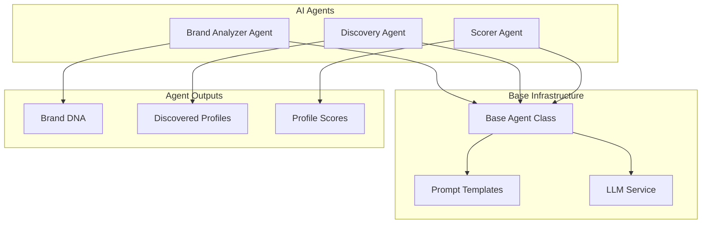

# EPIC-5: AI Agents Implementation

## Overview

**Goal:** Implement the three core AI agents: Brand Analyzer, Discovery Agent, and Scorer Agent using LangChain with multi-provider support.

**Duration:** 3-4 days  
**Dependencies:** EPIC-1, EPIC-2, EPIC-3, EPIC-4  
**Deliverables:** Three fully functional AI agents with tests and prompts

---

## Environment Variables Required

```bash
# LLM Configuration (from EPIC-4)
LLM_PROVIDER=openai
OPENAI_API_KEY=sk-...
GOOGLE_API_KEY=AIza...

# Agent Configuration
AGENT_MAX_RETRIES=3
AGENT_TIMEOUT=60
BRAND_ANALYZER_MODEL=gpt-4o-mini
SCORER_MODEL=gpt-4o-mini
DISCOVERY_MODEL=gpt-4o-mini
```

---

## Agent Architecture



---

## FEATURE-5.1: Base Agent Infrastructure

### STORY-5.1.1: Implement Base Agent Class

**As a** developer  
**I want** a base agent class with common functionality  
**So that** all agents share consistent behavior

#### TASK-5.1.1.1: Write Base Agent Tests (TDD)

**Priority:** P0 (Critical)  
**Estimated Time:** 2 hours

##### SUB-TASK-5.1.1.1.1: Write Base Agent Tests

**File:** `backend/tests/unit/test_base_agent.py`

```python
"""
Unit tests for base agent class.
TDD: Write these tests FIRST, then implement base_agent.py
"""
import pytest
from unittest.mock import MagicMock, patch


class TestBaseAgent:
    """Test base agent functionality."""

    @pytest.fixture
    def mock_llm_service(self):
        """Create mock LLM service."""
        service = MagicMock()
        service.generate.return_value = "Generated response"
        service.generate_structured.return_value = {"key": "value"}
        return service

    def test_agent_has_name(self, mock_llm_service):
        """Agent should have a name identifier."""
        from app.agents.base_agent import BaseAgent
        
        class TestAgent(BaseAgent):
            name = "test_agent"
            
            def execute(self, **kwargs):
                return {}
        
        agent = TestAgent(mock_llm_service)
        assert agent.name == "test_agent"

    def test_agent_uses_llm_service(self, mock_llm_service):
        """Agent should use provided LLM service."""
        from app.agents.base_agent import BaseAgent
        
        class TestAgent(BaseAgent):
            name = "test_agent"
            
            def execute(self, **kwargs):
                return self._generate("test prompt")
        
        agent = TestAgent(mock_llm_service)
        result = agent.execute()
        
        mock_llm_service.generate.assert_called()

    def test_agent_logs_execution(self, mock_llm_service):
        """Agent should log start and end of execution."""
        from app.agents.base_agent import BaseAgent
        
        class TestAgent(BaseAgent):
            name = "test_agent"
            
            def execute(self, **kwargs):
                return {"result": "success"}
        
        agent = TestAgent(mock_llm_service)
        
        with patch("app.agents.base_agent.logger") as mock_logger:
            agent.run()
            
            # Should log start and completion
            assert mock_logger.info.call_count >= 2

    def test_agent_handles_errors(self, mock_llm_service):
        """Agent should handle and log errors."""
        from app.agents.base_agent import BaseAgent
        from app.core.exceptions import LLMError
        
        class FailingAgent(BaseAgent):
            name = "failing_agent"
            
            def execute(self, **kwargs):
                raise LLMError("Test error", provider="test")
        
        agent = FailingAgent(mock_llm_service)
        
        with pytest.raises(LLMError):
            agent.run()

    def test_agent_retry_on_failure(self, mock_llm_service):
        """Agent should retry on transient failures."""
        from app.agents.base_agent import BaseAgent
        
        call_count = 0
        
        class RetryAgent(BaseAgent):
            name = "retry_agent"
            max_retries = 3
            
            def execute(self, **kwargs):
                nonlocal call_count
                call_count += 1
                if call_count < 3:
                    raise Exception("Transient error")
                return {"success": True}
        
        agent = RetryAgent(mock_llm_service)
        result = agent.run()
        
        assert call_count == 3
        assert result["success"] is True


class TestPromptTemplate:
    """Test prompt template functionality."""

    def test_load_prompt_template(self):
        """Should load prompt template from file."""
        from app.agents.base_agent import load_prompt
        
        # This will be mocked in actual test
        with patch("builtins.open", MagicMock()):
            with patch("app.agents.base_agent.Path.read_text") as mock_read:
                mock_read.return_value = "System: {role}\nUser: {query}"
                
                prompt = load_prompt("test_prompt")
                assert prompt is not None

    def test_format_prompt(self):
        """Should format prompt with variables."""
        from app.agents.base_agent import format_prompt
        
        template = "Analyze this brand: {brand_name}"
        result = format_prompt(template, brand_name="TestBrand")
        
        assert result == "Analyze this brand: TestBrand"

    def test_format_prompt_missing_variable(self):
        """Should raise on missing variable."""
        from app.agents.base_agent import format_prompt
        
        template = "Hello {name}, welcome to {place}"
        
        with pytest.raises(KeyError):
            format_prompt(template, name="User")  # Missing 'place'
```

##### SUB-TASK-5.1.1.1.2: Implement Base Agent

**File:** `backend/app/agents/base_agent.py`

```python
"""
Base agent class for AI agents.
Provides common functionality for all agents.
"""
from abc import ABC, abstractmethod
from pathlib import Path
from typing import Any, Dict, Optional, Type, TypeVar

from tenacity import (
    retry,
    stop_after_attempt,
    wait_exponential,
    retry_if_exception_type
)

from app.core.exceptions import LLMError
from app.core.logging import get_logger
from app.services.llm_service import LLMService

logger = get_logger(__name__)

T = TypeVar("T", bound=Dict[str, Any])

# Prompt templates directory
PROMPTS_DIR = Path(__file__).parent / "prompts"


def load_prompt(prompt_name: str) -> str:
    """
    Load a prompt template from file.
    
    Args:
        prompt_name: Name of the prompt file (without extension)
        
    Returns:
        Prompt template string
    """
    prompt_path = PROMPTS_DIR / f"{prompt_name}.txt"
    
    if not prompt_path.exists():
        # Try .md extension
        prompt_path = PROMPTS_DIR / f"{prompt_name}.md"
    
    if not prompt_path.exists():
        raise FileNotFoundError(f"Prompt template not found: {prompt_name}")
    
    return prompt_path.read_text()


def format_prompt(template: str, **kwargs) -> str:
    """
    Format a prompt template with variables.
    
    Args:
        template: Prompt template with {variable} placeholders
        **kwargs: Variables to substitute
        
    Returns:
        Formatted prompt string
    """
    return template.format(**kwargs)


class BaseAgent(ABC):
    """
    Abstract base class for AI agents.
    
    Subclasses must implement:
    - name: Agent identifier
    - execute(): Main agent logic
    """
    
    name: str = "base_agent"
    max_retries: int = 3
    
    def __init__(
        self,
        llm_service: Optional[LLMService] = None,
        **config
    ):
        """
        Initialize agent.
        
        Args:
            llm_service: LLM service instance
            **config: Additional configuration
        """
        self._llm = llm_service or LLMService()
        self._config = config
    
    @abstractmethod
    def execute(self, **kwargs) -> Dict[str, Any]:
        """
        Execute the agent's main logic.
        
        Must be implemented by subclasses.
        
        Args:
            **kwargs: Agent-specific inputs
            
        Returns:
            Agent output dictionary
        """
        pass
    
    def run(self, **kwargs) -> Dict[str, Any]:
        """
        Run the agent with retry logic.
        
        Args:
            **kwargs: Arguments to pass to execute()
            
        Returns:
            Agent output
        """
        logger.info(f"Starting agent: {self.name}", **kwargs)
        
        try:
            result = self._execute_with_retry(**kwargs)
            logger.info(f"Agent completed: {self.name}")
            return result
        except Exception as e:
            logger.error(f"Agent failed: {self.name}", error=str(e))
            raise
    
    @retry(
        stop=stop_after_attempt(3),
        wait=wait_exponential(multiplier=1, min=1, max=10),
        retry=retry_if_exception_type((LLMError,))
    )
    def _execute_with_retry(self, **kwargs) -> Dict[str, Any]:
        """Execute with retry on transient errors."""
        return self.execute(**kwargs)
    
    def _generate(
        self,
        prompt: str,
        system_prompt: Optional[str] = None,
        temperature: float = 0.7,
        max_tokens: int = 1000
    ) -> str:
        """
        Generate text using LLM.
        
        Args:
            prompt: User prompt
            system_prompt: Optional system instruction
            temperature: Creativity parameter
            max_tokens: Maximum output length
            
        Returns:
            Generated text
        """
        return self._llm.generate(
            prompt,
            system_prompt=system_prompt,
            temperature=temperature,
            max_tokens=max_tokens
        )
    
    def _generate_structured(
        self,
        prompt: str,
        schema: Dict[str, Any],
        system_prompt: Optional[str] = None
    ) -> Dict[str, Any]:
        """
        Generate structured JSON output.
        
        Args:
            prompt: User prompt
            schema: Expected JSON schema
            system_prompt: Optional system instruction
            
        Returns:
            Parsed JSON response
        """
        return self._llm.generate_structured(
            prompt,
            schema=schema,
            system_prompt=system_prompt
        )
    
    def _embed(self, text: str) -> list:
        """
        Generate embedding for text.
        
        Args:
            text: Text to embed
            
        Returns:
            Embedding vector
        """
        return self._llm.embed(text)
    
    def _load_prompt(self, prompt_name: str) -> str:
        """Load prompt template."""
        return load_prompt(prompt_name)
    
    def _format_prompt(self, template: str, **kwargs) -> str:
        """Format prompt with variables."""
        return format_prompt(template, **kwargs)
```

---

## FEATURE-5.2: Brand Analyzer Agent

### STORY-5.2.1: Implement Brand Analyzer

**As a** user  
**I want** to analyze reference profiles to extract brand DNA  
**So that** I can find similar influencers

#### TASK-5.2.1.1: Write Brand Analyzer Tests (TDD)

**Priority:** P0 (Critical)  
**Estimated Time:** 3 hours

##### SUB-TASK-5.2.1.1.1: Write Brand Analyzer Tests

**File:** `backend/tests/unit/test_brand_analyzer.py`

```python
"""
Unit tests for Brand Analyzer agent.
"""
import pytest
from unittest.mock import MagicMock, patch


class TestBrandAnalyzer:
    """Test Brand Analyzer agent."""

    @pytest.fixture
    def mock_llm(self):
        """Create mock LLM service."""
        llm = MagicMock()
        llm.generate_structured.return_value = {
            "hashtags": ["fashion", "style", "ootd"],
            "keywords": ["trendy", "sustainable", "minimalist"],
            "tone": "casual and aspirational",
            "target_audience": "millennials interested in fashion",
            "content_themes": ["outfit ideas", "styling tips"],
            "brand_values": ["sustainability", "quality"]
        }
        llm.embed.return_value = [0.1, 0.2, 0.3] * 512
        return llm

    @pytest.fixture
    def mock_apify(self):
        """Create mock Apify service."""
        apify = MagicMock()
        apify.scrape_profile.return_value = {
            "username": "testbrand",
            "bio": "Sustainable fashion brand #fashion #eco",
            "follower_count": 50000,
            "post_count": 200
        }
        return apify

    @pytest.fixture
    def agent(self, mock_llm, mock_apify):
        """Create Brand Analyzer with mocks."""
        from app.agents.brand_analyzer import BrandAnalyzerAgent
        
        return BrandAnalyzerAgent(
            llm_service=mock_llm,
            apify_service=mock_apify
        )

    def test_agent_has_correct_name(self, agent):
        """Agent should have correct name."""
        assert agent.name == "brand_analyzer"

    def test_extracts_hashtags(self, agent, mock_llm):
        """Should extract relevant hashtags."""
        result = agent.execute(
            reference_profiles=["testbrand"]
        )
        
        assert "hashtags" in result
        assert len(result["hashtags"]) > 0

    def test_extracts_keywords(self, agent):
        """Should extract brand keywords."""
        result = agent.execute(
            reference_profiles=["testbrand"]
        )
        
        assert "keywords" in result
        assert len(result["keywords"]) > 0

    def test_generates_embedding(self, agent, mock_llm):
        """Should generate brand embedding."""
        result = agent.execute(
            reference_profiles=["testbrand"]
        )
        
        assert "embedding" in result
        assert len(result["embedding"]) > 0
        mock_llm.embed.assert_called()

    def test_handles_multiple_profiles(self, agent):
        """Should handle multiple reference profiles."""
        result = agent.execute(
            reference_profiles=["brand1", "brand2", "brand3"]
        )
        
        assert result is not None
        # Should aggregate data from all profiles

    def test_returns_analysis_object(self, agent):
        """Should return full analysis object."""
        result = agent.execute(
            reference_profiles=["testbrand"]
        )
        
        assert "hashtags" in result
        assert "keywords" in result
        assert "tone" in result
        assert "target_audience" in result
        assert "embedding" in result

    def test_handles_scraping_failure(self, agent, mock_apify):
        """Should handle profile scraping failures."""
        from app.core.exceptions import ApifyError
        
        mock_apify.scrape_profile.side_effect = ApifyError("Scraping failed")
        
        with pytest.raises(ApifyError):
            agent.execute(reference_profiles=["invalid"])


class TestBrandAnalyzerPrompts:
    """Test Brand Analyzer prompts."""

    def test_system_prompt_loaded(self):
        """System prompt should be loaded correctly."""
        from app.agents.prompts.brand_analyzer import SYSTEM_PROMPT
        
        assert SYSTEM_PROMPT is not None
        assert len(SYSTEM_PROMPT) > 100

    def test_analysis_prompt_has_placeholders(self):
        """Analysis prompt should have required placeholders."""
        from app.agents.prompts.brand_analyzer import ANALYSIS_PROMPT
        
        assert "{profiles_data}" in ANALYSIS_PROMPT
```

##### SUB-TASK-5.2.1.1.2: Create Brand Analyzer Prompts

**File:** `backend/app/agents/prompts/brand_analyzer.py`

```python
"""
Prompts for Brand Analyzer agent.
"""

SYSTEM_PROMPT = """You are an expert brand analyst specializing in Instagram marketing and influencer identification.

Your task is to analyze Instagram profiles and extract the brand's DNA - the core characteristics that define their identity, audience, and content style.

You must:
1. Identify the key hashtags that represent the brand
2. Extract keywords that capture the brand's essence
3. Understand the tone and voice used in content
4. Identify the target audience demographics and interests
5. List the main content themes and topics
6. Determine the brand's core values

Be specific and accurate. Base your analysis only on the provided data.
Output your analysis in valid JSON format."""

ANALYSIS_PROMPT = """Analyze the following Instagram profile(s) and extract the brand DNA.

Profile Data:
{profiles_data}

Based on this data, provide a comprehensive brand analysis including:
1. Top 10 most relevant hashtags (that similar influencers might use)
2. 10 keywords that define the brand's identity
3. The brand's tone of voice (formal/casual, aspirational/relatable, etc.)
4. Target audience description
5. Main content themes (3-5 themes)
6. Core brand values (3-5 values)
7. Content style characteristics

Output your analysis as JSON with this structure:
{{
    "hashtags": ["hashtag1", "hashtag2", ...],
    "keywords": ["keyword1", "keyword2", ...],
    "tone": "description of tone and voice",
    "target_audience": "description of target audience",
    "content_themes": ["theme1", "theme2", ...],
    "brand_values": ["value1", "value2", ...],
    "content_style": "description of content style",
    "competitors": ["potential_competitor1", "potential_competitor2", ...]
}}"""

EMBEDDING_PROMPT = """Create a text summary of this brand for embedding purposes:

Brand: {brand_name}
Keywords: {keywords}
Themes: {themes}
Audience: {audience}
Values: {values}

Write a concise paragraph (2-3 sentences) that captures the essence of this brand for similarity matching."""

ANALYSIS_SCHEMA = {
    "type": "object",
    "properties": {
        "hashtags": {
            "type": "array",
            "items": {"type": "string"},
            "description": "Relevant hashtags for the brand"
        },
        "keywords": {
            "type": "array",
            "items": {"type": "string"},
            "description": "Keywords defining the brand"
        },
        "tone": {
            "type": "string",
            "description": "Brand's tone of voice"
        },
        "target_audience": {
            "type": "string",
            "description": "Target audience description"
        },
        "content_themes": {
            "type": "array",
            "items": {"type": "string"},
            "description": "Main content themes"
        },
        "brand_values": {
            "type": "array",
            "items": {"type": "string"},
            "description": "Core brand values"
        },
        "content_style": {
            "type": "string",
            "description": "Content style description"
        },
        "competitors": {
            "type": "array",
            "items": {"type": "string"},
            "description": "Potential competitor accounts"
        }
    },
    "required": ["hashtags", "keywords", "tone", "target_audience"]
}
```

##### SUB-TASK-5.2.1.1.3: Implement Brand Analyzer Agent

**File:** `backend/app/agents/brand_analyzer.py`

```python
"""
Brand Analyzer Agent.
Extracts brand DNA from reference Instagram profiles.
"""
import json
from typing import Any, Dict, List, Optional

from app.agents.base_agent import BaseAgent
from app.agents.prompts.brand_analyzer import (
    SYSTEM_PROMPT,
    ANALYSIS_PROMPT,
    EMBEDDING_PROMPT,
    ANALYSIS_SCHEMA
)
from app.core.logging import get_logger
from app.services.apify_service import ApifyService
from app.services.llm_service import LLMService

logger = get_logger(__name__)


class BrandAnalyzerAgent(BaseAgent):
    """
    Agent for analyzing brand profiles and extracting DNA.
    
    Takes reference Instagram profiles and extracts:
    - Relevant hashtags
    - Brand keywords
    - Tone and voice
    - Target audience
    - Content themes
    - Brand values
    - Embedding vector for similarity matching
    """
    
    name = "brand_analyzer"
    
    def __init__(
        self,
        llm_service: Optional[LLMService] = None,
        apify_service: Optional[ApifyService] = None,
        **config
    ):
        """
        Initialize Brand Analyzer.
        
        Args:
            llm_service: LLM service instance
            apify_service: Apify service for scraping
            **config: Additional configuration
        """
        super().__init__(llm_service, **config)
        self._apify = apify_service or ApifyService()
    
    def execute(
        self,
        reference_profiles: List[str],
        include_embedding: bool = True
    ) -> Dict[str, Any]:
        """
        Analyze reference profiles and extract brand DNA.
        
        Args:
            reference_profiles: List of Instagram usernames/URLs
            include_embedding: Whether to generate embedding vector
            
        Returns:
            Brand DNA dictionary with hashtags, keywords, etc.
        """
        logger.info(
            "Analyzing brand profiles",
            profile_count=len(reference_profiles)
        )
        
        # Step 1: Scrape profile data
        profiles_data = self._scrape_profiles(reference_profiles)
        
        # Step 2: Analyze with LLM
        analysis = self._analyze_profiles(profiles_data)
        
        # Step 3: Generate embedding (optional)
        if include_embedding:
            embedding = self._generate_embedding(analysis)
            analysis["embedding"] = embedding
        
        logger.info(
            "Brand analysis complete",
            hashtag_count=len(analysis.get("hashtags", [])),
            keyword_count=len(analysis.get("keywords", []))
        )
        
        return analysis
    
    def _scrape_profiles(
        self,
        profiles: List[str]
    ) -> List[Dict[str, Any]]:
        """
        Scrape data from reference profiles.
        
        Args:
            profiles: List of usernames or URLs
            
        Returns:
            List of profile data dictionaries
        """
        scraped = []
        
        for profile in profiles:
            # Extract username from URL if needed
            username = self._extract_username(profile)
            
            try:
                data = self._apify.scrape_profile(username, include_posts=True)
                scraped.append(data)
                logger.debug(f"Scraped profile: {username}")
            except Exception as e:
                logger.warning(f"Failed to scrape {username}: {e}")
                raise
        
        return scraped
    
    def _analyze_profiles(
        self,
        profiles_data: List[Dict[str, Any]]
    ) -> Dict[str, Any]:
        """
        Analyze scraped profiles with LLM.
        
        Args:
            profiles_data: Scraped profile data
            
        Returns:
            Analysis results
        """
        # Format profile data for prompt
        formatted_data = self._format_profiles_for_prompt(profiles_data)
        
        # Create analysis prompt
        prompt = self._format_prompt(
            ANALYSIS_PROMPT,
            profiles_data=formatted_data
        )
        
        # Generate analysis
        analysis = self._generate_structured(
            prompt,
            schema=ANALYSIS_SCHEMA,
            system_prompt=SYSTEM_PROMPT
        )
        
        return analysis
    
    def _generate_embedding(
        self,
        analysis: Dict[str, Any]
    ) -> List[float]:
        """
        Generate embedding vector for brand.
        
        Args:
            analysis: Brand analysis results
            
        Returns:
            Embedding vector
        """
        # Create summary text for embedding
        summary_prompt = self._format_prompt(
            EMBEDDING_PROMPT,
            brand_name="Reference Brand",
            keywords=", ".join(analysis.get("keywords", [])[:5]),
            themes=", ".join(analysis.get("content_themes", [])[:3]),
            audience=analysis.get("target_audience", ""),
            values=", ".join(analysis.get("brand_values", [])[:3])
        )
        
        # Generate summary
        summary = self._generate(summary_prompt, temperature=0.3)
        
        # Generate embedding
        return self._embed(summary)
    
    def _format_profiles_for_prompt(
        self,
        profiles_data: List[Dict[str, Any]]
    ) -> str:
        """
        Format profile data for LLM prompt.
        
        Args:
            profiles_data: List of profile data
            
        Returns:
            Formatted string
        """
        formatted = []
        
        for i, profile in enumerate(profiles_data, 1):
            entry = f"""
Profile {i}:
- Username: {profile.get('username', 'Unknown')}
- Display Name: {profile.get('display_name', 'N/A')}
- Bio: {profile.get('bio', 'No bio')}
- Followers: {profile.get('follower_count', 0):,}
- Following: {profile.get('following_count', 0):,}
- Posts: {profile.get('post_count', 0):,}
- Verified: {profile.get('is_verified', False)}
- Business Account: {profile.get('is_business', False)}
"""
            formatted.append(entry)
        
        return "\n".join(formatted)
    
    def _extract_username(self, profile: str) -> str:
        """
        Extract username from profile URL or return as-is.
        
        Args:
            profile: Username or Instagram URL
            
        Returns:
            Clean username
        """
        # Remove URL prefix if present
        if "instagram.com" in profile:
            parts = profile.rstrip("/").split("/")
            return parts[-1]
        
        # Remove @ if present
        return profile.lstrip("@")


def get_brand_analyzer_agent() -> BrandAnalyzerAgent:
    """Get Brand Analyzer agent instance."""
    return BrandAnalyzerAgent()
```

---

## FEATURE-5.3: Scorer Agent

### STORY-5.3.1: Implement Profile Scorer

**As a** user  
**I want** discovered profiles scored against my brand  
**So that** I can prioritize the best matches

#### TASK-5.3.1.1: Write Scorer Agent Tests (TDD)

**Priority:** P0 (Critical)  
**Estimated Time:** 3 hours

##### SUB-TASK-5.3.1.1.1: Write Scorer Agent Tests

**File:** `backend/tests/unit/test_scorer_agent.py`

```python
"""
Unit tests for Scorer Agent.
"""
import pytest
from unittest.mock import MagicMock


class TestScorerAgent:
    """Test Scorer Agent."""

    @pytest.fixture
    def mock_llm(self):
        """Create mock LLM service."""
        llm = MagicMock()
        llm.generate_structured.return_value = {
            "overall_score": 85,
            "category_scores": {
                "brand_alignment": 90,
                "audience_fit": 80,
                "engagement_quality": 85,
                "content_quality": 82,
                "partnership_potential": 88
            },
            "reasoning": "Strong alignment with brand values...",
            "strengths": ["High engagement", "Quality content"],
            "concerns": ["Limited post frequency"],
            "email": "creator@example.com"
        }
        return llm

    @pytest.fixture
    def agent(self, mock_llm):
        """Create Scorer agent with mock."""
        from app.agents.scorer_agent import ScorerAgent
        
        return ScorerAgent(llm_service=mock_llm)

    def test_agent_has_correct_name(self, agent):
        """Agent should have correct name."""
        assert agent.name == "scorer"

    def test_returns_overall_score(self, agent):
        """Should return overall score 0-100."""
        result = agent.execute(
            profile={
                "username": "testinfluencer",
                "bio": "Fashion blogger",
                "follower_count": 50000
            },
            brand_dna={
                "hashtags": ["fashion"],
                "keywords": ["style"]
            }
        )
        
        assert "overall_score" in result
        assert 0 <= result["overall_score"] <= 100

    def test_returns_category_scores(self, agent):
        """Should return category breakdown."""
        result = agent.execute(
            profile={"username": "test"},
            brand_dna={"hashtags": []}
        )
        
        assert "category_scores" in result
        assert "brand_alignment" in result["category_scores"]

    def test_returns_reasoning(self, agent):
        """Should explain the score."""
        result = agent.execute(
            profile={"username": "test"},
            brand_dna={"hashtags": []}
        )
        
        assert "reasoning" in result
        assert len(result["reasoning"]) > 0

    def test_extracts_email_from_bio(self, agent):
        """Should extract email if present."""
        result = agent.execute(
            profile={
                "username": "test",
                "bio": "Contact: test@example.com"
            },
            brand_dna={}
        )
        
        assert "email" in result

    def test_handles_missing_profile_data(self, agent):
        """Should handle minimal profile data."""
        result = agent.execute(
            profile={"username": "minimal"},
            brand_dna={}
        )
        
        assert result is not None
        assert "overall_score" in result


class TestScorerCategoryWeights:
    """Test scoring category weights."""

    def test_default_weights(self):
        """Should have default category weights."""
        from app.agents.scorer_agent import DEFAULT_WEIGHTS
        
        assert "brand_alignment" in DEFAULT_WEIGHTS
        assert sum(DEFAULT_WEIGHTS.values()) == 1.0

    def test_custom_weights(self):
        """Should accept custom weights."""
        from app.agents.scorer_agent import ScorerAgent
        
        custom_weights = {
            "brand_alignment": 0.5,
            "audience_fit": 0.3,
            "engagement_quality": 0.2
        }
        
        agent = ScorerAgent(weights=custom_weights)
        assert agent.weights == custom_weights
```

##### SUB-TASK-5.3.1.1.2: Create Scorer Prompts

**File:** `backend/app/agents/prompts/scorer.py`

```python
"""
Prompts for Scorer Agent.
"""

SYSTEM_PROMPT = """You are an expert influencer marketing analyst. Your task is to evaluate Instagram profiles for brand partnership potential.

You must score profiles across multiple dimensions:
1. Brand Alignment (0-100): How well does the influencer's content align with the brand's identity?
2. Audience Fit (0-100): Does the influencer's audience match the brand's target demographic?
3. Engagement Quality (0-100): Is the engagement authentic and meaningful?
4. Content Quality (0-100): Is the content professional, creative, and on-brand?
5. Partnership Potential (0-100): Overall suitability for brand partnership.

Be objective and base your analysis on the provided data. Extract any contact email if visible.
Output your analysis in valid JSON format."""

SCORING_PROMPT = """Score this influencer profile for partnership with the brand.

BRAND DNA:
{brand_dna}

PROFILE TO SCORE:
{profile_data}

Evaluate this profile and provide:
1. Overall score (0-100)
2. Category scores:
   - brand_alignment: How well content matches brand identity
   - audience_fit: Audience demographic match
   - engagement_quality: Quality and authenticity of engagement
   - content_quality: Visual and creative quality
   - partnership_potential: Overall fit for partnership
3. Detailed reasoning explaining the score
4. Key strengths (list)
5. Potential concerns (list)
6. Contact email if found in bio or profile

Output as JSON:
{{
    "overall_score": 85,
    "category_scores": {{
        "brand_alignment": 90,
        "audience_fit": 80,
        "engagement_quality": 85,
        "content_quality": 82,
        "partnership_potential": 88
    }},
    "reasoning": "Detailed explanation...",
    "strengths": ["strength1", "strength2"],
    "concerns": ["concern1"],
    "email": "email@example.com or null"
}}"""

SCORING_SCHEMA = {
    "type": "object",
    "properties": {
        "overall_score": {
            "type": "integer",
            "minimum": 0,
            "maximum": 100,
            "description": "Overall partnership score"
        },
        "category_scores": {
            "type": "object",
            "properties": {
                "brand_alignment": {"type": "integer", "minimum": 0, "maximum": 100},
                "audience_fit": {"type": "integer", "minimum": 0, "maximum": 100},
                "engagement_quality": {"type": "integer", "minimum": 0, "maximum": 100},
                "content_quality": {"type": "integer", "minimum": 0, "maximum": 100},
                "partnership_potential": {"type": "integer", "minimum": 0, "maximum": 100}
            },
            "required": ["brand_alignment", "audience_fit", "engagement_quality"]
        },
        "reasoning": {
            "type": "string",
            "description": "Detailed explanation of score"
        },
        "strengths": {
            "type": "array",
            "items": {"type": "string"},
            "description": "Key strengths"
        },
        "concerns": {
            "type": "array",
            "items": {"type": "string"},
            "description": "Potential concerns"
        },
        "email": {
            "type": ["string", "null"],
            "description": "Contact email if found"
        }
    },
    "required": ["overall_score", "category_scores", "reasoning"]
}
```

##### SUB-TASK-5.3.1.1.3: Implement Scorer Agent

**File:** `backend/app/agents/scorer_agent.py`

```python
"""
Scorer Agent for evaluating discovered profiles.
"""
import re
from typing import Any, Dict, List, Optional

from app.agents.base_agent import BaseAgent
from app.agents.prompts.scorer import (
    SYSTEM_PROMPT,
    SCORING_PROMPT,
    SCORING_SCHEMA
)
from app.core.logging import get_logger
from app.services.llm_service import LLMService

logger = get_logger(__name__)

# Default category weights for overall score
DEFAULT_WEIGHTS = {
    "brand_alignment": 0.25,
    "audience_fit": 0.20,
    "engagement_quality": 0.20,
    "content_quality": 0.15,
    "partnership_potential": 0.20
}


class ScorerAgent(BaseAgent):
    """
    Agent for scoring discovered profiles against brand DNA.
    
    Evaluates profiles across multiple dimensions:
    - Brand alignment
    - Audience fit
    - Engagement quality
    - Content quality
    - Partnership potential
    
    Also extracts contact email if found.
    """
    
    name = "scorer"
    
    def __init__(
        self,
        llm_service: Optional[LLMService] = None,
        weights: Optional[Dict[str, float]] = None,
        **config
    ):
        """
        Initialize Scorer Agent.
        
        Args:
            llm_service: LLM service instance
            weights: Custom category weights
            **config: Additional configuration
        """
        super().__init__(llm_service, **config)
        self.weights = weights or DEFAULT_WEIGHTS
    
    def execute(
        self,
        profile: Dict[str, Any],
        brand_dna: Dict[str, Any]
    ) -> Dict[str, Any]:
        """
        Score a profile against brand DNA.
        
        Args:
            profile: Profile data to score
            brand_dna: Brand DNA from analyzer
            
        Returns:
            Score results with reasoning
        """
        logger.info(
            "Scoring profile",
            username=profile.get("username")
        )
        
        # Format data for prompt
        profile_str = self._format_profile(profile)
        dna_str = self._format_brand_dna(brand_dna)
        
        # Create prompt
        prompt = self._format_prompt(
            SCORING_PROMPT,
            brand_dna=dna_str,
            profile_data=profile_str
        )
        
        # Generate score
        result = self._generate_structured(
            prompt,
            schema=SCORING_SCHEMA,
            system_prompt=SYSTEM_PROMPT
        )
        
        # Try to extract email if not found by LLM
        if not result.get("email"):
            result["email"] = self._extract_email(profile.get("bio", ""))
        
        # Calculate weighted overall if needed
        if "category_scores" in result:
            result["weighted_score"] = self._calculate_weighted_score(
                result["category_scores"]
            )
        
        logger.info(
            "Profile scored",
            username=profile.get("username"),
            score=result.get("overall_score")
        )
        
        return result
    
    def score_batch(
        self,
        profiles: List[Dict[str, Any]],
        brand_dna: Dict[str, Any]
    ) -> List[Dict[str, Any]]:
        """
        Score multiple profiles.
        
        Args:
            profiles: List of profile data
            brand_dna: Brand DNA
            
        Returns:
            List of score results
        """
        results = []
        
        for profile in profiles:
            try:
                score = self.execute(profile, brand_dna)
                score["profile_id"] = profile.get("id")
                score["username"] = profile.get("username")
                results.append(score)
            except Exception as e:
                logger.error(
                    f"Failed to score {profile.get('username')}: {e}"
                )
                results.append({
                    "profile_id": profile.get("id"),
                    "username": profile.get("username"),
                    "error": str(e)
                })
        
        return results
    
    def _format_profile(self, profile: Dict[str, Any]) -> str:
        """Format profile data for prompt."""
        engagement_rate = profile.get("engagement_rate")
        if engagement_rate is None:
            followers = profile.get("follower_count", 0)
            avg_likes = profile.get("avg_likes", 0)
            if followers > 0:
                engagement_rate = (avg_likes / followers) * 100
        
        return f"""
Username: {profile.get('username', 'Unknown')}
Display Name: {profile.get('display_name', 'N/A')}
Bio: {profile.get('bio', 'No bio')}
Followers: {profile.get('follower_count', 0):,}
Following: {profile.get('following_count', 0):,}
Posts: {profile.get('post_count', 0):,}
Engagement Rate: {engagement_rate:.2f}% if engagement_rate else 'Unknown'
Verified: {profile.get('is_verified', False)}
Business Account: {profile.get('is_business', False)}
Profile URL: {profile.get('profile_url', '')}
"""
    
    def _format_brand_dna(self, brand_dna: Dict[str, Any]) -> str:
        """Format brand DNA for prompt."""
        return f"""
Hashtags: {', '.join(brand_dna.get('hashtags', [])[:10])}
Keywords: {', '.join(brand_dna.get('keywords', [])[:10])}
Tone: {brand_dna.get('tone', 'Not specified')}
Target Audience: {brand_dna.get('target_audience', 'Not specified')}
Content Themes: {', '.join(brand_dna.get('content_themes', [])[:5])}
Brand Values: {', '.join(brand_dna.get('brand_values', [])[:5])}
"""
    
    def _calculate_weighted_score(
        self,
        category_scores: Dict[str, int]
    ) -> float:
        """
        Calculate weighted overall score.
        
        Args:
            category_scores: Individual category scores
            
        Returns:
            Weighted overall score
        """
        total = 0.0
        weight_sum = 0.0
        
        for category, weight in self.weights.items():
            if category in category_scores:
                total += category_scores[category] * weight
                weight_sum += weight
        
        if weight_sum > 0:
            return round(total / weight_sum, 1)
        return 0.0
    
    def _extract_email(self, text: str) -> Optional[str]:
        """
        Extract email from text using regex.
        
        Args:
            text: Text to search
            
        Returns:
            Email if found, None otherwise
        """
        if not text:
            return None
        
        pattern = r'[a-zA-Z0-9._%+-]+@[a-zA-Z0-9.-]+\.[a-zA-Z]{2,}'
        match = re.search(pattern, text)
        
        return match.group(0) if match else None


def get_scorer_agent() -> ScorerAgent:
    """Get Scorer agent instance."""
    return ScorerAgent()
```

---

## FEATURE-5.4: Discovery Agent

### STORY-5.4.1: Implement Discovery Agent

**As a** user  
**I want** to discover similar profiles based on brand DNA  
**So that** I can find potential partners

#### TASK-5.4.1.1: Write Discovery Agent Tests (TDD)

**Priority:** P0 (Critical)  
**Estimated Time:** 2 hours

##### SUB-TASK-5.4.1.1.1: Write Discovery Agent Tests

**File:** `backend/tests/unit/test_discovery_agent.py`

```python
"""
Unit tests for Discovery Agent.
"""
import pytest
from unittest.mock import MagicMock


class TestDiscoveryAgent:
    """Test Discovery Agent."""

    @pytest.fixture
    def mock_llm(self):
        """Create mock LLM service."""
        llm = MagicMock()
        llm.generate_structured.return_value = {
            "search_queries": [
                {"hashtag": "fashion", "expected_relevance": 0.9},
                {"hashtag": "style", "expected_relevance": 0.8}
            ],
            "profile_suggestions": ["influencer1", "influencer2"]
        }
        return llm

    @pytest.fixture
    def mock_apify(self):
        """Create mock Apify service."""
        apify = MagicMock()
        apify.scrape_hashtag.return_value = [
            {"ownerUsername": "user1", "likesCount": 500},
            {"ownerUsername": "user2", "likesCount": 300}
        ]
        apify.scrape_profile.return_value = {
            "username": "user1",
            "follower_count": 50000
        }
        return apify

    @pytest.fixture
    def agent(self, mock_llm, mock_apify):
        """Create Discovery agent."""
        from app.agents.discovery_agent import DiscoveryAgent
        
        return DiscoveryAgent(
            llm_service=mock_llm,
            apify_service=mock_apify
        )

    def test_agent_has_correct_name(self, agent):
        """Agent should have correct name."""
        assert agent.name == "discovery"

    def test_generates_search_queries(self, agent, mock_llm):
        """Should generate search queries from brand DNA."""
        result = agent.execute(
            brand_dna={"hashtags": ["fashion"]},
            limit=20
        )
        
        mock_llm.generate_structured.assert_called()

    def test_returns_discovered_profiles(self, agent):
        """Should return discovered profiles."""
        result = agent.execute(
            brand_dna={"hashtags": ["fashion"]},
            limit=10
        )
        
        assert "profiles" in result
        assert len(result["profiles"]) > 0

    def test_deduplicates_profiles(self, agent, mock_apify):
        """Should remove duplicate usernames."""
        # Setup to return duplicates
        mock_apify.scrape_hashtag.return_value = [
            {"ownerUsername": "user1"},
            {"ownerUsername": "user1"},  # Duplicate
            {"ownerUsername": "user2"}
        ]
        
        result = agent.execute(
            brand_dna={"hashtags": ["fashion"]},
            limit=10
        )
        
        usernames = [p["username"] for p in result["profiles"]]
        assert len(usernames) == len(set(usernames))

    def test_respects_limit(self, agent):
        """Should respect the limit parameter."""
        result = agent.execute(
            brand_dna={"hashtags": ["fashion"]},
            limit=5
        )
        
        assert len(result["profiles"]) <= 5


class TestDiscoverySearchQueries:
    """Test search query generation."""

    def test_uses_hashtags_from_dna(self):
        """Should use hashtags from brand DNA."""
        pass

    def test_expands_related_hashtags(self):
        """Should suggest related hashtags."""
        pass
```

##### SUB-TASK-5.4.1.1.2: Create Discovery Prompts

**File:** `backend/app/agents/prompts/discovery.py`

```python
"""
Prompts for Discovery Agent.
"""

SYSTEM_PROMPT = """You are an expert at discovering Instagram influencers and creators.

Given a brand's DNA (hashtags, keywords, themes), you must:
1. Generate effective search queries to find similar accounts
2. Suggest related hashtags that similar influencers might use
3. Recommend specific accounts to explore

Focus on finding creators who would be authentic partners for the brand."""

QUERY_GENERATION_PROMPT = """Based on this brand DNA, generate search queries to discover similar influencers.

BRAND DNA:
Hashtags: {hashtags}
Keywords: {keywords}
Themes: {themes}
Target Audience: {target_audience}

Generate:
1. 10 hashtags to search for related content
2. 5 suggested accounts to explore (if you know any)
3. 3 niche communities or topics to search

Output as JSON:
{{
    "search_queries": [
        {{"hashtag": "hashtag1", "expected_relevance": 0.9}},
        {{"hashtag": "hashtag2", "expected_relevance": 0.8}}
    ],
    "suggested_accounts": ["account1", "account2"],
    "niche_topics": ["topic1", "topic2"]
}}"""

QUERY_SCHEMA = {
    "type": "object",
    "properties": {
        "search_queries": {
            "type": "array",
            "items": {
                "type": "object",
                "properties": {
                    "hashtag": {"type": "string"},
                    "expected_relevance": {"type": "number"}
                }
            }
        },
        "suggested_accounts": {
            "type": "array",
            "items": {"type": "string"}
        },
        "niche_topics": {
            "type": "array",
            "items": {"type": "string"}
        }
    }
}
```

##### SUB-TASK-5.4.1.1.3: Implement Discovery Agent

**File:** `backend/app/agents/discovery_agent.py`

```python
"""
Discovery Agent for finding similar profiles.
"""
from typing import Any, Dict, List, Optional, Set

from app.agents.base_agent import BaseAgent
from app.agents.prompts.discovery import (
    SYSTEM_PROMPT,
    QUERY_GENERATION_PROMPT,
    QUERY_SCHEMA
)
from app.core.logging import get_logger
from app.services.apify_service import ApifyService
from app.services.llm_service import LLMService

logger = get_logger(__name__)


class DiscoveryAgent(BaseAgent):
    """
    Agent for discovering similar profiles based on brand DNA.
    
    Uses hashtag searches and similar account exploration
    to find potential partner profiles.
    """
    
    name = "discovery"
    
    def __init__(
        self,
        llm_service: Optional[LLMService] = None,
        apify_service: Optional[ApifyService] = None,
        **config
    ):
        """
        Initialize Discovery Agent.
        
        Args:
            llm_service: LLM service instance
            apify_service: Apify service for scraping
            **config: Additional configuration
        """
        super().__init__(llm_service, **config)
        self._apify = apify_service or ApifyService()
    
    def execute(
        self,
        brand_dna: Dict[str, Any],
        limit: int = 50,
        min_followers: int = 1000,
        max_followers: int = 1000000
    ) -> Dict[str, Any]:
        """
        Discover profiles similar to brand DNA.
        
        Args:
            brand_dna: Brand DNA from analyzer
            limit: Maximum profiles to discover
            min_followers: Minimum follower count
            max_followers: Maximum follower count
            
        Returns:
            Discovery results with profiles
        """
        logger.info(
            "Starting profile discovery",
            limit=limit
        )
        
        # Step 1: Generate search queries
        queries = self._generate_queries(brand_dna)
        
        # Step 2: Discover profiles via hashtag search
        discovered_usernames: Set[str] = set()
        profiles: List[Dict[str, Any]] = []
        
        for query in queries.get("search_queries", [])[:5]:
            hashtag = query.get("hashtag", "").lstrip("#")
            if not hashtag:
                continue
            
            try:
                posts = self._apify.scrape_hashtag(
                    hashtag,
                    limit=min(20, limit - len(profiles))
                )
                
                for post in posts:
                    username = post.get("ownerUsername")
                    if username and username not in discovered_usernames:
                        discovered_usernames.add(username)
                        profiles.append({
                            "username": username,
                            "source": f"#{hashtag}"
                        })
                
                if len(profiles) >= limit:
                    break
                    
            except Exception as e:
                logger.warning(f"Failed to search #{hashtag}: {e}")
        
        # Step 3: Enrich with profile details
        enriched = self._enrich_profiles(
            profiles[:limit],
            min_followers,
            max_followers
        )
        
        logger.info(
            "Discovery complete",
            found=len(profiles),
            enriched=len(enriched)
        )
        
        return {
            "profiles": enriched,
            "queries_used": queries,
            "total_found": len(profiles)
        }
    
    def _generate_queries(
        self,
        brand_dna: Dict[str, Any]
    ) -> Dict[str, Any]:
        """
        Generate search queries from brand DNA.
        
        Args:
            brand_dna: Brand DNA
            
        Returns:
            Generated queries
        """
        prompt = self._format_prompt(
            QUERY_GENERATION_PROMPT,
            hashtags=", ".join(brand_dna.get("hashtags", [])[:10]),
            keywords=", ".join(brand_dna.get("keywords", [])[:10]),
            themes=", ".join(brand_dna.get("content_themes", [])[:5]),
            target_audience=brand_dna.get("target_audience", "General")
        )
        
        return self._generate_structured(
            prompt,
            schema=QUERY_SCHEMA,
            system_prompt=SYSTEM_PROMPT
        )
    
    def _enrich_profiles(
        self,
        profiles: List[Dict[str, Any]],
        min_followers: int,
        max_followers: int
    ) -> List[Dict[str, Any]]:
        """
        Enrich profiles with full data and filter.
        
        Args:
            profiles: Basic profile list
            min_followers: Minimum followers
            max_followers: Maximum followers
            
        Returns:
            Enriched and filtered profiles
        """
        enriched = []
        
        for profile in profiles:
            try:
                data = self._apify.scrape_profile(profile["username"])
                
                followers = data.get("follower_count", 0)
                if min_followers <= followers <= max_followers:
                    data["source"] = profile.get("source")
                    enriched.append(data)
                    
            except Exception as e:
                logger.warning(
                    f"Failed to enrich {profile['username']}: {e}"
                )
        
        return enriched


def get_discovery_agent() -> DiscoveryAgent:
    """Get Discovery agent instance."""
    return DiscoveryAgent()
```

---

## VALIDATION PLAN: EPIC-5

### Validation Script

**File:** `backend/scripts/validate_epic5.py`

```python
#!/usr/bin/env python3
"""
Validation script for EPIC-5: AI Agents.
"""
import subprocess
import sys
from pathlib import Path


def run_command(cmd: list[str], description: str) -> bool:
    """Run a command and return success status."""
    print(f"\n{'='*60}")
    print(f"VALIDATION: {description}")
    print("="*60)
    
    result = subprocess.run(cmd, capture_output=False)
    return result.returncode == 0


def validate_structure() -> bool:
    """Validate agent structure."""
    required_files = [
        "app/agents/__init__.py",
        "app/agents/base_agent.py",
        "app/agents/brand_analyzer.py",
        "app/agents/scorer_agent.py",
        "app/agents/discovery_agent.py",
        "app/agents/prompts/__init__.py",
        "app/agents/prompts/brand_analyzer.py",
        "app/agents/prompts/scorer.py",
        "app/agents/prompts/discovery.py",
        "tests/unit/test_base_agent.py",
        "tests/unit/test_brand_analyzer.py",
        "tests/unit/test_scorer_agent.py",
        "tests/unit/test_discovery_agent.py",
    ]
    
    backend_dir = Path(__file__).parent.parent
    all_exist = True
    
    print("\n" + "="*60)
    print("VALIDATION: Agent Structure")
    print("="*60)
    
    for file in required_files:
        path = backend_dir / file
        exists = path.exists()
        status = "✓" if exists else "✗"
        print(f"  {status} {file}")
        if not exists:
            all_exist = False
    
    return all_exist


def main():
    """Run all validations."""
    print("\n" + "#"*60)
    print("# EPIC-5 VALIDATION: AI Agents")
    print("#"*60)
    
    results = []
    
    results.append(validate_structure())
    results.append(run_command(
        ["pytest", "tests/unit/test_base_agent.py", "-v"],
        "Base Agent Tests"
    ))
    results.append(run_command(
        ["pytest", "tests/unit/test_brand_analyzer.py", "-v"],
        "Brand Analyzer Tests"
    ))
    results.append(run_command(
        ["pytest", "tests/unit/test_scorer_agent.py", "-v"],
        "Scorer Agent Tests"
    ))
    results.append(run_command(
        ["pytest", "tests/unit/test_discovery_agent.py", "-v"],
        "Discovery Agent Tests"
    ))
    results.append(run_command(
        ["mypy", "app/agents/", "--ignore-missing-imports"],
        "Type Checking"
    ))
    
    passed = sum(results)
    total = len(results)
    
    print(f"\n{'#'*60}")
    print(f"# SUMMARY: {passed}/{total} passed")
    print(f"{'#'*60}")
    
    return 0 if all(results) else 1


if __name__ == "__main__":
    sys.exit(main())
```

---

## Definition of Done

- [ ] Base agent class implemented with retry logic
- [ ] Brand Analyzer agent implemented with prompts
- [ ] Scorer agent implemented with category scores
- [ ] Discovery agent implemented
- [ ] All agent unit tests passing
- [ ] Prompt templates created for all agents
- [ ] Type checking passing
- [ ] `validate_epic5.py` runs successfully

---

## Next EPIC

After completing EPIC-5, proceed to:
- **[06-EPIC-API-ROUTES.md](./06-EPIC-API-ROUTES.md)** - FastAPI Routes Implementation
