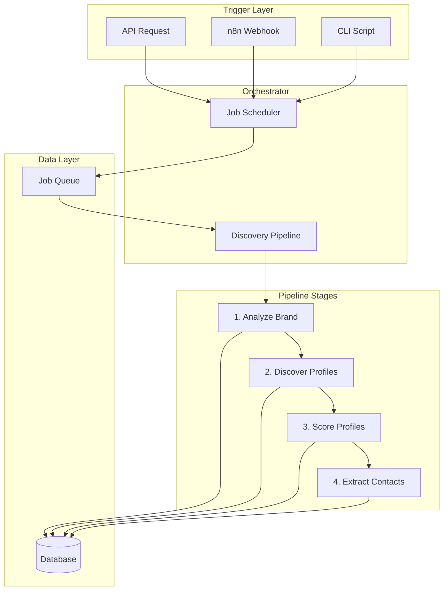

# EPIC-7: Workflow Orchestration

## Overview

**Goal:** Implement workflow orchestration using n8n for external automation and Python orchestrator for internal processing.

**Duration:** 2-3 days  
**Dependencies:** EPIC-1 through EPIC-6  
**Deliverables:** Complete discovery pipeline orchestration

---

> [!NOTE]
> **Test Data Layer Pattern**: All tests in this EPIC follow the layered format (`input → test → output`) with fixtures stored in `tests/fixtures/`. See [00-MASTER-PLAN.md](./00-MASTER-PLAN.md#test-data-layer-pattern) for details.

## Environment Variables Required

```bash
# n8n Configuration
N8N_WEBHOOK_URL=http://localhost:5678/webhook
N8N_API_KEY=your-n8n-api-key

# Orchestrator Configuration
ORCHESTRATOR_POLL_INTERVAL=5
ORCHESTRATOR_MAX_CONCURRENT_JOBS=3
ORCHESTRATOR_BATCH_SIZE=10
```

---

## Orchestration Architecture



---

## FEATURE-7.1: Discovery Pipeline

### STORY-7.1.1: Implement Pipeline Orchestrator

**As a** developer  
**I want** an automated discovery pipeline  
**So that** jobs process end-to-end without manual intervention

#### TASK-7.1.1.1: Write Pipeline Tests (TDD)

**File:** `backend/tests/unit/test_pipeline.py`

```python
"""
Unit tests for discovery pipeline.
"""
import pytest
from unittest.mock import MagicMock, patch, AsyncMock


class TestDiscoveryPipeline:
    """Test discovery pipeline orchestration."""

    @pytest.fixture
    def mock_services(self):
        """Create mock services."""
        return {
            "discovery_service": MagicMock(),
            "brand_analyzer": MagicMock(),
            "discovery_agent": MagicMock(),
            "scorer_agent": MagicMock()
        }

    @pytest.fixture
    def pipeline(self, mock_services):
        """Create pipeline with mocks."""
        from app.orchestration.pipeline import DiscoveryPipeline
        
        return DiscoveryPipeline(
            discovery_service=mock_services["discovery_service"],
            brand_analyzer=mock_services["brand_analyzer"],
            discovery_agent=mock_services["discovery_agent"],
            scorer_agent=mock_services["scorer_agent"]
        )

    def test_pipeline_runs_all_stages(self, pipeline, mock_services):
        """Pipeline should run all stages in order."""
        mock_services["discovery_service"].get_job.return_value = MagicMock(
            id="job-123",
            reference_profiles=["brand1"],
            status="pending"
        )
        mock_services["brand_analyzer"].run.return_value = {
            "hashtags": ["test"],
            "keywords": ["test"]
        }
        mock_services["discovery_agent"].run.return_value = {
            "profiles": [{"username": "user1"}]
        }
        mock_services["scorer_agent"].run.return_value = {
            "overall_score": 85
        }
        
        pipeline.run("job-123")
        
        mock_services["brand_analyzer"].run.assert_called_once()
        mock_services["discovery_agent"].run.assert_called_once()
        mock_services["scorer_agent"].run.assert_called()

    def test_pipeline_updates_status(self, pipeline, mock_services):
        """Pipeline should update job status at each stage."""
        mock_services["discovery_service"].get_job.return_value = MagicMock(
            id="job-123",
            reference_profiles=["brand1"]
        )
        
        pipeline.run("job-123")
        
        # Should have called update_status for each stage transition
        assert mock_services["discovery_service"].advance_to_discovering.called
        assert mock_services["discovery_service"].advance_to_scoring.called
        assert mock_services["discovery_service"].complete_discovery.called

    def test_pipeline_handles_failure(self, pipeline, mock_services):
        """Pipeline should mark job as failed on error."""
        mock_services["discovery_service"].get_job.return_value = MagicMock(
            id="job-123",
            reference_profiles=["brand1"]
        )
        mock_services["brand_analyzer"].run.side_effect = Exception("API Error")
        
        with pytest.raises(Exception):
            pipeline.run("job-123")
        
        mock_services["discovery_service"].fail_discovery.assert_called()

    def test_pipeline_saves_brand_dna(self, pipeline, mock_services):
        """Pipeline should save brand DNA after analysis."""
        mock_services["discovery_service"].get_job.return_value = MagicMock(
            id="job-123",
            reference_profiles=["brand1"]
        )
        mock_services["brand_analyzer"].run.return_value = {
            "hashtags": ["fashion"],
            "keywords": ["style"]
        }
        
        pipeline.run("job-123")
        
        mock_services["discovery_service"].save_brand_dna.assert_called()

    def test_pipeline_batch_processes_profiles(self, pipeline, mock_services):
        """Pipeline should process profiles in batches."""
        mock_services["discovery_service"].get_job.return_value = MagicMock(
            id="job-123",
            reference_profiles=["brand1"]
        )
        mock_services["discovery_agent"].run.return_value = {
            "profiles": [{"username": f"user{i}"} for i in range(50)]
        }
        
        pipeline.run("job-123")
        
        # Should call scorer multiple times for batches
        assert mock_services["scorer_agent"].run.call_count > 0
```

#### TASK-7.1.1.2: Implement Pipeline

**File:** `backend/app/orchestration/pipeline.py`

```python
"""
Discovery pipeline orchestration.
"""
from typing import Any, Dict, List, Optional

from app.agents.brand_analyzer import BrandAnalyzerAgent
from app.agents.discovery_agent import DiscoveryAgent
from app.agents.scorer_agent import ScorerAgent
from app.core.constants import DiscoveryStatus, ProfileStatus
from app.core.logging import get_logger
from app.services.discovery_service import DiscoveryService

logger = get_logger(__name__)


class DiscoveryPipeline:
    """
    Orchestrates the full discovery workflow.
    
    Stages:
    1. Analyze brand DNA from reference profiles
    2. Discover similar profiles
    3. Score discovered profiles
    4. Extract contact information
    """
    
    def __init__(
        self,
        discovery_service: DiscoveryService,
        brand_analyzer: Optional[BrandAnalyzerAgent] = None,
        discovery_agent: Optional[DiscoveryAgent] = None,
        scorer_agent: Optional[ScorerAgent] = None,
        batch_size: int = 10
    ):
        """
        Initialize pipeline.
        
        Args:
            discovery_service: Service for job management
            brand_analyzer: Brand analysis agent
            discovery_agent: Profile discovery agent
            scorer_agent: Profile scoring agent
            batch_size: Profiles to process per batch
        """
        self._service = discovery_service
        self._brand_analyzer = brand_analyzer or BrandAnalyzerAgent()
        self._discovery_agent = discovery_agent or DiscoveryAgent()
        self._scorer = scorer_agent or ScorerAgent()
        self._batch_size = batch_size
    
    def run(self, job_id: str) -> Dict[str, Any]:
        """
        Execute the full discovery pipeline.
        
        Args:
            job_id: Discovery job ID to process
            
        Returns:
            Pipeline results summary
        """
        logger.info("Starting discovery pipeline", job_id=job_id)
        
        try:
            # Get job
            job = self._service.get_job(job_id)
            
            # Stage 1: Analyze brand
            logger.info("Stage 1: Analyzing brand", job_id=job_id)
            self._service.start_discovery(job_id)
            brand_dna = self._analyze_brand(job.reference_profiles)
            self._service.save_brand_dna(job_id, brand_dna)
            
            # Stage 2: Discover profiles
            logger.info("Stage 2: Discovering profiles", job_id=job_id)
            self._service.advance_to_discovering(job_id)
            profiles = self._discover_profiles(brand_dna, job.settings)
            self._save_profiles(job_id, profiles)
            
            # Stage 3: Score profiles
            logger.info("Stage 3: Scoring profiles", job_id=job_id)
            self._service.advance_to_scoring(job_id)
            self._score_profiles(job_id, brand_dna)
            
            # Complete
            self._service.complete_discovery(job_id)
            
            logger.info("Pipeline completed", job_id=job_id)
            
            return {
                "job_id": job_id,
                "status": "completed",
                "profiles_discovered": len(profiles),
                "brand_dna": brand_dna
            }
            
        except Exception as e:
            logger.error("Pipeline failed", job_id=job_id, error=str(e))
            self._service.fail_discovery(job_id, str(e))
            raise
    
    def _analyze_brand(
        self,
        reference_profiles: List[str]
    ) -> Dict[str, Any]:
        """
        Run brand analysis stage.
        
        Args:
            reference_profiles: Reference profile URLs/usernames
            
        Returns:
            Brand DNA dictionary
        """
        return self._brand_analyzer.run(
            reference_profiles=reference_profiles,
            include_embedding=True
        )
    
    def _discover_profiles(
        self,
        brand_dna: Dict[str, Any],
        settings: Any
    ) -> List[Dict[str, Any]]:
        """
        Run profile discovery stage.
        
        Args:
            brand_dna: Brand DNA from analysis
            settings: Job settings
            
        Returns:
            List of discovered profiles
        """
        limit = getattr(settings, "discovery_limit", 50)
        min_followers = getattr(settings, "min_followers", 1000)
        max_followers = getattr(settings, "max_followers", 1000000)
        
        result = self._discovery_agent.run(
            brand_dna=brand_dna,
            limit=limit,
            min_followers=min_followers,
            max_followers=max_followers
        )
        
        return result.get("profiles", [])
    
    def _save_profiles(
        self,
        job_id: str,
        profiles: List[Dict[str, Any]]
    ) -> None:
        """
        Save discovered profiles to database.
        
        Args:
            job_id: Job ID
            profiles: List of profile data
        """
        self._service.add_discovered_profiles_batch(job_id, profiles)
    
    def _score_profiles(
        self,
        job_id: str,
        brand_dna: Dict[str, Any]
    ) -> None:
        """
        Score all discovered profiles in batches.
        
        Args:
            job_id: Job ID
            brand_dna: Brand DNA for scoring
        """
        profiles = self._service.get_discovered_profiles(job_id)
        
        for i in range(0, len(profiles), self._batch_size):
            batch = profiles[i:i + self._batch_size]
            
            for profile in batch:
                try:
                    score = self._scorer.run(
                        profile=profile.model_dump(),
                        brand_dna=brand_dna
                    )
                    
                    # Save score
                    self._service._score_repo.upsert_for_profile(
                        str(profile.id),
                        {
                            "overall_score": score["overall_score"],
                            "category_scores": score.get("category_scores", {}),
                            "reasoning": score.get("reasoning", "")
                        }
                    )
                    
                    # Update profile status
                    self._service._profile_repo.update_status(
                        str(profile.id),
                        ProfileStatus.SCORED
                    )
                    
                except Exception as e:
                    logger.warning(
                        f"Failed to score profile {profile.username}: {e}"
                    )
                    self._service._profile_repo.update_status(
                        str(profile.id),
                        ProfileStatus.ERROR
                    )


def get_discovery_pipeline(
    discovery_service: DiscoveryService
) -> DiscoveryPipeline:
    """Get configured discovery pipeline."""
    return DiscoveryPipeline(discovery_service=discovery_service)
```

---

## FEATURE-7.2: Job Scheduler

### STORY-7.2.1: Implement Background Job Processing

**File:** `backend/app/orchestration/scheduler.py`

```python
"""
Background job scheduler for discovery pipeline.
"""
import asyncio
from typing import List, Optional

from app.core.config import get_settings
from app.core.logging import get_logger
from app.orchestration.pipeline import DiscoveryPipeline, get_discovery_pipeline

logger = get_logger(__name__)


class JobScheduler:
    """
    Background scheduler for processing discovery jobs.
    
    Polls for pending jobs and runs them through the pipeline.
    """
    
    def __init__(
        self,
        poll_interval: int = 5,
        max_concurrent: int = 3
    ):
        """
        Initialize scheduler.
        
        Args:
            poll_interval: Seconds between polls
            max_concurrent: Max concurrent jobs
        """
        self.poll_interval = poll_interval
        self.max_concurrent = max_concurrent
        self._running = False
        self._active_jobs: List[str] = []
    
    async def start(self) -> None:
        """Start the scheduler loop."""
        logger.info("Starting job scheduler")
        self._running = True
        
        while self._running:
            try:
                await self._process_pending_jobs()
            except Exception as e:
                logger.error(f"Scheduler error: {e}")
            
            await asyncio.sleep(self.poll_interval)
    
    def stop(self) -> None:
        """Stop the scheduler."""
        logger.info("Stopping job scheduler")
        self._running = False
    
    async def _process_pending_jobs(self) -> None:
        """Check for and process pending jobs."""
        if len(self._active_jobs) >= self.max_concurrent:
            return
        
        # Get pending jobs from database
        from app.db.supabase_client import get_supabase_client
        from app.repositories.discovery_repository import DiscoveryJobRepository
        
        client = get_supabase_client()
        if not client:
            return
        
        repo = DiscoveryJobRepository(client)
        pending_jobs = repo.get_pending()
        
        for job in pending_jobs:
            if len(self._active_jobs) >= self.max_concurrent:
                break
            
            if str(job.id) not in self._active_jobs:
                self._active_jobs.append(str(job.id))
                asyncio.create_task(self._run_job(str(job.id)))
    
    async def _run_job(self, job_id: str) -> None:
        """Run a single job."""
        try:
            logger.info(f"Processing job: {job_id}")
            
            # Create pipeline and run
            from app.api.deps import get_db_client
            from app.repositories.discovery_repository import (
                DiscoveryJobRepository,
                BrandDNARepository
            )
            from app.repositories.profile_repository import (
                ProfileRepository,
                ProfileScoreRepository
            )
            from app.services.discovery_service import DiscoveryService
            
            db = get_db_client()
            service = DiscoveryService(
                job_repository=DiscoveryJobRepository(db),
                dna_repository=BrandDNARepository(db),
                profile_repository=ProfileRepository(db),
                score_repository=ProfileScoreRepository(db)
            )
            
            pipeline = get_discovery_pipeline(service)
            
            # Run in thread pool
            loop = asyncio.get_event_loop()
            await loop.run_in_executor(None, pipeline.run, job_id)
            
            logger.info(f"Job completed: {job_id}")
            
        except Exception as e:
            logger.error(f"Job failed: {job_id} - {e}")
        finally:
            self._active_jobs.remove(job_id)


# Global scheduler instance
_scheduler: Optional[JobScheduler] = None


def get_scheduler() -> JobScheduler:
    """Get scheduler instance."""
    global _scheduler
    if _scheduler is None:
        settings = get_settings()
        _scheduler = JobScheduler(
            poll_interval=getattr(settings, "orchestrator_poll_interval", 5),
            max_concurrent=getattr(settings, "orchestrator_max_concurrent_jobs", 3)
        )
    return _scheduler
```

---

## FEATURE-7.3: CLI Runner

### STORY-7.3.1: Implement CLI Script

**File:** `backend/scripts/run_discovery.py`

```python
#!/usr/bin/env python3
"""
CLI script for running discovery jobs.
"""
import argparse
import sys
from pathlib import Path

# Add parent to path
sys.path.insert(0, str(Path(__file__).parent.parent))


def main():
    parser = argparse.ArgumentParser(
        description="Run PartnerScout discovery pipeline"
    )
    
    subparsers = parser.add_subparsers(dest="command", help="Commands")
    
    # Create job command
    create_parser = subparsers.add_parser("create", help="Create discovery job")
    create_parser.add_argument(
        "--profiles",
        nargs="+",
        required=True,
        help="Reference profile usernames"
    )
    create_parser.add_argument(
        "--limit",
        type=int,
        default=50,
        help="Max profiles to discover"
    )
    
    # Run job command
    run_parser = subparsers.add_parser("run", help="Run discovery job")
    run_parser.add_argument("job_id", help="Job ID to process")
    
    # Process pending command
    process_parser = subparsers.add_parser(
        "process-pending",
        help="Process all pending jobs"
    )
    
    args = parser.parse_args()
    
    if args.command == "create":
        create_job(args.profiles, args.limit)
    elif args.command == "run":
        run_job(args.job_id)
    elif args.command == "process-pending":
        process_pending_jobs()
    else:
        parser.print_help()


def create_job(profiles: list, limit: int):
    """Create a new discovery job."""
    from app.api.deps import get_db_client
    from app.repositories.discovery_repository import (
        DiscoveryJobRepository,
        BrandDNARepository
    )
    from app.repositories.profile_repository import (
        ProfileRepository,
        ProfileScoreRepository
    )
    from app.services.discovery_service import DiscoveryService
    
    db = get_db_client()
    service = DiscoveryService(
        job_repository=DiscoveryJobRepository(db),
        dna_repository=BrandDNARepository(db),
        profile_repository=ProfileRepository(db),
        score_repository=ProfileScoreRepository(db)
    )
    
    job = service.create_job(
        user_id="cli-user",
        reference_profiles=profiles,
        settings={"discovery_limit": limit}
    )
    
    print(f"Created job: {job.id}")
    return str(job.id)


def run_job(job_id: str):
    """Run a specific discovery job."""
    from app.api.deps import get_db_client
    from app.repositories.discovery_repository import (
        DiscoveryJobRepository,
        BrandDNARepository
    )
    from app.repositories.profile_repository import (
        ProfileRepository,
        ProfileScoreRepository
    )
    from app.services.discovery_service import DiscoveryService
    from app.orchestration.pipeline import get_discovery_pipeline
    
    db = get_db_client()
    service = DiscoveryService(
        job_repository=DiscoveryJobRepository(db),
        dna_repository=BrandDNARepository(db),
        profile_repository=ProfileRepository(db),
        score_repository=ProfileScoreRepository(db)
    )
    
    pipeline = get_discovery_pipeline(service)
    result = pipeline.run(job_id)
    
    print(f"Job completed: {result}")


def process_pending_jobs():
    """Process all pending jobs."""
    from app.api.deps import get_db_client
    from app.repositories.discovery_repository import DiscoveryJobRepository
    
    db = get_db_client()
    repo = DiscoveryJobRepository(db)
    
    pending = repo.get_pending()
    print(f"Found {len(pending)} pending jobs")
    
    for job in pending:
        print(f"Processing: {job.id}")
        run_job(str(job.id))


if __name__ == "__main__":
    main()
```

---

## FEATURE-7.4: n8n Webhook Integration

### STORY-7.4.1: Implement Webhook Endpoint

**File:** `backend/app/api/routes/webhook.py`

```python
"""
Webhook endpoints for n8n integration.
"""
from typing import Any, Dict

from fastapi import APIRouter, Depends, HTTPException, BackgroundTasks
from pydantic import BaseModel

from app.guards.api_key_guard import get_api_key
from app.core.logging import get_logger

logger = get_logger(__name__)

router = APIRouter(prefix="/webhook", tags=["Webhooks"])


class WebhookPayload(BaseModel):
    """Webhook payload from n8n."""
    event: str
    job_id: str
    data: Dict[str, Any] = {}


@router.post("/n8n")
async def n8n_webhook(
    payload: WebhookPayload,
    background_tasks: BackgroundTasks,
    api_key: str = Depends(get_api_key)
):
    """
    Handle webhooks from n8n.
    
    Events:
    - discovery.start: Start a discovery job
    - discovery.cancel: Cancel a running job
    """
    logger.info("Received n8n webhook", event=payload.event, job_id=payload.job_id)
    
    if payload.event == "discovery.start":
        background_tasks.add_task(
            _start_discovery_job,
            payload.job_id
        )
        return {"status": "accepted", "message": "Job queued for processing"}
    
    elif payload.event == "discovery.cancel":
        # Cancel logic here
        return {"status": "cancelled"}
    
    else:
        raise HTTPException(status_code=400, detail=f"Unknown event: {payload.event}")


async def _start_discovery_job(job_id: str):
    """Background task to start discovery."""
    from app.api.deps import get_db_client
    from app.repositories.discovery_repository import (
        DiscoveryJobRepository,
        BrandDNARepository
    )
    from app.repositories.profile_repository import (
        ProfileRepository,
        ProfileScoreRepository
    )
    from app.services.discovery_service import DiscoveryService
    from app.orchestration.pipeline import get_discovery_pipeline
    
    try:
        db = get_db_client()
        service = DiscoveryService(
            job_repository=DiscoveryJobRepository(db),
            dna_repository=BrandDNARepository(db),
            profile_repository=ProfileRepository(db),
            score_repository=ProfileScoreRepository(db)
        )
        
        pipeline = get_discovery_pipeline(service)
        pipeline.run(job_id)
        
    except Exception as e:
        logger.error(f"Webhook job failed: {job_id} - {e}")
```

---

## VALIDATION PLAN: EPIC-7

### Validation Script

**File:** `backend/scripts/validate_epic7.py`

```python
#!/usr/bin/env python3
"""
Validation script for EPIC-7: Orchestration.
"""
import subprocess
import sys
from pathlib import Path


def validate_structure() -> bool:
    required_files = [
        "app/orchestration/__init__.py",
        "app/orchestration/pipeline.py",
        "app/orchestration/scheduler.py",
        "app/api/routes/webhook.py",
        "scripts/run_discovery.py",
        "tests/unit/test_pipeline.py",
    ]
    
    backend_dir = Path(__file__).parent.parent
    all_exist = True
    
    for file in required_files:
        path = backend_dir / file
        exists = path.exists()
        print(f"  {'✓' if exists else '✗'} {file}")
        if not exists:
            all_exist = False
    
    return all_exist


def main():
    print("\n" + "#"*60)
    print("# EPIC-7 VALIDATION: Orchestration")
    print("#"*60)
    
    results = []
    results.append(validate_structure())
    results.append(subprocess.run(
        ["pytest", "tests/unit/test_pipeline.py", "-v"],
        capture_output=False
    ).returncode == 0)
    
    passed = sum(results)
    total = len(results)
    
    print(f"\nPassed: {passed}/{total}")
    return 0 if all(results) else 1


if __name__ == "__main__":
    sys.exit(main())
```

---

## Mock Data for Orchestration Testing

### Pipeline Test Fixtures

**File:** `backend/tests/fixtures/orchestration.py`

```python
"""
Test fixtures for orchestration - pipeline stages and workflow testing.
Uses mock data to test full discovery pipeline per PRD Section 7.2.
"""
from tests.fixtures.mock_data import (
    get_job,
    get_brand_dna_for_job,
    get_profiles_for_job,
    get_score_for_profile,
    PRD_JOB_STATUSES,
)

# === PIPELINE STAGE TEST DATA (PRD 7.2) ===
PIPELINE_TEST_JOB = get_job("job-001-uuid-0000-000000000001")

PIPELINE_STAGES = [
    {
        "stage": "brand_analyzer",
        "input_status": "pending",
        "output_status": "analyzing",
        "expected_output": get_brand_dna_for_job("job-001-uuid-0000-000000000001"),
    },
    {
        "stage": "discovery",
        "input_status": "analyzing",
        "output_status": "discovering",
        "expected_profiles_min": 1,
    },
    {
        "stage": "scoring",
        "input_status": "discovering",
        "output_status": "scoring",
        "profiles_to_score": get_profiles_for_job("job-001-uuid-0000-000000000001"),
    },
    {
        "stage": "complete",
        "input_status": "scoring",
        "output_status": "completed",
    },
]

# === STATUS TRANSITION VALIDATION ===
VALID_STATUS_TRANSITIONS = {
    "pending": ["analyzing", "failed"],
    "analyzing": ["discovering", "failed"],
    "discovering": ["scoring", "failed"],
    "scoring": ["completed", "failed"],
    "completed": [],  # Terminal state
    "failed": ["pending"],  # Can retry
}

# === FULL PIPELINE E2E TEST DATA ===
E2E_PIPELINE_INPUT = {
    "job": {
        "brand_description": "Sustainable fashion for eco-conscious consumers",
        "reference_profiles": ["https://instagram.com/everlane"],
    },
    "expected_flow": [
        ("pending", "Job created"),
        ("analyzing", "Brand DNA extraction started"),
        ("discovering", "Profile discovery started"),
        ("scoring", "Scoring profiles"),
        ("completed", "Pipeline finished"),
    ],
    "expected_outcomes": {
        "brand_dna_created": True,
        "profiles_discovered_min": 5,
        "profiles_scored_min": 5,
        "fake_profiles_filtered": True,
    },
}

def get_mock_pipeline_result():
    """Get mock result of a complete pipeline run."""
    job = get_job("job-001-uuid-0000-000000000001")
    profiles = get_profiles_for_job("job-001-uuid-0000-000000000001")
    
    return {
        "job": job,
        "brand_dna": get_brand_dna_for_job("job-001-uuid-0000-000000000001"),
        "profiles_discovered": len(profiles),
        "profiles_scored": len([p for p in profiles if p["status"] == "done"]),
        "high_score_profiles": [p for p in profiles if p.get("_expected_score_range", [0])[0] >= 70],
        "filtered_profiles": [p for p in profiles if p["status"] == "skipped"],
    }
```

### Orchestration Validation

The `validate_epic7.py` script should include:

```python
def validate_status_transitions():
    """Validate job status transitions per PRD Section 5.4."""
    from tests.fixtures.orchestration import VALID_STATUS_TRANSITIONS
    from tests.fixtures.mock_data import PRD_JOB_STATUSES
    
    # All PRD statuses must have defined transitions
    for status in PRD_JOB_STATUSES:
        assert status in VALID_STATUS_TRANSITIONS, \
            f"Missing transition rules for status: {status}"
    
    # Verify terminal states
    assert VALID_STATUS_TRANSITIONS["completed"] == [], \
        "completed should be terminal state"
    
    print("  ✓ Status transitions validated (PRD 5.4)")
    return True

def validate_pipeline_with_mock_data():
    """Validate pipeline produces expected results with mock data."""
    from tests.fixtures.orchestration import get_mock_pipeline_result
    
    result = get_mock_pipeline_result()
    
    # Verify job completed
    assert result["job"]["status"] == "completed"
    
    # Verify profiles discovered and scored
    assert result["profiles_discovered"] >= 5, "Should discover multiple profiles"
    assert result["profiles_scored"] >= 3, "Should score most profiles"
    
    # Verify fake profiles were filtered
    assert len(result["filtered_profiles"]) >= 1, "Should filter fake profiles"
    
    # Verify high-quality matches exist
    assert len(result["high_score_profiles"]) >= 2, "Should have quality matches"
    
    print("  ✓ Pipeline mock execution validated")
    return True

def validate_n8n_workflow_data():
    """Validate data structure matches n8n workflow expectations."""
    from tests.fixtures.orchestration import PIPELINE_STAGES, E2E_PIPELINE_INPUT
    
    # Verify all stages have required fields
    for stage in PIPELINE_STAGES:
        assert "stage" in stage
        assert "input_status" in stage
        assert "output_status" in stage
    
    # Verify E2E input matches what n8n would receive
    assert "brand_description" in E2E_PIPELINE_INPUT["job"]
    assert "reference_profiles" in E2E_PIPELINE_INPUT["job"]
    
    print("  ✓ n8n workflow data structure validated")
    return True
```

---

## Definition of Done

- [ ] Discovery pipeline implemented with all stages
- [ ] Pipeline tests passing
- [ ] Job scheduler implemented for background processing
- [ ] CLI script working for manual job execution
- [ ] n8n webhook endpoint implemented
- [ ] **Pipeline tested with PRD mock data end-to-end**
- [ ] **Status transitions validated (PRD 5.4)**
- [ ] **Fake profiles correctly filtered in pipeline**
- [ ] **Pipeline results match expected mock outcomes**
- [ ] `validate_epic7.py` runs successfully with mock data tests

---

## Next EPIC

After completing EPIC-7, proceed to:
- **[08-EPIC-BACKEND-TESTING.md](./08-EPIC-BACKEND-TESTING.md)** - Backend Integration Testing
