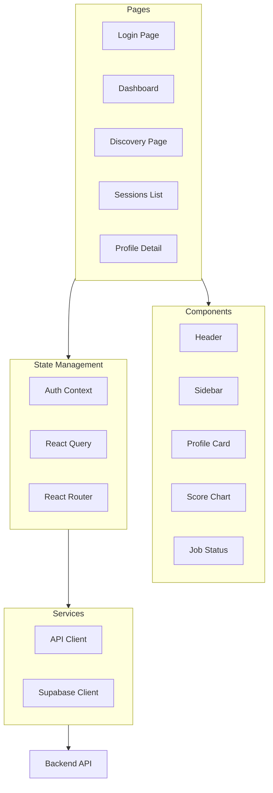

# EPIC-9: Frontend Implementation

## Overview

**Goal:** Build the complete React TypeScript frontend with modern UI, real-time updates, and full API integration.

**Duration:** 5-7 days  
**Dependencies:** EPIC-1 through EPIC-8 (Backend complete)  
**Deliverables:** Production-ready frontend application

---

> [!NOTE]
> **Test Data Layer Pattern**: All tests in this EPIC follow the layered format (`input → test → output`) with fixtures stored in `tests/fixtures/`. See [00-MASTER-PLAN.md](./00-MASTER-PLAN.md#test-data-layer-pattern) for details.

## Environment Variables Required

```bash
# Frontend Configuration (.env)
VITE_API_URL=http://localhost:8000/api
VITE_SUPABASE_URL=https://xxxxx.supabase.co
VITE_SUPABASE_ANON_KEY=eyJhbGciOiJIUzI1NiIsInR5cCI6IkpXVCJ9...
VITE_APP_NAME=PartnerScout AI
VITE_POLLING_INTERVAL=3000
```

---

## Frontend Architecture



---

## FEATURE-9.1: Project Setup

### STORY-9.1.1: Initialize React Project

#### TASK-9.1.1.1: Create Project Structure

**Commands:**
```bash
cd frontend
npm create vite@latest . -- --template react-ts
npm install
```

**Project Structure:**
```
frontend/
├── src/
│   ├── components/
│   │   ├── common/
│   │   │   ├── Button.tsx
│   │   │   ├── Input.tsx
│   │   │   ├── Card.tsx
│   │   │   ├── Modal.tsx
│   │   │   └── Loading.tsx
│   │   ├── layout/
│   │   │   ├── Header.tsx
│   │   │   ├── Sidebar.tsx
│   │   │   └── Layout.tsx
│   │   ├── discovery/
│   │   │   ├── JobCard.tsx
│   │   │   ├── JobStatus.tsx
│   │   │   └── CreateJobForm.tsx
│   │   └── profile/
│   │       ├── ProfileCard.tsx
│   │       ├── ProfileDetail.tsx
│   │       ├── ScoreChart.tsx
│   │       └── ProfileList.tsx
│   ├── pages/
│   │   ├── LoginPage.tsx
│   │   ├── DashboardPage.tsx
│   │   ├── DiscoveryPage.tsx
│   │   ├── SessionsPage.tsx
│   │   └── ProfilePage.tsx
│   ├── hooks/
│   │   ├── useAuth.ts
│   │   ├── useDiscovery.ts
│   │   ├── useProfiles.ts
│   │   └── usePolling.ts
│   ├── services/
│   │   ├── api.ts
│   │   ├── auth.ts
│   │   └── supabase.ts
│   ├── types/
│   │   ├── auth.ts
│   │   ├── discovery.ts
│   │   └── profile.ts
│   ├── utils/
│   │   ├── format.ts
│   │   └── constants.ts
│   ├── context/
│   │   └── AuthContext.tsx
│   ├── App.tsx
│   ├── main.tsx
│   └── index.css
├── public/
├── package.json
├── tsconfig.json
├── vite.config.ts
└── tailwind.config.js
```

#### TASK-9.1.1.2: Install Dependencies

**File:** `frontend/package.json`

```json
{
  "name": "partner-scout-frontend",
  "version": "0.1.0",
  "type": "module",
  "scripts": {
    "dev": "vite",
    "build": "tsc && vite build",
    "preview": "vite preview",
    "lint": "eslint . --ext ts,tsx",
    "test": "vitest",
    "test:ui": "vitest --ui"
  },
  "dependencies": {
    "react": "^18.2.0",
    "react-dom": "^18.2.0",
    "react-router-dom": "^6.21.0",
    "@tanstack/react-query": "^5.17.0",
    "@supabase/supabase-js": "^2.39.0",
    "axios": "^1.6.0",
    "recharts": "^2.10.0",
    "lucide-react": "^0.303.0",
    "clsx": "^2.1.0",
    "date-fns": "^3.2.0"
  },
  "devDependencies": {
    "@types/react": "^18.2.0",
    "@types/react-dom": "^18.2.0",
    "@typescript-eslint/eslint-plugin": "^6.0.0",
    "@typescript-eslint/parser": "^6.0.0",
    "@vitejs/plugin-react": "^4.2.0",
    "autoprefixer": "^10.4.0",
    "eslint": "^8.56.0",
    "eslint-plugin-react-hooks": "^4.6.0",
    "postcss": "^8.4.0",
    "tailwindcss": "^3.4.0",
    "typescript": "^5.3.0",
    "vite": "^5.0.0",
    "vitest": "^1.1.0",
    "@testing-library/react": "^14.1.0"
  }
}
```

#### TASK-9.1.1.3: Configure Tailwind

**File:** `frontend/tailwind.config.js`

```javascript
/** @type {import('tailwindcss').Config} */
export default {
  content: [
    "./index.html",
    "./src/**/*.{js,ts,jsx,tsx}",
  ],
  theme: {
    extend: {
      colors: {
        primary: {
          50: '#f0f9ff',
          100: '#e0f2fe',
          500: '#0ea5e9',
          600: '#0284c7',
          700: '#0369a1',
        },
        accent: {
          500: '#8b5cf6',
          600: '#7c3aed',
        },
        surface: {
          50: '#f8fafc',
          100: '#f1f5f9',
          200: '#e2e8f0',
          800: '#1e293b',
          900: '#0f172a',
        }
      },
      fontFamily: {
        sans: ['Inter', 'system-ui', 'sans-serif'],
        display: ['Cabinet Grotesk', 'Inter', 'sans-serif'],
      }
    },
  },
  plugins: [],
}
```

---

## FEATURE-9.2: Authentication

### STORY-9.2.1: Implement Auth Context

**File:** `frontend/src/context/AuthContext.tsx`

```typescript
import React, { createContext, useContext, useEffect, useState } from 'react';
import { User, Session } from '@supabase/supabase-js';
import { supabase } from '../services/supabase';

interface AuthContextType {
  user: User | null;
  session: Session | null;
  loading: boolean;
  signIn: (email: string, password: string) => Promise<void>;
  signUp: (email: string, password: string) => Promise<void>;
  signOut: () => Promise<void>;
}

const AuthContext = createContext<AuthContextType | undefined>(undefined);

export function AuthProvider({ children }: { children: React.ReactNode }) {
  const [user, setUser] = useState<User | null>(null);
  const [session, setSession] = useState<Session | null>(null);
  const [loading, setLoading] = useState(true);

  useEffect(() => {
    // Get initial session
    supabase.auth.getSession().then(({ data: { session } }) => {
      setSession(session);
      setUser(session?.user ?? null);
      setLoading(false);
    });

    // Listen for auth changes
    const { data: { subscription } } = supabase.auth.onAuthStateChange(
      (_event, session) => {
        setSession(session);
        setUser(session?.user ?? null);
        setLoading(false);
      }
    );

    return () => subscription.unsubscribe();
  }, []);

  const signIn = async (email: string, password: string) => {
    const { error } = await supabase.auth.signInWithPassword({
      email,
      password,
    });
    if (error) throw error;
  };

  const signUp = async (email: string, password: string) => {
    const { error } = await supabase.auth.signUp({
      email,
      password,
    });
    if (error) throw error;
  };

  const signOut = async () => {
    const { error } = await supabase.auth.signOut();
    if (error) throw error;
  };

  return (
    <AuthContext.Provider value={{ user, session, loading, signIn, signUp, signOut }}>
      {children}
    </AuthContext.Provider>
  );
}

export function useAuth() {
  const context = useContext(AuthContext);
  if (context === undefined) {
    throw new Error('useAuth must be used within an AuthProvider');
  }
  return context;
}
```

### STORY-9.2.2: Login Page

**File:** `frontend/src/pages/LoginPage.tsx`

```typescript
import React, { useState } from 'react';
import { useNavigate } from 'react-router-dom';
import { useAuth } from '../context/AuthContext';

export default function LoginPage() {
  const [email, setEmail] = useState('');
  const [password, setPassword] = useState('');
  const [isSignUp, setIsSignUp] = useState(false);
  const [error, setError] = useState('');
  const [loading, setLoading] = useState(false);
  
  const { signIn, signUp } = useAuth();
  const navigate = useNavigate();

  const handleSubmit = async (e: React.FormEvent) => {
    e.preventDefault();
    setError('');
    setLoading(true);

    try {
      if (isSignUp) {
        await signUp(email, password);
      } else {
        await signIn(email, password);
      }
      navigate('/dashboard');
    } catch (err: any) {
      setError(err.message);
    } finally {
      setLoading(false);
    }
  };

  return (
    <div className="min-h-screen flex items-center justify-center bg-gradient-to-br from-surface-900 via-surface-800 to-primary-900">
      <div className="w-full max-w-md">
        <div className="bg-surface-800/50 backdrop-blur-xl rounded-2xl shadow-2xl p-8 border border-surface-700/50">
          <div className="text-center mb-8">
            <h1 className="text-3xl font-display font-bold text-white">
              PartnerScout
            </h1>
            <p className="text-surface-400 mt-2">
              AI-Powered Partner Discovery
            </p>
          </div>

          <form onSubmit={handleSubmit} className="space-y-6">
            {error && (
              <div className="bg-red-500/10 border border-red-500/50 rounded-lg p-3 text-red-400 text-sm">
                {error}
              </div>
            )}

            <div>
              <label className="block text-sm font-medium text-surface-300 mb-2">
                Email
              </label>
              <input
                type="email"
                value={email}
                onChange={(e) => setEmail(e.target.value)}
                className="w-full px-4 py-3 bg-surface-900/50 border border-surface-600 rounded-lg text-white placeholder-surface-500 focus:outline-none focus:ring-2 focus:ring-primary-500 focus:border-transparent"
                placeholder="you@example.com"
                required
              />
            </div>

            <div>
              <label className="block text-sm font-medium text-surface-300 mb-2">
                Password
              </label>
              <input
                type="password"
                value={password}
                onChange={(e) => setPassword(e.target.value)}
                className="w-full px-4 py-3 bg-surface-900/50 border border-surface-600 rounded-lg text-white placeholder-surface-500 focus:outline-none focus:ring-2 focus:ring-primary-500 focus:border-transparent"
                placeholder="••••••••"
                required
              />
            </div>

            <button
              type="submit"
              disabled={loading}
              className="w-full py-3 px-4 bg-gradient-to-r from-primary-500 to-accent-500 text-white font-medium rounded-lg hover:from-primary-600 hover:to-accent-600 transition-all disabled:opacity-50 disabled:cursor-not-allowed"
            >
              {loading ? 'Loading...' : isSignUp ? 'Create Account' : 'Sign In'}
            </button>
          </form>

          <div className="mt-6 text-center">
            <button
              onClick={() => setIsSignUp(!isSignUp)}
              className="text-primary-400 hover:text-primary-300 text-sm"
            >
              {isSignUp ? 'Already have an account? Sign in' : "Don't have an account? Sign up"}
            </button>
          </div>
        </div>
      </div>
    </div>
  );
}
```

---

## FEATURE-9.3: API Integration

### STORY-9.3.1: API Client

**File:** `frontend/src/services/api.ts`

```typescript
import axios, { AxiosInstance, AxiosError } from 'axios';
import { supabase } from './supabase';

const API_URL = import.meta.env.VITE_API_URL || 'http://localhost:8000/api';

class ApiClient {
  private client: AxiosInstance;

  constructor() {
    this.client = axios.create({
      baseURL: API_URL,
      headers: {
        'Content-Type': 'application/json',
      },
    });

    // Add auth token to requests
    this.client.interceptors.request.use(async (config) => {
      const { data: { session } } = await supabase.auth.getSession();
      if (session?.access_token) {
        config.headers.Authorization = `Bearer ${session.access_token}`;
      }
      return config;
    });

    // Handle errors
    this.client.interceptors.response.use(
      (response) => response,
      (error: AxiosError) => {
        if (error.response?.status === 401) {
          // Redirect to login
          window.location.href = '/login';
        }
        return Promise.reject(error);
      }
    );
  }

  // Discovery endpoints
  async createDiscoveryJob(referenceProfiles: string[], settings?: object) {
    const response = await this.client.post('/discovery', {
      reference_profiles: referenceProfiles,
      settings,
    });
    return response.data;
  }

  async getDiscoveryJobs() {
    const response = await this.client.get('/discovery');
    return response.data;
  }

  async getDiscoveryJob(jobId: string) {
    const response = await this.client.get(`/discovery/${jobId}`);
    return response.data;
  }

  async deleteDiscoveryJob(jobId: string) {
    await this.client.delete(`/discovery/${jobId}`);
  }

  // Profile endpoints
  async getProfiles(jobId: string, params?: { minScore?: number; limit?: number }) {
    const response = await this.client.get(`/profiles/${jobId}`, { params });
    return response.data;
  }

  async getProfile(profileId: string) {
    const response = await this.client.get(`/profiles/profile/${profileId}`);
    return response.data;
  }

  // Agent endpoints
  async analyzeBrand(referenceProfiles: string[]) {
    const response = await this.client.post('/agent/analyze-brand', {
      reference_profiles: referenceProfiles,
    });
    return response.data;
  }

  async scoreProfile(profile: object, brandDna: object) {
    const response = await this.client.post('/agent/score', {
      profile,
      brand_dna: brandDna,
    });
    return response.data;
  }

  // Health check
  async healthCheck() {
    const response = await this.client.get('/health');
    return response.data;
  }
}

export const api = new ApiClient();
```

### STORY-9.3.2: React Query Hooks

**File:** `frontend/src/hooks/useDiscovery.ts`

```typescript
import { useQuery, useMutation, useQueryClient } from '@tanstack/react-query';
import { api } from '../services/api';

export function useDiscoveryJobs() {
  return useQuery({
    queryKey: ['discovery-jobs'],
    queryFn: () => api.getDiscoveryJobs(),
    refetchInterval: 5000, // Poll every 5 seconds for updates
  });
}

export function useDiscoveryJob(jobId: string) {
  return useQuery({
    queryKey: ['discovery-job', jobId],
    queryFn: () => api.getDiscoveryJob(jobId),
    refetchInterval: (data) => {
      // Poll more frequently if job is in progress
      if (data?.status === 'pending' || data?.status === 'analyzing' || 
          data?.status === 'discovering' || data?.status === 'scoring') {
        return 3000;
      }
      return false; // Stop polling when complete
    },
  });
}

export function useCreateDiscoveryJob() {
  const queryClient = useQueryClient();

  return useMutation({
    mutationFn: ({ profiles, settings }: { profiles: string[]; settings?: object }) =>
      api.createDiscoveryJob(profiles, settings),
    onSuccess: () => {
      queryClient.invalidateQueries({ queryKey: ['discovery-jobs'] });
    },
  });
}

export function useDeleteDiscoveryJob() {
  const queryClient = useQueryClient();

  return useMutation({
    mutationFn: (jobId: string) => api.deleteDiscoveryJob(jobId),
    onSuccess: () => {
      queryClient.invalidateQueries({ queryKey: ['discovery-jobs'] });
    },
  });
}
```

**File:** `frontend/src/hooks/useProfiles.ts`

```typescript
import { useQuery } from '@tanstack/react-query';
import { api } from '../services/api';

export function useProfiles(jobId: string, minScore?: number) {
  return useQuery({
    queryKey: ['profiles', jobId, minScore],
    queryFn: () => api.getProfiles(jobId, { minScore }),
    enabled: !!jobId,
  });
}

export function useProfile(profileId: string) {
  return useQuery({
    queryKey: ['profile', profileId],
    queryFn: () => api.getProfile(profileId),
    enabled: !!profileId,
  });
}
```

---

## FEATURE-9.4: Components

### STORY-9.4.1: Profile Card Component

**File:** `frontend/src/components/profile/ProfileCard.tsx`

```typescript
import React from 'react';
import { ExternalLink, CheckCircle, Users, Image } from 'lucide-react';
import clsx from 'clsx';

interface ProfileCardProps {
  profile: {
    id: string;
    username: string;
    display_name?: string;
    profile_pic_url?: string;
    follower_count: number;
    is_verified: boolean;
    score?: number;
  };
  onClick?: () => void;
}

export default function ProfileCard({ profile, onClick }: ProfileCardProps) {
  const scoreColor = profile.score 
    ? profile.score >= 80 
      ? 'text-green-400 bg-green-500/20'
      : profile.score >= 60 
        ? 'text-yellow-400 bg-yellow-500/20'
        : 'text-red-400 bg-red-500/20'
    : 'text-surface-400 bg-surface-700';

  return (
    <div 
      onClick={onClick}
      className="bg-surface-800/50 backdrop-blur rounded-xl border border-surface-700/50 p-4 hover:border-primary-500/50 transition-all cursor-pointer group"
    >
      <div className="flex items-start gap-4">
        {/* Avatar */}
        <div className="relative">
          {profile.profile_pic_url ? (
            
          ) : (
            <div className="w-14 h-14 rounded-full bg-surface-700 flex items-center justify-center">
              <Image className="w-6 h-6 text-surface-500" />
            </div>
          )}
          {profile.is_verified && (
            <CheckCircle className="absolute -bottom-1 -right-1 w-5 h-5 text-primary-400 bg-surface-800 rounded-full" />
          )}
        </div>

        {/* Info */}
        <div className="flex-1 min-w-0">
          <div className="flex items-center gap-2">
            <h3 className="font-semibold text-white truncate">
              @{profile.username}
            </h3>
            <a
              href={`https://instagram.com/${profile.username}`}
              target="_blank"
              rel="noopener noreferrer"
              onClick={(e) => e.stopPropagation()}
              className="text-surface-400 hover:text-primary-400"
            >
              <ExternalLink className="w-4 h-4" />
            </a>
          </div>
          {profile.display_name && (
            <p className="text-sm text-surface-400 truncate">
              {profile.display_name}
            </p>
          )}
          <div className="flex items-center gap-1 mt-1 text-sm text-surface-400">
            <Users className="w-4 h-4" />
            <span>{(profile.follower_count / 1000).toFixed(1)}K</span>
          </div>
        </div>

        {/* Score */}
        {profile.score !== undefined && (
          <div className={clsx(
            'px-3 py-1 rounded-full font-semibold text-sm',
            scoreColor
          )}>
            {profile.score}
          </div>
        )}
      </div>
    </div>
  );
}
```

### STORY-9.4.2: Score Chart Component

**File:** `frontend/src/components/profile/ScoreChart.tsx`

```typescript
import React from 'react';
import { RadarChart, PolarGrid, PolarAngleAxis, Radar, ResponsiveContainer } from 'recharts';

interface ScoreChartProps {
  categoryScores: {
    brand_alignment?: number;
    audience_fit?: number;
    engagement_quality?: number;
    content_quality?: number;
    partnership_potential?: number;
  };
}

export default function ScoreChart({ categoryScores }: ScoreChartProps) {
  const data = [
    { category: 'Brand', score: categoryScores.brand_alignment || 0 },
    { category: 'Audience', score: categoryScores.audience_fit || 0 },
    { category: 'Engagement', score: categoryScores.engagement_quality || 0 },
    { category: 'Content', score: categoryScores.content_quality || 0 },
    { category: 'Potential', score: categoryScores.partnership_potential || 0 },
  ];

  return (
    <div className="w-full h-64">
      <ResponsiveContainer width="100%" height="100%">
        <RadarChart cx="50%" cy="50%" outerRadius="80%" data={data}>
          <PolarGrid stroke="#334155" />
          <PolarAngleAxis 
            dataKey="category" 
            tick={{ fill: '#94a3b8', fontSize: 12 }}
          />
          <Radar
            name="Score"
            dataKey="score"
            stroke="#0ea5e9"
            fill="#0ea5e9"
            fillOpacity={0.3}
          />
        </RadarChart>
      </ResponsiveContainer>
    </div>
  );
}
```

---

## FEATURE-9.5: Pages

### STORY-9.5.1: Dashboard Page

**File:** `frontend/src/pages/DashboardPage.tsx`

```typescript
import React from 'react';
import { Link } from 'react-router-dom';
import { Plus, TrendingUp, Users, Clock } from 'lucide-react';
import { useDiscoveryJobs } from '../hooks/useDiscovery';
import Layout from '../components/layout/Layout';

export default function DashboardPage() {
  const { data: jobs, isLoading } = useDiscoveryJobs();

  const stats = React.useMemo(() => {
    if (!jobs) return { total: 0, active: 0, completed: 0, profiles: 0 };
    
    return {
      total: jobs.length,
      active: jobs.filter((j: any) => !['completed', 'failed'].includes(j.status)).length,
      completed: jobs.filter((j: any) => j.status === 'completed').length,
      profiles: jobs.reduce((acc: number, j: any) => acc + (j.profiles_found || 0), 0),
    };
  }, [jobs]);

  return (
    <Layout>
      <div className="p-8">
        {/* Header */}
        <div className="flex items-center justify-between mb-8">
          <div>
            <h1 className="text-3xl font-display font-bold text-white">
              Dashboard
            </h1>
            <p className="text-surface-400 mt-1">
              Overview of your partner discovery campaigns
            </p>
          </div>
          <Link
            to="/discovery/new"
            className="flex items-center gap-2 px-4 py-2 bg-primary-500 text-white rounded-lg hover:bg-primary-600 transition-colors"
          >
            <Plus className="w-5 h-5" />
            New Discovery
          </Link>
        </div>

        {/* Stats Grid */}
        <div className="grid grid-cols-1 md:grid-cols-4 gap-6 mb-8">
          <StatCard
            icon={<TrendingUp className="w-6 h-6" />}
            label="Total Campaigns"
            value={stats.total}
            color="primary"
          />
          <StatCard
            icon={<Clock className="w-6 h-6" />}
            label="Active"
            value={stats.active}
            color="yellow"
          />
          <StatCard
            icon={<Users className="w-6 h-6" />}
            label="Profiles Found"
            value={stats.profiles}
            color="green"
          />
          <StatCard
            icon={<TrendingUp className="w-6 h-6" />}
            label="Completed"
            value={stats.completed}
            color="accent"
          />
        </div>

        {/* Recent Jobs */}
        <div className="bg-surface-800/50 backdrop-blur rounded-xl border border-surface-700/50 p-6">
          <h2 className="text-xl font-semibold text-white mb-4">
            Recent Campaigns
          </h2>
          
          {isLoading ? (
            <div className="text-center py-8 text-surface-400">Loading...</div>
          ) : jobs?.length === 0 ? (
            <div className="text-center py-8">
              <p className="text-surface-400 mb-4">No campaigns yet</p>
              <Link
                to="/discovery/new"
                className="text-primary-400 hover:text-primary-300"
              >
                Create your first discovery campaign
              </Link>
            </div>
          ) : (
            <div className="space-y-4">
              {jobs?.slice(0, 5).map((job: any) => (
                <Link
                  key={job.id}
                  to={`/discovery/${job.id}`}
                  className="block p-4 bg-surface-700/50 rounded-lg hover:bg-surface-700 transition-colors"
                >
                  <div className="flex items-center justify-between">
                    <div>
                      <p className="text-white font-medium">
                        {job.reference_profiles?.[0] || 'Discovery Job'}
                      </p>
                      <p className="text-sm text-surface-400">
                        {job.profiles_found || 0} profiles found
                      </p>
                    </div>
                    <StatusBadge status={job.status} />
                  </div>
                </Link>
              ))}
            </div>
          )}
        </div>
      </div>
    </Layout>
  );
}

function StatCard({ icon, label, value, color }: any) {
  const colors = {
    primary: 'from-primary-500/20 to-primary-500/5 text-primary-400',
    yellow: 'from-yellow-500/20 to-yellow-500/5 text-yellow-400',
    green: 'from-green-500/20 to-green-500/5 text-green-400',
    accent: 'from-accent-500/20 to-accent-500/5 text-accent-400',
  };

  return (
    <div className={`bg-gradient-to-br ${colors[color]} rounded-xl p-6 border border-surface-700/50`}>
      <div className="flex items-center gap-3 mb-2">
        {icon}
        <span className="text-surface-400 text-sm">{label}</span>
      </div>
      <p className="text-3xl font-bold text-white">{value}</p>
    </div>
  );
}

function StatusBadge({ status }: { status: string }) {
  const styles: Record<string, string> = {
    pending: 'bg-yellow-500/20 text-yellow-400',
    analyzing: 'bg-blue-500/20 text-blue-400',
    discovering: 'bg-blue-500/20 text-blue-400',
    scoring: 'bg-purple-500/20 text-purple-400',
    completed: 'bg-green-500/20 text-green-400',
    failed: 'bg-red-500/20 text-red-400',
  };

  return (
    <span className={`px-3 py-1 rounded-full text-sm font-medium ${styles[status] || styles.pending}`}>
      {status}
    </span>
  );
}
```

---

## VALIDATION PLAN: EPIC-9

### Validation Script

**File:** `frontend/scripts/validate.sh`

```bash
#!/bin/bash
echo "=========================================="
echo "EPIC-9 VALIDATION: Frontend"
echo "=========================================="

# Check TypeScript
echo -e "\n--- TypeScript Check ---"
npm run build

# Run linter
echo -e "\n--- ESLint Check ---"
npm run lint

# Run tests
echo -e "\n--- Unit Tests ---"
npm run test -- --run

echo -e "\n=========================================="
echo "Validation Complete"
echo "=========================================="
```

---

## Mock Data for Frontend Development

### MSW (Mock Service Worker) Handlers

**File:** `frontend/src/mocks/handlers.ts`

```typescript
/**
 * MSW handlers using PRD-aligned mock data for development/testing.
 * Data mirrors backend mock_data/ for consistent testing across stack.
 */
import { rest } from 'msw';
import { mockUsers, mockJobs, mockProfiles, mockScores } from './data';

export const handlers = [
  // PRD 8.1: List sessions
  rest.get('/api/discovery', (req, res, ctx) => {
    const userId = req.headers.get('x-user-id') || 'user-001-uuid-0000-000000000001';
    const userJobs = mockJobs.filter(j => j.user_id === userId);
    return res(ctx.json({ sessions: userJobs }));
  }),

  // PRD 8.1: Get session details
  rest.get('/api/discovery/:id', (req, res, ctx) => {
    const job = mockJobs.find(j => j.id === req.params.id);
    if (!job) return res(ctx.status(404));
    
    const profiles = mockProfiles.filter(p => p.job_id === job.id);
    return res(ctx.json({ ...job, profiles }));
  }),

  // PRD 8.4: Get profile score
  rest.get('/api/profiles/:id/score', (req, res, ctx) => {
    const score = mockScores.find(s => s.profile_id === req.params.id);
    if (!score) return res(ctx.status(404));
    return res(ctx.json(score));
  }),
];
```

### TypeScript Mock Data

**File:** `frontend/src/mocks/data.ts`

```typescript
/**
 * Mock data matching PRD specifications.
 * Mirrors backend tests/fixtures/mock_data/ for consistency.
 */

// PRD 10.2: Users
export const mockUsers = [
  {
    id: 'user-001-uuid-0000-000000000001',
    email: 'demo@partnerscout.ai',
    full_name: 'Demo User',
    avatar_url: 'https://api.dicebear.com/7.x/avataaars/svg?seed=demo',
  },
];

// PRD 10.3: Discovery Jobs (all statuses)
export const mockJobs: DiscoveryJob[] = [
  {
    id: 'job-001-uuid-0000-000000000001',
    user_id: 'user-001-uuid-0000-000000000001',
    name: 'Sustainable Fashion Discovery',
    brand_description: 'Eco-friendly sustainable fashion brand',
    status: 'completed',
    profiles_discovered: 47,
    profiles_scored: 47,
    created_at: '2026-01-31T10:00:00Z',
  },
  // ... include all job statuses for testing
];

// PRD 10.5: Profiles (genuine + fake for testing)
export const mockProfiles: DiscoveredProfile[] = [
  {
    id: 'profile-001-uuid-0000-000000000001',
    job_id: 'job-001-uuid-0000-000000000001',
    username: 'eco_boutique_nyc',
    followers: 45000,
    following: 1200,
    engagement_rate: 3.5,
    is_business: true,
    status: 'done',
    // High-quality genuine profile
  },
  {
    id: 'profile-004-uuid-0000-000000000004',
    job_id: 'job-001-uuid-0000-000000000001',
    username: 'bot_follower_farm',
    followers: 85000,
    following: 78000,
    engagement_rate: 0.1,
    is_business: false,
    status: 'skipped',
    // Fake profile - should show warning indicators in UI
  },
];

// PRD 10.6: Scores with 6 dimensions
export const mockScores: ProfileScore[] = [
  {
    id: 'score-001-uuid-0000-000000000001',
    profile_id: 'profile-001-uuid-0000-000000000001',
    score: 87,
    visual_aesthetic_match: 92,
    content_theme_alignment: 88,
    engagement_rate_score: 82,
    follower_quality: 95,
    business_indicators: 90,
    activity_recency: 85,
    reasoning: {
      summary: 'Excellent match for sustainable fashion brand.',
      recommendation: 'Highly recommended for partnership outreach.',
    },
  },
];
```

### Vitest Test Fixtures

**File:** `frontend/src/test/fixtures.ts`

```typescript
/**
 * Test fixtures for component tests.
 * Uses same mock data as MSW handlers for consistency.
 */
import { mockJobs, mockProfiles, mockScores } from '../mocks/data';

export const getCompletedJob = () => mockJobs.find(j => j.status === 'completed');
export const getPendingJob = () => mockJobs.find(j => j.status === 'pending');
export const getFailedJob = () => mockJobs.find(j => j.status === 'failed');

export const getGenuineProfile = () => mockProfiles.find(p => p.engagement_rate > 2);
export const getFakeProfile = () => mockProfiles.find(p => p.engagement_rate < 1);

export const getHighScore = () => mockScores.find(s => s.score >= 80);
export const getLowScore = () => mockScores.find(s => s.score < 50);
```

---

## Definition of Done

- [ ] Project structure created with Vite
- [ ] Tailwind CSS configured with custom theme
- [ ] Authentication flow working with Supabase
- [ ] API client with interceptors
- [ ] React Query hooks for data fetching
- [ ] Dashboard page with stats
- [ ] Discovery creation and monitoring
- [ ] Profile list and detail views
- [ ] Score visualization with charts
- [ ] Real-time polling for job status
- [ ] All TypeScript types defined
- [ ] Components tested
- [ ] Build completes without errors
- [ ] **MSW handlers with PRD mock data**
- [ ] **TypeScript mock data mirrors backend fixtures**
- [ ] **UI correctly displays all 6 scoring dimensions (PRD 5.3)**
- [ ] **Fake profile indicators visible in UI (PRD 5.3.1)**
- [ ] **All job statuses display correctly (PRD 5.4)**

---

## Next EPIC

After completing EPIC-9, proceed to:
- **[10-EPIC-E2E-DEMO.md](./10-EPIC-E2E-DEMO.md)** - E2E Testing and Demo
