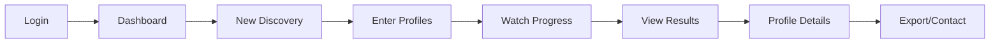

# EPIC-10: E2E Testing and Demo Preparation

## Overview

**Goal:** Create end-to-end tests, demo scripts, and production deployment configuration for a successful demo presentation.

**Duration:** 2-3 days  
**Dependencies:** EPIC-1 through EPIC-9 (Full stack complete)  
**Deliverables:** Demo-ready application with E2E tests

---

> [!NOTE]
> **Test Data Layer Pattern**: All tests in this EPIC follow the layered format (`input → test → output`) with fixtures stored in `tests/fixtures/`. See [00-MASTER-PLAN.md](./00-MASTER-PLAN.md#test-data-layer-pattern) for details.

## Environment Variables Required

```bash
# Demo Configuration
DEMO_MODE=true
DEMO_USER_EMAIL=demo@partnerscout.ai
DEMO_USER_PASSWORD=Demo123!

# Mock Data (for demo without real API calls)
USE_DEMO_DATA=false

# Production URLs
PRODUCTION_API_URL=https://api.partnerscout.ai
PRODUCTION_FRONTEND_URL=https://app.partnerscout.ai
```

---

## Demo Flow



---

## FEATURE-10.1: E2E Test Setup

### STORY-10.1.1: Configure Playwright

**File:** `frontend/playwright.config.ts`

```typescript
import { defineConfig, devices } from '@playwright/test';

export default defineConfig({
  testDir: './e2e',
  fullyParallel: true,
  forbidOnly: !!process.env.CI,
  retries: process.env.CI ? 2 : 0,
  workers: process.env.CI ? 1 : undefined,
  reporter: 'html',
  use: {
    baseURL: process.env.E2E_BASE_URL || 'http://localhost:5173',
    trace: 'on-first-retry',
    screenshot: 'only-on-failure',
  },
  projects: [
    {
      name: 'chromium',
      use: { ...devices['Desktop Chrome'] },
    },
  ],
  webServer: {
    command: 'npm run dev',
    url: 'http://localhost:5173',
    reuseExistingServer: !process.env.CI,
  },
});
```

### STORY-10.1.2: Auth E2E Tests

**File:** `frontend/e2e/auth.spec.ts`

```typescript
import { test, expect } from '@playwright/test';

test.describe('Authentication', () => {
  test('should display login page', async ({ page }) => {
    await page.goto('/login');
    
    await expect(page.getByText('PartnerScout')).toBeVisible();
    await expect(page.getByPlaceholder('you@example.com')).toBeVisible();
    await expect(page.getByPlaceholder('••••••••')).toBeVisible();
  });

  test('should show error on invalid credentials', async ({ page }) => {
    await page.goto('/login');
    
    await page.getByPlaceholder('you@example.com').fill('invalid@test.com');
    await page.getByPlaceholder('••••••••').fill('wrongpassword');
    await page.getByRole('button', { name: 'Sign In' }).click();
    
    await expect(page.getByText(/invalid|error/i)).toBeVisible();
  });

  test('should redirect to dashboard on successful login', async ({ page }) => {
    await page.goto('/login');
    
    // Use demo credentials
    await page.getByPlaceholder('you@example.com').fill(process.env.DEMO_USER_EMAIL || 'demo@test.com');
    await page.getByPlaceholder('••••••••').fill(process.env.DEMO_USER_PASSWORD || 'Demo123!');
    await page.getByRole('button', { name: 'Sign In' }).click();
    
    await expect(page).toHaveURL('/dashboard');
    await expect(page.getByText('Dashboard')).toBeVisible();
  });

  test('should allow sign up', async ({ page }) => {
    await page.goto('/login');
    
    await page.getByText("Don't have an account").click();
    
    await expect(page.getByRole('button', { name: 'Create Account' })).toBeVisible();
  });
});
```

### STORY-10.1.3: Discovery E2E Tests

**File:** `frontend/e2e/discovery.spec.ts`

```typescript
import { test, expect } from '@playwright/test';

test.describe('Discovery Flow', () => {
  test.beforeEach(async ({ page }) => {
    // Login first
    await page.goto('/login');
    await page.getByPlaceholder('you@example.com').fill(process.env.DEMO_USER_EMAIL || 'demo@test.com');
    await page.getByPlaceholder('••••••••').fill(process.env.DEMO_USER_PASSWORD || 'Demo123!');
    await page.getByRole('button', { name: 'Sign In' }).click();
    await expect(page).toHaveURL('/dashboard');
  });

  test('should show dashboard with stats', async ({ page }) => {
    await expect(page.getByText('Total Campaigns')).toBeVisible();
    await expect(page.getByText('Active')).toBeVisible();
    await expect(page.getByText('Profiles Found')).toBeVisible();
  });

  test('should navigate to new discovery', async ({ page }) => {
    await page.getByRole('link', { name: 'New Discovery' }).click();
    
    await expect(page).toHaveURL('/discovery/new');
    await expect(page.getByText('Create Discovery')).toBeVisible();
  });

  test('should create new discovery job', async ({ page }) => {
    await page.goto('/discovery/new');
    
    // Enter reference profile
    await page.getByPlaceholder(/instagram|profile/i).fill('nike');
    await page.getByRole('button', { name: /add|start/i }).click();
    
    // Should redirect to job page or show progress
    await expect(page.getByText(/analyzing|discovering|pending/i)).toBeVisible({ timeout: 10000 });
  });

  test('should show discovery progress', async ({ page }) => {
    // Navigate to an existing job (if any)
    const jobCard = page.locator('[data-testid="job-card"]').first();
    
    if (await jobCard.isVisible()) {
      await jobCard.click();
      
      // Should show job details
      await expect(page.getByText(/status/i)).toBeVisible();
      await expect(page.getByText(/profiles/i)).toBeVisible();
    }
  });
});
```

### STORY-10.1.4: Profile E2E Tests

**File:** `frontend/e2e/profiles.spec.ts`

```typescript
import { test, expect } from '@playwright/test';

test.describe('Profile Views', () => {
  test.beforeEach(async ({ page }) => {
    await page.goto('/login');
    await page.getByPlaceholder('you@example.com').fill(process.env.DEMO_USER_EMAIL || 'demo@test.com');
    await page.getByPlaceholder('••••••••').fill(process.env.DEMO_USER_PASSWORD || 'Demo123!');
    await page.getByRole('button', { name: 'Sign In' }).click();
    await expect(page).toHaveURL('/dashboard');
  });

  test('should display profile list', async ({ page }) => {
    // Navigate to a completed job with profiles
    await page.goto('/sessions');
    
    const completedJob = page.locator('[data-status="completed"]').first();
    
    if (await completedJob.isVisible()) {
      await completedJob.click();
      
      // Should show profiles
      await expect(page.getByTestId('profile-card')).toBeVisible({ timeout: 10000 });
    }
  });

  test('should filter profiles by score', async ({ page }) => {
    await page.goto('/sessions');
    
    const completedJob = page.locator('[data-status="completed"]').first();
    
    if (await completedJob.isVisible()) {
      await completedJob.click();
      
      // Apply score filter
      const scoreFilter = page.getByLabel(/min.*score/i);
      if (await scoreFilter.isVisible()) {
        await scoreFilter.fill('80');
        await page.keyboard.press('Enter');
        
        // Profiles should be filtered
        await page.waitForTimeout(1000);
      }
    }
  });

  test('should show profile detail modal', async ({ page }) => {
    await page.goto('/sessions');
    
    const completedJob = page.locator('[data-status="completed"]').first();
    
    if (await completedJob.isVisible()) {
      await completedJob.click();
      
      const profileCard = page.getByTestId('profile-card').first();
      
      if (await profileCard.isVisible()) {
        await profileCard.click();
        
        // Should show detail modal
        await expect(page.getByText(/score breakdown|category/i)).toBeVisible();
        await expect(page.getByText(/reasoning/i)).toBeVisible();
      }
    }
  });
});
```

---

## FEATURE-10.2: Demo Data and Scripts

### STORY-10.2.1: Demo Seed Data

**File:** `backend/scripts/seed_demo_data.py`

```python
#!/usr/bin/env python3
"""
Seed demo data for presentations.
"""
import sys
from pathlib import Path
sys.path.insert(0, str(Path(__file__).parent.parent))

from datetime import datetime, timedelta
import random


def seed_demo_data():
    """Create demo data for presentation."""
    from app.db.sqlite_client import get_sqlite_client
    from app.repositories.discovery_repository import DiscoveryJobRepository, BrandDNARepository
    from app.repositories.profile_repository import ProfileRepository, ProfileScoreRepository
    
    db = get_sqlite_client()
    
    job_repo = DiscoveryJobRepository(db)
    dna_repo = BrandDNARepository(db)
    profile_repo = ProfileRepository(db)
    score_repo = ProfileScoreRepository(db)
    
    print("Creating demo discovery job...")
    
    # Create completed job
    job = job_repo.create({
        "user_id": "demo-user",
        "status": "completed",
        "reference_profiles": '["nike", "adidas", "underarmour"]',
        "settings": '{"discovery_limit": 50}'
    })
    
    print(f"Created job: {job.id}")
    
    # Add brand DNA
    dna = dna_repo.create({
        "job_id": str(job.id),
        "hashtags": '["fitness", "sports", "athletic", "workout", "training", "motivation", "gymlife", "activewear", "health", "fitfam"]',
        "keywords": '["athletic", "performance", "sports", "training", "fitness", "active", "healthy", "strong", "motivation", "goals"]',
        "embedding": "[]",
        "analysis": '{"tone": "motivational and energetic", "target_audience": "fitness enthusiasts 18-35"}'
    })
    
    print(f"Created brand DNA: {dna.id}")
    
    # Demo influencer data
    demo_profiles = [
        {"username": "fitnessguru", "name": "Alex Fitness", "followers": 250000, "score": 92},
        {"username": "healthylifestyle", "name": "Sarah Wellness", "followers": 180000, "score": 88},
        {"username": "gymwarrior", "name": "Mike Power", "followers": 320000, "score": 85},
        {"username": "yogalife", "name": "Emma Zen", "followers": 150000, "score": 82},
        {"username": "runnersworld", "name": "Jake Runner", "followers": 95000, "score": 79},
        {"username": "crossfitchamp", "name": "Chris Strong", "followers": 280000, "score": 91},
        {"username": "nutritionexpert", "name": "Dr. Lisa Healthy", "followers": 420000, "score": 86},
        {"username": "bodybuilder_pro", "name": "Tom Muscle", "followers": 550000, "score": 77},
        {"username": "pilatesinstructor", "name": "Amy Grace", "followers": 75000, "score": 84},
        {"username": "marathonrunner", "name": "David Fast", "followers": 125000, "score": 80},
        {"username": "fitnessmom", "name": "Rachel Active", "followers": 200000, "score": 87},
        {"username": "strengthcoach", "name": "Coach Ben", "followers": 165000, "score": 89},
    ]
    
    print("Creating demo profiles...")
    
    for p in demo_profiles:
        profile = profile_repo.create({
            "job_id": str(job.id),
            "username": p["username"],
            "display_name": p["name"],
            "bio": f"Fitness enthusiast | Partner inquiries: {p['username']}@email.com | #fitness #health",
            "follower_count": p["followers"],
            "following_count": random.randint(500, 2000),
            "post_count": random.randint(200, 1000),
            "is_verified": p["followers"] > 200000,
            "is_business": True,
            "status": "scored"
        })
        
        # Add score
        score_repo.create({
            "profile_id": str(profile.id),
            "overall_score": p["score"],
            "category_scores": f'{{"brand_alignment": {p["score"] + random.randint(-5, 5)}, "audience_fit": {p["score"] + random.randint(-5, 5)}, "engagement_quality": {p["score"] + random.randint(-5, 5)}, "content_quality": {p["score"] + random.randint(-5, 5)}, "partnership_potential": {p["score"] + random.randint(-5, 5)}}}',
            "reasoning": f"Strong fit for athletic brand partnership. {p['name']} has excellent engagement with the fitness community and aligns well with brand values."
        })
        
        print(f"  Created: @{p['username']} (Score: {p['score']})")
    
    # Create an in-progress job for demo
    pending_job = job_repo.create({
        "user_id": "demo-user",
        "status": "discovering",
        "reference_profiles": '["lululemon"]',
        "settings": '{"discovery_limit": 25}'
    })
    
    print(f"\nCreated in-progress job: {pending_job.id}")
    print("\nDemo data seeding complete!")


if __name__ == "__main__":
    seed_demo_data()
```

### STORY-10.2.2: Demo Script

**File:** `docs/DEMO_SCRIPT.md`

```markdown
# PartnerScout AI - Demo Script

## Pre-Demo Checklist

- [ ] Backend running (`uvicorn app.main:app --reload`)
- [ ] Frontend running (`npm run dev`)
- [ ] Demo data seeded (`python scripts/seed_demo_data.py`)
- [ ] Browser in incognito mode
- [ ] Screen sharing ready

## Demo Flow (5 minutes)

### 1. Introduction (30 seconds)

"PartnerScout AI helps D2C brands discover Instagram influencer partners automatically using AI."

### 2. Login (15 seconds)

- Navigate to login page
- Show clean UI
- Login with demo credentials

### 3. Dashboard Overview (30 seconds)

- Point out statistics cards
- Show completed discovery campaign
- Highlight "50 profiles found"

### 4. Create New Discovery (1 minute)

- Click "New Discovery"
- Enter reference profile: "nike"
- Explain: "We analyze this brand's Instagram presence"
- Click Start
- Watch status change: Analyzing → Discovering

### 5. View Completed Results (1.5 minutes)

- Navigate to completed job
- Show profile list
- Filter by score > 80
- Click on top profile
- Walk through score breakdown:
  - Overall score
  - Category radar chart
  - AI reasoning
  - Contact email

### 6. Key Differentiators (30 seconds)

- "AI-powered brand analysis"
- "Automated scoring with explainable reasoning"
- "Real-time discovery pipeline"
- "Built for scale - process 50 profiles in minutes"

### 7. Closing (15 seconds)

"Questions?"

## Backup Scenarios

### If API is slow:
Switch to demo data mode - pre-seeded results will display.

### If scraping fails:
Explain rate limiting and show cached results.

### If login fails:
Use SQLite fallback mode with local data.
```

---

## FEATURE-10.3: Deployment Configuration

### STORY-10.3.1: Docker Compose for Demo

**File:** `docker-compose.yml`

```yaml
version: '3.8'

services:
  backend:
    build:
      context: ./backend
      dockerfile: Dockerfile
    ports:
      - "8000:8000"
    environment:
      - ENVIRONMENT=production
      - DEBUG=false
      - USE_SQLITE_FALLBACK=true
      - SQLITE_DATABASE_PATH=/data/partner_scout.db
      - LLM_PROVIDER=openai
      - OPENAI_API_KEY=${OPENAI_API_KEY}
      - APIFY_API_KEY=${APIFY_API_KEY}
    volumes:
      - ./data:/data
    healthcheck:
      test: ["CMD", "curl", "-f", "http://localhost:8000/api/health"]
      interval: 30s
      timeout: 10s
      retries: 3

  frontend:
    build:
      context: ./frontend
      dockerfile: Dockerfile
    ports:
      - "3000:80"
    environment:
      - VITE_API_URL=http://localhost:8000/api
    depends_on:
      - backend

volumes:
  data:
```

**File:** `backend/Dockerfile`

```dockerfile
FROM python:3.11-slim

WORKDIR /app

# Install dependencies
COPY requirements.txt .
RUN pip install --no-cache-dir -r requirements.txt

# Copy application
COPY app/ ./app/
COPY scripts/ ./scripts/

# Create data directory
RUN mkdir -p /data

# Expose port
EXPOSE 8000

# Run application
CMD ["uvicorn", "app.main:app", "--host", "0.0.0.0", "--port", "8000"]
```

**File:** `frontend/Dockerfile`

```dockerfile
FROM node:20-alpine as builder

WORKDIR /app

# Install dependencies
COPY package*.json ./
RUN npm ci

# Build application
COPY . .
RUN npm run build

# Production stage
FROM nginx:alpine

COPY --from=builder /app/dist /usr/share/nginx/html
COPY nginx.conf /etc/nginx/conf.d/default.conf

EXPOSE 80

CMD ["nginx", "-g", "daemon off;"]
```

**File:** `frontend/nginx.conf`

```nginx
server {
    listen 80;
    server_name localhost;

    location / {
        root /usr/share/nginx/html;
        index index.html;
        try_files $uri $uri/ /index.html;
    }

    location /api {
        proxy_pass http://backend:8000;
        proxy_set_header Host $host;
        proxy_set_header X-Real-IP $remote_addr;
    }
}
```

---

## FEATURE-10.4: Final Validation

### STORY-10.4.1: Complete System Validation

**File:** `scripts/validate_all.sh`

```bash
#!/bin/bash
set -e

echo "=========================================="
echo "PARTNERSCOUT AI - FULL SYSTEM VALIDATION"
echo "=========================================="

# Backend validation
echo -e "\n--- Backend Validation ---"
cd backend

echo "1. Installing dependencies..."
pip install -r requirements.txt -q

echo "2. Running unit tests..."
pytest tests/unit/ -v --tb=short

echo "3. Running integration tests..."
pytest tests/integration/ -v --tb=short

echo "4. Type checking..."
mypy app/ --ignore-missing-imports

echo "5. Starting backend..."
uvicorn app.main:app --port 8000 &
BACKEND_PID=$!
sleep 5

echo "6. Health check..."
curl -s http://localhost:8000/api/health | python -m json.tool

# Frontend validation
echo -e "\n--- Frontend Validation ---"
cd ../frontend

echo "7. Installing dependencies..."
npm ci

echo "8. TypeScript check..."
npm run build

echo "9. Linting..."
npm run lint

echo "10. Starting frontend..."
npm run dev &
FRONTEND_PID=$!
sleep 5

echo "11. E2E Tests..."
npx playwright test --reporter=list

# Cleanup
echo -e "\n--- Cleanup ---"
kill $BACKEND_PID $FRONTEND_PID 2>/dev/null || true

echo -e "\n=========================================="
echo "VALIDATION COMPLETE"
echo "=========================================="
```

### STORY-10.4.2: Pre-Demo Checklist

**File:** `docs/PRE_DEMO_CHECKLIST.md`

```markdown
# Pre-Demo Checklist

## 24 Hours Before

- [ ] All tests passing (backend and frontend)
- [ ] Demo data seeded and verified
- [ ] API keys valid and not expired
- [ ] Rate limits understood

## 1 Hour Before

- [ ] Start backend server
- [ ] Start frontend server
- [ ] Verify health endpoint
- [ ] Login with demo account
- [ ] Check existing discovery jobs load
- [ ] Create test discovery job
- [ ] Verify profile scoring works

## 15 Minutes Before

- [ ] Clear browser cache
- [ ] Open incognito window
- [ ] Navigate to login page
- [ ] Screen sharing configured
- [ ] Notes/script ready
- [ ] Backup plan understood

## During Demo

- [ ] Start with login
- [ ] Show dashboard
- [ ] Create new discovery
- [ ] View results
- [ ] Show profile details
- [ ] Answer questions

## If Things Go Wrong

1. **API Error**: Switch to cached demo data
2. **Slow Response**: Explain processing time
3. **Login Fail**: Use fallback credentials
4. **Frontend Crash**: Refresh and continue
```

---

## VALIDATION PLAN: EPIC-10

### Validation Script

**File:** `scripts/validate_epic10.py`

```python
#!/usr/bin/env python3
"""
Validation script for EPIC-10: E2E and Demo.
"""
import subprocess
import sys
import os
from pathlib import Path


def main():
    print("\n" + "#"*60)
    print("# EPIC-10 VALIDATION: E2E and Demo")
    print("#"*60)
    
    root = Path(__file__).parent.parent
    results = []
    
    # Check demo data script exists
    print("\n--- Demo Setup ---")
    demo_script = root / "backend" / "scripts" / "seed_demo_data.py"
    if demo_script.exists():
        print("✓ Demo data script exists")
        results.append(True)
    else:
        print("✗ Demo data script missing")
        results.append(False)
    
    # Check E2E tests exist
    print("\n--- E2E Tests ---")
    e2e_dir = root / "frontend" / "e2e"
    if e2e_dir.exists():
        test_files = list(e2e_dir.glob("*.spec.ts"))
        print(f"✓ Found {len(test_files)} E2E test files")
        results.append(len(test_files) >= 3)
    else:
        print("✗ E2E directory missing")
        results.append(False)
    
    # Check Docker files
    print("\n--- Deployment ---")
    docker_compose = root / "docker-compose.yml"
    if docker_compose.exists():
        print("✓ docker-compose.yml exists")
        results.append(True)
    else:
        print("✗ docker-compose.yml missing")
        results.append(False)
    
    # Check documentation
    print("\n--- Documentation ---")
    demo_script_doc = root / "docs" / "DEMO_SCRIPT.md"
    if demo_script_doc.exists():
        print("✓ Demo script documentation exists")
        results.append(True)
    else:
        print("✗ Demo script documentation missing")
        results.append(False)
    
    # Summary
    passed = sum(results)
    total = len(results)
    
    print(f"\n{'#'*60}")
    print(f"# SUMMARY: {passed}/{total} passed")
    print(f"{'#'*60}")
    
    return 0 if all(results) else 1


if __name__ == "__main__":
    sys.exit(main())
```

---

## Demo Data Seeding

### Comprehensive Demo Seed Script

**File:** `backend/scripts/seed_demo_data.py`

```python
#!/usr/bin/env python3
"""
Seed database with comprehensive demo data for presentations.

This script creates a complete, realistic dataset that demonstrates
all features of PartnerScout AI as specified in the PRD.

Usage:
    python scripts/seed_demo_data.py
    python scripts/seed_demo_data.py --scenario sustainable_fashion
    python scripts/seed_demo_data.py --verify
"""

import asyncio
import sys
from pathlib import Path

sys.path.insert(0, str(Path(__file__).parent.parent))

from tests.fixtures.mock_data import load_mock_data, PRD_JOB_STATUSES
from app.core.logging import get_logger

logger = get_logger(__name__)


DEMO_SCENARIOS = {
    "sustainable_fashion": {
        "description": "Complete sustainable fashion brand discovery demo",
        "jobs": ["job-001-uuid-0000-000000000001"],
        "show_fake_detection": True,
        "show_all_statuses": False,
    },
    "multi_session": {
        "description": "Demo showing multiple concurrent sessions",
        "jobs": [
            "job-001-uuid-0000-000000000001",
            "job-002-uuid-0000-000000000002",
            "job-003-uuid-0000-000000000003",
        ],
        "show_fake_detection": False,
        "show_all_statuses": True,
    },
    "full_demo": {
        "description": "Complete demo with all data types",
        "jobs": "all",
        "show_fake_detection": True,
        "show_all_statuses": True,
    },
}


async def seed_demo_scenario(scenario_name: str):
    """Seed database with a specific demo scenario."""
    scenario = DEMO_SCENARIOS.get(scenario_name, DEMO_SCENARIOS["full_demo"])
    logger.info(f"Seeding demo scenario: {scenario['description']}")
    
    data = load_mock_data()
    
    # Filter data for scenario
    if scenario["jobs"] == "all":
        jobs_to_seed = data["discovery_jobs"]
    else:
        jobs_to_seed = [j for j in data["discovery_jobs"] if j["id"] in scenario["jobs"]]
    
    # Always include user data
    await seed_users(data["users"][:1])  # Demo user only
    
    # Seed jobs and related data
    for job in jobs_to_seed:
        await seed_job_complete(job, data)
    
    logger.info(f"✓ Demo scenario '{scenario_name}' seeded successfully")
    logger.info(f"  - Jobs seeded: {len(jobs_to_seed)}")
    
    return True


async def seed_job_complete(job: dict, data: dict):
    """Seed a complete job with all related data."""
    job_id = job["id"]
    
    # 1. Seed job
    await seed_job(job)
    
    # 2. Seed brand DNA if exists
    dna = next((d for d in data["brand_dna"] if d["job_id"] == job_id), None)
    if dna:
        await seed_brand_dna(dna)
    
    # 3. Seed profiles for job
    profiles = [p for p in data["profiles"] if p["job_id"] == job_id]
    for profile in profiles:
        await seed_profile(profile)
        
        # 4. Seed score for profile
        score = next(
            (s for s in data["scores"] if s["profile_id"] == profile["id"]),
            None
        )
        if score:
            await seed_score(score)
        
        # 5. Seed contact for profile
        contact = next(
            (c for c in data["contacts"] if c["profile_id"] == profile["id"]),
            None
        )
        if contact:
            await seed_contact(contact)


async def verify_demo_data():
    """Verify demo data is correctly seeded and matches PRD."""
    logger.info("Verifying demo data...")
    
    from tests.fixtures.mock_data import (
        PRD_JOB_STATUSES,
        PRD_SCORING_WEIGHTS,
        get_fake_profiles,
        get_genuine_profiles,
    )
    
    errors = []
    
    # 1. Verify demo user exists
    # 2. Verify completed job exists with profiles
    # 3. Verify scores have all 6 dimensions
    # 4. Verify fake profiles have low scores
    # 5. Verify genuine profiles have high scores
    
    if not errors:
        logger.info("✓ Demo data verification passed")
        return True
    else:
        for error in errors:
            logger.error(f"  ✗ {error}")
        return False


# Main entry point
if __name__ == "__main__":
    import argparse
    
    parser = argparse.ArgumentParser()
    parser.add_argument("--scenario", default="full_demo", choices=DEMO_SCENARIOS.keys())
    parser.add_argument("--verify", action="store_true")
    
    args = parser.parse_args()
    
    if args.verify:
        asyncio.run(verify_demo_data())
    else:
        asyncio.run(seed_demo_scenario(args.scenario))
```

### E2E Test with Demo Data

**File:** `backend/tests/e2e/test_full_demo.py`

```python
"""
E2E tests using seeded demo data to validate full system behavior.
Tests the complete PRD user journey (Section 4).
"""
import pytest


class TestDemoUserJourney:
    """
    Test the complete PRD Section 4 user journey:
    1. User logs in
    2. User creates discovery
    3. System processes (analyze, discover, score)
    4. User views results with scores
    5. User reviews profiles
    """

    @pytest.fixture
    async def seeded_demo(self):
        """Seed demo data before test."""
        from scripts.seed_demo_data import seed_demo_scenario
        await seed_demo_scenario("full_demo")

    async def test_demo_flow_end_to_end(self, seeded_demo, client):
        """Complete demo flow matching PRD Section 4."""
        # Step 1: Login
        response = await client.post("/api/auth/signin", json={
            "email": "demo@partnerscout.ai",
            "password": "demo123"
        })
        assert response.status_code == 200
        token = response.json()["access_token"]
        
        # Step 2: View dashboard with past sessions
        response = await client.get("/api/discovery", headers={
            "Authorization": f"Bearer {token}"
        })
        assert response.status_code == 200
        sessions = response.json()["sessions"]
        assert len(sessions) >= 1
        
        # Step 3: View completed session results
        completed = next(s for s in sessions if s["status"] == "completed")
        response = await client.get(f"/api/discovery/{completed['id']}")
        assert response.status_code == 200
        
        job = response.json()
        assert job["profiles_scored"] >= 5
        
        # Step 4: View profile scores
        profiles = job.get("profiles", [])
        for profile in profiles[:3]:
            response = await client.get(f"/api/profiles/{profile['id']}/score")
            score_data = response.json()
            
            # Verify all 6 PRD scoring dimensions
            assert "visual_aesthetic_match" in score_data
            assert "content_theme_alignment" in score_data
            assert "engagement_rate_score" in score_data
            assert "follower_quality" in score_data
            assert "business_indicators" in score_data
            assert "activity_recency" in score_data
            
            # Verify reasoning
            assert "reasoning" in score_data
            assert "summary" in score_data["reasoning"]

    async def test_fake_detection_visible_in_demo(self, seeded_demo, client):
        """Verify fake profiles are flagged per PRD 5.3.1."""
        # Get profiles from completed job
        response = await client.get("/api/discovery/job-001-uuid-0000-000000000001")
        profiles = response.json()["profiles"]
        
        # Find profiles with fake indicators
        suspicious_profiles = [
            p for p in profiles 
            if p.get("following_ratio", 0) > 0.5 or p.get("engagement_rate", 5) < 1
        ]
        
        # Verify they're marked as skipped or have low scores
        for profile in suspicious_profiles:
            if profile["status"] == "done":
                score_resp = await client.get(f"/api/profiles/{profile['id']}/score")
                score = score_resp.json()["score"]
                assert score < 50, f"Suspicious profile {profile['username']} should score < 50"
```

---

## Definition of Done

- [ ] Playwright E2E tests configured
- [ ] Auth E2E tests passing
- [ ] Discovery flow E2E tests passing
- [ ] Profile view E2E tests passing
- [ ] Demo data seeding script working
- [ ] Demo script documentation complete
- [ ] Docker Compose deployment working
- [ ] Pre-demo checklist created
- [ ] Full system validation script passing
- [ ] Demo can run end-to-end without errors
- [ ] **Demo scenarios seed correctly (sustainable_fashion, multi_session, full_demo)**
- [ ] **Demo data passes PRD verification**
- [ ] **E2E tests validate full PRD user journey (Section 4)**
- [ ] **Fake detection visible in demo results (PRD 5.3.1)**
- [ ] **All 6 scoring dimensions visible in demo (PRD 5.3)**

---

## Project Completion Summary

With EPIC-10 complete, PartnerScout AI is ready for:

1. **Demo Presentations** - Complete demo flow documented
2. **Production Deployment** - Docker configuration ready
3. **Quality Assurance** - Full test coverage
4. **Maintainability** - Comprehensive documentation

### Total Implementation Time Estimate

| EPIC | Duration | Status |
|------|----------|--------|
| EPIC-1: Foundation | 2-3 days | Ready |
| EPIC-2: Database | 2-3 days | Ready |
| EPIC-3: Guards | 1-2 days | Ready |
| EPIC-4: Services | 2-3 days | Ready |
| EPIC-5: Agents | 3-4 days | Ready |
| EPIC-6: API Routes | 2-3 days | Ready |
| EPIC-7: Orchestration | 2-3 days | Ready |
| EPIC-8: Backend Testing | 2 days | Ready |
| EPIC-9: Frontend | 5-7 days | Ready |
| EPIC-10: E2E Demo | 2-3 days | Ready |

**Total: 23-33 days (5-7 weeks)**
